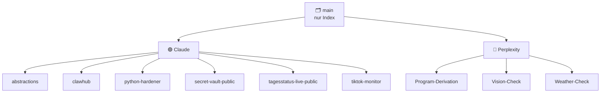

# 🗂️ Projects

**Branch-basiertes Mono-Repository — jeder Branch ist ein eigenständiges Projekt einer KI-Plattform.**
Der Default-Branch `main` enthält ausschließlich diesen Index.

---

## 📖 Übersicht

Dieses Repository folgt einem **Branch-pro-Projekt**-Modell: Statt einer verschachtelten
Ordnerstruktur lebt jedes Projekt vollständig in seinem eigenen Branch. Der Default-Branch
`main` trägt keinen Projektcode, sondern dient als reine Landing-Page und führt — gruppiert
nach der zugrunde liegenden KI-Plattform (**Claude** bzw. **Perplexity**) — auf die
einzelnen Projekt-Branches.

Die Kurzbeschreibungen unten sind aus dem tatsächlichen Branch-Inhalt abgeleitet
(`SKILL.md`, `ARCHITECTURE.md`, Quellcode), nicht aus den noch leeren Projekt-READMEs.

---

## 🟣 Claude

Skills, Agents und Browser-Artefakte rund um die OpenClaw-/Claude-Code-Umgebung.

| Projekt | Beschreibung | Branch |
| --- | --- | --- |
| **abstractions** | Automatisierter Multi-Node Abstraction Manager, der OpenClaw-Scripts per Cron in 10 Zielsprachen portiert und dazu Status-Report sowie Dokumentations-Datenbanken pflegt. | [`abstractions`](https://github.com/KikiKari/Projects/tree/abstractions) |
| **clawhub** | Bidirektionaler Sync- und Publish-Agent, der OpenClaw-Skills zwischen ClawHub und Git abgleicht und Commits, Versionierung sowie Veröffentlichung automatisiert. | [`clawhub`](https://github.com/KikiKari/Projects/tree/clawhub) |
| **python-hardener** | Skill samt Eval-Suite, der bestehende Python-Scripts automatisch absichert (Shell-Injection, Logging, atomare Writes, Docstrings) und die Änderungen als Markdown dokumentiert. | [`python-hardener`](https://github.com/KikiKari/Projects/tree/python-hardener) |
| **secret-vault-public** | Vollständig client-seitiges Browser-Artefakt für einen verschlüsselten Secret-Container (WebCrypto, AES-256-GCM + PBKDF2) zum Anlegen, Rotieren und Exportieren von Secrets — ohne eingebettete Schlüssel. | [`secret-vault-public`](https://github.com/KikiKari/Projects/tree/secret-vault-public) |
| **tagesstatus-live-public** | Umgebungs-unabhängige Status-Seite, die Live-Daten mehrerer Dienste (GitHub, OpenRouter, OpenAI, Anthropic, Tailscale, ClawHub) per direktem Browser-Abruf anzeigt; Tokens liegen nur im localStorage. | [`tagesstatus-live-public`](https://github.com/KikiKari/Projects/tree/tagesstatus-live-public) |
| **tiktok-monitor** | TikTok-LIVE-Monitor (`tt-live`), der den Live-Status eines Users prüft, die m3u8-Stream-URL auflöst und per Daemon `go_live` / `go_offline` / `rename`-Events als reiner Datenprovider meldet. | [`tiktok-monitor`](https://github.com/KikiKari/Projects/tree/tiktok-monitor) |

---

## 🔵 Perplexity

Skills und Apps für die Perplexity-Plattform (Computer-Prompts, On-Device-KI, Analyse).

| Projekt | Beschreibung | Branch |
| --- | --- | --- |
| **Program-Derivation** | Skill für formale Programmableitung: Architekturanalyse, Abstraktionsschichten und Code-Metriken (CC, LCOM, Kopplung, Kohäsion, Vendor Lock-in) mit deutsch-/englischsprachigen Referenzen. | [`Program-Derivation`](https://github.com/KikiKari/Projects/tree/Program-Derivation) |
| **Vision-Check** | Browser-App zur KI-Objekt-/Biodiversitätserkennung über die Smartphone-Kamera (bis 4K) mit On-Device-KI (TensorFlow.js / COCO-SSD) und einer Canvas-Bildverbesserungs-Pipeline. | [`Vision-Check`](https://github.com/KikiKari/Projects/tree/Vision-Check) |
| **Weather-Check** | Lokaler Regen-Check als PWA plus Perplexity-Computer-Prompt: Niederschlagseinschätzung für die nächsten 30 / 60 / 120 Minuten aus DWD-Radar, Messstationen, Open-Meteo, Satellit, Webcams und optionalem Handyfoto. | [`Weather-Check`](https://github.com/KikiKari/Projects/tree/Weather-Check) |

---

ℹ️ Hinweise zur Struktur

- **`main`** enthält nur diese Übersicht — keinen Projektcode.
- Jedes Projekt wird in **seinem eigenen Branch** entwickelt und gepflegt; es gibt keine
  projektübergreifenden Merges in `main`.
- Die einzelnen Projekt-READMEs sind aktuell leer; die Kurzbeschreibungen hier sind aus
  dem jeweiligen Branch-Inhalt abgeleitet und werden bei Bedarf aktualisiert.

