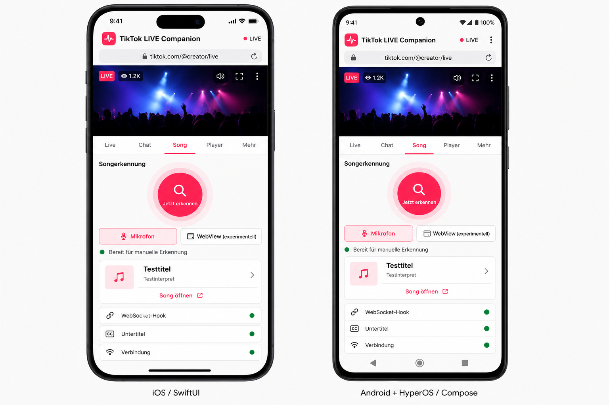
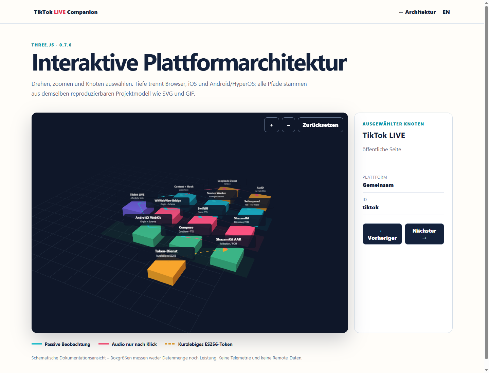
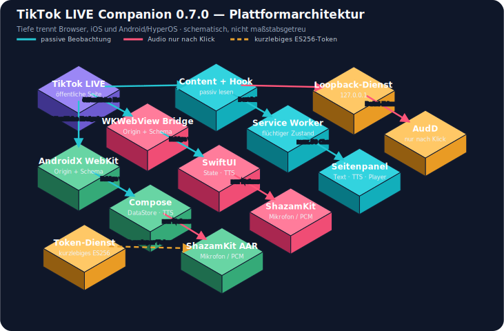
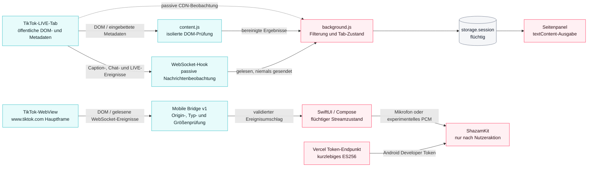

# TikTok LIVE Companion 0.7.0

> Plattformbranch `TikTok-Live-Companion-iOS`: enthält die native SwiftUI-/WKWebView-/ShazamKit-App. Der Android-/HyperOS-Quellstand liegt im Branch `TikTok-Live-Companion-Android`.

TikTok LIVE Companion ist eine lokale Manifest-V3-Erweiterung für Edge und Chrome. Sie macht öffentliche TikTok-LIVE-Streams zugänglicher: Chatzeilen werden als bereinigter Text angezeigt und auf Wunsch lokal vorgelesen, native Untertitel werden geprüft, LIVE-Werte und Stream-Qualitäten werden sichtbar und der vorhandene Player lässt sich über ein Seitenpanel steuern.

Version 0.7.0 ergänzt native Quellprojekte für iOS sowie Android/HyperOS. Die Browser-Erweiterung erkennt Songs weiterhin manuell über AudD; die nativen Apps verwenden ShazamKit mit Mikrofon als stabilem und WebView-PCM als experimentellem Audioweg.



[Interaktive architecture-3d](https://tiktok-live-companion.vercel.app/de/architecture-3d)

[](https://tiktok-live-companion.vercel.app/de/architecture-3d)



## Schnellstart

1. Lade `release/0.7.0/tiktok-live-companion-extension-0.7.0.zip` herunter und entpacke die Datei.
2. Öffne `edge://extensions` oder `chrome://extensions` und aktiviere den Entwicklermodus.
3. Wähle **Entpackte Erweiterung laden** und den Ordner mit `manifest.json`.
4. Öffne einen öffentlichen TikTok-LIVE-Tab und klicke auf **TikTok LIVE Companion**.
5. Nutze **Hook setzen**, bevor der Player seine WebSocket-Verbindung aufbaut.

## Architektur



Quelle: [`docs/diagrams/architecture.mmd`](docs/diagrams/architecture.mmd)

## Dokumentation

- [Vollständige Dokumentation V7](docs/TikTok-Live-Companion_v7_utf8bom.md)
- [Links und Erreichbarkeiten V7](docs/Links-und-Erreichbarkeiten_v7_utf8bom.md)
- [Deutsch](docs/de/overview.md)
- [English](docs/en/overview.md)
- [Visualisierungsquellen und Reproduktion](assets/README.md)
- [Sicherheitsbeschreibung](plugin-source/SECURITY.md)

Die veröffentlichte Dokumentationssite enthält dieselben Inhalte mit Sprachumschaltung, Suche und geprüften Downloads. GitHub ist die technische Quelle; Notion, Linear, Canva und Vercel spiegeln den freigegebenen Stand.

## Projektlinks

- [Dokumentationssite](https://tiktok-live-companion.vercel.app)
- [Linear-Projekt](https://linear.app/0penclaw/project/tiktok-live-companion-ed2f087b24bc)
- [Notion-Projektseite](https://app.notion.com/p/3a18d8ad3db9817f882bd79682fbbc51)
- [GitHub-Branch](https://github.com/KikiKari/Projects/tree/TikTok-Live-Companion)
- [iOS-Branch](https://github.com/KikiKari/Projects/tree/TikTok-Live-Companion-iOS)
- [Android-/HyperOS-Branch](https://github.com/KikiKari/Projects/tree/TikTok-Live-Companion-Android)

## Projektstruktur

- `plugin-source/` – reproduzierbarer Plugin-Quellstand einschließlich Browser-Erweiterung, Tests und Packaging-Script
- `docs/` – deutsche und englische Dokumentation sowie Mermaid-Quellen
- `release/` – reproduzierbare 0.7.0-Artefakte und SHA-256-Prüfsummen
- `plugin-source/companion-service/` – optionaler lokaler Windows-Dienst für verstärkte Sprachausgabe und manuelle Songerkennung
- `site/` – statische React-/TypeScript-/Vite-Dokumentationssite
- `mobile/ios/` – SwiftUI-, WKWebView- und ShazamKit-Xcode-Projekt ab iOS 15
- `plugin-source/mobile-shared/` – versionierte, origin-beschränkte WebView-Bridge

## Verifikation

```powershell
node plugin-source/scripts/test_extension.cjs
node plugin-source/scripts/test_mobile_bridge.cjs
python assets/test_visualizations.py
cd plugin-source/companion-service
npm test
cd ../../site
npm ci
npm run typecheck
npm test
npm run build
```

Android- und iOS-Builds benötigen die jeweiligen Hersteller-Toolchains. Das proprietäre ShazamKit-AAR und Apple-Schlüsselmaterial werden nicht im Repository gespeichert.

Die Erweiterung liest keine Cookies. Chat, Statistik und TTS bleiben lokal; nur nach einem ausdrücklichen Klick wird ein kurzer Audioausschnitt über den lokalen Dienst an AudD gesendet. Signierte Stream-URLs sind zeitlich begrenzt und während ihrer Gültigkeit sensibel.
