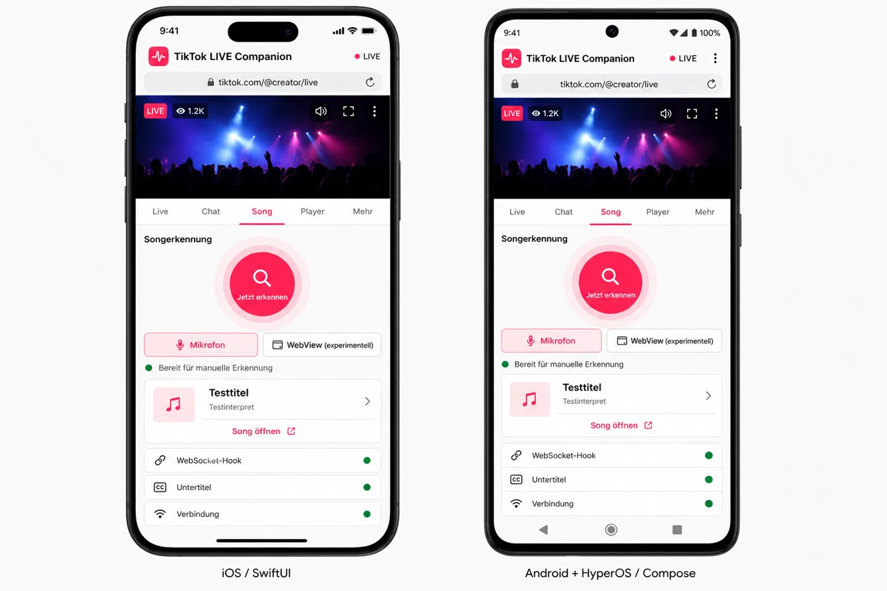
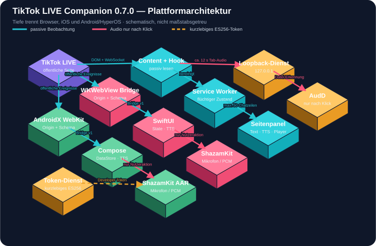
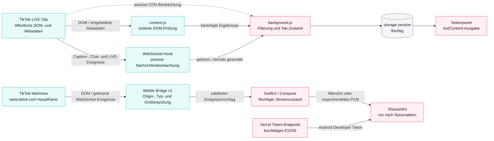
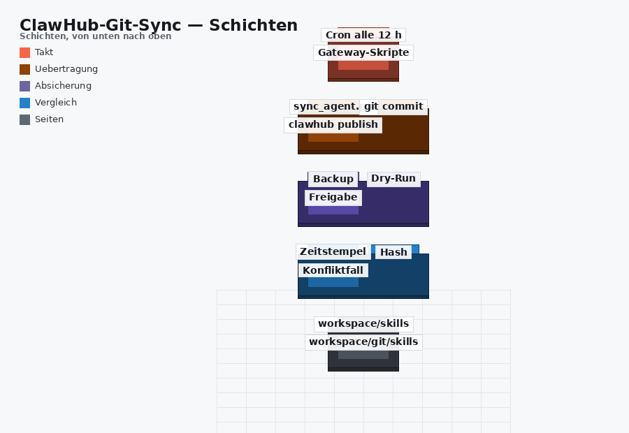
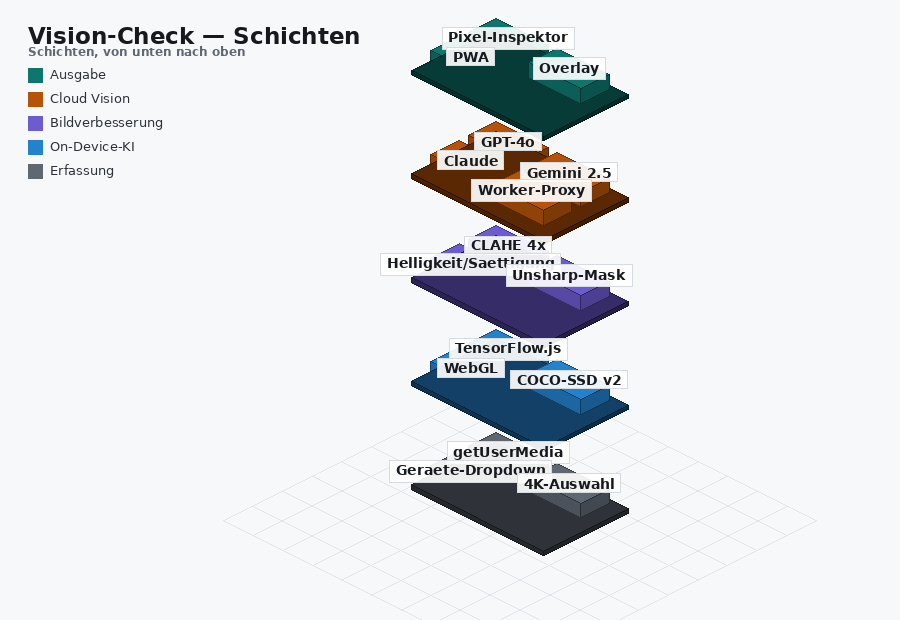
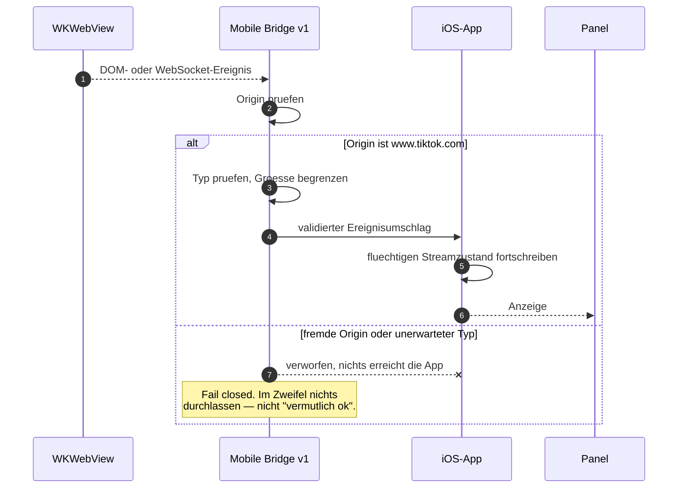
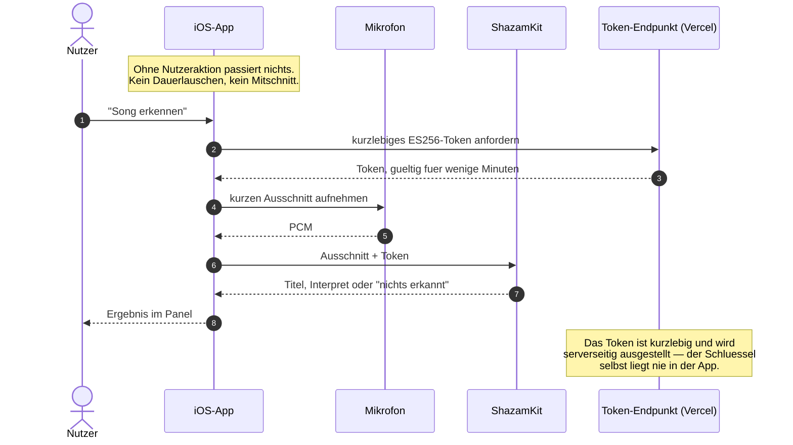
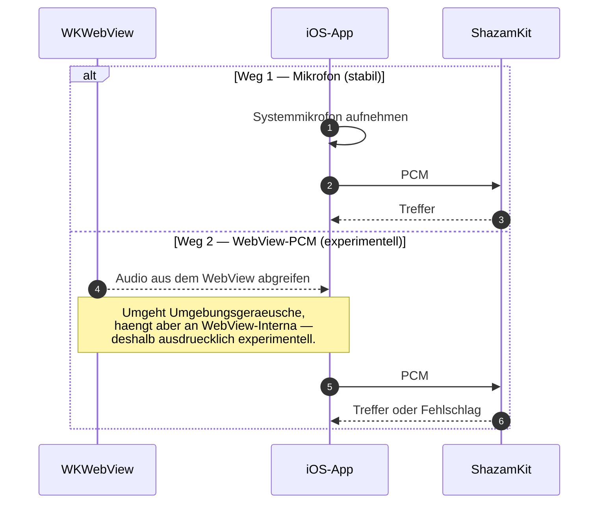

# TikTok LIVE Companion 0.7.1

> Plattformbranch `TikTok-Live-Companion-iOS`: enthält die native SwiftUI-/WKWebView-/ShazamKit-App. Der Android-/HyperOS-Quellstand liegt im Branch `TikTok-Live-Companion-Android`.

TikTok LIVE Companion ist eine lokale Manifest-V3-Erweiterung für Edge und Chrome. Sie macht öffentliche TikTok-LIVE-Streams zugänglicher: Chatzeilen werden als bereinigter Text angezeigt und auf Wunsch lokal vorgelesen, native Untertitel werden geprüft, LIVE-Werte und Stream-Qualitäten werden sichtbar und der vorhandene Player lässt sich über ein Seitenpanel steuern.

Version 0.7.1 ergänzt native Quellprojekte für iOS sowie Android/HyperOS. Die Browser-Erweiterung erkennt Songs weiterhin manuell über AudD; die nativen Apps verwenden ShazamKit mit Mikrofon als stabilem und WebView-PCM als experimentellem Audioweg.



[](https://tiktok-live-companion.vercel.app/de/architecture-3d)

Die Visualisierung zeigt den tatsächlichen 0.7.1-Datenfluss: Browser-Songerkennung über AudD nur nach Klick sowie native iOS-/Android-/HyperOS-Erkennung über ShazamKit. SVG, Mermaid-Diagramm und Three.js-Ansicht bilden denselben projektspezifischen Datenfluss ab.

- [Interaktive Three.js-Ansicht](https://tiktok-live-companion.vercel.app/de/architecture-3d)
- [Freigegebener Mobile-Entwurf](docs/mobile/mobile-0.7.1-concept.png)
- [Visualisierungsvertrag und Textalternative](docs/diagrams/tiktok-live-companion-visualization-contract.md)

## Schnellstart

1. Lade `release/0.7.1/tiktok-live-companion-extension-0.7.1.zip` herunter und entpacke die Datei.
2. Öffne `edge://extensions` oder `chrome://extensions` und aktiviere den Entwicklermodus.
3. Wähle **Entpackte Erweiterung laden** und den Ordner mit `manifest.json`.
4. Öffne einen öffentlichen TikTok-LIVE-Tab und klicke auf **TikTok LIVE Companion**.
5. Nutze **Hook setzen**, bevor der Player seine WebSocket-Verbindung aufbaut.

## Architektur


```mermaid
flowchart LR
    page["TikTok-LIVE-Tab<br/>öffentliche DOM- und Metadaten"]
    content["content.js<br/>isolierte DOM-Prüfung"]
    hook["WebSocket-Hook<br/>passive Nachrichtenbeobachtung"]
    bg["background.js<br/>Filterung und Tab-Zustand"]
    session[("storage.session<br/>flüchtig")]
    panel["Seitenpanel<br/>textContent-Ausgabe"]
    mobilePage["TikTok-WebView<br/>www.tiktok.com Hauptframe"]
    bridge["Mobile Bridge v1<br/>Origin-, Typ- und Größenprüfung"]
    native["SwiftUI / Compose<br/>flüchtiger Streamzustand"]
    shazam["ShazamKit<br/>nur nach Nutzeraktion"]
    token["Vercel Token-Endpunkt<br/>kurzlebiges ES256"]

    page -->|"DOM / eingebettete Metadaten"| content
    page -->|"Caption-, Chat- und LIVE-Ereignisse"| hook
    page -.->|"passive CDN-Beobachtung"| bg
    content -->|"bereinigte Ergebnisse"| bg
    hook -->|"gelesen, niemals gesendet"| bg
    bg --> session
    session --> panel
    mobilePage -->|"DOM / gelesene WebSocket-Ereignisse"| bridge
    bridge -->|"validierter Ereignisumschlag"| native
    native -->|"Mikrofon oder experimentelles PCM"| shazam
    token -->|"Android Developer Token"| shazam

    classDef observation fill:#e7fbfb,stroke:#25b9c2,color:#102126
    classDef action fill:#fff0f3,stroke:#fe2c55,color:#2b1117
    classDef storage fill:#f5f6f8,stroke:#667085,color:#101828
    class page,content,hook,mobilePage,bridge observation
    class bg,panel,native,shazam,token action
    class session storage
```

Quelle: [`docs/diagrams/architecture.mmd`](docs/diagrams/architecture.mmd)

### Schichtansicht in 3D

<div align="center">



**[▶ Begehbare Schichtansicht öffnen](https://tiktok-live-companion.vercel.app/de/architecture-3d)** — ziehen zum Drehen, Rad zum Zoomen,
Umschalter zwischen isometrisch und perspektivisch. Ergänzt die
[interaktive Datenfluss-Ansicht](https://tiktok-live-companion.vercel.app/de/architecture-3d)
um die Schichtsicht dieses Plattformbranches.

</div>



| Schicht | Wo | Verantwortung | Sendet |
|---|---|---|---|
| **Quelle** | WKWebView | `www.tiktok.com` im Hauptframe | — |
| **Brücke** | Mobile Bridge v1 | Origin-, Typ- und Größenprüfung | nein |
| **App** | Swift, SwiftUI, WebKit | Oberfläche, Zustand, Steuerung | nein |
| **Audio** | ShazamKit | nur nach Nutzeraktion | ja, auf Klick |
| **Ausgabe** | Panel, IPA | flüchtiger Streamzustand | nein |

**Die Brücke ist die Sicherheitsgrenze.** Alles, was aus dem WebView kommt, wird auf Herkunft,
Typ und Größe geprüft, bevor die App es überhaupt ansieht. Ohne diese Prüfung wäre jede
Änderung an der TikTok-Seite ein Einfallstor in die native App.

Standbild und GIF entstehen aus `docs/architektur.json`:

```bash
python tools/render_3d.py docs/architektur.json docs/assets
```

---

## Abläufe

### Ein Ereignis vom WebView in die App


```mermaid
sequenceDiagram
    autonumber
    participant W as WKWebView
    participant B as Mobile Bridge v1
    participant A as iOS-App
    participant P as Panel

    W-->>B: DOM- oder WebSocket-Ereignis
    B->>B: Origin pruefen
    alt Origin ist www.tiktok.com
        B->>B: Typ pruefen, Groesse begrenzen
        B->>A: validierter Ereignisumschlag
        A->>A: fluechtigen Streamzustand fortschreiben
        A-->>P: Anzeige
    else fremde Origin oder unerwarteter Typ
        B--xA: verworfen, nichts erreicht die App
        Note over B: Fail closed. Im Zweifel nichts<br/>durchlassen — nicht "vermutlich ok".
    end
```

### Songerkennung mit ShazamKit


```mermaid
sequenceDiagram
    autonumber
    actor N as Nutzer
    participant A as iOS-App
    participant M as Mikrofon
    participant S as ShazamKit
    participant T as Token-Endpunkt (Vercel)

    Note over A: Ohne Nutzeraktion passiert nichts.<br/>Kein Dauerlauschen, kein Mitschnitt.
    N->>A: "Song erkennen"
    A->>T: kurzlebiges ES256-Token anfordern
    T-->>A: Token, gueltig fuer wenige Minuten
    A->>M: kurzen Ausschnitt aufnehmen
    M-->>A: PCM
    A->>S: Ausschnitt + Token
    S-->>A: Titel, Interpret oder "nichts erkannt"
    A-->>N: Ergebnis im Panel
    Note over T: Das Token ist kurzlebig und wird<br/>serverseitig ausgestellt — der Schluessel<br/>selbst liegt nie in der App.
```

### Der experimentelle Audioweg


```mermaid
sequenceDiagram
    autonumber
    participant W as WKWebView
    participant A as iOS-App
    participant S as ShazamKit

    alt Weg 1 — Mikrofon (stabil)
        A->>A: Systemmikrofon aufnehmen
        A->>S: PCM
        S-->>A: Treffer
    else Weg 2 — WebView-PCM (experimentell)
        W-->>A: Audio aus dem WebView abgreifen
        Note over W,A: Umgeht Umgebungsgeraeusche,<br/>haengt aber an WebView-Interna —<br/>deshalb ausdruecklich experimentell.
        A->>S: PCM
        S-->>A: Treffer oder Fehlschlag
    end
```

## Dokumentation

- [Vollständige Dokumentation V7](docs/TikTok-Live-Companion_v7_utf8bom.md)
- [Links und Erreichbarkeiten V7](docs/Links-und-Erreichbarkeiten_v7_utf8bom.md)
- [Deutsch](docs/de/overview.md)
- [English](docs/en/overview.md)
- [Architekturdiagramm](docs/diagrams/architecture.mmd)
- [Interaktive Three.js-Architektur](https://tiktok-live-companion.vercel.app/de/architecture-3d)
- [Generiertes Architektur-SVG](docs/diagrams/tiktok-live-companion-architecture.svg)
- [Visualisierungsquellen und Reproduktion](assets/README.md)
- [Sicherheitsbeschreibung](plugin-source/SECURITY.md)

Die veröffentlichte Dokumentationssite enthält dieselben Inhalte mit Sprachumschaltung, Suche und geprüften Downloads. GitHub ist die technische Quelle; Notion, Linear, Canva und Vercel spiegeln den freigegebenen Stand.

## Projektlinks

- [Dokumentationssite](https://tiktok-live-companion.vercel.app)
- [Linear-Projekt](https://linear.app/0penclaw/project/tiktok-live-companion-ed2f087b24bc)
- [Notion-Projektseite](https://app.notion.com/p/3a18d8ad3db9817f882bd79682fbbc51)
- [GitHub-Branch](https://github.com/KikiKari/Projects/tree/TikTok-Live-Companion)
- [iOS-Branch](https://github.com/KikiKari/Projects/tree/TikTok-Live-Companion-iOS)
- [Android-/HyperOS-Branch](https://github.com/KikiKari/Projects/tree/TikTok-Live-Companion-Android)

## Projektstruktur

- `plugin-source/` – reproduzierbarer Plugin-Quellstand einschließlich Browser-Erweiterung, Tests und Packaging-Script
- `docs/` – deutsche und englische Dokumentation sowie Mermaid-Quellen
- `release/` – reproduzierbare 0.7.1-Artefakte und SHA-256-Prüfsummen
- `plugin-source/companion-service/` – optionaler lokaler Windows-Dienst für verstärkte Sprachausgabe und manuelle Songerkennung
- `site/` – statische React-/TypeScript-/Vite-Dokumentationssite
- `mobile/ios/` – SwiftUI-, WKWebView- und ShazamKit-Xcode-Projekt ab iOS 15
- `plugin-source/mobile-shared/` – versionierte, origin-beschränkte WebView-Bridge

## Verifikation

```powershell
node plugin-source/scripts/test_extension.cjs
node plugin-source/scripts/test_mobile_bridge.cjs
python assets/test_visualizations.py
cd plugin-source/companion-service
npm test
cd ../../site
npm ci
npm run typecheck
npm test
npm run build
```

Android- und iOS-Builds benötigen die jeweiligen Hersteller-Toolchains. Das proprietäre ShazamKit-AAR und Apple-Schlüsselmaterial werden nicht im Repository gespeichert.

Die Erweiterung liest keine Cookies. Chat, Statistik und TTS bleiben lokal; nur nach einem ausdrücklichen Klick wird ein kurzer Audioausschnitt über den lokalen Dienst an AudD gesendet. Signierte Stream-URLs sind zeitlich begrenzt und während ihrer Gültigkeit sensibel.
