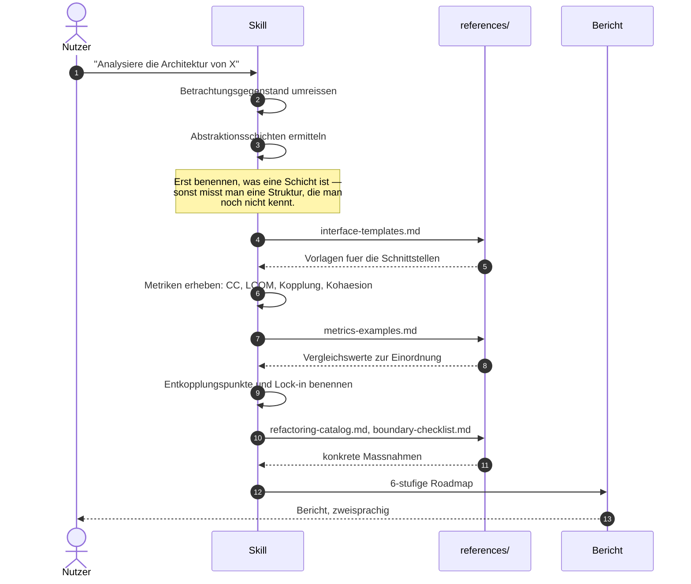
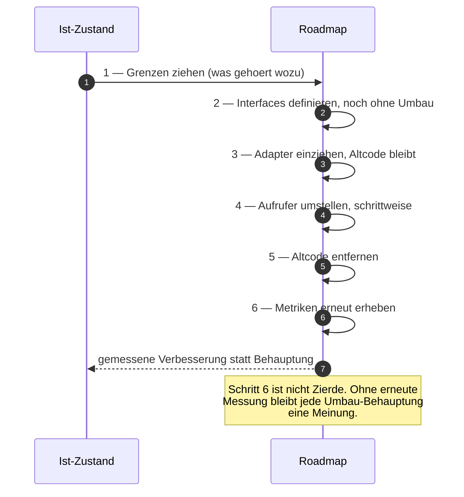
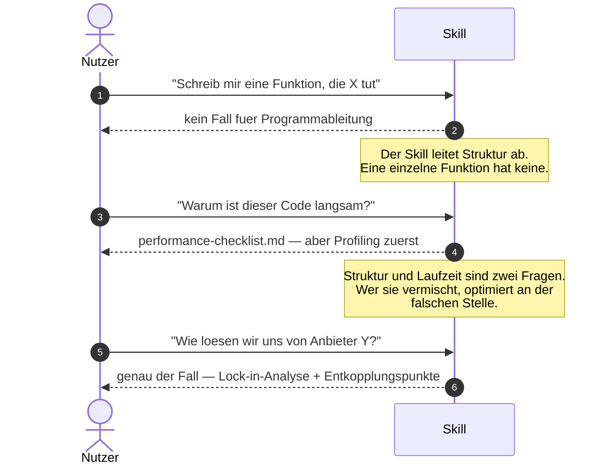

# Program-Derivation

> Formale Programmableitung / Formal Program Derivation — ein Agent Skill für Architekturanalyse, Abstraktionsschichten-Design, Software-Metriken und eine vollständige Modernisierungs-Roadmap.

[](https://agentskills.io)   

Dieser Branch enthält den Agent Skill **`program-derivation`**. Der Skill führt eine strukturierte, formale Ableitung von Software-Architekturen durch — von der Ist-Analyse bestehender Systeme bis zur abgeleiteten Modernisierungs-Roadmap.

---

## Inhalt / Contents

```
Program-Derivation/
├── SKILL.md                         # Kern-Anweisung (Phasen 1–4, Ausgabeformat, Trigger)
├── README.md                       # ausführliche Skill-Dokumentation
└── references/
    ├── boundary-checklist.md       # Grenzschichten-Checkliste (Phase 1.1)
    ├── interface-templates.md      # Interface-Vorlagen (Phase 2)
    ├── metrics-examples.md         # CC/LCOM/I-Index Berechnungsbeispiele (Phase 3)
    ├── refactoring-catalog.md      # Refactoring-Muster & Debt-Klassifikation (Phase 4.1 + 4.3)
    ├── performance-checklist.md    # Performance-/Effizienz-Checkliste (Phase 4.2)
    └── modernization-playbook.md   # Replatforming vs. Green-Field Rewrite (Phase 4.5 + 4.6)
```

---

## Was der Skill leistet / What It Does

Der Skill arbeitet in **vier Phasen**. Die Ausgabesprache folgt der Sprache des Nutzers (de/en).

| Phase | Fokus | Kernergebnis |
|---|---|---|
| **1 — Architektur-Ermittlung** | Grenzschichten, Austauschbarkeit, Komplexität, Vendor Lock-in, SoC, Kopplung/Kohäsion, Leaky Abstractions | Ist-Architektur mit Befund-Tabellen |
| **2 — Abstraktionsschichten-Design** | Wrapper/Facades, strategische Entkopplungspunkte | vollständige Interface-Definitionen (TS/Python/Java) |
| **3 — Metriken** | Zyklomatische Komplexität (CC), LCOM4, Instabilitäts-Index (I) | quantitative Qualitätsbewertung |
| **4 — Modernisierungs-Roadmap** | 6 aufeinander aufbauende Stufen | priorisierte Umbau-/Neubau-Strategie |

### Phase 4 — die 6-stufige Roadmap

```
Stufe 1            Stufe 2              Stufe 3                Stufe 4         Stufe 5              Stufe 6
Refactoring   ->   Performance /   ->   Refinement /      ->   System- &   ->  Replatforming /  ->  Green-Field
(struktur-         Optimierung          Debt Reduction         Komponenten-    Lift-and-Reshape     Rewrite /
 erhaltend)        (Effizienz)          (Schuldenabbau)        Doku            (Plattformwechsel)   Reengineering
```

Jede Stufe ist ein **Gate**: Sie wird erst empfohlen, wenn die Eingangskriterien der vorherigen Stufe erfüllt sind. Stufe 1–4 erhalten das Verhalten und senken das Risiko; Stufe 5–6 verändern Plattform bzw. Implementierung und setzen eine stabilisierte, dokumentierte Basis voraus.

---

---

## Architektur des Skills / Skill Architecture

<div align="center">


**[▶ Interaktive 3D-Ansicht öffnen](public/3d.html)** — ziehen zum Drehen, Rad zum Zoomen,
Umschalter zwischen isometrisch und perspektivisch.

</div>

### Isometrische Ansicht


| Schicht | Was hineingeht | Was herauskommt |
|---|---|---|
| **Eingaben** | Quellcode, Anforderungen, Randbedingungen | ein umrissener Betrachtungsgegenstand |
| **Ermittlung** | dieser Gegenstand | Abstraktionsschichten, Interfaces, Entkopplungspunkte |
| **Messung** | die ermittelte Struktur | CC, LCOM, Kopplung, Kohäsion, Vendor Lock-in, SoC |
| **Ableitung** | Struktur + Zahlen | die 6-stufige Roadmap, konkrete Refactorings |
| **Ausgabe** | alles zusammen | Bericht, Interface-Vorlagen, Checklisten — zweisprachig |

Die Reihenfolge ist der Kern: **erst ermitteln, dann messen, dann ableiten.** Wer mit
Metriken anfängt, misst eine Struktur, die er noch gar nicht benannt hat — und bekommt Zahlen
ohne Bedeutung. Ein LCOM-Wert sagt nichts, solange nicht feststeht, welche Klasse welche
Schicht bedienen soll.

Beide Bilder entstehen aus `docs/architektur.json`:

```bash
python tools/render_3d.py docs/architektur.json docs/assets
```

---

## Abläufe / Flows

### Eine Analyse von der Anfrage bis zum Bericht


```mermaid
sequenceDiagram
    autonumber
    actor N as Nutzer
    participant S as Skill
    participant R as references/
    participant B as Bericht

    N->>S: "Analysiere die Architektur von X"
    S->>S: Betrachtungsgegenstand umreissen
    S->>S: Abstraktionsschichten ermitteln
    Note over S: Erst benennen, was eine Schicht ist —<br/>sonst misst man eine Struktur, die man<br/>noch nicht kennt.
    S->>R: interface-templates.md
    R-->>S: Vorlagen fuer die Schnittstellen
    S->>S: Metriken erheben: CC, LCOM, Kopplung, Kohaesion
    S->>R: metrics-examples.md
    R-->>S: Vergleichswerte zur Einordnung
    S->>S: Entkopplungspunkte und Lock-in benennen
    S->>R: refactoring-catalog.md, boundary-checklist.md
    R-->>S: konkrete Massnahmen
    S->>B: 6-stufige Roadmap
    B-->>N: Bericht, zweisprachig
```

### Die sechs Stufen der Roadmap


```mermaid
sequenceDiagram
    autonumber
    participant A as Ist-Zustand
    participant R as Roadmap

    A->>R: 1 — Grenzen ziehen (was gehoert wozu)
    R->>R: 2 — Interfaces definieren, noch ohne Umbau
    R->>R: 3 — Adapter einziehen, Altcode bleibt
    R->>R: 4 — Aufrufer umstellen, schrittweise
    R->>R: 5 — Altcode entfernen
    R->>R: 6 — Metriken erneut erheben
    R-->>A: gemessene Verbesserung statt Behauptung
    Note over R: Schritt 6 ist nicht Zierde. Ohne erneute<br/>Messung bleibt jede Umbau-Behauptung<br/>eine Meinung.
```

### Wann der Skill *nicht* greift


```mermaid
sequenceDiagram
    autonumber
    actor N as Nutzer
    participant S as Skill

    N->>S: "Schreib mir eine Funktion, die X tut"
    S-->>N: kein Fall fuer Programmableitung
    Note over S: Der Skill leitet Struktur ab.<br/>Eine einzelne Funktion hat keine.
    N->>S: "Warum ist dieser Code langsam?"
    S-->>N: performance-checklist.md — aber Profiling zuerst
    Note over S: Struktur und Laufzeit sind zwei Fragen.<br/>Wer sie vermischt, optimiert an der<br/>falschen Stelle.
    N->>S: "Wie loesen wir uns von Anbieter Y?"
    S-->>N: genau der Fall — Lock-in-Analyse + Entkopplungspunkte
```

## Verwendung / Usage

### Als Agent Skill in Perplexity
Der Skill ist im Space „Program-Derivation" hinterlegt. In einer Konversation genügt ein Trigger:

```
@Program-Derivation Erstelle eine vollständige Programmableitung
inkl. Modernisierungs-Roadmap für das Repo owner/repo.
```

Der Agent ermittelt Phase 1–3 aus dem Code und leitet daraus die Phase-4-Roadmap mit konkreten, priorisierten Stufen ab.

### Trigger-Beispiele (de / en)
- „Führe eine Architekturanalyse durch" / „Perform a program derivation / architecture analysis"
- „Welche Abstraktionsschichten fehlen?" / „What interfaces are missing?"
- „Berechne die zyklomatische Komplexität" / „Analyze coupling and cohesion"
- „Erstelle eine Modernisierungs-Roadmap / Refactoring-Plan" / „Create a modernization roadmap"
- „Plane Performance-Tuning / Effizienzsteigerung" / „Plan performance tuning"
- „Analysiere die technischen Schulden / Debt Reduction" / „Assess technical debt"
- „Replatforming / Lift-and-Reshape planen" / „Replatforming vs. green-field rewrite"

### Manuelle Installation aus diesem Repo
1. Ordner `Program-Derivation/` als ZIP packen.
2. Über die [Skill-Verwaltung](https://www.perplexity.ai/computer/skills) importieren.
3. Mit `agentskills validate Program-Derivation/` prüfen (Ergebnis: `Valid skill`).

---

## Ausgabeformat / Output Format

Jede Ableitung wird einheitlich strukturiert:
1. Kritische Befunde (sofortiger Handlungsbedarf) — mit Code-Beispielen
2. Hohe Befunde (nächster Sprint) — mit Interface-Vorschlägen
3. Mittlere Befunde (Backlog) — mit Begründung
4. Positive Aspekte — was bereits gut strukturiert ist
5. Priorisierte Refactoring-Reihenfolge (Tabelle: Aufwand/Nutzen)
6. Roadmap-Zusammenfassung (Phase 4.7)

Eine ausführliche Beschreibung jeder Phase, der Phasenverknüpfungen und der Referenzdateien steht in [`Program-Derivation/README.md`](Program-Derivation/README.md).

---

## Metadaten / Metadata

| Feld | Wert |
|---|---|
| Skill-Name | `program-derivation` |
| Version | 2.0 |
| Sprachen | Deutsch / Englisch |
| Autor | karimkiki |
| Lizenz | MIT (siehe [LICENSE](LICENSE)) |

---

## Changelog

- **v2.0** — Neue Phase 4 (6-stufige Modernisierungs-Roadmap), drei neue Referenzdateien (`refactoring-catalog.md`, `performance-checklist.md`, `modernization-playbook.md`), erweiterte Trigger, ausführliche Dokumentation.
- **v1.0** — Phasen 1–3 (Architektur-Ermittlung, Abstraktionsschichten-Design, Metriken).
