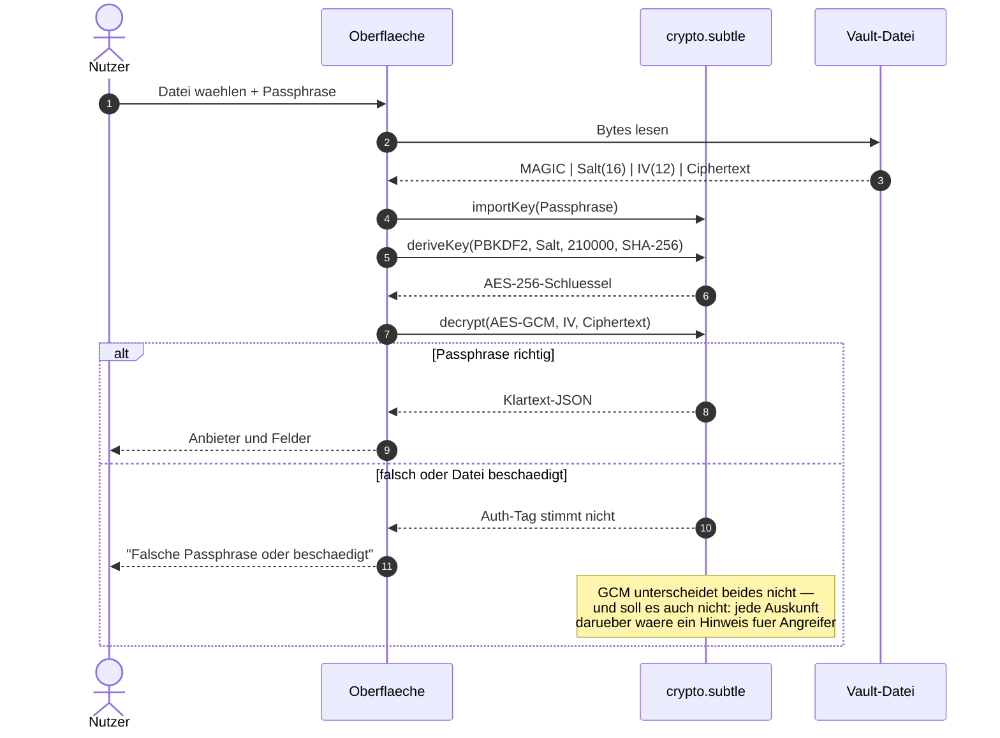
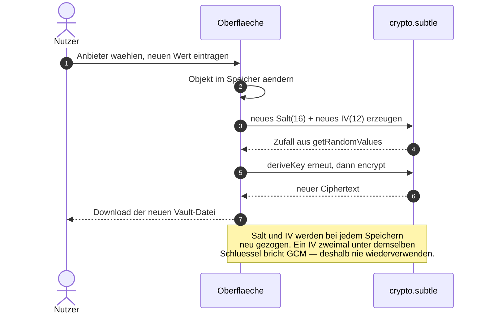
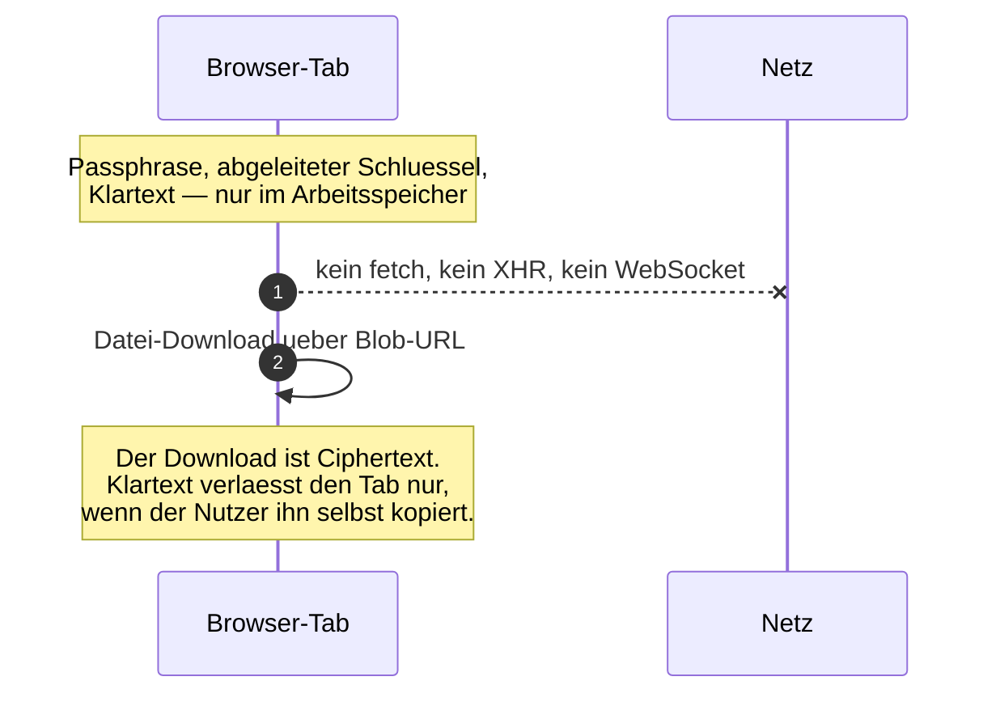

# 🔐 Secret-Vault Public

**Verschlüsselter Secret-Container als reines Browser-Artefakt.**
Eine einzige HTML-Datei: Vault anlegen, öffnen, Anbieter und Felder pflegen, Werte rotieren,
exportieren. `AES-256-GCM` mit `PBKDF2` (210 000 Iterationen) über die WebCrypto-API.

**Ohne eingebettete Schlüssel.** Diese Datei enthält keine Zugangsdaten — sie ist das Werkzeug,
nicht der Inhalt. Was sie verwaltet, bringt der Nutzer selbst mit.

---

## Schnellstart

Die Datei `secret-vault-public/index.html` im Browser öffnen. Doppelklick genügt — kein Server,
keine Installation, kein Konto. Sie funktioniert auch ohne Netz.

1. **Neuer Vault** → Passphrase zweimal eingeben
2. Anbieter anlegen, Felder ausfüllen
3. **Speichern** → lädt eine verschlüsselte Datei herunter
4. Beim nächsten Mal: Datei wählen, Passphrase eingeben

---

## Architektur

<div align="center">


**[▶ Interaktive 3D-Ansicht öffnen](https://secret-vault-public.vercel.app/3d.html)** — ziehen zum Drehen, Rad zum Zoomen,
Umschalter zwischen isometrisch und perspektivisch.

</div>

### Isometrische Ansicht


| Schicht | Womit | Warum so |
|---|---|---|
| **Eingaben** | Passphrase, Vault-Datei, Formularfelder | nichts wird gespeichert, was nicht der Nutzer eingibt |
| **Schlüsselableitung** | `PBKDF2`, **210 000 Iterationen**, SHA-256, 16-Byte-Salt | macht Wörterbuchangriffe teuer; die Iterationszahl ist der Preis pro Rateversuch |
| **Verschlüsselung** | `AES-256-GCM` über `crypto.subtle`, 12-Byte-IV | GCM liefert Vertraulichkeit **und** Integrität in einem Durchgang |
| **Verwaltung** | Anbieter, Felder, Rotation | die eigentliche Oberfläche |
| **Ausgabe** | Download, Export, Zwischenablage | Ciphertext verlässt den Browser, Klartext nur auf Knopfdruck |

**Es gibt kein Backend.** Keine Zeile dieser Seite spricht mit einem Server — die gesamte
Kryptografie läuft in `crypto.subtle` des Browsers. Wer die Datei offline öffnet, verliert
keine Funktion.

Beide Bilder entstehen aus `docs/architektur.json`:

```bash
python tools/render_3d.py docs/architektur.json docs/assets
```

---

## Abläufe

### Einen Vault öffnen


```mermaid
sequenceDiagram
    autonumber
    actor N as Nutzer
    participant U as Oberflaeche
    participant W as crypto.subtle
    participant D as Vault-Datei

    N->>U: Datei waehlen + Passphrase
    U->>D: Bytes lesen
    D-->>U: MAGIC | Salt(16) | IV(12) | Ciphertext
    U->>W: importKey(Passphrase)
    U->>W: deriveKey(PBKDF2, Salt, 210000, SHA-256)
    W-->>U: AES-256-Schluessel
    U->>W: decrypt(AES-GCM, IV, Ciphertext)
    alt Passphrase richtig
        W-->>U: Klartext-JSON
        U-->>N: Anbieter und Felder
    else falsch oder Datei beschaedigt
        W-->>U: Auth-Tag stimmt nicht
        U-->>N: "Falsche Passphrase oder beschaedigt"
        Note over W: GCM unterscheidet beides nicht —<br/>und soll es auch nicht: jede Auskunft<br/>darueber waere ein Hinweis fuer Angreifer
    end
```

### Ein Feld rotieren


```mermaid
sequenceDiagram
    autonumber
    actor N as Nutzer
    participant U as Oberflaeche
    participant W as crypto.subtle

    N->>U: Anbieter waehlen, neuen Wert eintragen
    U->>U: Objekt im Speicher aendern
    U->>W: neues Salt(16) + neues IV(12) erzeugen
    W-->>U: Zufall aus getRandomValues
    U->>W: deriveKey erneut, dann encrypt
    W-->>U: neuer Ciphertext
    U-->>N: Download der neuen Vault-Datei
    Note over U,W: Salt und IV werden bei jedem Speichern<br/>neu gezogen. Ein IV zweimal unter demselben<br/>Schluessel bricht GCM — deshalb nie wiederverwenden.
```

### Was den Browser nicht verlässt


```mermaid
sequenceDiagram
    autonumber
    participant B as Browser-Tab
    participant N as Netz

    Note over B: Passphrase, abgeleiteter Schluessel,<br/>Klartext — nur im Arbeitsspeicher
    B--xN: kein fetch, kein XHR, kein WebSocket
    B->>B: Datei-Download ueber Blob-URL
    Note over B: Der Download ist Ciphertext.<br/>Klartext verlaesst den Tab nur,<br/>wenn der Nutzer ihn selbst kopiert.
```


---

## Das Dateiformat

```
MAGIC (9 Byte) | Salt (16 Byte) | IV (12 Byte) | Ciphertext + Auth-Tag
```

Salt und IV liegen im Klartext vor dem Ciphertext — das ist so vorgesehen und schwächt nichts.
Beide werden bei **jedem** Speichern neu gezogen.

| Parameter | Wert | Warum |
|---|---|---|
| Ableitung | PBKDF2-HMAC-SHA-256 | in `crypto.subtle` überall verfügbar |
| Iterationen | 210 000 | Kompromiss aus Wartezeit und Angriffskosten |
| Salt | 16 Byte zufällig | verhindert vorberechnete Tabellen |
| Verfahren | AES-256-GCM | Vertraulichkeit und Integrität in einem |
| IV | 12 Byte zufällig, nie wiederverwendet | ein doppelter IV bricht GCM |

Die Kommandozeilen-Fassung des Vaults nutzt `scrypt` statt PBKDF2 — speicherhart und damit
gegen Spezialhardware robuster. Im Browser ist `scrypt` nicht in `crypto.subtle` verfügbar;
PBKDF2 mit hoher Iterationszahl ist die tragfähige Alternative. Die Formate sind deshalb
**nicht** austauschbar.

---

## Sicherheit — was gilt und was nicht

**Was diese Datei leistet:**

- Verschlüsselung im Ruhezustand. Wer die Vault-Datei findet, hat Ciphertext.
- Integritätsschutz. Eine veränderte Datei wird beim Öffnen abgelehnt, nicht stillschweigend
  falsch entschlüsselt.
- Kein Netzverkehr. Nichts wird übertragen, weil nichts übertragen wird.

**Was sie nicht leistet:**

- **Schutz vor einem kompromittierten Rechner.** Wer den Browser kontrolliert, liest den
  Klartext mit, sobald er im Speicher liegt.
- **Schutz vor Schulterblick.** Angezeigte Werte sind angezeigt.
- **Wiederherstellung.** Geht die Passphrase verloren, ist der Inhalt weg. Das ist der Zweck
  der Konstruktion, kein Mangel.

Die Passphrase gehört getrennt aufbewahrt — Passwortmanager, nicht dieselbe Festplatte.

---

## Aufbau

```
secret-vault-public/index.html      das gesamte Werkzeug, eine Datei
secret-vault-public/versions/       frühere Fassungen
secret-vault-public/thumbnail.png   Vorschaubild
public/3d.html                      interaktive Architekturansicht
tools/render_3d.py                  erzeugt Standbild und GIF
docs/architektur.json               Schichtbeschreibung
```

---

## Grenzen

- **Eine Datei, ein Zweck.** Kein Mehrbenutzerbetrieb, keine Freigaben, keine Synchronisation.
- **Kein Formatwechsel.** Vault-Dateien der CLI-Fassung (scrypt) öffnet diese Seite nicht.
- **Browser-Kryptografie ist so gut wie der Browser.** Auf einem veralteten Browser ohne
  `crypto.subtle` läuft die Seite gar nicht — bewusst, statt auf eine schwächere Fallback-
  Implementierung auszuweichen.
