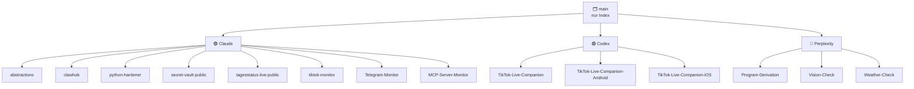

<div align="center">

# 🗂️ Projects

**Branch-basiertes Mono-Repository — jeder Branch ist ein eigenständiges Projekt einer KI-Plattform.**
Der Default-Branch `main` enthält ausschließlich diesen Index.

[](https://github.com/KikiKari/Projects/branches)
[](#-übersicht)
[](#-übersicht)
[](#-darstellungen)
[](https://github.com/KikiKari/Projects/tree/main)

</div>

---

## 📖 Übersicht

Dieses Repository folgt einem **Branch-pro-Projekt**-Modell: Statt einer verschachtelten
Ordnerstruktur lebt jedes Projekt vollständig in seinem eigenen Branch. Die Branches sind
**Orphan-Branches** — sie teilen keine Historie mit `main` und untereinander auch nicht.
`main` trägt keinen Projektcode, sondern dient als reine Landing-Page.


```mermaid
flowchart TD
    MAIN["🗂️ main<br/>nur Index"]
    MAIN --> CL["🟣 Claude"]
    MAIN --> CX["🟢 Codex"]
    MAIN --> PX["🔵 Perplexity"]

    CL --> A["abstractions"]
    CL --> B["clawhub"]
    CL --> C["python-hardener"]
    CL --> D["secret-vault-public"]
    CL --> E["tagesstatus-live-public"]
    CL --> F["tiktok-monitor"]
    CL --> G["Telegram-Monitor"]
    CL --> H["MCP-Server-Monitor"]

    CX --> I["TikTok-Live-Companion"]
    CX --> J["TikTok-Live-Companion-Android"]
    CX --> K["TikTok-Live-Companion-iOS"]

    PX --> L["Program-Derivation"]
    PX --> M["Vision-Check"]
    PX --> N["Weather-Check"]
```

---

## 🎛️ Darstellungen

Jedes Projekt-README ist nach demselben Muster ausgearbeitet:

| Darstellung | Wo | Wozu |
|---|---|---|
| **Isometrische 3D-Ansicht** | `docs/assets/architektur-iso.png` | Standbild der Schichten, kollisionsfrei beschriftet |
| **Rotierende 3D-Ansicht** | `docs/assets/architektur-rotation.gif` | 36 Bilder, einmal um die Szene |
| **Interaktive 3D-Ansicht** | gehostet, aus dem README verlinkt | drehen, zoomen, Knoten auswählen, Detailpanel |
| **Mermaid-Sequenzdiagramme** | im README | drei tatsächliche Abläufe je Projekt |

Alle drei 3D-Darstellungen stammen aus **einer** Beschreibung je Projekt:

```
docs/architektur.json     Schichten, Bausteine, Verbindungen
tools/render_3d.py        erzeugt Standbild und GIF (Pillow + NumPy)
public/3d.html            erzeugt die interaktive Ansicht (three.js)
```

Neu erzeugen:

```bash
python tools/render_3d.py docs/architektur.json docs/assets
```

Der Renderer ist eine reine Orthogonalprojektion mit Maler-Algorithmus — kein Renderer,
keine GPU. Beschriftungen werden zuletzt gesetzt und weichen einander aus, mit
Führungslinie zum Block: In der Isometrie landen Bausteine, die im Raum weit
auseinanderliegen, projiziert oft nebeneinander.

---

## 🟣 Claude

Skills, Agents und Browser-Artefakte rund um die OpenClaw-/Claude-Code-Umgebung.

| Projekt | Beschreibung | Branch |
| --- | --- | --- |
| **MCP-Server-Monitor** | Diagnose- und Einrichtungswerkzeug für fremde MCP-Server: bestimmt anhand von fünf Zuständen, warum Tools fehlen, prüft per Discovery (`mcp.DOMAIN`, `docs.DOMAIN/mcp`, OAuth-`well-known`), ob ein Anbieter überhaupt einen Server betreibt, und benennt die MSIX-Pfadfalle der Konfigurationsdatei. | [`MCP-Server-Monitor`](https://github.com/KikiKari/Projects/tree/MCP-Server-Monitor) |
| **Telegram-Monitor** | Findet und beobachtet Telegram-Kanäle komplett webbasiert — drei parallel laufende Zugangswege (web, Bot-API, MTProto), Discord als zweite Plattform, TikTok-Livegang-Meldung, Dauerbetrieb im Container mit PWA. | [`Telegram-Monitor`](https://github.com/KikiKari/Projects/tree/Telegram-Monitor) |
| **abstractions** | Automatisierter Multi-Node Abstraction Manager, der OpenClaw-Scripts per Cron alle sechs Stunden in zehn Zielsprachen portiert, das Ergebnis gegen die laufende Umgebung prüft und Status-Report sowie Dokumentations-Datenbanken pflegt. | [`abstractions`](https://github.com/KikiKari/Projects/tree/abstractions) |
| **clawhub** | Bidirektionaler Sync-Agent zwischen ClawHub-Workspace und Git: Vergleich über Zeitstempel **und** Hash, Backup vor jeder Änderung, Dry-Run mit Freigabe — und die ausdrückliche Weigerung, Konflikte selbst aufzulösen. | [`clawhub`](https://github.com/KikiKari/Projects/tree/clawhub) |
| **python-hardener** | Messplatz für den gleichnamigen Skill: dieselbe Aufgabe mit und ohne Skill, geprüft über den Syntaxbaum statt per Textsuche, mit Benchmark und HTML-Gegenüberstellung. | [`python-hardener`](https://github.com/KikiKari/Projects/tree/python-hardener) |
| **secret-vault-public** | Verschlüsselter Secret-Container als reines Browser-Artefakt: WebCrypto, AES-256-GCM mit PBKDF2 (210 000 Iterationen), kein Backend, keine eingebetteten Schlüssel. | [`secret-vault-public`](https://github.com/KikiKari/Projects/tree/secret-vault-public) |
| **tagesstatus-live-public** | Statusseite für acht Dienste (GitHub, Vercel, Docker Hub, OpenRouter, OpenAI, Anthropic, Tailscale, ClawHub) — Tokens werden abgefragt statt eingebettet und liegen nur im `localStorage`. | [`tagesstatus-live-public`](https://github.com/KikiKari/Projects/tree/tagesstatus-live-public) |
| **tiktok-monitor** | TikTok-LIVE-Monitor (`tt-live`): prüft den Live-Status, löst die m3u8-Stream-URL auf und meldet per Daemon `go_live` / `go_offline` / `rename_detected` als reiner Datenprovider. | [`tiktok-monitor`](https://github.com/KikiKari/Projects/tree/tiktok-monitor) |

---

## 🟢 Codex

Browser-Erweiterung, native Apps und zweisprachige Dokumentationssite.

| Projekt | Beschreibung | Branch |
| --- | --- | --- |
| **TikTok-Live-Companion** | Lokale Manifest-V3-Erweiterung mit zugänglichem LIVE-Chat, Untertitelprüfung, Playersteuerung und passiver Ereignisbeobachtung — gelesen, niemals gesendet. Dazu die statische Doku-Site in Deutsch und Englisch. | [`TikTok-Live-Companion`](https://github.com/KikiKari/Projects/tree/TikTok-Live-Companion) |
| **TikTok-Live-Companion-Android** | Native Kotlin-/Compose-/AndroidX-WebKit-App für Android und HyperOS. Die Mobile Bridge v1 prüft jedes Ereignis aus dem WebView auf Origin, Typ und Größe; Songerkennung über ShazamKit nur nach Nutzeraktion. | [`TikTok-Live-Companion-Android`](https://github.com/KikiKari/Projects/tree/TikTok-Live-Companion-Android) |
| **TikTok-Live-Companion-iOS** | Native Swift-/SwiftUI-/WebKit-App mit derselben Brücke und demselben Audioweg — Mikrofon als stabiler, WebView-PCM als experimenteller Pfad. | [`TikTok-Live-Companion-iOS`](https://github.com/KikiKari/Projects/tree/TikTok-Live-Companion-iOS) |

---

## 🔵 Perplexity

Skills und Apps für die Perplexity-Plattform (Computer-Prompts, On-Device-KI, Analyse).

| Projekt | Beschreibung | Branch |
| --- | --- | --- |
| **Program-Derivation** | Skill für formale Programmableitung: erst Abstraktionsschichten ermitteln, dann messen (CC, LCOM, Kopplung, Kohäsion, Vendor Lock-in), dann ableiten — mit sechsstufiger Roadmap und zweisprachigen Referenzen. | [`Program-Derivation`](https://github.com/KikiKari/Projects/tree/Program-Derivation) |
| **Vision-Check** | Biodiversitätserkennung über die Smartphone-Kamera bis 4K: On-Device-KI (TensorFlow.js / COCO-SSD), Canvas-Bildverbesserung mit Kontrastanhebung bis 4× und optionale Cloud-Analyse über OpenAI, Gemini und Claude. | [`Vision-Check`](https://github.com/KikiKari/Projects/tree/Vision-Check) |
| **Weather-Check** | Lokaler Regen-Check für die nächsten 30, 60 und 120 Minuten aus DWD-Radar, Messstationen, Open-Meteo, Satellit, Webcams und optionalem Handyfoto — als PWA und als Perplexity-Computer-Prompt. | [`Weather-Check`](https://github.com/KikiKari/Projects/tree/Weather-Check) |

---

<details>
<summary>ℹ️ Hinweise zur Struktur</summary>

- **`main`** enthält nur diese Übersicht — keinen Projektcode.
- Jedes Projekt wird in **seinem eigenen Branch** entwickelt und gepflegt; es gibt keine
  projektübergreifenden Merges in `main`.
- Die Branches sind **Orphan-Branches** ohne gemeinsamen Vorfahren. Ein Vergleich zwischen
  zwei Projekt-Branches ist deshalb nicht sinnvoll.
- Alle Projekt-READMEs sind ausgearbeitet: isometrische und rotierende 3D-Ansicht,
  interaktive Ansicht und drei Mermaid-Sequenzdiagramme.

</details>

<details>
<summary>⚙️ Hinweis zu den Vercel-Projekten</summary>

Alle Vercel-Projekte hängen am **selben** Repository. Ein Push auf irgendeinen Branch löst
deshalb in **jedem** dieser Projekte einen Build aus — auch dort, wo der Branch nichts zu
suchen hat. Abstellbar pro Projekt über *Settings → Git → Ignored Build Step*:

```bash
if [ "$VERCEL_GIT_COMMIT_REF" != "<Branch dieses Projekts>" ]; then exit 0; else exit 1; fi
```

Ohne diese Bremse verbraucht ein einziger Doku-Durchlauf über alle Branches das
Tages-Kontingent an Deployments.

</details>
