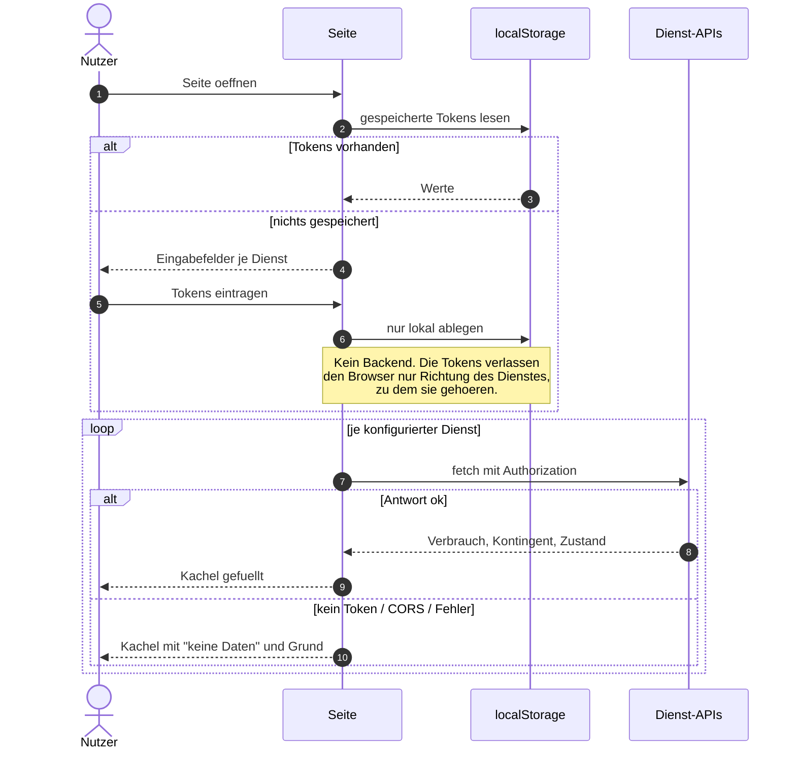
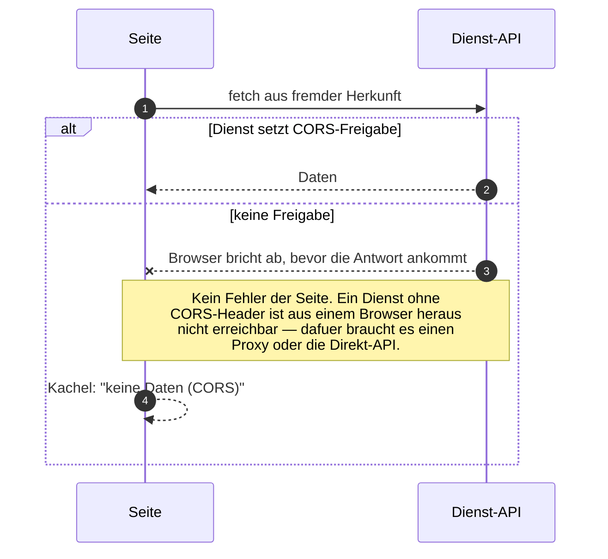
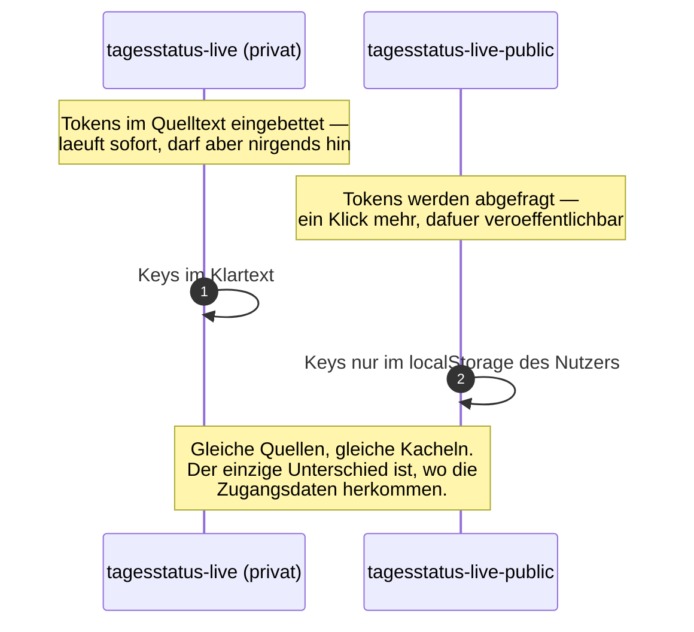

# 📊 Tagesstatus Live (public)

**Statusseite für acht Dienste — umgebungs-unabhängig, ohne eingebettete Schlüssel.**

Zeigt Verbrauch und Zustand von GitHub, Vercel, Docker Hub, OpenRouter, OpenAI, Anthropic,
Tailscale und ClawHub auf einer Seite. Die Daten holt der Browser **direkt** bei den Diensten;
es gibt kein Backend, das dazwischensteht.

Die Tokens werden beim Öffnen abgefragt und liegen ausschließlich im `localStorage`. Ohne
Token zeigt die betreffende Kachel „keine Daten" — die Seite rät nicht und bringt nichts mit.

---

## Schnellstart

`tagesstatus-live-public/index.html` im Browser öffnen. Tokens eintragen, fertig.
Kein Server, keine Installation, kein Konto bei irgendjemandem außer den Diensten selbst.

---

## Architektur

<div align="center">


**[▶ Interaktive 3D-Ansicht öffnen](public/3d.html)** — ziehen zum Drehen, Rad zum Zoomen,
Umschalter zwischen isometrisch und perspektivisch.

</div>

### Isometrische Ansicht


| Schicht | Was passiert | Ohne Token |
|---|---|---|
| **Tokens** | beim Öffnen abgefragt, nur in `localStorage` | die Seite fragt, sie rät nicht |
| **Quellen** | acht Dienste, jeder mit eigener API | jede einzeln abschaltbar |
| **Abruf** | ein `fetch` je Quelle, direkt aus dem Browser | Fehler bleiben lokal |
| **Ausgabe** | Kacheln mit Verbrauch und Zustand | „keine Daten" statt leerer Kachel |

**Kein Backend, keine eingebetteten Schlüssel.** Der Unterschied zur nicht-öffentlichen
Fassung ist genau dieser: dort stehen die Tokens im Quelltext, hier fragt die Seite danach.
Deshalb ist diese Fassung veröffentlichbar und die andere nicht.

Beide Bilder entstehen aus `docs/architektur.json`:

```bash
python tools/render_3d.py docs/architektur.json docs/assets
```

---

## Abläufe

### Seite öffnen, Tokens eingeben, Status sehen


```mermaid
sequenceDiagram
    autonumber
    actor N as Nutzer
    participant S as Seite
    participant L as localStorage
    participant Q as Dienst-APIs

    N->>S: Seite oeffnen
    S->>L: gespeicherte Tokens lesen
    alt Tokens vorhanden
        L-->>S: Werte
    else nichts gespeichert
        S-->>N: Eingabefelder je Dienst
        N->>S: Tokens eintragen
        S->>L: nur lokal ablegen
        Note over S,L: Kein Backend. Die Tokens verlassen<br/>den Browser nur Richtung des Dienstes,<br/>zu dem sie gehoeren.
    end
    loop je konfigurierter Dienst
        S->>Q: fetch mit Authorization
        alt Antwort ok
            Q-->>S: Verbrauch, Kontingent, Zustand
            S-->>N: Kachel gefuellt
        else kein Token / CORS / Fehler
            S-->>N: Kachel mit "keine Daten" und Grund
        end
    end
```

### Warum manche Kachel leer bleibt


```mermaid
sequenceDiagram
    autonumber
    participant S as Seite
    participant A as Dienst-API

    S->>A: fetch aus fremder Herkunft
    alt Dienst setzt CORS-Freigabe
        A-->>S: Daten
    else keine Freigabe
        A--xS: Browser bricht ab, bevor die Antwort ankommt
        Note over S,A: Kein Fehler der Seite. Ein Dienst ohne<br/>CORS-Header ist aus einem Browser heraus<br/>nicht erreichbar — dafuer braucht es einen<br/>Proxy oder die Direkt-API.
        S-->>S: Kachel: "keine Daten (CORS)"
    end
```

### Was diese Fassung von der privaten unterscheidet


```mermaid
sequenceDiagram
    autonumber
    participant P as tagesstatus-live (privat)
    participant O as tagesstatus-live-public

    Note over P: Tokens im Quelltext eingebettet —<br/>laeuft sofort, darf aber nirgends hin
    Note over O: Tokens werden abgefragt —<br/>ein Klick mehr, dafuer veroeffentlichbar
    P->>P: Keys im Klartext
    O->>O: Keys nur im localStorage des Nutzers
    Note over P,O: Gleiche Quellen, gleiche Kacheln.<br/>Der einzige Unterschied ist, wo die<br/>Zugangsdaten herkommen.
```


---

## Die acht Quellen

| Dienst | Was gezeigt wird | Was zusätzlich nötig ist |
|---|---|---|
| **GitHub** | Repos, Aktionen, Kontingent | Token + `owner/repo` |
| **Vercel** | Projekte, Deployments | Token + Team-ID und Projekt-ID |
| **Docker Hub** | Abbilder, Pulls | Anmeldename/Namespace + PAT |
| **OpenRouter** | Guthaben, Verbrauch | API-Key |
| **OpenAI** | Verbrauch | Admin-Key (der normale Key reicht nicht) |
| **Anthropic** | Verbrauch | Admin-Key |
| **Tailscale** | Geräte im Tailnet | Access-Token + Tailnet-Name |
| **ClawHub** | eigene Skills, Installationen | API-Token + Skill-Slugs |

**Ein Token allein genügt oft nicht.** Mehrere Dienste brauchen zusätzlich einen
Identifikator: Namespace, Repo, Team, Tailnet, Slug. Steht der nicht daneben, bleibt die
Kachel leer, obwohl der Schlüssel stimmt — das ist der häufigste Stolperstein.

---

## Warum es diese Fassung gibt

Es gibt eine zweite, nicht veröffentlichte Variante desselben Werkzeugs mit fest
eingetragenen Zugangsdaten. Die läuft sofort, darf aber nirgendwohin — jeder, der sie öffnet,
liest die Schlüssel im Quelltext.

Diese Fassung tauscht einen Klick gegen Veröffentlichbarkeit: Tokens werden abgefragt statt
eingebettet, die Quellen und Kacheln sind identisch.

---

## Aufbau

```
tagesstatus-live-public/index.html    das gesamte Werkzeug, eine Datei
tagesstatus-live-public/thumbnail.png Vorschaubild
public/3d.html                        interaktive Architekturansicht
tools/render_3d.py                    erzeugt Standbild und GIF
docs/architektur.json                 Schichtbeschreibung
```

---

## Grenzen

- **CORS entscheidet.** Ein Dienst ohne CORS-Freigabe ist aus dem Browser heraus nicht
  erreichbar, egal wie gültig der Token ist. Die Kachel benennt dann den Grund.
- **Kein Verlauf.** Die Seite zeigt den Moment, nicht die Entwicklung. Wer Zeitreihen will,
  braucht eine Ablage — die gibt es hier bewusst nicht.
- **Kein automatischer Abruf.** Neu geladen wird beim Öffnen und auf Knopfdruck. Jeder Abruf
  verbraucht echtes Kontingent beim jeweiligen Dienst.
- **`localStorage` ist kein Tresor.** Wer Zugriff auf das Browserprofil hat, liest die Tokens.
  Für dauerhafte Ablage gehört ein Passwortmanager oder der verschlüsselte Vault daneben.
