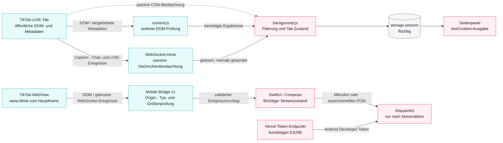
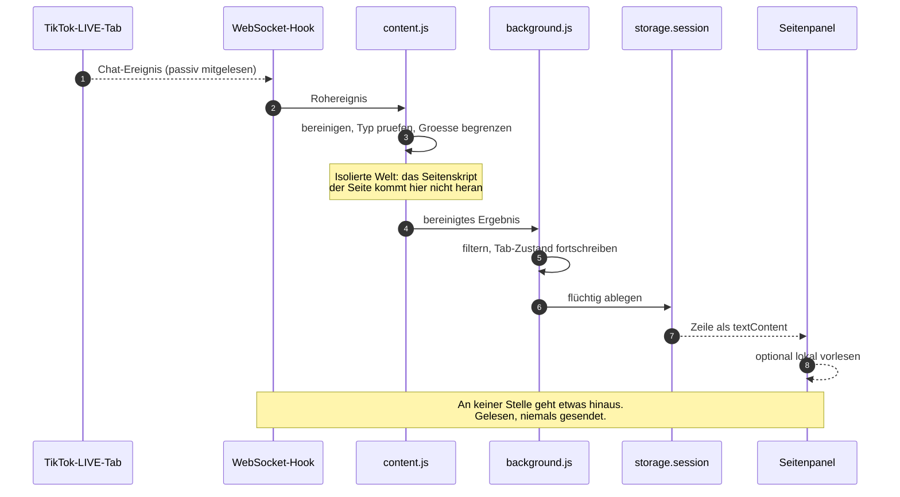
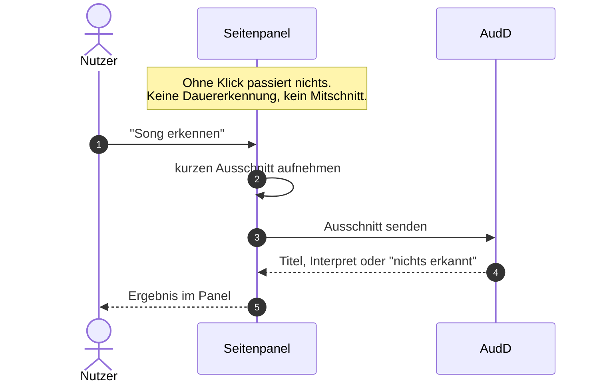
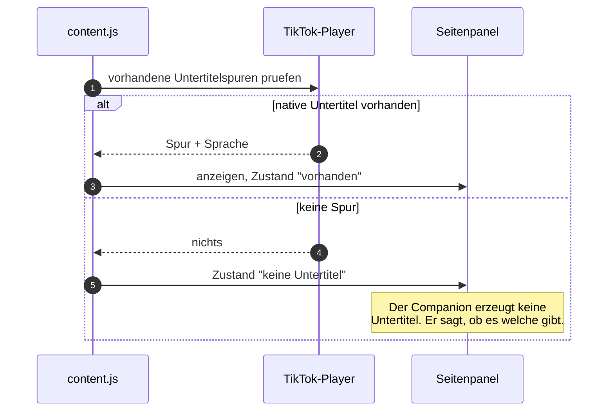

# TikTok LIVE Companion 0.8.0

TikTok LIVE Companion ist eine lokale Manifest-V3-Erweiterung für Edge und Chrome. Sie macht öffentliche TikTok-LIVE-Streams zugänglicher: Chatzeilen werden als bereinigter Text angezeigt und auf Wunsch lokal vorgelesen, native Untertitel werden geprüft, LIVE-Werte und Stream-Qualitäten werden sichtbar und der vorhandene Player lässt sich über ein Seitenpanel steuern.

Version 0.8.0 bündelt die Browser-Erweiterung, den lokalen Windows-Dienst, das Codex-Plugin und die Mobile-Quellarchive im einheitlichen Release-Stand. Die Browser-Erweiterung erkennt Songs weiterhin manuell über AudD; die nativen Apps verwenden ShazamKit mit Mikrofon als stabilem und WebView-PCM als experimentellem Audioweg.

[](https://tiktok-live-companion.vercel.app/de/architecture-3d)

Die Visualisierung zeigt den tatsächlichen 0.8.0-Datenfluss: Browser-Songerkennung über AudD nur nach Klick sowie native iOS-/Android-/HyperOS-Erkennung über ShazamKit. SVG, Mermaid-Diagramm und Three.js-Ansicht bilden denselben projektspezifischen Datenfluss ab.

- [Interaktive Three.js-Ansicht](https://tiktok-live-companion.vercel.app/de/architecture-3d)
- [Freigegebener Mobile-Entwurf](docs/mobile/mobile-0.7.0-concept.png)
- [Visualisierungsvertrag und Textalternative](docs/diagrams/tiktok-live-companion-visualization-contract.md)

## Schnellstart

1. Lade `release/0.8.0/tiktok-live-companion-extension-0.8.0.zip` herunter und entpacke die Datei.
2. Öffne `edge://extensions` oder `chrome://extensions` und aktiviere den Entwicklermodus.
3. Wähle **Entpackte Erweiterung laden** und den Ordner mit `manifest.json`.
4. Öffne einen öffentlichen TikTok-LIVE-Tab und klicke auf **TikTok LIVE Companion**.
5. Nutze **Hook setzen**, bevor der Player seine WebSocket-Verbindung aufbaut.

## Architektur


```mermaid
flowchart LR
    page["TikTok-LIVE-Tab<br/>öffentliche DOM- und Metadaten"]
    content["content.js<br/>isolierte DOM-Prüfung"]
    hook["WebSocket-Hook<br/>passive Nachrichtenbeobachtung"]
    bg["background.js<br/>Filterung und Tab-Zustand"]
    session[("storage.session<br/>flüchtig")]
    panel["Seitenpanel<br/>textContent-Ausgabe"]
    mobilePage["TikTok-WebView<br/>www.tiktok.com Hauptframe"]
    bridge["Mobile Bridge v1<br/>Origin-, Typ- und Größenprüfung"]
    native["SwiftUI / Compose<br/>flüchtiger Streamzustand"]
    shazam["ShazamKit<br/>nur nach Nutzeraktion"]
    token["Vercel Token-Endpunkt<br/>kurzlebiges ES256"]

    page -->|"DOM / eingebettete Metadaten"| content
    page -->|"Caption-, Chat- und LIVE-Ereignisse"| hook
    page -.->|"passive CDN-Beobachtung"| bg
    content -->|"bereinigte Ergebnisse"| bg
    hook -->|"gelesen, niemals gesendet"| bg
    bg --> session
    session --> panel
    mobilePage -->|"DOM / gelesene WebSocket-Ereignisse"| bridge
    bridge -->|"validierter Ereignisumschlag"| native
    native -->|"Mikrofon oder experimentelles PCM"| shazam
    token -->|"Android Developer Token"| shazam

    classDef observation fill:#e7fbfb,stroke:#25b9c2,color:#102126
    classDef action fill:#fff0f3,stroke:#fe2c55,color:#2b1117
    classDef storage fill:#f5f6f8,stroke:#667085,color:#101828
    class page,content,hook,mobilePage,bridge observation
    class bg,panel,native,shazam,token action
    class session storage
```

Quelle: [`docs/diagrams/architecture.mmd`](docs/diagrams/architecture.mmd)

### Schichtansicht in 3D

<div align="center">


**[▶ Begehbare Schichtansicht öffnen](https://tiktok-live-companion.vercel.app/de/architecture-3d)** — ziehen zum Drehen, Rad zum Zoomen,
Umschalter zwischen isometrisch und perspektivisch. Ergänzt die
[interaktive Datenfluss-Ansicht](https://tiktok-live-companion.vercel.app/de/architecture-3d)
um die Schichtsicht.

</div>


| Schicht | Wo | Verantwortung | Sendet |
|---|---|---|---|
| **Quelle** | TikTok-Tab | öffentliche DOM- und Metadaten | — |
| **Beobachtung** | `content.js`, WebSocket-Hook | isolierte Prüfung, passives Mitlesen | nein |
| **Zustand** | `background.js`, `storage.session` | Filterung, Tab-Zustand, flüchtige Ablage | nein |
| **Ausgabe** | Seitenpanel | `textContent`, Vorlesen, Playersteuerung | nein |
| **Doku** | `docs/de`, `docs/en` | zweisprachige statische Site | — |

Der WebSocket-Hook liest, er sendet nie. `storage.session` ist bewusst flüchtig: Nach dem
Schließen des Tabs bleibt nichts zurück, was jemand später auslesen könnte.

Standbild und GIF entstehen aus `docs/architektur.json`:

```bash
python tools/render_3d.py docs/architektur.json docs/assets
```

---

## Abläufe

### Eine Chatzeile bis ins Seitenpanel


```mermaid
sequenceDiagram
    autonumber
    participant T as TikTok-LIVE-Tab
    participant H as WebSocket-Hook
    participant C as content.js
    participant B as background.js
    participant S as storage.session
    participant P as Seitenpanel

    T-->>H: Chat-Ereignis (passiv mitgelesen)
    H->>C: Rohereignis
    C->>C: bereinigen, Typ pruefen, Groesse begrenzen
    Note over C: Isolierte Welt: das Seitenskript<br/>der Seite kommt hier nicht heran
    C->>B: bereinigtes Ergebnis
    B->>B: filtern, Tab-Zustand fortschreiben
    B->>S: flüchtig ablegen
    S-->>P: Zeile als textContent
    P-->>P: optional lokal vorlesen
    Note over H,P: An keiner Stelle geht etwas hinaus.<br/>Gelesen, niemals gesendet.
```

### Songerkennung — nur nach Klick


```mermaid
sequenceDiagram
    autonumber
    actor N as Nutzer
    participant P as Seitenpanel
    participant A as AudD

    Note over P: Ohne Klick passiert nichts.<br/>Keine Dauererkennung, kein Mitschnitt.
    N->>P: "Song erkennen"
    P->>P: kurzen Ausschnitt aufnehmen
    P->>A: Ausschnitt senden
    A-->>P: Titel, Interpret oder "nichts erkannt"
    P-->>N: Ergebnis im Panel
```

### Untertitel prüfen


```mermaid
sequenceDiagram
    autonumber
    participant C as content.js
    participant T as TikTok-Player
    participant P as Seitenpanel

    C->>T: vorhandene Untertitelspuren pruefen
    alt native Untertitel vorhanden
        T-->>C: Spur + Sprache
        C->>P: anzeigen, Zustand "vorhanden"
    else keine Spur
        T-->>C: nichts
        C->>P: Zustand "keine Untertitel"
        Note over P: Der Companion erzeugt keine<br/>Untertitel. Er sagt, ob es welche gibt.
    end
```

## Dokumentation

- [Deutsch](docs/de/overview.md)
- [English](docs/en/overview.md)
- [Architekturdiagramm](docs/diagrams/architecture.mmd)
- [Interaktive Three.js-Architektur](https://tiktok-live-companion.vercel.app/de/architecture-3d)
- [Generiertes Architektur-SVG](docs/diagrams/tiktok-live-companion-architecture.svg)
- [Visualisierungsquellen und Reproduktion](assets/README.md)
- [Sicherheitsbeschreibung](plugin-source/SECURITY.md)

Die veröffentlichte Dokumentationssite enthält dieselben Inhalte mit Sprachumschaltung, Suche und geprüften Downloads. GitHub ist die technische Quelle; Notion, Linear, Canva und Vercel spiegeln den freigegebenen Stand.

## Projektlinks

- [Dokumentationssite](https://tiktok-live-companion.vercel.app)
- [Linear-Projekt](https://linear.app/0penclaw/project/tiktok-live-companion-ed2f087b24bc)
- [Notion-Projektseite](https://app.notion.com/p/3a18d8ad3db9817f882bd79682fbbc51)
- [GitHub-Branch](https://github.com/KikiKari/Projects/tree/TikTok-Live-Companion)
- [iOS-Branch](https://github.com/KikiKari/Projects/tree/TikTok-Live-Companion-iOS)
- [Android-/HyperOS-Branch](https://github.com/KikiKari/Projects/tree/TikTok-Live-Companion-Android)

## Projektstruktur

- `plugin-source/` – reproduzierbarer Plugin-Quellstand einschließlich Browser-Erweiterung, Tests und Packaging-Script
- `docs/` – deutsche und englische Dokumentation sowie Mermaid-Quellen
- `release/` – reproduzierbare 0.8.0-Artefakte und SHA-256-Prüfsummen
- `plugin-source/companion-service/` – optionaler lokaler Windows-Dienst für verstärkte Sprachausgabe und manuelle Songerkennung
- `site/` – statische React-/TypeScript-/Vite-Dokumentationssite
- `mobile/ios/` – SwiftUI-, WKWebView- und ShazamKit-Xcode-Projekt ab iOS 15
- `mobile/android/` – Kotlin-/Compose-/AndroidX-WebKit-Projekt ab API 21, ohne Google-Play-Services-Abhängigkeit
- `plugin-source/mobile-shared/` – versionierte, origin-beschränkte WebView-Bridge

## Verifikation

```powershell
node plugin-source/scripts/test_extension.cjs
node plugin-source/scripts/test_mobile_bridge.cjs
python assets/test_visualizations.py
cd plugin-source/companion-service
npm test
cd ../../site
npm ci
npm run typecheck
npm test
npm run build
```

Android- und iOS-Builds benötigen die jeweiligen Hersteller-Toolchains. Das proprietäre ShazamKit-AAR und Apple-Schlüsselmaterial werden nicht im Repository gespeichert.

Die Erweiterung liest keine Cookies. Chat, Statistik und TTS bleiben lokal; nur nach einem ausdrücklichen Klick wird ein kurzer Audioausschnitt über den lokalen Dienst an AudD gesendet. Signierte Stream-URLs sind zeitlich begrenzt und während ihrer Gültigkeit sensibel.
