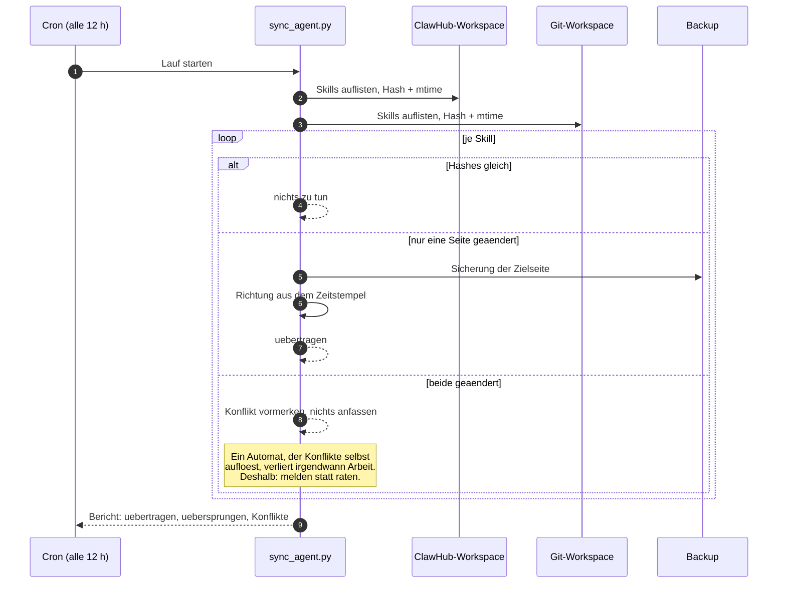
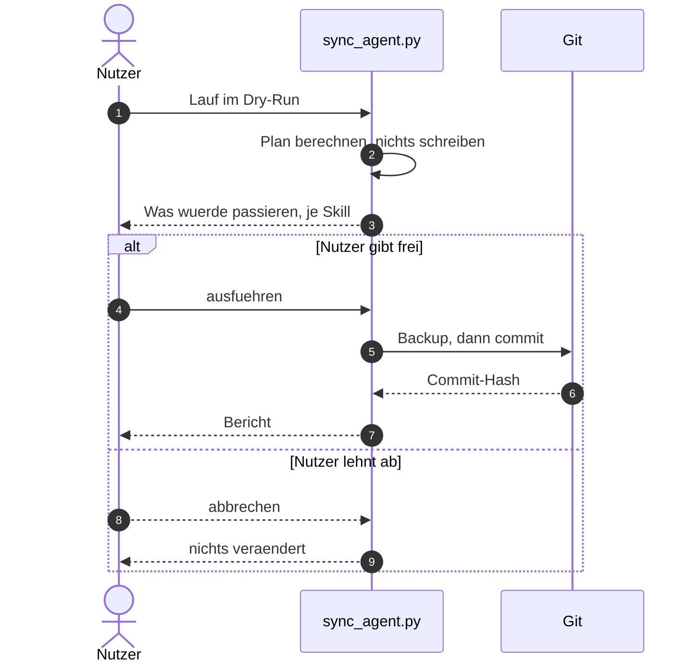
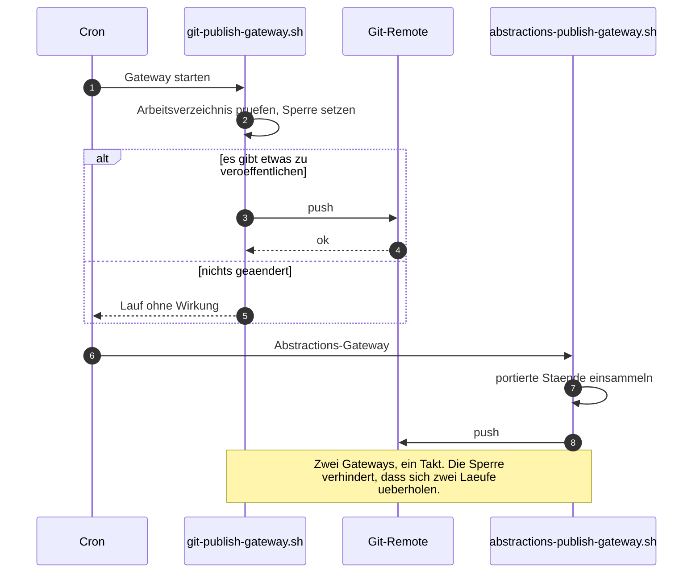

# 🔄 ClawHub ↔ Git Sync-Agent

**Bidirektionaler Abgleich zwischen dem ClawHub-Workspace und einem Git-Repository —
alle 12 Stunden, unbeaufsichtigt, mit Sicherung vor jeder Änderung.**

Skills entstehen mal auf der einen, mal auf der anderen Seite. Ohne Abgleich driften beide
Stände auseinander, und irgendwann weiß niemand mehr, welcher der richtige ist. Dieser Agent
hält sie zusammen — und **weigert sich**, Konflikte selbst aufzulösen.

---

## Schnellstart

```bash
# Was wuerde passieren?
python3 clawhub/Skills/sync_agent.py --dry-run

# Ausfuehren
python3 clawhub/Skills/sync_agent.py

# Als Cron alle 12 Stunden
0 */12 * * * /usr/bin/python3 /pfad/zu/sync_agent.py
```

Abgeglichen wird zwischen:

- **ClawHub:** `/workspace/skills/*/`
- **Git:** `/workspace/git/skills/*/`

---

## Architektur

<div align="center">


**[▶ Interaktive 3D-Ansicht öffnen](https://clawhub.vercel.app/3d.html)** — ziehen zum Drehen, Rad zum Zoomen,
Umschalter zwischen isometrisch und perspektivisch.

</div>

### Isometrische Ansicht


| Schicht | Wo | Verantwortung |
|---|---|---|
| **Seiten** | `/workspace/skills/`, `/workspace/git/skills/` | die zwei Wahrheiten, die abgeglichen werden |
| **Vergleich** | `sync_agent.py` | Zeitstempel und Hash — beides, nicht eines |
| **Absicherung** | Backup, Dry-Run, Freigabe | vor jeder Änderung, ohne Ausnahme |
| **Übertragung** | `sync_agent.py`, Gateway-Skripte | Commit, Publish |
| **Takt** | Cron | alle 12 Stunden, unbeaufsichtigt |

**Warum Zeitstempel *und* Hash:** Der Zeitstempel sagt, welche Seite neuer ist. Der Hash sagt,
ob sich überhaupt etwas geändert hat. Nur der Zeitstempel würde bei jedem Anfassen einer Datei
einen Sync auslösen; nur der Hash wüsste bei echten Unterschieden nicht, welche Richtung gilt.

Beide Bilder entstehen aus `docs/architektur.json`:

```bash
python tools/render_3d.py docs/architektur.json docs/assets
```

---

## Abläufe

### Ein Sync-Lauf


```mermaid
sequenceDiagram
    autonumber
    participant C as Cron (alle 12 h)
    participant A as sync_agent.py
    participant H as ClawHub-Workspace
    participant G as Git-Workspace
    participant B as Backup

    C->>A: Lauf starten
    A->>H: Skills auflisten, Hash + mtime
    A->>G: Skills auflisten, Hash + mtime
    loop je Skill
        alt Hashes gleich
            A-->>A: nichts zu tun
        else nur eine Seite geaendert
            A->>B: Sicherung der Zielseite
            A->>A: Richtung aus dem Zeitstempel
            A-->>A: uebertragen
        else beide geaendert
            A-->>A: Konflikt vormerken, nichts anfassen
            Note over A: Ein Automat, der Konflikte selbst<br/>aufloest, verliert irgendwann Arbeit.<br/>Deshalb: melden statt raten.
        end
    end
    A-->>C: Bericht: uebertragen, uebersprungen, Konflikte
```

### Dry-Run mit Freigabe


```mermaid
sequenceDiagram
    autonumber
    actor N as Nutzer
    participant A as sync_agent.py
    participant G as Git

    N->>A: Lauf im Dry-Run
    A->>A: Plan berechnen, nichts schreiben
    A-->>N: Was wuerde passieren, je Skill
    alt Nutzer gibt frei
        N->>A: ausfuehren
        A->>G: Backup, dann commit
        G-->>A: Commit-Hash
        A-->>N: Bericht
    else Nutzer lehnt ab
        N-->>A: abbrechen
        A-->>N: nichts veraendert
    end
```

### Publish-Gateway


```mermaid
sequenceDiagram
    autonumber
    participant C as Cron
    participant S as git-publish-gateway.sh
    participant R as Git-Remote
    participant P as abstractions-publish-gateway.sh

    C->>S: Gateway starten
    S->>S: Arbeitsverzeichnis pruefen, Sperre setzen
    alt es gibt etwas zu veroeffentlichen
        S->>R: push
        R-->>S: ok
    else nichts geaendert
        S-->>C: Lauf ohne Wirkung
    end
    C->>P: Abstractions-Gateway
    P->>P: portierte Staende einsammeln
    P->>R: push
    Note over S,P: Zwei Gateways, ein Takt. Die Sperre<br/>verhindert, dass sich zwei Laeufe<br/>ueberholen.
```


---

## Wie entschieden wird

| Lage | Was der Agent tut |
|---|---|
| Hashes gleich | nichts |
| Nur eine Seite geändert | Backup, dann in Richtung des neueren Zeitstempels übertragen |
| Beide Seiten geändert | **Konflikt melden, nichts anfassen** |
| Nur auf einer Seite vorhanden | anlegen, nach Backup |

Der dritte Fall ist der wichtige. Ein Automat, der Konflikte selbst auflöst, verliert
irgendwann Arbeit — und zwar unbemerkt. Melden ist unbequemer und richtig.

---

## Die Gateway-Skripte

| Skript | Zweck |
|---|---|
| `git-publish-gateway.sh` | veröffentlicht den Git-Stand, mit Sperre gegen überlappende Läufe |
| `git-publish-gateway-cron.sh` | Cron-Hülle dazu |
| `abstractions-publish-gateway.sh` | dasselbe für die portierten Stände aus dem `abstractions`-Branch |
| `abstractions-publish-gateway-cron.sh` | Cron-Hülle dazu |

Die Sperre ist nicht Zierde: Bei 12-Stunden-Takt und langen Läufen können sich zwei
Durchgänge überholen, und dann schreiben beide dieselbe Datei.

---

## Aufbau

```
clawhub/Skills/SKILL.md                          Skill-Definition
clawhub/Skills/sync_agent.py                     der Abgleich selbst
clawhub/git-publish-agent_SKILL.md               Skill-Definition des Publish-Agenten
clawhub/Scripts/git-publish-gateway.sh           Veroeffentlichung Git
clawhub/Scripts/git-publish-gateway-cron.sh      Cron-Huelle
clawhub/Scripts/abstractions-publish-gateway.sh  Veroeffentlichung Abstractions
clawhub/Scripts/abstractions-publish-gateway-cron.sh  Cron-Huelle
public/3d.html                                   interaktive Architekturansicht
tools/render_3d.py                               erzeugt Standbild und GIF
docs/architektur.json                            Schichtbeschreibung
```

---

## Grenzen

- **Keine automatische Konfliktauflösung.** Bewusst. Wer sie will, muss sie selbst bauen und
  die Folgen tragen.
- **Kein Rollback über mehrere Läufe.** Es gibt ein Backup je Änderung, keine Historie mit
  Zeitreise. Die liegt in Git.
- **Der Takt ist grob.** 12 Stunden reichen für Skill-Pflege, nicht für gemeinsames Arbeiten
  an derselben Datei.
- **Zwei Seiten, nicht drei.** Ein dritter Ablageort würde die Konfliktlogik sprengen.
