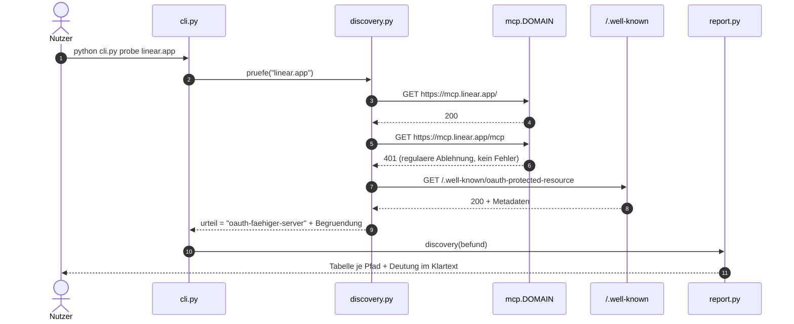
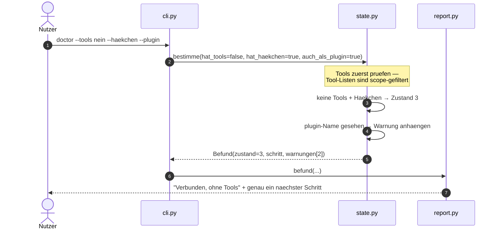
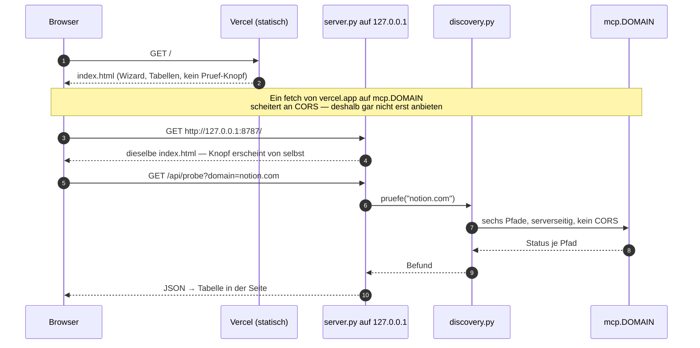

# MCP-Server-Monitor

Fremde, offizielle MCP-Server finden, ihren Zustand feststellen, einrichten lassen
und im Betrieb richtig benutzen.

Fast jede Frage nach einem MCP-Server ist in Wahrheit eine **Zustandsfrage**.
Wer den Zustand feststellt, hat die Antwort meist schon — dieses Werkzeug stellt
ihn fest und nennt pro Zustand genau einen nächsten Schritt.

Alles läuft mit purer Python-Standardbibliothek: kein pip, kein Framework,
keine Pflicht-Zugangsdaten.

> **Was dieses Werkzeug nicht ist: ein Automat.** Es trägt keine Server ein und
> meldet niemanden an. Das ist geprüfte Grenze, keine Bequemlichkeit — siehe
> [Grenzen](#grenzen). Was es kann, ist diagnostizieren, suchen und den Weg exakt
> vorbereiten. Das ist der Teil, an dem die meiste Zeit verloren geht.

---

## Schnellstart

```bash
python cli.py states                  # die fünf Zustände nachschlagen
python cli.py probe linear.app        # gibt es dort einen MCP-Server?
python cli.py config                  # welche Konfigurationsdatei wirkt bei mir?
python cli.py doctor --tools nein --haekchen
python cli.py serve                   # Weboberfläche: http://127.0.0.1:8787
```

Windows: `run.cmd` doppelklicken. macOS/Linux: `./run.sh`.
Jeder Befehl kennt `--json` für maschinenlesbare Ausgabe.

---

---

## Architektur

<div align="center">


**[▶ Interaktive 3D-Ansicht öffnen](https://mcp-server-monitor.vercel.app/3d.html)** — ziehen zum Drehen,
Rad zum Zoomen, Umschalter zwischen isometrisch und perspektivisch.

</div>

### Isometrische Ansicht


Vier Schichten, streng getrennt, jede für sich prüfbar:

| Schicht | Modul | Verantwortung | Kennt nicht |
|---|---|---|---|
| **Quellen** | Netz, Dateisystem | die Wirklichkeit, die befragt wird | — |
| **Sonde** | `discovery.py`, `config.py` | Rohbefunde erheben | Zustände, Formatierung |
| **Klassifikation** | `state.py` | Signale → einer von fünf Zuständen | Netz, Dateisystem, Terminal |
| **Ausgabe** | `report.py`, `server.py`, `public/` | Text bzw. HTML | Netz |

`state.py` importiert **nur** `dataclasses`. Das ist Absicht: Die Klassifikationsregeln
sind der Kern und müssen ohne Netz, ohne Dateien und ohne Terminal testbar bleiben.

Beide Bilder werden aus derselben Schichtbeschreibung erzeugt wie die 3D-Seite:

```bash
python tools/render_3d.py mcp-server-monitor docs/assets
```

---

## Abläufe

### Discovery — was beim Prüfen einer Domain passiert


```mermaid
sequenceDiagram
    autonumber
    actor N as Nutzer
    participant C as cli.py
    participant D as discovery.py
    participant E as mcp.DOMAIN
    participant W as /.well-known
    participant R as report.py

    N->>C: python cli.py probe linear.app
    C->>D: pruefe("linear.app")
    D->>E: GET https://mcp.linear.app/
    E-->>D: 200
    D->>E: GET https://mcp.linear.app/mcp
    E-->>D: 401 (regulaere Ablehnung, kein Fehler)
    D->>W: GET /.well-known/oauth-protected-resource
    W-->>D: 200 + Metadaten
    D-->>C: urteil = "oauth-faehiger-server" + Begruendung
    C->>R: discovery(befund)
    R-->>N: Tabelle je Pfad + Deutung im Klartext
```

Der entscheidende Punkt steht in Schritt 5: **400/401/405 sind reguläre Ablehnungen,
keine Negativbefunde.** Ein Streamable-HTTP-Endpunkt lehnt ein nacktes GET erwartungsgemäß
ab. Wer das als „nicht vorhanden" liest, sucht danach an der falschen Stelle.

### Zustandsbestimmung — warum die Tools fehlen


```mermaid
sequenceDiagram
    autonumber
    actor N as Nutzer
    participant C as cli.py
    participant S as state.py
    participant R as report.py

    N->>C: doctor --tools nein --haekchen --plugin
    C->>S: bestimme(hat_tools=false, hat_haekchen=true, auch_als_plugin=true)
    Note over S: Tools zuerst pruefen —<br/>Tool-Listen sind scope-gefiltert
    S->>S: keine Tools + Haekchen → Zustand 3
    S->>S: plugin-Name gesehen → Warnung anhaengen
    S-->>C: Befund(zustand=3, schritt, warnungen[2])
    C->>R: befund(...)
    R-->>N: "Verbunden, ohne Tools" + genau ein naechster Schritt
```

### Lokaler Companion — warum die öffentliche Seite nicht probt


```mermaid
sequenceDiagram
    autonumber
    participant B as Browser
    participant V as Vercel (statisch)
    participant L as server.py auf 127.0.0.1
    participant D as discovery.py
    participant Z as mcp.DOMAIN

    B->>V: GET /
    V-->>B: index.html (Wizard, Tabellen, kein Pruef-Knopf)
    Note over B,Z: Ein fetch von vercel.app auf mcp.DOMAIN<br/>scheitert an CORS — deshalb gar nicht erst anbieten
    B->>L: GET http://127.0.0.1:8787/
    L-->>B: dieselbe index.html — Knopf erscheint von selbst
    B->>L: GET /api/probe?domain=notion.com
    L->>D: pruefe("notion.com")
    D->>Z: sechs Pfade, serverseitig, kein CORS
    Z-->>D: Status je Pfad
    D-->>L: Befund
    L-->>B: JSON → Tabelle in der Seite
```

## Die fünf Zustände

| Zustand | Woran erkennbar | Nächster Schritt |
|---|---|---|
| **1 — Offen** | Tools vorhanden, nie etwas angemeldet | Direkt benutzen |
| **2 — Verbunden, mit Tools** | Konnektor mit Häkchen, Tools vorhanden | Direkt benutzen |
| **3 — Verbunden, ohne Tools** | Konnektor mit Häkchen, aber keine Tools | Liefert er überhaupt Tools? Scope erteilt? |
| **4 — Installiert, unangemeldet** | gelistet, Tools fehlen, „benötigt Authentifizierung" | Anmelden — braucht eine interaktive Sitzung |
| **5 — Nicht vorhanden** | nichts | Suchen, dann eintragen lassen |

**Zustand 3** ist der, der als Fehler missverstanden wird. Ein Konnektor kann
verbunden sein und trotzdem keine Tools mitbringen, weil er gar keine liefert —
die GitHub-Integration ist so ein Fall. Sie öffnet Repository-Zugriff für Chat,
Projekte und Claude Code; eine Tool-Sammlung ist sie nicht.

### Konnektoren und Plugin-Server sind zweierlei

Die zweite große Verwechslung, und sie erzeugt ein Bild, das wie ein Widerspruch
aussieht: Ein Dienst steht in der Konnektoren-Liste mit Häkchen — und gleichzeitig
meldet das System für denselben Namen „benötigt Authentifizierung".

Beides stimmt, weil es zwei verschiedene Server sind:

- **Konnektoren** hängen am Konto, gelten produktübergreifend, verwaltet unter *Anpassen → Konnektoren*.
- **Plugins** bringen eigene MCP-Server mit. `plugin:engineering:github` ist **nicht** der GitHub-Konnektor.

`cli.py doctor --plugin` benennt das ausdrücklich, sobald ein Name doppelt auftaucht.

---

## Zustand feststellen

```bash
python cli.py doctor --tools ja|nein [--gelistet] [--haekchen] \
                     [--auth-noetig] [--plugin] [--angemeldet]
```

1. **Tools prüfen.** Sind Tools mit dem Namensmuster des Servers vorhanden? Das ist
   das verlässlichste Signal — Tool-Listen sind scope-gefiltert, was da ist, ist nutzbar.
2. **Konnektoren-Liste ansehen.** *Einstellungen → Anpassen → Konnektoren*. Ferne
   Server haben Typ „Web".
3. **Auf Plugin-Server achten.** Läuft der Name auch als `plugin:…`, ist das ein
   zweiter, separat anzumeldender Server.

---

## Discovery

```bash
python cli.py probe notion.com sentry.io
```

Geprüft wird in dieser Reihenfolge:

| # | Pfad | Bedeutung |
|---|---|---|
| 1 | `https://mcp.DOMAIN/` | Streamable-HTTP-Endpunkt |
| 2 | `https://mcp.DOMAIN/mcp` | häufige Pfadvariante |
| 3 | `https://docs.DOMAIN/mcp` | dort steht sie bei den meisten Anbietern |
| 4 | `/.well-known/oauth-protected-resource` | existiert sie, gibt es einen OAuth-fähigen Server |
| 5 | `/.well-known/oauth-authorization-server` | dito, mit Revocation-Endpunkt |

**Eine leere Antwort auf ein nacktes GET beweist nichts.** Streamable-HTTP-Endpunkte
antworten darauf oft mit gar nichts; 400/401/405 sind reguläre Ablehnungen, keine
Negativbefunde. Erst wenn auch die Discovery-Pfade fehlen, ist von Abwesenheit
auszugehen — dann als Nächstes die Connector-Registry nach Anbietername und Domäne
durchsuchen.

---

## Eintragen — der reale Weg

**Ferne Server gehören unter Konnektoren, nicht unter Erweiterungen.**
*Erweiterungen* liegt im Abschnitt „Desktop-App" und meint lokale Erweiterungen.
*Konnektoren* liegt unter „Anpassen" und ist der richtige Ort.

**Weg 1 — Claude-App.** Einstellungen → Anpassen → Konnektoren → „Hinzufügen"
oben rechts → URL eintragen. Danach führt die Anmeldung durch den Browser.

**Weg 2 — Claude Code.**

```bash
claude mcp add --transport http NAME https://mcp.DOMAIN/
```

Danach `/mcp` aufrufen und im Browser anmelden.

**Weg 3 — Konfigurationsdatei**, Schlüssel `mcpServers`. Zwei mögliche Orte:

| Installationsart | Pfad |
|---|---|
| Standard-Installer | `%APPDATA%\Claude\claude_desktop_config.json` |
| MSIX (Store, WinGet, Enterprise) | `%LOCALAPPDATA%\Packages\Claude_pzs8sxrjxfjjc\LocalCache\Roaming\Claude\claude_desktop_config.json` |

**Die Falle:** Bei MSIX öffnet „Edit Config" die **erste** Datei, gelesen wird die
**zweite**. Wer dort einträgt, wartet vergeblich. Und die App liest die Datei nur
beim Start — nach dem Ändern vollständig beenden und neu öffnen.

`python cli.py config` sagt, welche Datei bei dir existiert und welche wirkt.

---

## Aufbau

```
cli.py              Kommandozeile — states, errors, probe, config, doctor, serve
server.py           lokaler Server auf 127.0.0.1, liefert public/index.html + /api/*
public/index.html   die statische Seite (auch das Vercel-Deployment)
public/3d.html      interaktive three.js-Ansicht der Architektur
tools/render_3d.py  erzeugt Standbild und rotierendes GIF aus derselben Beschreibung
docs/assets/        gerenderte Architekturbilder
mcpmon/discovery.py Netz-Proben und ihre Deutung
mcpmon/state.py     die fünf Zustände, Klassifikation, Fehlerbilder
mcpmon/config.py    claude_desktop_config.json finden, MSIX-Falle benennen
mcpmon/report.py    Textausgabe
docs/               Architektur und Betrieb
```

Details: [docs/ARCHITECTURE.md](docs/ARCHITECTURE.md) · [docs/BETRIEB.md](docs/BETRIEB.md)

---

## Bereitstellung

Statisch aus `public/`, kein Build (`vercel.json`: `framework: null`,
`outputDirectory: public`). Production-Branch ist `MCP-Server-Monitor` —
ein Push auf diesen Branch deployt.

Die **öffentliche Seite probt nicht**. Ein `fetch` aus dem Browser auf
`mcp.DOMAIN` scheitert an CORS; eine Seite, die es trotzdem versucht, bleibt beim
Nutzer leer und sieht dabei kaputt aus. Läuft dieselbe Datei über den lokalen
Server, erscheint der Prüf-Knopf von selbst — ihn bindet kein CORS.

---

## Grenzen

Diese vier Wege sind getestet und versperrt; sie noch einmal zu versuchen kostet nur Zeit:

1. **Die Claude-App per Bildschirmzugriff bedienen** — dauerhaft gesperrt, damit ein
   Modell nicht die eigenen Berechtigungen ändern kann. Nicht freischaltbar.
2. **Einen zweiten Agenten damit beauftragen** — dieselbe Handlung mit einem Zwischenschritt.
3. **Den Ordner `AppData\Roaming\Claude` einbinden** — interner Sitzungsspeicher,
   nicht als Arbeitsordner freigebbar.
4. **Eine OAuth-Anmeldung aus einer nicht-interaktiven Sitzung auslösen** — der Flow
   startet dort nicht.

Was bleibt und trägt: Zustand feststellen, Registry und Discovery durchsuchen, den
exakten Klickweg mit URL und empfohlenen Scopes vorbereiten, Fehlerbilder deuten.
