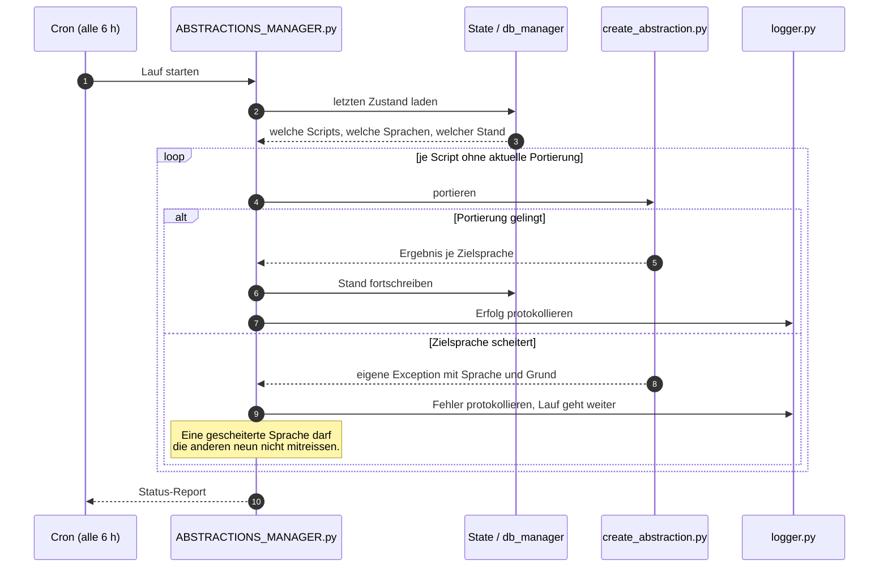
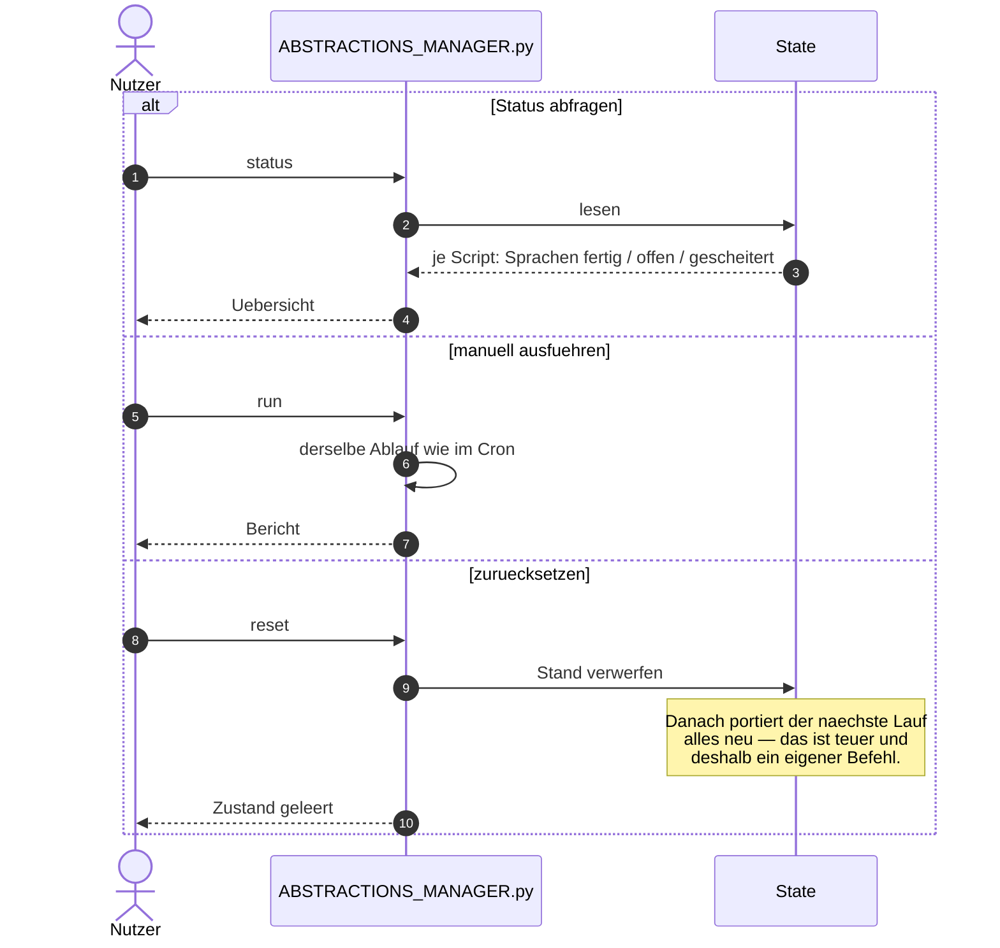
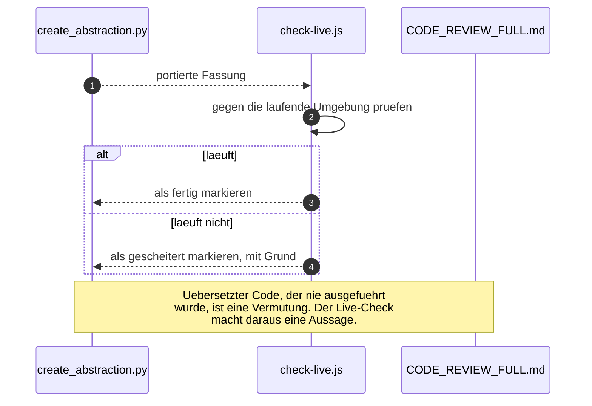

# 🤖 Abstractions Manager

**Automatisierter Multi-Node Abstraction Manager.** Portiert OpenClaw-Scripts alle sechs
Stunden per Cron in **zehn Zielsprachen**, prüft das Ergebnis gegen die laufende Umgebung und
pflegt daraus einen Status-Report sowie Dokumentations-Datenbanken.

Kein Übersetzer für sich, sondern eine Pipeline mit Zustand: Was schon portiert und geprüft
ist, wird nicht noch einmal angefasst.

---

## Schnellstart

```bash
# Manuell ausfuehren
python3 abstractions/ABSTRACTIONS_MANAGER.py

# Stand ansehen
python3 abstractions/ABSTRACTIONS_MANAGER.py status

# Zustand verwerfen (naechster Lauf portiert alles neu)
python3 abstractions/ABSTRACTIONS_MANAGER.py reset
```

Als Cron alle sechs Stunden:

```
0 */6 * * * /usr/bin/python3 /pfad/zu/ABSTRACTIONS_MANAGER.py
```

Umgebung: `abstractions/.env.example` als Vorlage kopieren. Erstinstallation:
`abstractions/initialize_repo.sh`.

---

## Architektur

<div align="center">


**[▶ Interaktive 3D-Ansicht öffnen](https://abstractions-two.vercel.app/3d.html)** — ziehen zum Drehen, Rad zum Zoomen,
Umschalter zwischen isometrisch und perspektivisch.

</div>

### Isometrische Ansicht


| Schicht | Wo | Verantwortung |
|---|---|---|
| **Eingaben** | `.env.example`, `initialize_repo.sh` | Quell-Scripts und Umgebung |
| **Portierung** | `create_abstraction.py`, `json_processor.js` | ein Script in zehn Zielsprachen übersetzen |
| **Verwaltung** | `db_manager.py`, `logger.py`, `exceptions.py` | Zustand halten, protokollieren, Fehler benennen |
| **Prüfung** | `check-live.js`, `CODE_REVIEW_FULL.md` | funktioniert das Portierte überhaupt |
| **Ausgabe** | Status-Report, Doku-Datenbanken | was ist wo in welchem Zustand |

Eigene Exception-Klassen (`exceptions.py`) statt roher `Exception` sind kein Stilfrage:
Ein Cron-Lauf ohne Aufsicht muss im Protokoll unterscheidbar machen, ob eine Zielsprache
fehlschlug, die Datenbank klemmte oder die Eingabe kaputt war.

Beide Bilder entstehen aus `docs/architektur.json`:

```bash
python tools/render_3d.py docs/architektur.json docs/assets
```

---

## Abläufe

### Ein Cron-Lauf


```mermaid
sequenceDiagram
    autonumber
    participant C as Cron (alle 6 h)
    participant M as ABSTRACTIONS_MANAGER.py
    participant S as State / db_manager
    participant A as create_abstraction.py
    participant L as logger.py

    C->>M: Lauf starten
    M->>S: letzten Zustand laden
    S-->>M: welche Scripts, welche Sprachen, welcher Stand
    loop je Script ohne aktuelle Portierung
        M->>A: portieren
        alt Portierung gelingt
            A-->>M: Ergebnis je Zielsprache
            M->>S: Stand fortschreiben
            M->>L: Erfolg protokollieren
        else Zielsprache scheitert
            A-->>M: eigene Exception mit Sprache und Grund
            M->>L: Fehler protokollieren, Lauf geht weiter
            Note over M: Eine gescheiterte Sprache darf<br/>die anderen neun nicht mitreissen.
        end
    end
    M-->>C: Status-Report
```

### Zustand, Statusabfrage, Reset


```mermaid
sequenceDiagram
    autonumber
    actor N as Nutzer
    participant M as ABSTRACTIONS_MANAGER.py
    participant S as State

    alt Status abfragen
        N->>M: status
        M->>S: lesen
        S-->>M: je Script: Sprachen fertig / offen / gescheitert
        M-->>N: Uebersicht
    else manuell ausfuehren
        N->>M: run
        M->>M: derselbe Ablauf wie im Cron
        M-->>N: Bericht
    else zuruecksetzen
        N->>M: reset
        M->>S: Stand verwerfen
        Note over S: Danach portiert der naechste Lauf<br/>alles neu — das ist teuer und<br/>deshalb ein eigener Befehl.
        M-->>N: Zustand geleert
    end
```

### Warum die Portierung geprüft wird


```mermaid
sequenceDiagram
    autonumber
    participant A as create_abstraction.py
    participant K as check-live.js
    participant R as CODE_REVIEW_FULL.md

    A-->>K: portierte Fassung
    K->>K: gegen die laufende Umgebung pruefen
    alt laeuft
        K-->>A: als fertig markieren
    else laeuft nicht
        K-->>A: als gescheitert markieren, mit Grund
    end
    Note over A,R: Uebersetzter Code, der nie ausgefuehrt<br/>wurde, ist eine Vermutung. Der Live-Check<br/>macht daraus eine Aussage.
```


---

## Die Bausteine

| Datei | Aufgabe |
|---|---|
| `ABSTRACTIONS_MANAGER.py` | Ablaufsteuerung, Cron-Einstieg, `status` und `reset` |
| `create_abstraction.py` | die eigentliche Portierung je Zielsprache |
| `db_manager.py` | Zustand und Dokumentations-Datenbanken |
| `json_processor.js` | Verarbeitung im Node-Teil der Kette |
| `check-live.js` | prüft die portierte Fassung gegen die laufende Umgebung |
| `logger.py` | Protokoll, das einen unbeaufsichtigten Lauf nachvollziehbar macht |
| `exceptions.py` | eigene Fehlerklassen statt roher `Exception` |
| `CODE_REVIEW_FULL.md` | vollständige Durchsicht des Codes |
| `ABSTRACTIONS_MANAGER.md` | ausführliche Beschreibung der Steuerung |

Im Branch liegt außerdem `python-hardener-workspace/` — die Eval-Suite, mit der die
Härtung der erzeugten Skripte gemessen wurde.

---

## Warum eigene Fehlerklassen

Ein Lauf ohne Aufsicht ist nur so gut wie sein Protokoll. `exceptions.py` unterscheidet, ob

- eine **Zielsprache** fehlschlug (neun andere laufen weiter),
- die **Datenbank** klemmte (Lauf abbrechen, Zustand nicht verfälschen),
- die **Eingabe** kaputt war (Script überspringen, melden).

Mit einer rohen `Exception` stünde in allen drei Fällen dieselbe Zeile im Log — und der
nächste Lauf würde denselben Fehler wieder machen.

---

## Aufbau

```
abstractions/ABSTRACTIONS_MANAGER.py    Ablaufsteuerung
abstractions/create_abstraction.py      Portierung
abstractions/db_manager.py              Zustand und Doku-DB
abstractions/json_processor.js          Node-Teil der Kette
abstractions/check-live.js              Live-Pruefung
abstractions/logger.py                  Protokoll
abstractions/exceptions.py              Fehlerklassen
abstractions/initialize_repo.sh         Erstinstallation
abstractions/.env.example               Umgebungsvorlage
abstractions/python-hardener-workspace/ Eval-Suite der Haertung
public/3d.html                          interaktive Architekturansicht
tools/render_3d.py                      erzeugt Standbild und GIF
docs/architektur.json                   Schichtbeschreibung
```

---

## Grenzen

- **Portierung ist keine Übersetzung.** Was in einer Sprache idiomatisch ist, ist es in der
  nächsten nicht. Der Live-Check sagt, ob es läuft — nicht, ob es schön ist.
- **Zehn Sprachen heißen zehn Fehlerquellen.** Der Lauf ist deshalb so gebaut, dass eine
  gescheiterte Sprache die anderen nicht mitreißt.
- **`reset` ist teuer.** Danach wird alles neu portiert. Deshalb ein eigener Befehl und keine
  Option.
- **Sechs Stunden sind ein Kompromiss.** Häufiger kostet Kontingent, seltener lässt Stände
  veralten.
