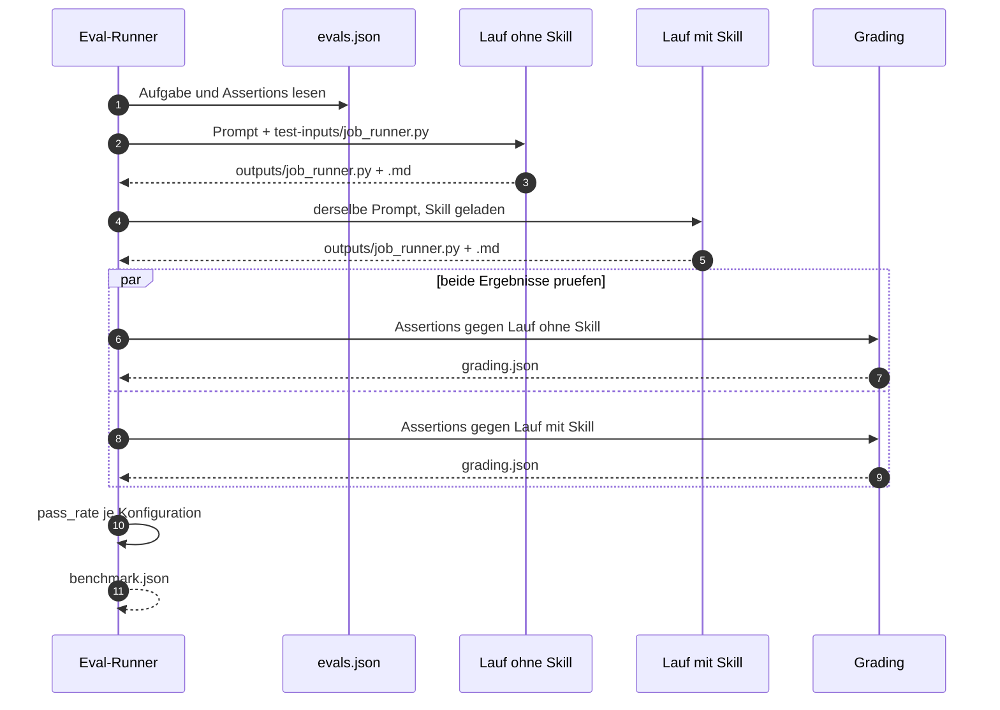
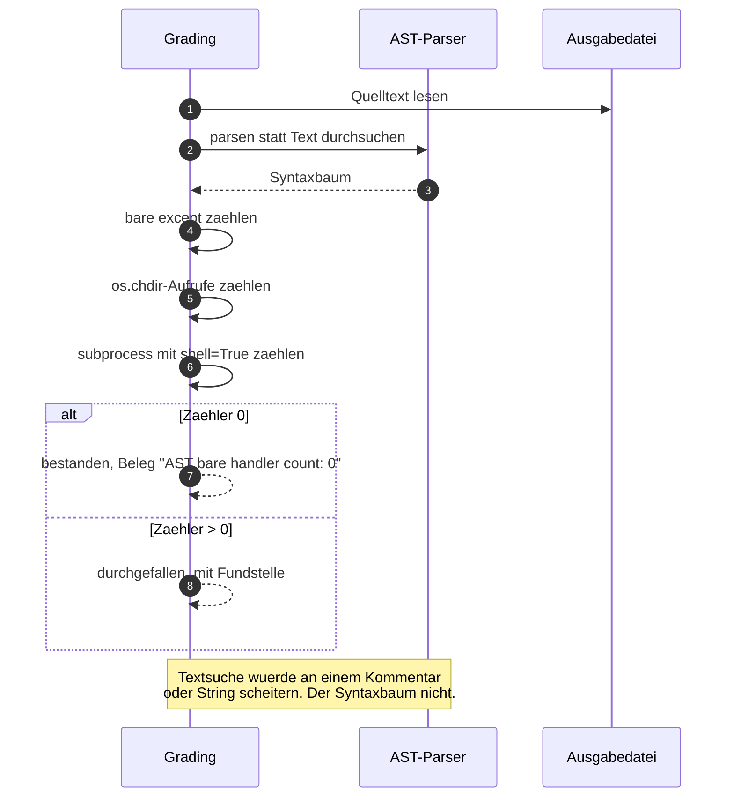
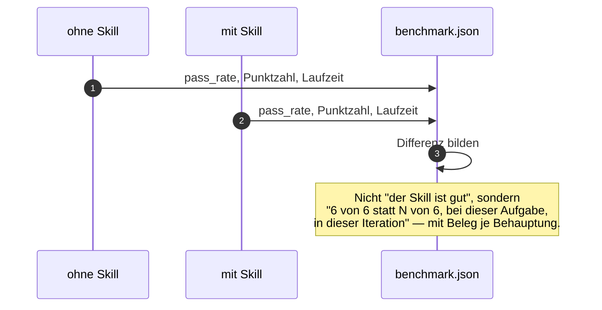

# 🛡️ Python Hardener — Eval-Suite

**Messplatz für den `python-hardener`-Skill.** Der Skill selbst härtet Python-Skripte:
Shell-Injection, blanke `except`-Blöcke, fehlendes Logging, unsichere Pfade, fehlende
Docstrings. Dieser Branch enthält nicht den Skill, sondern den **Beweis, dass er wirkt**.

Der Aufbau ist eine kontrollierte Gegenüberstellung: dieselbe Aufgabe einmal mit und einmal
ohne Skill, gemessen an maschinell entscheidbaren Behauptungen.

---

## Schnellstart

```bash
# Ergebnisse ansehen
open python-hardener/eval-review.html

# Rohdaten
cat python-hardener/iteration-1/benchmark.json
```

`eval-review.html` stellt beide Läufe nebeneinander, Behauptung für Behauptung, mit dem
jeweiligen Beleg.

---

## Architektur

<div align="center">


**[▶ Interaktive 3D-Ansicht öffnen](public/3d.html)** — ziehen zum Drehen, Rad zum Zoomen,
Umschalter zwischen isometrisch und perspektivisch.

</div>

### Isometrische Ansicht


| Schicht | Wo | Verantwortung |
|---|---|---|
| **Eingaben** | `test-inputs/` | absichtlich schlechte, aber realistische Skripte |
| **Läufe** | `iteration-N/eval-K/with_skill` und `without_skill` | dieselbe Aufgabe, einmal mit und einmal ohne Skill |
| **Prüfung** | `evals/evals.json` | Behauptungen, die maschinell entscheidbar sind |
| **Ergebnis** | `benchmark.json`, `timing.json`, `eval-review.html` | Zahlen und Belege, nicht Eindrücke |

Der Aufbau ist eine **kontrollierte Gegenüberstellung**: Ohne den `without_skill`-Lauf wäre
jedes Ergebnis wertlos, weil ein gutes Modell auch ohne Skill vieles richtig macht. Erst die
Differenz zeigt, was der Skill beiträgt.

Beide Bilder entstehen aus `docs/architektur.json`:

```bash
python tools/render_3d.py docs/architektur.json docs/assets
```

---

## Abläufe

### Ein Eval-Durchlauf


```mermaid
sequenceDiagram
    autonumber
    participant R as Eval-Runner
    participant E as evals.json
    participant M1 as Lauf ohne Skill
    participant M2 as Lauf mit Skill
    participant G as Grading

    R->>E: Aufgabe und Assertions lesen
    R->>M1: Prompt + test-inputs/job_runner.py
    M1-->>R: outputs/job_runner.py + .md
    R->>M2: derselbe Prompt, Skill geladen
    M2-->>R: outputs/job_runner.py + .md
    par beide Ergebnisse pruefen
        R->>G: Assertions gegen Lauf ohne Skill
        G-->>R: grading.json
    and
        R->>G: Assertions gegen Lauf mit Skill
        G-->>R: grading.json
    end
    R->>R: pass_rate je Konfiguration
    R-->>R: benchmark.json
```

### Wie eine Behauptung geprüft wird


```mermaid
sequenceDiagram
    autonumber
    participant G as Grading
    participant A as AST-Parser
    participant O as Ausgabedatei

    G->>O: Quelltext lesen
    G->>A: parsen statt Text durchsuchen
    A-->>G: Syntaxbaum
    G->>G: bare except zaehlen
    G->>G: os.chdir-Aufrufe zaehlen
    G->>G: subprocess mit shell=True zaehlen
    alt Zaehler 0
        G-->>G: bestanden, Beleg "AST bare handler count: 0"
    else Zaehler > 0
        G-->>G: durchgefallen, mit Fundstelle
    end
    Note over G,A: Textsuche wuerde an einem Kommentar<br/>oder String scheitern. Der Syntaxbaum nicht.
```

### Woran der Skill gemessen wird


```mermaid
sequenceDiagram
    autonumber
    participant O as ohne Skill
    participant M as mit Skill
    participant B as benchmark.json

    O->>B: pass_rate, Punktzahl, Laufzeit
    M->>B: pass_rate, Punktzahl, Laufzeit
    B->>B: Differenz bilden
    Note over B: Nicht "der Skill ist gut", sondern<br/>"6 von 6 statt N von 6, bei dieser Aufgabe,<br/>in dieser Iteration" — mit Beleg je Behauptung.
```


---

## Die Aufgaben

| # | Aufgabe | Eingabe | Worum es geht |
|---|---|---|---|
| 0 | `job-runner-full-hardening` | `test-inputs/job_runner.py` | Produktions-Cronjob: blanke `except`, `os.chdir()`, `shell=True`, Logging bei jedem Aufruf neu konfiguriert |
| 1 | `report-db` | `test-inputs/report_db.py` | Datenbankzugriff mit zusammengebauten SQL-Strings und verschluckten Fehlern |

Beide Eingaben sind **realistisch schlecht**, nicht künstlich kaputt. Genau solche Skripte
laufen in echten Cron-Jobs.

---

## Die Behauptungen

Geprüft wird über den **Syntaxbaum**, nicht per Textsuche:

| Behauptung | Prüfung | Warum AST |
|---|---|---|
| `no_bare_except` | kein `except:` ohne Typ | ein `except:` im Kommentar wäre ein falscher Treffer |
| `no_os_chdir` | keine `os.chdir()`-Aufrufe | Arbeitsverzeichnis ändern ist prozessweit — `git -C` tut dasselbe lokal |
| `no_shell_true` | kein `subprocess(..., shell=True)` | der klassische Injection-Weg |
| Logging | `RotatingFileHandler`, einmal konfiguriert | mehrfaches `basicConfig` bleibt sonst wirkungslos |
| Docstrings | jede öffentliche Funktion dokumentiert | zählbar, nicht Geschmackssache |

Jede bestandene Behauptung trägt ihren Beleg mit: *„AST bare handler count: 0"*.

---

## Ergebnis Iteration 1

Der Lauf **mit Skill** besteht Aufgabe 0 mit `pass_rate 1.0` (6 von 6 Punkten). Die
Gegenüberstellung mit dem Lauf ohne Skill steht in `benchmark.json` und in der HTML-Ansicht.

Laufzeiten liegen je Lauf in `timing.json` — Härtung kostet Zeit, und das gehört mit in die
Bewertung.

---

## Aufbau

```
python-hardener/evals/evals.json                Aufgaben und Behauptungen
python-hardener/test-inputs/                    absichtlich schlechte Eingaben
python-hardener/iteration-1/benchmark.json      Ergebnis beider Konfigurationen
python-hardener/iteration-1/eval-K/with_skill/     Ausgabe, Grading, Laufzeit
python-hardener/iteration-1/eval-K/without_skill/  dieselbe Aufgabe ohne Skill
python-hardener/eval-review.html                Gegenueberstellung zum Ansehen
public/3d.html                                  interaktive Architekturansicht
tools/render_3d.py                              erzeugt Standbild und GIF
docs/architektur.json                           Schichtbeschreibung
```

---

## Grenzen

- **Zwei Aufgaben sind keine Statistik.** Iteration 1 zeigt eine Richtung, keine Gewissheit.
  Mehr Aufgaben und mehr Iterationen würden die Aussage tragen.
- **Maschinell prüfbar heißt nicht vollständig.** Ob der gehärtete Code auch fachlich noch
  dasselbe tut, prüft keine Assertion. Dafür gibt es die Ausgabedateien zum Nachlesen.
- **Der Skill selbst liegt nicht hier.** Er ist auf ClawHub veröffentlicht; dieser Branch ist
  der Messplatz, nicht das Werkzeug.
