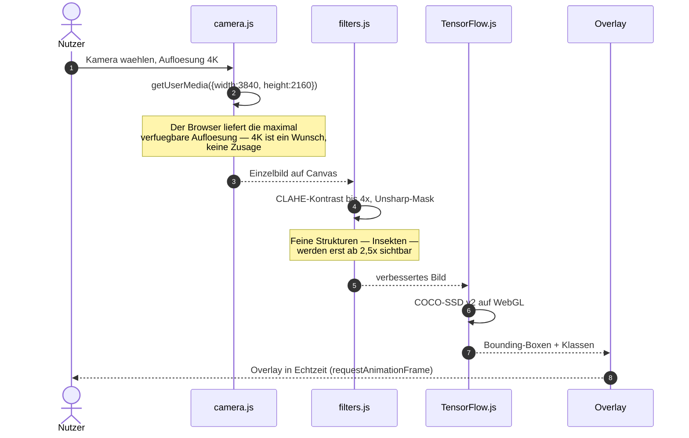
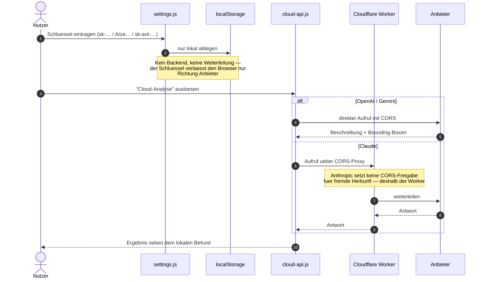
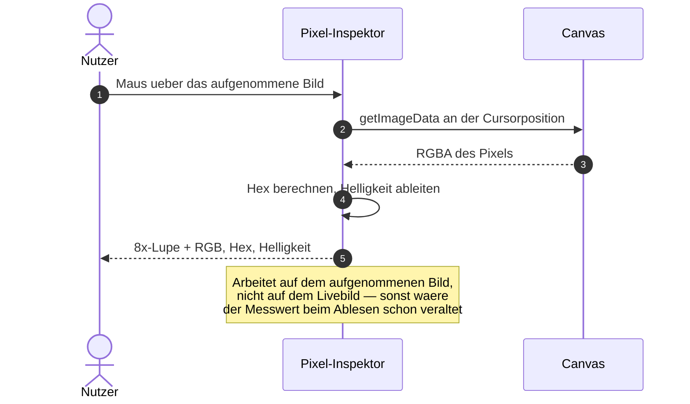

# 👁️ Vision-Check

**KI-gestützte Biodiversitätserkennung über die Smartphone-Kamera — bis 4K, mit
On-Device-KI und optionaler Cloud-Analyse.**

Eine PWA, die hochauflösende Kamerabilder erfasst und darin **alle Lebewesen** erkennt,
von Vögeln bis zu Insekten, in Bäumen, Wäldern, Sträuchern und Büschen. Hochauflösung und
Kontrastanhebung machen feine Strukturen sichtbar, die auf einem normalen Handyfoto untergehen.

---

## Schnellstart

```bash
cd Vision-Check/app
python3 -m http.server 8080     # oder eine beliebige statische Auslieferung
```

Dann `http://localhost:8080` öffnen, Kamera freigeben, Auflösung wählen. Die lokale Erkennung
läuft sofort — ohne Anmeldung, ohne Schlüssel, ohne dass ein Bild den Rechner verlässt.

Als App installieren: im Browsermenü *Zum Startbildschirm hinzufügen*. `manifest.json` und
`sw.js` sind vorhanden.

---

## Architektur

<div align="center">


**[▶ Interaktive 3D-Ansicht öffnen](https://vision-check-pink.vercel.app/public/3d.html)** — ziehen zum Drehen, Rad zum Zoomen,
Umschalter zwischen isometrisch und perspektivisch.

</div>

### Isometrische Ansicht


| Schicht | Wo im Code | Verantwortung | Netz |
|---|---|---|---|
| **Erfassung** | `app/js/camera.js` | MediaStream, Auflösungswahl, Gerätewechsel | nein |
| **On-Device-KI** | `app/js/app.js` | TensorFlow.js + COCO-SSD v2 im Browser | Modell einmalig |
| **Bildverbesserung** | `app/js/filters.js` | Canvas-Pipeline: CLAHE, Unsharp-Mask, Helligkeit, Sättigung | nein |
| **Cloud Vision** | `app/js/cloud-api.js`, `providers.js` | GPT-4o, Gemini, Claude — optional und kostenpflichtig | ja |
| **Ausgabe** | `app/index.html`, `sw.js` | Overlay, Pixel-Inspektor, PWA-Installation | nein |

Die ersten drei Schichten laufen vollständig lokal. Erst wer die vierte einschaltet, schickt ein
Bild aus dem Browser — und dann nur an den Anbieter, dessen Schlüssel er selbst eingetragen hat.

Beide Bilder entstehen aus `docs/architektur.json`:

```bash
python tools/render_3d.py docs/architektur.json docs/assets
```

---

## Abläufe

### Ein Bild, drei Stufen


```mermaid
sequenceDiagram
    autonumber
    actor N as Nutzer
    participant C as camera.js
    participant F as filters.js
    participant T as TensorFlow.js
    participant U as Overlay

    N->>C: Kamera waehlen, Aufloesung 4K
    C->>C: getUserMedia({width:3840, height:2160})
    Note over C: Der Browser liefert die maximal<br/>verfuegbare Aufloesung — 4K ist ein Wunsch,<br/>keine Zusage
    C-->>F: Einzelbild auf Canvas
    F->>F: CLAHE-Kontrast bis 4x, Unsharp-Mask
    Note over F: Feine Strukturen — Insekten —<br/>werden erst ab 2,5x sichtbar
    F-->>T: verbessertes Bild
    T->>T: COCO-SSD v2 auf WebGL
    T-->>U: Bounding-Boxen + Klassen
    U-->>N: Overlay in Echtzeit (requestAnimationFrame)
```

### Cloud-Anbieter dazuschalten


```mermaid
sequenceDiagram
    autonumber
    actor N as Nutzer
    participant S as settings.js
    participant L as localStorage
    participant A as cloud-api.js
    participant W as Cloudflare Worker
    participant P as Anbieter

    N->>S: Schluessel eintragen (sk-… / AIza… / sk-ant-…)
    S->>L: nur lokal ablegen
    Note over S,L: Kein Backend, keine Weiterleitung —<br/>der Schluessel verlaesst den Browser nur<br/>Richtung Anbieter
    N->>A: "Cloud-Analyse" ausloesen
    alt OpenAI / Gemini
        A->>P: direkter Aufruf mit CORS
        P-->>A: Beschreibung + Bounding-Boxen
    else Claude
        A->>W: Aufruf ueber CORS-Proxy
        Note over W: Anthropic setzt keine CORS-Freigabe<br/>fuer fremde Herkunft — deshalb der Worker
        W->>P: weiterleiten
        P-->>W: Antwort
        W-->>A: Antwort
    end
    A-->>N: Ergebnis neben dem lokalen Befund
```

### Pixel-Inspektor


```mermaid
sequenceDiagram
    autonumber
    actor N as Nutzer
    participant I as Pixel-Inspektor
    participant CV as Canvas

    N->>I: Maus ueber das aufgenommene Bild
    I->>CV: getImageData an der Cursorposition
    CV-->>I: RGBA des Pixels
    I->>I: Hex berechnen, Helligkeit ableiten
    I-->>N: 8x-Lupe + RGB, Hex, Helligkeit
    Note over I: Arbeitet auf dem aufgenommenen Bild,<br/>nicht auf dem Livebild — sonst waere<br/>der Messwert beim Ablesen schon veraltet
```


---

## Die drei Erkennungsstufen

### Stufe 1 — lokale KI

`TensorFlow.js` mit `COCO-SSD v2`, vollständig im Browser, Backend derzeit **WebGL**.
Echtzeit-Detektion über eine `requestAnimationFrame`-Schleife. Kein Upload, kein Konto,
keine Kosten.

WebGPU löst WebGL als Standard ab und bringt je nach Gerät 2–3× Geschwindigkeit. Der Umstieg
ist eine Backend-Zeile, kein Umbau.

### Stufe 2 — Bildverbesserung

Eine Canvas-Filter-Pipeline vor der Erkennung:

| Filter | Wirkung | Warum |
|---|---|---|
| CLAHE-Simulation | Kontrastverstärkung bis 4× | Insektenkörper heben sich erst dann vom Blattwerk ab |
| Unsharp-Mask | 5 Stufen, echte Pixelmatrix-Operation | Kanten schärfen, ohne Rauschen mitzuverstärken |
| Helligkeit / Sättigung | frei einstellbar | Gegenlicht und Schatten ausgleichen |

**Kontrast ist der entscheidende Regler.** Unter 2,5× bleiben feine Strukturen für das Modell
unsichtbar, egal wie hoch die Auflösung ist.

### Stufe 3 — Cloud Vision (optional, kostenpflichtig)

| Anbieter | Modell | Stärke |
|---|---|---|
| **OpenAI** | GPT-4o, `detail:high` | hochauflösendes Tile-Processing in 512×512-Segmenten |
| **Google Gemini** | gemini-2.5-pro | Bounding-Box und Segmentierung nativ |
| **Anthropic Claude** | claude-opus-4-5 | stärkstes biologisches Domänenwissen |

Claude braucht den CORS-Proxy aus `cloudflare-worker/` — Anthropic setzt für fremde Herkunft
keine CORS-Freigabe. `wrangler.toml` liegt bei.

---

## Schlüssel eintragen

| Anbieter | Format | Woher |
|---|---|---|
| OpenAI | `sk-proj-…` | [platform.openai.com](https://platform.openai.com) |
| Gemini | `AIza…` | [aistudio.google.com](https://aistudio.google.com) |
| Claude | `sk-ant-…` | [console.anthropic.com](https://console.anthropic.com) |

**Alle Schlüssel bleiben im Browser** — `localStorage`, kein Backend, keine Weiterleitung.
Wer die Cloud-Stufe nicht einschaltet, braucht gar keinen.

---

## Pixel-Inspektor

8× Echtzeit-Lupe mit Mausverfolgung auf dem aufgenommenen Bild. Zeigt RGB-Werte, Hex-Code und
Helligkeit an der Cursorposition — nützlich, um zu prüfen, ob ein vermeintlicher Fund nicht
bloß ein Bildartefakt ist.

---

## Aufbau

```
Vision-Check/app/index.html      Oberflaeche
Vision-Check/app/js/camera.js    MediaStream, Aufloesung, Geraetewahl
Vision-Check/app/js/app.js       Erkennungsschleife, Overlay
Vision-Check/app/js/filters.js   Canvas-Pipeline
Vision-Check/app/js/cloud-api.js Cloud-Aufrufe
Vision-Check/app/js/providers.js Anbieter-Definitionen
Vision-Check/app/js/settings.js  Schluesselverwaltung, localStorage
Vision-Check/app/js/env-manager.js  Umgebungserkennung
Vision-Check/app/sw.js           Service Worker (PWA)
Vision-Check/cloudflare-worker/  CORS-Proxy fuer Claude
public/3d.html                   interaktive Architekturansicht
tools/render_3d.py               erzeugt Standbild und GIF
docs/architektur.json            Schichtbeschreibung
```

---

## Grenzen

- **4K ist ein Wunsch, keine Zusage.** `getUserMedia` fordert an, der Browser liefert das
  Machbare. Was tatsächlich ankommt, steht in der Oberfläche.
- **COCO-SSD kennt 80 Klassen.** Es erkennt „bird" und „insect"-nahe Objekte, keine Arten.
  Artbestimmung ist die Aufgabe der Cloud-Stufe.
- **Jeder Cloud-Aufruf kostet echtes Kontingent** beim jeweiligen Anbieter.
- **Ohne Kontrastanhebung keine Insekten.** Das ist kein Fehler des Modells, sondern Physik
  des Sensors.
