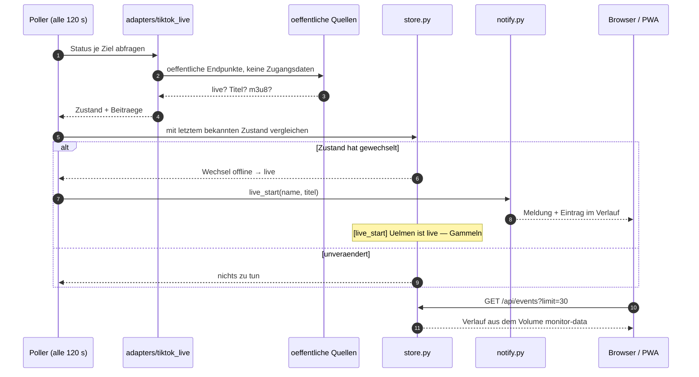
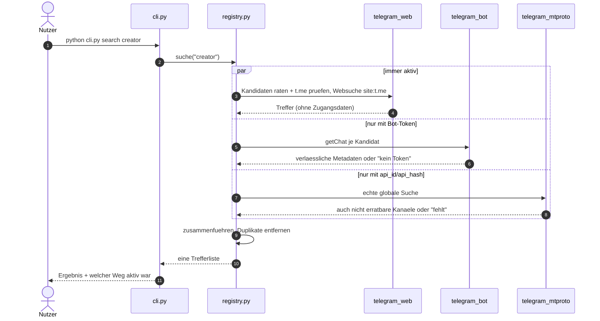
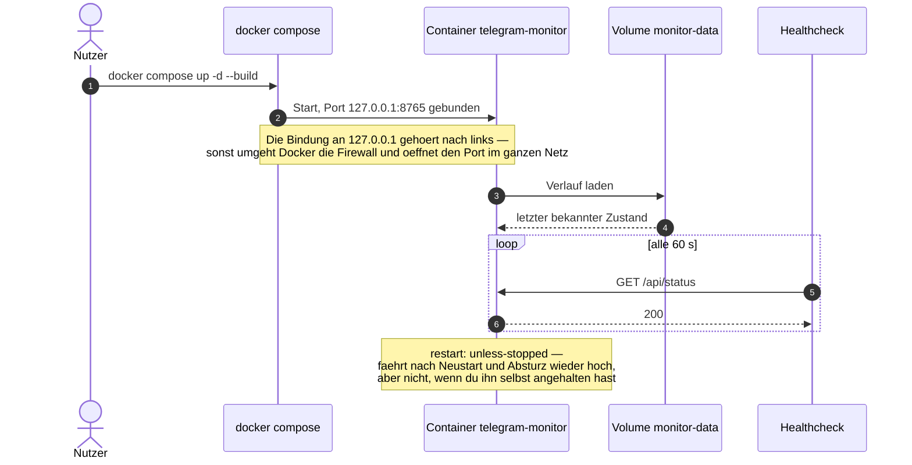

# Telegram Monitor

Findet und beobachtet Telegram-Kanaele - **komplett webbasiert, ohne die
Telegram-App zu installieren**. Discord ist als zweite Plattform voll
integriert.

Alles Wesentliche laeuft mit purer Python-Standardbibliothek: kein pip,
kein Framework, keine Pflicht-Zugangsdaten.

---

## Schnellstart

```bash
cd telegram-monitor
python cli.py search creator        # suchen
python cli.py posts creator --limit 5
python server.py                       # Web-Oberflaeche: http://127.0.0.1:8765
```

Windows: `run.cmd` doppelklicken. macOS/Linux: `./run.sh`.

---

---

## Architektur

<div align="center">


**[▶ Interaktive 3D-Ansicht öffnen](https://telegram-monitor-five.vercel.app/3d.html)** — ziehen zum Drehen,
Rad zum Zoomen, Umschalter zwischen isometrisch und perspektivisch.

</div>

### Isometrische Ansicht


| Schicht | Wo im Code | Verantwortung | Zugangsdaten |
|---|---|---|---|
| **Plattformen** | — | t.me, Bot-API, MTProto, Discord, TikTok | je Weg verschieden |
| **Adapter** | `tgmon/adapters/` | eine Quelle befragen, Ergebnis vereinheitlichen | web: keine · bot: Token · mtproto: api_id/hash |
| **Kern** | `tgmon/registry.py`, `store.py`, `live.py`, `models.py` | Adapter zusammenführen, Zustand halten, Änderungen erkennen | keine |
| **Ausgabe** | `tgmon/notify.py`, `cli.py`, `server.py`, `web/` | melden, anzeigen, bedienbar machen | keine |

Der Kern kennt keine Plattform. Er sieht nur, was ein Adapter liefert — deshalb
lässt sich eine Quelle hinzufügen, ohne den Rest anzufassen, und deshalb laufen
alle drei Telegram-Wege gleichzeitig, ohne sich zu kennen.

Beide Bilder werden aus derselben Schichtbeschreibung erzeugt wie die 3D-Seite:

```bash
python tools/render_3d.py telegram-monitor docs/assets
```

---

## Abläufe

### Livegang erkennen und melden


```mermaid
sequenceDiagram
    autonumber
    participant P as Poller (alle 120 s)
    participant A as adapters/tiktok_live
    participant Q as oeffentliche Quellen
    participant S as store.py
    participant N as notify.py
    participant B as Browser / PWA

    P->>A: Status je Ziel abfragen
    A->>Q: oeffentliche Endpunkte, keine Zugangsdaten
    Q-->>A: live? Titel? m3u8?
    A-->>P: Zustand + Beitraege
    P->>S: mit letztem bekannten Zustand vergleichen
    alt Zustand hat gewechselt
        S-->>P: Wechsel offline → live
        P->>N: live_start(name, titel)
        N-->>B: Meldung + Eintrag im Verlauf
        Note over S: [live_start] Uelmen ist live — Gammeln
    else unveraendert
        S-->>P: nichts zu tun
    end
    B->>S: GET /api/events?limit=30
    S-->>B: Verlauf aus dem Volume monitor-data
```

Nur der **Wechsel** löst eine Meldung aus, nicht jeder Abruf. Der zuletzt bekannte
Zustand liegt im benannten Volume `monitor-data` und überlebt jedes Neubauen des
Abbilds — sonst würde nach jedem `docker compose up --build` alles noch einmal
gemeldet.

### Die drei Telegram-Wege laufen parallel


```mermaid
sequenceDiagram
    autonumber
    actor N as Nutzer
    participant C as cli.py
    participant R as registry.py
    participant W as telegram_web
    participant B as telegram_bot
    participant M as telegram_mtproto

    N->>C: python cli.py search creator
    C->>R: suche("creator")
    par immer aktiv
        R->>W: Kandidaten raten + t.me pruefen, Websuche site:t.me
        W-->>R: Treffer (ohne Zugangsdaten)
    and nur mit Bot-Token
        R->>B: getChat je Kandidat
        B-->>R: verlaessliche Metadaten oder "kein Token"
    and nur mit api_id/api_hash
        R->>M: echte globale Suche
        M-->>R: auch nicht erratbare Kanaele oder "fehlt"
    end
    R->>R: zusammenfuehren, Duplikate entfernen
    R-->>C: eine Trefferliste
    C-->>N: Ergebnis + welcher Weg aktiv war
```

Was gerade aktiv ist, sagt `python cli.py status` — und beim Start meldet es der
Server selbst:

```
[x] telegram-web: Immer verfuegbar - benoetigt keinerlei Zugangsdaten.
[ ] telegram-bot: Kein Bot-Token. Setze TELEGRAM_BOT_TOKEN oder telegram.bot_token in config.json.
[ ] telegram-mtproto: api_id/api_hash fehlen - von https://my.telegram.org holen.
[ ] discord-bot: Kein Bot-Token - Invite-Lookup funktioniert trotzdem.
[x] tiktok-live: Oeffentliche Quellen, keine Zugangsdaten noetig.
```

Ein fehlender Weg ist kein Fehler, sondern eine Fähigkeit weniger.

### Dauerbetrieb im Container


```mermaid
sequenceDiagram
    autonumber
    actor N as Nutzer
    participant D as docker compose
    participant K as Container telegram-monitor
    participant V as Volume monitor-data
    participant H as Healthcheck

    N->>D: docker compose up -d --build
    D->>K: Start, Port 127.0.0.1:8765 gebunden
    Note over D,K: Die Bindung an 127.0.0.1 gehoert nach links —<br/>sonst umgeht Docker die Firewall und oeffnet den Port im ganzen Netz
    K->>V: Verlauf laden
    V-->>K: letzter bekannter Zustand
    loop alle 60 s
        H->>K: GET /api/status
        K-->>H: 200
    end
    Note over K: restart: unless-stopped —<br/>faehrt nach Neustart und Absturz wieder hoch,<br/>aber nicht, wenn du ihn selbst angehalten hast
```

## Die drei Telegram-Zugangswege

| Methode | Datei | Zugangsdaten | Kann |
|---|---|---|---|
| **web** | `tgmon/adapters/telegram_web.py` | keine | Kanaele aufloesen, Beitraege lesen, Namensvarianten + Websuche |
| **bot** | `tgmon/adapters/telegram_bot.py` | Bot-Token (@BotFather) | verlaessliche Metadaten, exakte Mitgliederzahl |
| **mtproto** | `tgmon/adapters/telegram_mtproto.py` | api_id + api_hash + Telefonnummer | **echte globale Kanalsuche**, auch nicht-oeffentliche Kanaele |

Alle drei laufen parallel und werden im Ergebnis zusammengefuehrt. Was
gerade aktiv ist, zeigt `python cli.py status`.

### Methode 1 - web (immer an)
Nutzt `https://t.me/<name>` und `https://t.me/s/<name>`. Die Suche kombiniert:
1. **Kandidaten-Pruefung** - erzeugt plausible Usernamen (`name`, `name_official`,
   `realname`, `name_lounge`, ...) und prueft jeden gegen t.me.
2. **Websuche** `site:t.me` - findet Kanaele, deren Name man nicht erraten wuerde.

Treffer bekommen einen Relevanzwert 0.00-1.00. Ergebnisse ohne Namens- oder
Titelbezug werden verworfen.

### Methode 2 - Bot-API
1. In Telegram `@BotFather` -> `/newbot` -> Token kopieren
2. `set TELEGRAM_BOT_TOKEN=...` (Windows) bzw. `export TELEGRAM_BOT_TOKEN=...`
   oder in `config.json` eintragen

Wichtig: Die Bot-API kann **nicht suchen**. `getChat` liefert aber fuer jeden
oeffentlichen `@namen` saubere Metadaten inkl. exakter Mitgliederzahl.

### Methode 3 - MTProto (echte Suche)
1. `https://my.telegram.org` -> *API development tools* -> `api_id` + `api_hash`
2. `pip install telethon`
3. `TELEGRAM_API_ID` / `TELEGRAM_API_HASH` setzen
4. Erster Lauf fragt einmalig Telefonnummer + Code ab; die Session liegt
   danach in `data/tgmon.session`

Damit steht `contacts.search` zur Verfuegung - Telegrams eigene globale Suche.

---

## Discord

Ohne Token sofort nutzbar:

```bash
python cli.py discord invite discord.gg/discord-developers
```

Mit Bot-Token (volle Integration):

1. https://discord.com/developers/applications -> **New Application** -> **Bot**
2. Token kopieren -> `DISCORD_BOT_TOKEN` setzen
3. Unter *Bot* das Privileged Intent **MESSAGE CONTENT** aktivieren
4. Bot einladen: `python cli.py discord invite-url <CLIENT_ID>` -> Link oeffnen

```bash
python cli.py discord guilds
python cli.py discord channels <GUILD_ID>
python cli.py discord messages <CHANNEL_ID> --limit 20
```

---

## Befehle

```
python cli.py status                        Zugangsmethoden anzeigen
python cli.py search <begriff> [--limit N] [--methods web,bot,mtproto,discord]
python cli.py resolve <@name> [--platform telegram|discord]
python cli.py posts <@name> [--limit N]
python cli.py watch add telegram <@name> [--note "..."]
python cli.py watch list | remove telegram <@name>
python cli.py scan [--limit N]              Watchlist komplett aktualisieren
python cli.py discord invite|guilds|channels|messages|me|invite-url [wert]
python cli.py live [ziel] [--interval N] [--once] [--limit N]
python cli.py tiktok <@name> [--limit N]     Live-Status + Sendungshistorie
python cli.py events [--limit N]             Ereignisse (Livegang etc.)
python cli.py serve [--port 8765] [--poll-interval 120]
```

`--json` haengt an jeden Befehl maschinenlesbare Ausgabe an:

```bash
python cli.py scan --json > data/latest.json
```

---

## Fortlaufende Beobachtung (Live)

Der Kern: Kanaele werden in festem Turnus abgefragt, neue Beitraege erkannt und
in einem wachsenden Verlauf abgelegt (`data/live/<plattform>_<ziel>.json`).
Telegram zeigt in der Web-Vorschau immer nur einen Ausschnitt - der Verlauf
haelt fest, was einmal gesehen wurde.

```bash
python cli.py live                      # ganze Watchlist, alle 120 s
python cli.py live creator --interval 60
python cli.py live durov --once         # einmalig
python cli.py --json live durov --once  # maschinenlesbar (nutzt auch das Artefakt)
python server.py --poll-interval 120    # Web-Oberflaeche + Hintergrund-Abfrage
```

Der Server startet den Poller automatisch mit; im Reiter **Live** laeuft die
Anzeige mit waehlbarer Aktualisierung (30 s / 1 min / 5 min / manuell) und
markiert neue Beitraege gruen. Kuerzer als 30 Sekunden wird bewusst nicht
abgefragt - das waere unhoeflich gegenueber t.me.

Zusaetzliche Endpunkte:

```
GET /api/live?target=&platform=&limit=     gesammelter Verlauf
GET /api/live/all?limit=                   Verlauf aller Watchlist-Ziele
GET /api/live/poll?target=&platform=       sofort abfragen
GET /api/poller                            Zustand der Hintergrund-Abfrage
GET /api/tiktok/status?users=a,b            Live-Status je Konto
GET /api/events?limit=                      Ereignisprotokoll
```

---

## TikTok: Live-Status, Benachrichtigung, Embed-Viewer

Dritte Plattform neben Telegram und Discord - ohne Konto und **ohne jede
Umgehung von Zugangskontrollen**.

```bash
python cli.py tiktok creator          # Status + letzte Sendungen
python cli.py watch add tiktok creator
python server.py --poll-interval 120     # Reiter "TikTok" + Benachrichtigung
python cli.py events                     # Ereignisprotokoll
```

### Woher der Status kommt

| Quelle | liefert |
|---|---|
| Oeffentliche Profilseite eines Aufzeichnungsdienstes | `is_live`, Sendungstitel, Beginn, Dauer, Verlauf (JSON in `window.ALT_DAILY_DATA`) |
| TikTok **Embed Live** (offiziell dokumentiert) | die Anzeige-URL `tiktok.com/embed/live/@name` |

Der Embed-Player ist der vorgesehene Weg fuer schreibgeschuetztes Zuschauen:
keine Anmeldung, **keine Geschenk- und Kauf-Oberflaeche**. Damit fallen genau
die kostenpflichtigen Aktionen weg, die im normalen Frontend erreichbar waeren.

### Benachrichtigung beim Livegang

Der Poller erkennt den Wechsel offline -> live und meldet ihn auf drei Wegen:

1. **Ereignisprotokoll** `data/events.json` - immer, sichtbar im Reiter TikTok
   und ueber `python cli.py events`
2. **Webhook** - `notify.webhook_url` in `config.json`, POST mit JSON
3. **Systemmeldung** - `notify.command`, Platzhalter `{title}` `{text}` `{url}`;
   eine Windows-Vorlage steht in `config.example.json`

Damit muss niemand mit offenem Tab warten.

### Embed-Viewer fuer das Browser-Plugin

Im Ordner `plugin/` liegt eine eigenstaendige Komponente:

```
plugin/tiktok-embed-viewer.html    fertige Oberflaeche (Player, Status, Sendungen)
plugin/tiktok-companion.js         Logik, ohne DOM-Abhaengigkeit, in Node testbar
plugin/README.md                   Einbau in eine Erweiterung (Manifest V3)
```

Direkt im Browser oeffnen:

```
plugin/tiktok-embed-viewer.html?user=creator&api=http://127.0.0.1:8765
```

Ohne laufenden Monitor faellt die Komponente auf den Direktabruf zurueck.
Python- und JavaScript-Parser sind gegen dieselbe echte Seite geprueft und
liefern identische Werte.

**Kein Live-Chat:** Der offizielle Embed liefert ihn nicht. Wer ihn braucht,
geht ueber TikToks Entwicklerprogramm - nicht ueber einen Umweg am Frontend vorbei.

---

## Web-Oberflaeche

`python server.py` startet einen lokalen Server (Standard 127.0.0.1:8765) mit
vier Bereichen: **Suche**, **Watchlist** (inkl. Sammel-Aktualisierung),
**Discord**, **Status**. Die Oberflaeche ist eine einzelne HTML-Datei
(`web/index.html`) und spricht ausschliesslich den lokalen Server an.

### API-Endpunkte

```
GET  /api/status
GET  /api/search?q=&limit=&methods=
GET  /api/resolve?target=&platform=
GET  /api/posts?target=&limit=&platform=
GET  /api/watchlist          POST /api/watchlist {action,platform,target,note}
GET  /api/scan?limit=
GET  /api/discord/invite?code=
GET  /api/discord/guilds
GET  /api/discord/channels?guild_id=
GET  /api/discord/messages?channel_id=&limit=
```

---

## Aufbau

```
telegram-monitor/
  cli.py                  Kommandozeile
  server.py               lokaler Webserver (nur Standardbibliothek)
  web/index.html          Oberflaeche
  build_artifact.py       baut die eigenstaendige Uebersichtsseite
  plugin/                 Embed-Viewer fuer die Browser-Erweiterung
  tgmon/
    live.py               Turnus-Abfrage + wachsender Verlauf
    notify.py             Ereignisse, Webhook, Systemmeldung
    models.py             Channel / Post / MethodStatus - plattformneutral
    util.py               HTTP + HTML-Parsing
    config.py             config.json + Umgebungsvariablen
    store.py              Watchlist und Snapshots (JSON)
    registry.py           fuehrt alle Methoden zusammen
    adapters/
      telegram_web.py     Methode 1
      telegram_bot.py     Methode 2
      telegram_mtproto.py Methode 3
      discord_bot.py      Discord (REST v10)
      tiktok_live.py      TikTok Live-Status + Embed
  data/                   watchlist.json, snapshots.json, Session
```

Neue Plattform ergaenzen = ein Adapter mit `status()`, `resolve()`, `posts()`,
`search()`, der `Channel`/`Post` zurueckgibt, plus ein Eintrag in `registry.py`.

---

### Zusaetzlich fuer die Doku

```
public/3d.html      interaktive three.js-Ansicht der Architektur
tools/render_3d.py  erzeugt Standbild und rotierendes GIF aus derselben Beschreibung
docs/assets/        gerenderte Architekturbilder
```

## Grenzen (ehrlich)

- Ohne MTProto gibt es **keine** echte Telegram-Volltextsuche; die Web-Methode
  raet Namen und nutzt eine Websuche. Das findet viel, aber nicht alles.
- Private Nutzerkonten (z. B. `@creator`) liefern nur Name, Bio und Bild -
  keine Beitraege. Das ist eine Telegram-Einschraenkung, kein Fehler.
- Kanaele koennen die Web-Vorschau abschalten; dann hilft nur MTProto.
- Discord-Nachrichten lesen setzt voraus, dass der Bot auf dem Server ist.
- Beim Scrapen gilt: nur oeffentliche Daten, mit Rate-Limit (`util._throttle`).
- TikTok: kein Live-Chat ueber den offiziellen Embed. Die Angabe "seit ca." ist
  eine Naeherung, weil die Zeitzone der Quelle nicht ausgewiesen ist. Faellt der
  Statusdienst aus, steht `live: null` statt einer falschen Aussage.
