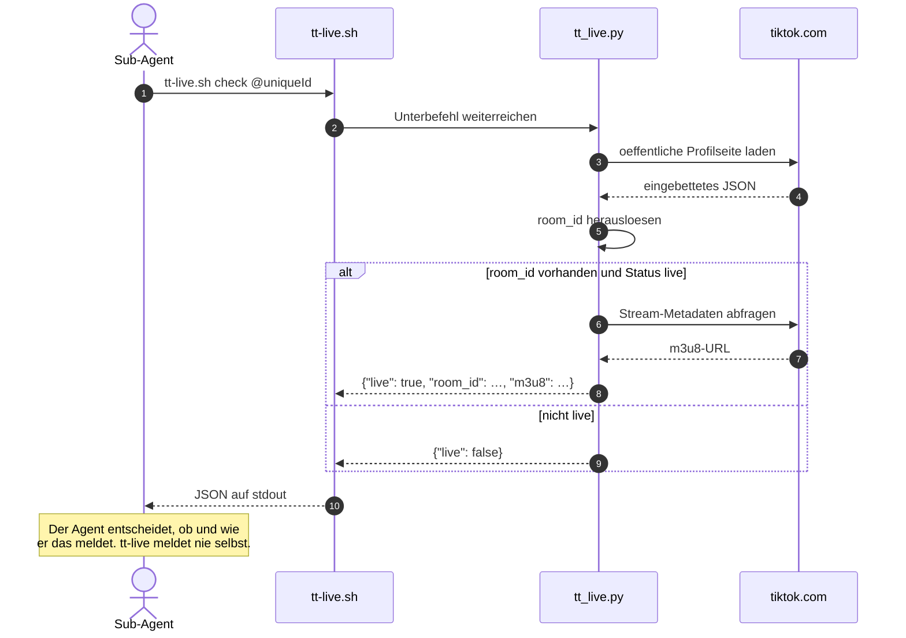
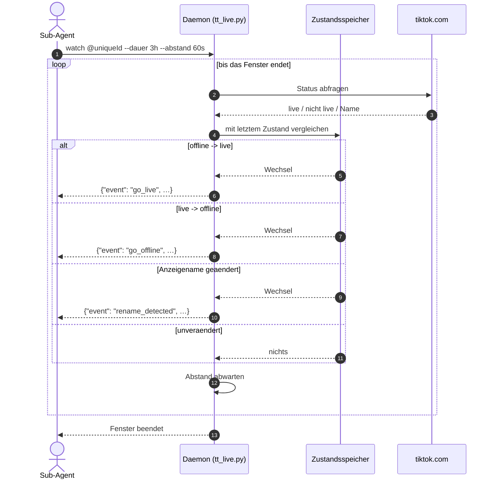
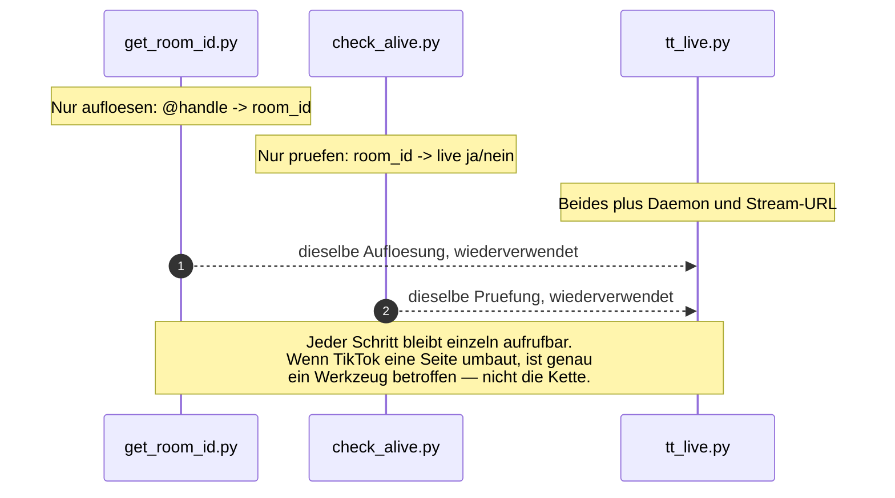

# 🎥 tt-live — TikTok-LIVE-Monitor

**Feststellen, ob ein TikTok-Konto gerade live ist, die m3u8-Stream-URL auflösen, oder ein
Konto über ein Zeitfenster beobachten und Ereignisse melden.**

Arbeitet auf der `uniqueId` — dem `@handle` — und benutzt ausschließlich öffentliche Quellen.
Keine Anmeldung, keine Zugangsdaten, kein Konto.

---

## Schnellstart

```bash
./tt-live.sh check @creator            # ist er gerade live?
./tt-live.sh url @creator              # m3u8-URL aufloesen
./tt-live.sh watch @creator --dauer 3h --abstand 60s
```

Alles gibt JSON auf stdout aus. Einzelne Schritte gehen auch direkt:

```bash
python3 get_room_id.py @creator        # @handle -> room_id
python3 check_alive.py <room_id>       # room_id -> live ja/nein
```

---

## Architektur

<div align="center">


**[▶ Interaktive 3D-Ansicht öffnen](https://tiktok-monitor-pearl.vercel.app/3d.html)** — ziehen zum Drehen, Rad zum Zoomen,
Umschalter zwischen isometrisch und perspektivisch.

</div>

### Isometrische Ansicht


| Schicht | Datei | Verantwortung |
|---|---|---|
| **Quellen** | — | öffentliche TikTok-Seiten, keine Anmeldung |
| **Werkzeuge** | `get_room_id.py`, `check_alive.py`, `tt_live.py` | je ein Schritt, einzeln aufrufbar |
| **Einstieg** | `tt-live.sh`, `tt-live.json` | ein Aufruf für den Sub-Agenten, JSON hinein und hinaus |
| **Daemon** | Teil von `tt_live.py` | Zeitfenster abfahren, Zustand halten |
| **Ereignisse** | JSON auf stdout | `go_live`, `go_offline`, `rename_detected` |

**tt-live ist Datenlieferant, nicht Melder.** Es stellt fest und gibt aus; wer daraus eine
Nachricht macht, ist der Sub-Agent. Diese Trennung ist der Grund, warum dasselbe Werkzeug in
einer Shell, in einem Cron-Job und in einem Agenten läuft, ohne angepasst zu werden.

Beide Bilder entstehen aus `docs/architektur.json`:

```bash
python tools/render_3d.py docs/architektur.json docs/assets
```

---

## Abläufe

### Einmalige Abfrage


```mermaid
sequenceDiagram
    autonumber
    actor A as Sub-Agent
    participant S as tt-live.sh
    participant P as tt_live.py
    participant T as tiktok.com

    A->>S: tt-live.sh check @uniqueId
    S->>P: Unterbefehl weiterreichen
    P->>T: oeffentliche Profilseite laden
    T-->>P: eingebettetes JSON
    P->>P: room_id herausloesen
    alt room_id vorhanden und Status live
        P->>T: Stream-Metadaten abfragen
        T-->>P: m3u8-URL
        P-->>S: {"live": true, "room_id": …, "m3u8": …}
    else nicht live
        P-->>S: {"live": false}
    end
    S-->>A: JSON auf stdout
    Note over A: Der Agent entscheidet, ob und wie<br/>er das meldet. tt-live meldet nie selbst.
```

### Daemon über ein Zeitfenster


```mermaid
sequenceDiagram
    autonumber
    actor A as Sub-Agent
    participant D as Daemon (tt_live.py)
    participant Z as Zustandsspeicher
    participant T as tiktok.com

    A->>D: watch @uniqueId --dauer 3h --abstand 60s
    loop bis das Fenster endet
        D->>T: Status abfragen
        T-->>D: live / nicht live / Name
        D->>Z: mit letztem Zustand vergleichen
        alt offline -> live
            Z-->>D: Wechsel
            D-->>A: {"event": "go_live", …}
        else live -> offline
            Z-->>D: Wechsel
            D-->>A: {"event": "go_offline", …}
        else Anzeigename geaendert
            Z-->>D: Wechsel
            D-->>A: {"event": "rename_detected", …}
        else unveraendert
            Z-->>D: nichts
        end
        D->>D: Abstand abwarten
    end
    D-->>A: Fenster beendet
```

### Warum drei getrennte Werkzeuge


```mermaid
sequenceDiagram
    autonumber
    participant G as get_room_id.py
    participant C as check_alive.py
    participant L as tt_live.py

    Note over G: Nur aufloesen: @handle -> room_id
    Note over C: Nur pruefen: room_id -> live ja/nein
    Note over L: Beides plus Daemon und Stream-URL
    G-->>L: dieselbe Aufloesung, wiederverwendet
    C-->>L: dieselbe Pruefung, wiederverwendet
    Note over G,L: Jeder Schritt bleibt einzeln aufrufbar.<br/>Wenn TikTok eine Seite umbaut, ist genau<br/>ein Werkzeug betroffen — nicht die Kette.
```


---

## Die drei Ereignisse

| Ereignis | Wann | Nutzlast |
|---|---|---|
| `go_live` | Wechsel von offline auf live | `uniqueId`, `room_id`, Titel, `m3u8` |
| `go_offline` | Wechsel von live auf offline | `uniqueId`, Dauer der Sendung |
| `rename_detected` | Anzeigename hat sich geändert | alter und neuer Name |

Gemeldet wird nur der **Wechsel**, nicht jeder Abruf. Ohne diese Regel käme bei jedem
Durchlauf dieselbe Meldung erneut.

`rename_detected` klingt nach Beiwerk, ist aber der praktische Fall: Konten ändern ihren
Anzeigenamen häufig, und wer nur auf den Namen filtert, verliert sie dabei aus den Augen.
Die `room_id` bleibt.

---

## Dokumentation im Branch

| Datei | Inhalt |
|---|---|
| `SKILL.md` | Skill-Definition für OpenClaw, Aufrufe und Parameter |
| `ARCHITECTURE.md` | Komponenten, Klassen, Datenflüsse und die Begründung dahinter |
| `SCHEMA.md` | JSON-Schemata aller Ein- und Ausgaben |
| `DAEMON.md` | Innenleben des Daemon-Modus |
| `tt_live.md`, `tt-live.sh.md`, `tt-live.json.md` | API je Datei |
| `check_alive.md`, `get_room_id.md` | API der Einzelwerkzeuge |
| `Deployment.txt` | Ablage und Einrichtung |

---

## Aufbau

```
tiktok-monitor/tt-live.sh         Einstieg fuer den Sub-Agenten
tiktok-monitor/tt-live.json       Aufrufbeschreibung
tiktok-monitor/tt_live.py         Aufloesung, Pruefung, Daemon
tiktok-monitor/get_room_id.py     @handle -> room_id
tiktok-monitor/check_alive.py     room_id -> live ja/nein
tiktok-monitor/SKILL.md           Skill-Definition
tiktok-monitor/ARCHITECTURE.md    Aufbau und Begruendung
tiktok-monitor/SCHEMA.md          JSON-Schemata
tiktok-monitor/DAEMON.md          Daemon-Innenleben
public/3d.html                    interaktive Architekturansicht
tools/render_3d.py                erzeugt Standbild und GIF
docs/architektur.json             Schichtbeschreibung
```

Voraussetzung: `python3`. Läuft auf Linux und macOS.

---

## Grenzen

- **Nur öffentliche Konten.** Was ohne Anmeldung nicht sichtbar ist, sieht tt-live auch nicht.
- **Kein Herunterladen.** Die m3u8-URL wird aufgelöst, nicht abgerufen. Was damit geschieht,
  entscheidet der Aufrufer.
- **Kein Melder.** tt-live gibt Ereignisse aus. Wer daraus eine Benachrichtigung macht, ist
  der Sub-Agent oder das aufrufende Programm.
- **TikTok kann jederzeit umbauen.** Die Aufteilung in drei Werkzeuge sorgt dafür, dass dann
  genau eines nachgezogen werden muss.
