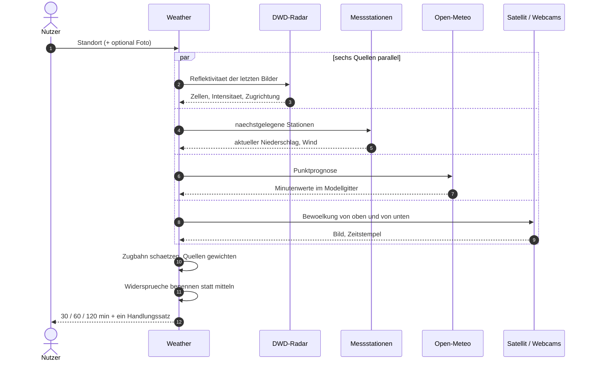
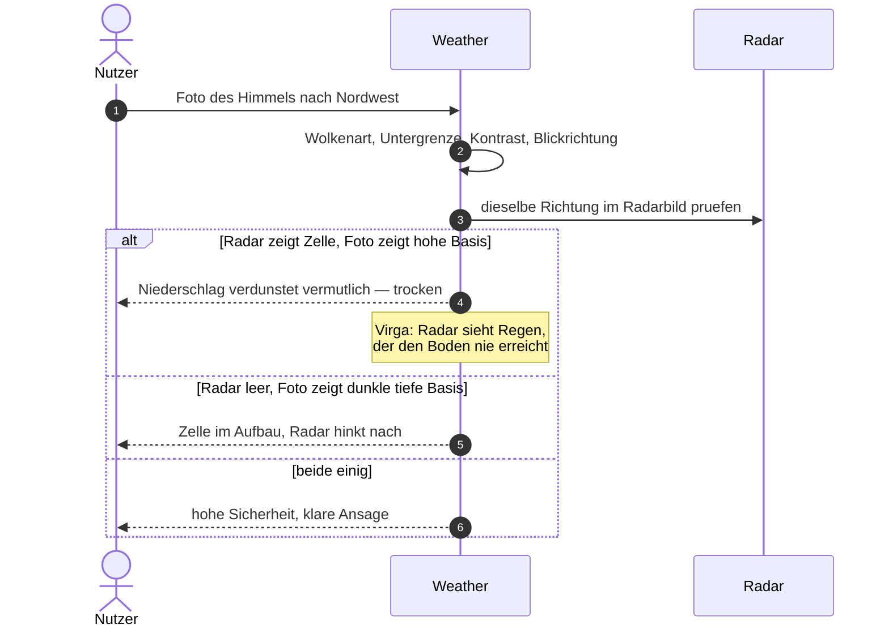
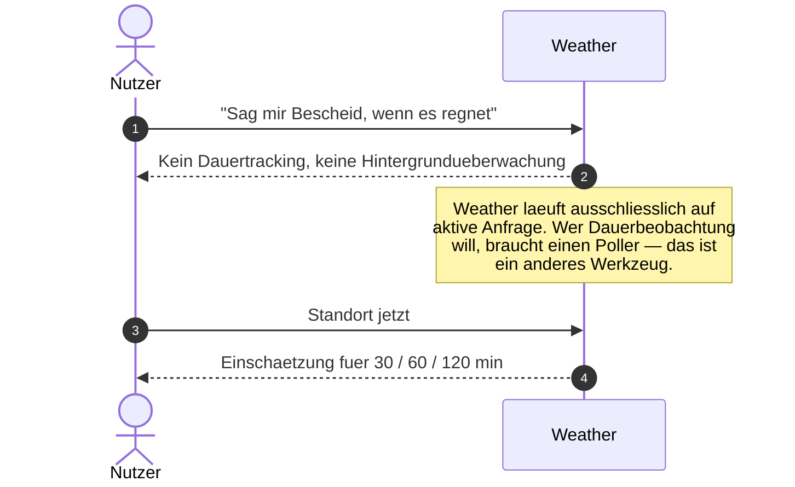

# 🌧️ Weather-Check

**Lokaler Regen-Check für die nächsten 30, 60 und 120 Minuten** — aus DWD-Radar,
Messstationen, Open-Meteo, Satellitenbildern, Webcams und optional einem Handyfoto.

Zwei Dinge in einem Branch: eine installierbare **PWA** und der **Computer-Prompt** für
Perplexity, der dieselbe Einschätzung im Chat liefert.

Die Antwort ist kein Prozentwert, sondern ein Satz, der eine Entscheidung trägt:
*„Die nächsten 40 Minuten trocken, danach 20 Minuten kräftiger Schauer — jetzt losgehen."*

---

## Schnellstart

**Als PWA:**

```bash
cd Weather-Check
python3 -m http.server 8080
```

`http://localhost:8080` öffnen, Standort freigeben, im Browsermenü *Zum Startbildschirm
hinzufügen*. `manifest.json`, `sw.js` und Icons liegen bei.

**Als Perplexity-Computer:** `weather_computer_prompt.md` in einen neuen Computer einsetzen.
Dieselbe Datei gibt es als `.docx` und `.pdf` zum Weiterreichen.

---

## Architektur

<div align="center">


**[▶ Interaktive 3D-Ansicht öffnen](https://weather-check.vercel.app/3d.html)** — ziehen zum Drehen, Rad zum Zoomen,
Umschalter zwischen isometrisch und perspektivisch.

</div>

### Isometrische Ansicht


| Schicht | Was passiert | Verlässlichkeit |
|---|---|---|
| **Quellen** | sechs unabhängige Beobachtungen desselben Himmels | einzeln lückenhaft |
| **Zusammenführung** | Zugbahn schätzen, Quellen gewichten, Widersprüche benennen | der eigentliche Wert |
| **Einschätzung** | drei Zeitfenster: 30, 60, 120 Minuten | nach hinten unschärfer |
| **Ausgabe** | ein Satz, der eine Entscheidung trägt | „Jetzt losgehen" statt „30 % Regenwahrscheinlichkeit" |

Der Kern ist nicht die einzelne Quelle, sondern das Zusammenführen. Radar sieht Niederschlag,
der den Boden nie erreicht; Messstationen sehen nur ihren Punkt; Open-Meteo rechnet mit einem
gröberen Gitter, als die Frage verlangt. Erst zusammen ergeben sie ein Bild.

Beide Bilder entstehen aus `docs/architektur.json`:

```bash
python tools/render_3d.py docs/architektur.json docs/assets
```

---

## Abläufe

### Ein Regen-Check von der Anfrage bis zur Antwort


```mermaid
sequenceDiagram
    autonumber
    actor N as Nutzer
    participant W as Weather
    participant R as DWD-Radar
    participant S as Messstationen
    participant O as Open-Meteo
    participant K as Satellit / Webcams

    N->>W: Standort (+ optional Foto)
    par sechs Quellen parallel
        W->>R: Reflektivitaet der letzten Bilder
        R-->>W: Zellen, Intensitaet, Zugrichtung
    and
        W->>S: naechstgelegene Stationen
        S-->>W: aktueller Niederschlag, Wind
    and
        W->>O: Punktprognose
        O-->>W: Minutenwerte im Modellgitter
    and
        W->>K: Bewoelkung von oben und von unten
        K-->>W: Bild, Zeitstempel
    end
    W->>W: Zugbahn schaetzen, Quellen gewichten
    W->>W: Widersprueche benennen statt mitteln
    W-->>N: 30 / 60 / 120 min + ein Handlungssatz
```

### Warum ein Foto hilft


```mermaid
sequenceDiagram
    autonumber
    actor N as Nutzer
    participant W as Weather
    participant R as Radar

    N->>W: Foto des Himmels nach Nordwest
    W->>W: Wolkenart, Untergrenze, Kontrast, Blickrichtung
    W->>R: dieselbe Richtung im Radarbild pruefen
    alt Radar zeigt Zelle, Foto zeigt hohe Basis
        W-->>N: Niederschlag verdunstet vermutlich — trocken
        Note over W: Virga: Radar sieht Regen,<br/>der den Boden nie erreicht
    else Radar leer, Foto zeigt dunkle tiefe Basis
        W-->>N: Zelle im Aufbau, Radar hinkt nach
    else beide einig
        W-->>N: hohe Sicherheit, klare Ansage
    end
```

### Was das Werkzeug bewusst nicht tut


```mermaid
sequenceDiagram
    autonumber
    actor N as Nutzer
    participant W as Weather

    N->>W: "Sag mir Bescheid, wenn es regnet"
    W-->>N: Kein Dauertracking, keine Hintergrundueberwachung
    Note over W: Weather laeuft ausschliesslich auf<br/>aktive Anfrage. Wer Dauerbeobachtung<br/>will, braucht einen Poller — das ist<br/>ein anderes Werkzeug.
    N->>W: Standort jetzt
    W-->>N: Einschaetzung fuer 30 / 60 / 120 min
```


---

## Die sechs Quellen

| Quelle | Was sie kann | Wo sie blind ist |
|---|---|---|
| **DWD-Radar** | Niederschlagszellen, Intensität, Zugrichtung | sieht auch Regen, der verdunstet, bevor er ankommt |
| **Messstationen** | verlässlicher Ist-Wert, Wind | nur der eigene Punkt, oft mehrere Kilometer entfernt |
| **Open-Meteo** | Minutenwerte, freie API | Modellgitter gröber als die Frage |
| **Satellit** | Bewölkung großflächig, Zellen im Aufbau | Zeitversatz, keine Niederschlagsintensität |
| **Webcams** | was tatsächlich vom Himmel fällt | nur dort, wo eine hängt |
| **Handyfoto** | Wolkenart und -untergrenze am Standort | nur der Moment, nur die Blickrichtung |

Keine dieser Quellen reicht allein. Der Wert entsteht beim Zusammenführen — und beim
**Benennen von Widersprüchen**, statt sie wegzumitteln.

---

## Die drei Zeitfenster

| Fenster | Wovon getragen | Aussagekraft |
|---|---|---|
| **30 min** | Radar-Zugbahn, Stationen, Foto | hoch — reine Extrapolation der Beobachtung |
| **60 min** | zusätzlich Satellit | mittel — Zellen können entstehen und zerfallen |
| **120 min** | zusätzlich Modellprognose | grob — hier endet, was Nowcasting leisten kann |

Nach hinten wird die Aussage unschärfer. Das steht in der Antwort, statt eine Genauigkeit
vorzuspielen, die es nicht gibt.

---

## Aufbau

```
Weather-Check/index.html            PWA-Oberflaeche
Weather-Check/assets/               gebautes Frontend (JS, CSS)
Weather-Check/manifest.json         PWA-Manifest
Weather-Check/sw.js                 Service Worker
Weather-Check/weather_computer_prompt.md   System-Prompt fuer Perplexity
Weather-Check/weather_computer_prompt.docx / .pdf   dieselbe Fassung zum Weiterreichen
public/3d.html                      interaktive Architekturansicht
tools/render_3d.py                  erzeugt Standbild und GIF
docs/architektur.json               Schichtbeschreibung
```

---

## Grenzen

- **Kein Dauertracking.** Weather läuft ausschließlich auf aktive Anfrage. Wer eine Meldung
  beim Regenbeginn will, braucht einen Poller — das ist ein anderes Werkzeug.
- **Nowcasting endet bei etwa zwei Stunden.** Danach ist es Wettervorhersage, und dafür gibt
  es bessere Werkzeuge als dieses.
- **Radar lügt nach oben.** Virga — Niederschlag, der vor dem Boden verdunstet — sieht im
  Radarbild aus wie Regen. Genau dafür ist das Foto da.
- **Standortgenauigkeit schlägt Modellgenauigkeit.** Eine Station 8 km entfernt sagt weniger
  über den eigenen Balkon als ein Blick nach draußen.
