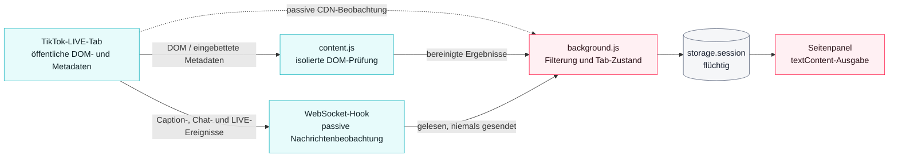

# TikTok LIVE Companion – Dokumentation v0.7.0

**Version:** 0.7.0 · **Status:** veröffentlicht · **Stand:** 18. Juli 2026
**Projektwurzel:** `C:\Users\silve\Documents\Codex\TikTok-Live-Companion`
**Kanonische Quelle:** GitHub · `KikiKari/Projects`
**Dokumentationssite:** https://tiktok-live-companion.vercel.app/de

> Dieses unabhängige Projekt ist nicht mit TikTok verbunden und wird nicht von TikTok unterstützt.

---

## Inhalt

1. [Überblick und Plattformmatrix](#1-überblick-und-plattformmatrix)
2. [Installation](#2-installation)
3. [Funktionen](#3-funktionen)
4. [Architektur](#4-architektur)
5. [Songerkennung und Token-Dienst](#5-songerkennung-und-token-dienst)
6. [Sicherheit und Datenschutz](#6-sicherheit-und-datenschutz)
7. [Fehlerbehebung](#7-fehlerbehebung)
8. [Downloads, Release und Abnahme](#8-downloads-release-und-abnahme)

---

## 1. Überblick und Plattformmatrix

TikTok LIVE Companion macht öffentliche TikTok-LIVE-Streams zugänglicher: bereinigter Chattext, natürliches Vorlesen, Top-Chatter, beobachtete Personen, Geschenkzählung, Untertitelprüfung, LIVE-Informationen, Playersteuerung, optionale Songerkennung, digitaler Pegelschutz, Bildqualitäten und FLV-/HLS-Links.

Mit 0.7.0 läuft das Projekt auf drei Plattformen.

### Plattformmatrix

| Plattform | Technik | Songerkennung | Branch | Commit |
|---|---|---|---|---|
| Edge / Chrome | Manifest V3 Erweiterung + lokaler Windows-Dienst | AudD auf Knopfdruck | `TikTok-Live-Companion` | `18ef6cf` |
| iOS 15+ | SwiftUI + WKWebView + ShazamKit | ShazamKit | `TikTok-Live-Companion-iOS` | `9ac0a20` |
| Android / HyperOS | Kotlin + Jetpack Compose + AndroidX WebKit, `minSdk 21` | ShazamKit (AAR) | `TikTok-Live-Companion-Android` | `9434e8c` |

### Warum native Apps

ShazamKit ist ein natives SDK und keine Web- oder PWA-API. Es lässt sich weder aus einer Chrome-Erweiterung noch aus einer PWA aufrufen. Apple unterstützt die eigenen Plattformen sowie ein Android-AAR; auf Android werden Kotlin, mindestens API 21, ein Apple-Developer-Token und unterstütztes PCM-Audio verlangt. Eine reine PWA reicht daher nicht aus — die zusätzlichen Branches sind technisch notwendig, nicht optional.

Die Browser-Erweiterung behält AudD. ShazamKit wird dort nicht nachgerüstet.

### Grenzen

Die Erweiterung erzeugt keine Untertitel selbst. Fehlen TikToks native Caption-Ereignisse, kann sie diese nicht erzwingen. Der WebSocket-Bridge-Inhalt ist ein Beobachtungsprotokoll und kein kryptografisch authentifizierter Nachweis. Der Pegel wird in dBFS gemessen; ohne kalibriertes Ausgabegerät kann kein dB-SPL-Wert am Ohr garantiert werden.

Es werden keine Cookies gelesen, kein Konto benötigt und kein API-Key in der Erweiterung gespeichert.

---

## 2. Installation

### 2.1 Browser

**Voraussetzungen:** Microsoft Edge oder Google Chrome ab Version 114, ein öffentlicher TikTok-LIVE-Tab.

1. `tiktok-live-companion-extension-0.7.0.zip` entpacken.
2. `edge://extensions` oder `chrome://extensions` öffnen.
3. **Entwicklermodus** aktivieren.
4. **Entpackte Erweiterung laden** wählen.
5. Den Ordner auswählen, in dem `manifest.json` liegt.
6. Einen öffentlichen TikTok-LIVE-Tab öffnen und auf das Erweiterungssymbol klicken.

### 2.2 Optionaler lokaler Sprach- und Songdienst

1. `tiktok-live-companion-service-0.7.0.zip` entpacken und PowerShell in diesem Ordner öffnen.
2. `npm run setup` ausführen; ein AudD-Token ist ausschließlich für die Songerkennung erforderlich.
3. Den Dienst mit `npm start` starten.
4. Den ausgegebenen Pairing-Code im Sidepanel eintragen.

Der Dienst lauscht ausschließlich auf `127.0.0.1:43117`.

### 2.3 iOS

Auslieferung als vollständiges Xcode-Projekt und Quellarchiv `tiktok-live-companion-ios-0.7.0-source.zip`.

**Kein IPA** — unter Windows ist weder ein Xcode-Build noch eine Apple-Signierung möglich. Für Build und XCTest werden macOS und Xcode benötigt.

Für echte Katalogerkennung sind Apple-Developer-Team, aktivierte ShazamKit-App-Capability, Media-ID und privater Schlüssel erforderlich.

### 2.4 Android / HyperOS

| Datei | Inhalt |
|---|---|
| `tiktok-live-companion-android-0.7.0-debug.apk` | reproduzierbare Debug-APK, 18,7 MiB |
| `tiktok-live-companion-android-0.7.0-source.zip` | vollständiger Quellcode |

Es werden ausschließlich Android-Standard-APIs ohne Google-Play-Services-Abhängigkeit verwendet, damit HyperOS unterstützt bleibt.

Das ausgelieferte APK verwendet die **Mock-Variante** der Erkennung und zeigt transparent „ShazamKit nicht konfiguriert". Für echte Erkennung müssen das ShazamKit-AAR unter `mobile/android/app/libs/` abgelegt und die Shazam-Produktvariante gebaut werden.

### 2.5 Erster Einsatz

1. **Seite prüfen** liest Caption-Metadaten, sichtbare Bedienelemente und Stream-Informationen.
2. **Untertitel aktivieren** betätigt nur einen eindeutig erkannten TikTok-Menüpunkt.
3. **Hook setzen** registriert die Beobachtung vor dem Player-Code und lädt neu.
4. Danach erscheinen Chat-, Caption- und LIVE-Ereignisse, sofern TikTok sie liefert.

---

## 3. Funktionen

### 3.1 Chat und Vorlesen

Öffentliche Chatnachrichten werden bereinigt und als zugänglicher Text dargestellt. Emoji-Sequenzen und sicher erkannte, pro Stream feste Teamkürzel werden beim Vorlesen entfernt. `@`-Empfänger und Fragen werden natürlich formuliert.

**Formulierungsbeispiele:**

| Chatzeile | Gesprochene Ausgabe |
|---|---|
| `Miimii tmm: @Stivinho danke` | Miimii sagt zu Stivinho danke |
| `Blitzerbiest: @Honey tmm wo is mein Tee ?` | Blitzerbiest fragt Honey wo is mein Tee |

**Teamkürzel-Heuristik:** genau eine dreistellige alphanumerische Zeichenfolge pro Stream — als Suffix bei mindestens zwei verschiedenen Namen oder bei einem Namen zuzüglich eigenständigem Vorkommen im Chat. Häufige gewöhnliche Drei-Buchstaben-Wörter genügen nicht. Bei Streamwechsel wird zurückgesetzt.

### 3.2 Sprechfreundliche Nicknamen

Reine **Ausgabetransformation**. Chat-Anzeige und Statistik behalten immer den Originalnamen; nur die gesprochene Form wird normalisiert. Dieselbe Reduktion gilt für `@`-Empfänger in fremden Antworten, damit auch dort keine überlangen Namen gesprochen werden.

| Regel | Beispiel | Gesprochen |
|---|---|---|
| Sonderzeichen und Zahlen entfallen | `liane15` | liane |
| Punkt-getrennte Namen auf Hauptteil | `Traumtänzer.der.Nächte` | Traumtänzer |
| Unterstrich-Namen auf Hauptteil | `Vanny_GioPrimetv` | Vanny |
| Artikel entfallen | `Die Löwin` | Löwin |
| Präfixkürzel entfallen | `MKU Maskenaufsicht` | Maskenaufsicht |
| Ziffernsuffix entfällt, Schreibweise bleibt | `Butterfly 004` | Butterfly |
| Systemnamen auf höchstens drei Ziffern | `user5728384…` | user572 |
| Lachspam wird zusammengefasst | `hahahahahahahhhhahhhaaaa` | haha |

Die Kürzung greift nur, wenn ein klarer erster alphabetischer Hauptteil vorhanden ist. Generische Präfixe wie „Team", „Official" oder „The" sowie einteilige Namen bleiben unverändert.

**TTS-Einstellungen:** Sprache `Auto` / `Deutsch` / `Englisch`; `Chatnamen vorlesen` (Standard: an); `Geeignete Namen kürzen` (Standard: aus, nur bei aktivierten Chatnamen verfügbar); `Vorlesen bei Tabwechsel oder Minimieren aktiv lassen`.

**Lautstärke:** Regler 0–100 %. 50 % entspricht dem normalen Maximalpegel, 100 % bis zu +6 dB, abgesichert durch einen lokalen Limiter. Ohne laufenden Dienst ist oberhalb 50 % keine zusätzliche Verstärkung möglich; der Status weist darauf hin.

### 3.3 Top-Chatter und beobachtete Personen

Pro Stream werden Nachrichten, Wörter und Geschenkereignisse für bis zu 5.000 im Chat sichtbare Personen gezählt. Die Top-Chatter-Box zeigt die fünf führenden Personen mit Nachrichten- und Wortzahl sowie einer Stream-Mute-Checkbox, sortiert nach Nachrichtenzahl, dann Wortzahl, dann Name. Darüber steht das erkannte Teamkürzel.

Der Button **Zuschauer\*innen** öffnet das Modal „Im Chat beobachtete Personen": Name, Nachrichten, Wörter, Geschenkereignisse, summierte `gesendet`-Anzahl, zuletzt gesehen und Mute-Modus je Person.

**Mute-Modi:** `Aktiv`, `Stream stumm`, `Dauerhaft stumm`. Stream-Mutes werden beim Streamwechsel verworfen, dauerhafte Mutes bleiben lokal gespeichert. Stummgeschaltete Personen werden weiterhin angezeigt und gezählt, aber nicht vorgelesen.

Die Liste ist ausdrücklich keine vollständige TikTok-Zuschauerliste, sondern die Menge der im Chat beobachteten Personen. TikToks WebSocket liefert nur aggregierte Zuschauerzahlen.

### 3.4 Untertitel, LIVE-Werte, Player

Die Oberfläche trennt drei Signale: angekündigte Caption-Funktion in `caption_info`, gefundener Menüpunkt und tatsächlich empfangene `WebcastCaptionMessage`-Ereignisse. Fehlende Ereignisse beweisen nicht, dass nie gesprochen wurde.

Der Hook beobachtet `WebcastRoomUserSeqMessage`, `WebcastLikeMessage` und `WebcastSocialMessage`. Angezeigt werden Zuschauerzahl, Aufrufe gesamt, Likes, Follows seit Hook, Teilungen und Follower gesamt. Follows seit Hook sind ein lokaler Ereigniszähler.

Play/Pause, Neuladen, Lautstärke, Stumm, Bild-in-Bild, Vollbild und Melden-öffnen bedienen TikToks vorhandenen Player. Der optionale lokale Kompressor begrenzt digitale Spitzen; der Grenzwert ist einstellbar. dBFS ist kein kalibrierter dB-SPL-Wert.

### 3.5 Bildqualität, VLC, Diagnose, Profil-Force

Qualitätsstufen stammen aus TikToks Stream-Metadaten mit Codec, Auflösung, Bildrate und Bitrate. **Automatisch** ist ein Playermodus ohne VLC-Link. Signierte FLV-/HLS-Links können ablaufen und sind bis dahin sensibel.

Das Caption-Protokoll lässt sich als JSONL exportieren. Der abschaltbare Debugmodus exportiert bereinigte Ereignisse ohne Chattext, Cookies, API-Keys oder Werte signierter URL-Parameter.

`Force` speichert die LIVE-URL, öffnet bewusst kurz die Profilseite ohne `/live`, übernimmt die dort geladenen öffentlichen Werte und stellt anschließend die LIVE-URL wieder her.

### 3.6 Funktionsparität auf Mobilgeräten

Volle Funktionsparität wird über **native Entsprechungen** erreicht, nicht über identische Implementierung. Chrome-spezifische APIs haben auf iOS und Android keine Entsprechung und wurden ersetzt:

| Funktion | Browser | Mobil |
|---|---|---|
| Chat, Captions, LIVE-Werte, Geschenke | Content Script + Hook | WebView-Bridge mit versioniertem Schema |
| Sprachausgabe | Web Speech / lokaler Dienst | `AVSpeechSynthesizer` bzw. Android Text-to-Speech |
| Playersteuerung | direkte DOM-Aktion | validierte WebView-Kommandos |
| Flüchtige Streamdaten | `storage.session` | nur Arbeitsspeicher |
| Einstellungen, dauerhafte Mutes | `storage.local` | UserDefaults bzw. DataStore |
| Songerkennung | AudD auf Knopfdruck | ShazamKit |

**Ehrlichkeitsregel:** Funktionen, die eine Plattform oder die TikTok-WebView technisch ablehnt, bleiben sichtbar und zeigen einen eindeutigen Verfügbarkeits- oder Fehlerstatus. Es werden keine scheinbar funktionierenden Attrappen ausgeliefert.

---

## 4. Architektur

### 4.1 Visuelle Dokumentation

Die statische, animierte und interaktive Architekturansicht werden aus demselben projektspezifischen Modell mit 13 Knoten und 12 gerichteten Verbindungen erzeugt. Die Darstellung trennt die Browser-, iOS- und Android-/HyperOS-Pfade räumlich und kennzeichnet passive Beobachtung, ausdrücklich gestartete Audioübertragung und kurzlebige Token getrennt.

[](https://tiktok-live-companion.vercel.app/de/architecture-3d)

- **Interaktiv:** [Three.js-Architektur öffnen](https://tiktok-live-companion.vercel.app/de/architecture-3d) – drehen, zoomen, Knoten auswählen und Tastatursteuerung verwenden.
- **Statisch:** [generiertes SVG öffnen](https://tiktok-live-companion.vercel.app/visualizations/tiktok-live-companion-architecture.svg).
- **Animiert:** [generiertes 36-Frame-GIF öffnen](https://tiktok-live-companion.vercel.app/visualizations/tiktok-live-companion-architecture.gif).
- **Quellen:** `assets/flow_model.py`, `assets/gen_tiktok_live_companion_flow.py` und `assets/gen_tiktok_live_companion_flow_gif.py`.
- **Vertrag:** `docs/diagrams/tiktok-live-companion-visualization-contract.md` legt Farben, Datenfluss, Textalternative und Herkunft fest.


Das Mobile-Bild ist die verbindliche UI-Spezifikation. Die Architekturvisualisierung ist eine Dokumentationsansicht und keine fremde eingebettete Anwendung. Sie lädt keine Remote-Daten, enthält keine Telemetrie und ersetzt keinen Inhalt der V7-Dokumentation.

### 4.2 Browser-Erweiterung

| Datei | Aufgabe |
|---|---|
| `content-core.js` | reine Normalisierung, Namens- und Metadatenanalyse |
| `content.js` | DOM-Prüfung und lokale Player-/Audioaktionen in der isolierten Welt |
| `proto-main.js` | minimaler Protobuf-Decoder für öffentliche LIVE-Ereignisse |
| `hook.js` | MAIN-World-WebSocket-Proxy, der nur Listener ergänzt |
| `background.js` | passives CDN-Monitoring und flüchtiger Tab-Zustand |
| `sidepanel.*` | lokale Darstellung, Export- und Kopieraktionen |

Der Hook ersetzt `WebSocket.send()` nicht. Seiteninhalte gelten als nicht vertrauenswürdig und werden mit `textContent` ausgegeben.

### 4.3 Datenfluss



Quelle: `docs/diagrams/architecture.mmd`

**Textalternative:** Der TikTok-Tab liefert öffentliche DOM-/Metadaten an das isolierte Content Script und beobachtete WebSocket-Ereignisse an den MAIN-World-Hook. Beide leiten bereinigte Ergebnisse an den Service Worker weiter. Dieser speichert den Zustand flüchtig pro Tab und sendet ihn an das Seitenpanel. CDN-Anfragen werden ausschließlich passiv beobachtet.

### 4.4 Lokaler Begleitdienst (Windows)

Node.js-Dienst, gebunden ausschließlich an `127.0.0.1`. Sprachsynthese über installierte Windows-DE-/EN-Stimmen mittels fester PowerShell-Synthese.

| Endpunkt | Beschreibung |
|---|---|
| `GET /v1/health` | Statusprüfung |
| `POST /v1/tts` | Text plus `auto` \| `de-DE` \| `en-US`; Antwort `audio/wav` |
| `POST /v1/recognize` | kurzer Audioausschnitt; Antwort mit Titel, Interpret, Album, Link, Erkennungsstatus |

### 4.5 WebView-Bridge (mobil)

Gemeinsame Quelle: `plugin-source/mobile-shared/webview-bridge.js`, identisch kopiert nach `mobile/ios/Resources/` und `mobile/android/app/src/main/res/raw/`. Die Kopiengleichheit wird automatisiert geprüft.

Nachrichtenschema mit `type`, `streamId`, `sequence`, `timestamp` und validiertem `payload`.

**Sicherheitsgrenzen:**

- WebViews laden ausschließlich HTTPS-Seiten unter `www.tiktok.com`; externe Navigation öffnet den Systembrowser.
- Die Bridge ist auf Hauptframe und erlaubte Origin beschränkt.
- Nachrichtengröße auf 64 KiB begrenzt.
- Cleartext-Verkehr ist verboten.
- Kein Zugriff auf Cookies, Schlüssel oder beliebige native Methoden.

iOS injiziert per `WKUserScript` zum Dokumentstart. Android verwendet AndroidX WebKit mit origin-beschränktem `WebMessageListener` statt `addJavascriptInterface`.

### 4.6 Projektstruktur der nativen Apps

| Pfad | Inhalt |
|---|---|
| `mobile/ios/TikTokLiveCompanion/` | SwiftUI-App: `CompanionState`, `CompanionWebView`, `BridgeValidator`, `RecognitionService`, `Models` |
| `mobile/ios/TikTokLiveCompanionTests/` | XCTest für Bridge und Zustand |
| `mobile/ios/TikTokLiveCompanion.xcodeproj/` | Xcode-Projekt |
| `mobile/android/app/src/main/java/app/tiktoklivecompanion/` | Compose-App: `MainActivity`, `CompanionViewModel`, `CompanionWebView`, `BridgeValidator`, `CompanionPreferences` |
| `mobile/android/app/src/mock/` | Mock-Erkennung ohne ShazamKit |
| `mobile/android/app/src/shazam/` | echte ShazamKit-Anbindung |
| `mobile/android/app/src/test/` | JUnit- und Robolectric-Tests |
| `mobile/android/app/libs/` | Ablageort für das ShazamKit-AAR (nicht eingecheckt) |

### 4.7 Berechtigungen (Manifest V3)

**Permissions:** `activeTab`, `scripting`, `sidePanel`, `storage`, `tabCapture`, `tabs`, `webRequest`

**Host-Permissions:** `https://www.tiktok.com/*`, `http://127.0.0.1/*`, `http://localhost/*`, `*://*.tiktokcdn.com/*`, `*://*.tiktokcdn-eu.com/*`, `*://*.tiktokcdn-us.com/*`, `*://*.tiktokcdn-in.com/*`, `*://*.ttlivecdn.com/*`

Keine Cookie-Berechtigung. `webRequest` ohne `webRequestBlocking`.

---

## 5. Songerkennung und Token-Dienst

### 5.1 Browser: AudD

Nach ausdrücklicher Aktivierung und Klick nimmt die Erweiterung etwa zwölf Sekunden Tab-Audio auf. Das Tab-Audio bleibt während der Aufnahme hörbar. Der lokale Dienst sendet nur diesen Ausschnitt an AudD und löscht temporäre Audiodaten unmittelbar nach Erfolg oder Fehler. Ohne Klick findet keine Aufnahme oder Übertragung statt. Eine automatische Dauerüberwachung ist nicht enthalten.

Die Oberfläche weist vor der ersten Nutzung ausdrücklich auf die externe Übertragung und mögliche Anbietergebühren hin.

### 5.2 Mobil: ShazamKit

Zwei Quellen, beide ausschließlich nach Nutzeraktion:

- **Mikrofon** — der stabile, offiziell dokumentierte Pfad.
- **WebView (experimentell)** — Versuch, unterstützte PCM-Puffer aus dem eingebetteten Player zu übergeben. Bei CORS-, Codec-, WebView- oder Plattformfehlern wird die Quelle beendet und der Mikrofon-Fallback angeboten.

Die gewählte Quelle wird nativ persistiert (UserDefaults bzw. DataStore).

### 5.3 Token-Dienst

`POST https://tiktok-live-companion.vercel.app/api/shazam-token`
Implementierung: `site/api/shazam-token.mjs`

- **Antwort:** `{ "token": "...", "expiresAt": "ISO-8601" }`
- **Fehlercodes:** `not_configured`, `rate_limited`, `signing_failed`
- Kurzlebige ES256-Tokens. Team-ID, Key-ID, Media-ID und privater Media-Services-Key liegen ausschließlich in Vercel-Umgebungsvariablen.
- Antworten und Logs enthalten niemals den privaten Schlüssel.
- Rate-Limit aktiv.
- Die SPA-Rewrite-Regel fängt `/api` nicht ab.
- Android nutzt einen cachefähigen `DeveloperTokenProvider`; iOS nutzt die aktivierte ShazamKit-App-Capability.

### 5.4 Gemeinsames Ergebnismodell

Schema: `plugin-source/mobile-shared/recognition-result.schema.json`

`matched`, `title`, `artist`, optional `album`, `artworkUrl`, `songUrl`, `matchOffset` und `source` (`microphone` oder `webview`). Links werden vor dem Öffnen auf HTTPS validiert.

### 5.5 Nicht eingecheckt

ShazamKit-AAR und Apple-Schlüsselmaterial werden aus Lizenz- und Geheimhaltungsgründen nicht in Git aufgenommen. Die Release-Archive wurden automatisiert darauf geprüft, dass sie weder AAR noch `.p8`-Schlüssel noch Build-Caches enthalten.

---

## 6. Sicherheit und Datenschutz

### 6.1 Bisheriges Release-Gate

Der formale Codex-Security-Scan vom 17. Juli 2026 hat alle neun Prüfumfänge abgeschlossen. Ergebnis: **0 Critical, 0 High, 0 Medium, 2 Low/P3** — Bezug: Version 0.5.0.

Die beiden Low/P3-Findings betreffen `proto-main.js:208-227` (unbegrenzte gzip-Ausgabe und Decode-Parallelität) und `content.js:696-708` (byte-unbegrenzte Page-Bridge-Ereignisse). Beide sind als Linear-Issues 0PE-41 und 0PE-43 geführt.

### 6.2 Neue Prüfdokumente für 0.7.0

| Datei | Inhalt |
|---|---|
| `security-scan/threat_model_0.7.0.md` | Threat Model für WebView-Bridges, Token-Endpunkt, Audiofluss |
| `security-scan/release-review-0.7.0.md` | Release-Review 0.7.0 |

**Offen:** Ein vollständiger formaler Codex-Security-Scan für 0.7.0 steht noch aus. Die bisherige 9/9-Bewertung bezieht sich auf 0.5.0.

### 6.3 Automatisierte Sicherheitsprüfungen

Statisch geprüft und ausgeschlossen: `addJavascriptInterface`, `setAllowUniversalAccessFromFileURLs`, `setAllowFileAccessFromFileURLs`, Cleartext-`http://`, `document.cookie`, `localStorage`, `sessionStorage`, `innerHTML`, `eval(`, `new Function`, eingebettete private Schlüssel.

Geprüft und bestätigt: Origin- und Hauptframe-Beschränkung, 64-KiB-Schemagrenze, identische Bridge-Kopien, Ausschluss von AAR und Apple-Schlüsseln aus allen Archiven.

### 6.4 Sicherheitskontrollen

- keine Cookie-Berechtigung und kein Zugriff auf `document.cookie`;
- keine Telemetrie oder Remote-Skripte;
- kein `eval`, `new Function` oder Zuweisung an `innerHTML`;
- `webRequest` ohne `webRequestBlocking`;
- maximal 50 bereinigte Chatnachrichten pro Tab;
- der Begleitdienst bindet nur an `127.0.0.1` und erzwingt Pairing, Origin-Prüfung und Größenlimits;
- die Dienstadresse akzeptiert ausschließlich echte Loopback-URLs;
- der Meldedialog wird nur geöffnet und nie automatisch ausgefüllt oder abgesendet;
- die Apps automatisieren weder Anmeldung noch Meldungen und lesen keine Cookies.

### 6.5 Datenhaltung

| Inhalt | Browser | Mobil |
|---|---|---|
| Stream, Chat, Captions, Teilnehmer, Diagnose | `chrome.storage.session` | nur Arbeitsspeicher |
| Einstellungen, dauerhafte Mutes | `chrome.storage.local` | UserDefaults / DataStore |
| Pairing-Code, Dienstadresse | `chrome.storage.local` | entfällt |
| AudD-Token | lokale Dienstkonfiguration unter `%LOCALAPPDATA%` | entfällt |
| Apple-Schlüsselmaterial | entfällt | ausschließlich Vercel-Umgebungsvariablen |

### 6.6 Offene Restrisiken

- Ein Seitenskript kann die `postMessage`-Bridge imitieren.
- Signierte Medien-URLs können während ihrer Gültigkeit Zugriff ermöglichen.
- TikTok kann DOM, CDN-Domains, Kompression oder Protobuf-Felder ändern und damit Fehlnegative verursachen.
- Browser und Plattformen können Bild-in-Bild, Vollbild oder Web-Audio-Routing ablehnen.

Der öffentliche Sicherheitsabschnitt enthält keine Proof-of-Concepts und keine gültigen signierten URLs.

---

## 7. Fehlerbehebung

### Keine CaptionMessages

Zuerst **Seite prüfen** ausführen. `caption_info` und ein sichtbarer Menüpunkt zeigen nur die Verfügbarkeit an; erst empfangene CaptionMessages bestätigen Ereignisse im Beobachtungszeitraum. Den Hook vor der Player-Verbindung setzen und neu laden.

### Hook bleibt getrennt

**Refresh** im Hook-Bereich verwenden. Dadurch wird nur der flüchtige Zustand gelöscht, der Hook erneut registriert und die Seite ohne Cache geladen. Cookies bleiben unverändert.

### Playeraktion wird abgelehnt

Bild-in-Bild und Vollbild benötigen je nach Plattform eine unmittelbare Nutzeraktion. Web Audio kann für einzelne Medienkonfigurationen nicht verfügbar sein; die Anwendung meldet den Fehler und behauptet dann keinen aktiven Pegelschutz.

### Keine VLC-Links

Ein Stream kann nur HLS, nur FLV oder keine extrahierbare URL liefern. **Automatisch** ist keine konkrete Stream-URL. Erneut **Seite prüfen** ausführen, nachdem der Player geladen ist.

### Vorlesen nicht lauter als bisher

Oberhalb 50 % ist Verstärkung nur mit laufendem lokalem Dienst möglich. Dienststatus im Sidepanel prüfen: Dienstadresse, Pairing-Code und `npm start`.

### Songerkennung ohne Ergebnis

Browser: fehlendes AudD-Token, verweigerte Tab-Audioaufnahme, nicht erreichbarer Dienst oder tatsächlich kein Treffer.

Mobil zusätzlich: `ShazamKit nicht konfiguriert` bei fehlendem Apple-Developer-Token oder fehlendem AAR, sowie fehlgeschlagene WebView-Audiozuführung mit Mikrofon-Fallback. Die Oberfläche unterscheidet diese Zustände.

### Android-App zeigt „nicht konfiguriert"

Das ausgelieferte Debug-APK ist die Mock-Variante. Für echte Erkennung das ShazamKit-AAR unter `mobile/android/app/libs/` ablegen, den Token-Dienst konfigurieren und die Shazam-Variante bauen.

### Diagnoseexport

Debugmodus erst zur Fehlersuche aktivieren. Der Export enthält keinen Chattext und entfernt Werte signierter URL-Parameter.

---

## 8. Downloads, Release und Abnahme

### 8.1 Artefakte 0.7.0

Ablage: `tiktok-live-companion-project/release/0.7.0/`

| Artefakt | SHA-256 |
|---|---|
| `tiktok-live-companion-extension-0.7.0.zip` | `a3c818eb63179ad1c0d5896c5bac8263bab0c6732c8621cbcafbd847d5a50b42` |
| `tiktok-live-companion-plugin-0.7.0.zip` | `4644ebf46bbd363edd499a16afc49b9ac7fa2c5cf03a1bae5149614ccbefb3b9` |
| `tiktok-live-companion-service-0.7.0.zip` | `4bb5df40229c72a0e93ab822709182542d31846cc865f89962da3769e652fd1c` |
| `tiktok-live-companion-ios-0.7.0-source.zip` | `3b833ea2969487ea9a82571478a4f273f3e678cffb6a11bde51e94ee0e5bbff3` |
| `tiktok-live-companion-android-0.7.0-source.zip` | `62e57e5d901ffb581fc40dc8a47454fb7e46531c57ffdbd71b82b071f76ad594` |
| `tiktok-live-companion-android-0.7.0-debug.apk` | `00f8df107107661c5bb6204f0fedb9d1f485fdbe5085f19f27e0f8089481d0f5` |

Alle sechs Werte wurden am 18.07.2026 gegen die tatsächlichen Dateien verifiziert.

**Kein IPA** — unter Windows ist weder ein Xcode-Build noch eine Apple-Signierung möglich.

### 8.2 Frühere Versionen

| Version | Artefakt | SHA-256 |
|---|---|---|
| 0.6.0 | `tiktok-live-companion-extension-0.6.0.zip` | `40721b800a0f1aa4580ebabaa13ad82d10426ce0287eb1559749385f5850dfce` |
| 0.6.0 | `tiktok-live-companion-plugin-0.6.0.zip` | `c8696754cc06453ad26237cb0d1d641ddeb19b7c21df7df3b06c7ac0b55f457c` |
| 0.6.0 | `tiktok-live-companion-service-0.6.0.zip` | `617c63288976c8507d2e5cd6cfaf9eb5767f43b4c901e703f29d3aff58aa6c56` |
| 0.5.0 | `tiktok-live-companion-extension-0.5.0.zip` | `9439e21db0e8fc2e874a478079d1243297d4c95e0dbb140795912f75eb250b02` |
| 0.5.0 | `tiktok-live-companion-plugin-0.5.0.zip` | `a99fdfb14cd0effac4f89468758258e073dc75ed0f59763bc9764c4c380088a0` |

### 8.3 Abnahme 0.7.0

| Prüfung | Ergebnis |
|---|---|
| Framework-Tests gesamt | 39 bestanden |
| Zusätzliche Vertrags- und Integritätstests | 3 bestanden |
| Extension-Struktur und Decoder (`test_extension.cjs`) | bestanden |
| Mobile-Bridge (`test_mobile_bridge.cjs`) | bestanden |
| Native Projektprüfung (`test_mobile_projects.py`) | bestanden |
| Token-Dienst (`shazam-token.test.mjs`) | bestanden |
| Website-Tests und Produktionsbuild | bestanden |
| Three.js 0.185.1, TypeScript und Produktionsbuild | bestanden; Route wird separat nachgeladen |
| Visualisierungsvertrag | 13 Knoten, 12 Kanten, deterministisches SVG und 36-Frame-GIF bestätigt |
| Öffentliche Visualisierungen | 3D-Route, Modell, SVG und GIF mit HTTP 200 verifiziert |
| Android JUnit / Robolectric | 5 Tests bestanden |
| Android Mock-Build (`assembleMockDebug`) | APK erzeugt, 18,7 MiB |
| Release-Prüfsummen und Archiv-Ausschlüsse | 6/6 bestätigt |
| Website-Sichtprüfung Desktop und 390 px | bestanden, schmale Ansicht nachgehärtet |

### 8.4 Nicht durchgeführt

| Punkt | Grund |
|---|---|
| iOS-Build und XCTest | benötigen macOS und Xcode |
| Echte Shazam-Katalogerkennung | benötigt Apple-Capability, Media-ID, privaten Schlüssel und Android-AAR |
| Physischer HyperOS-Test | kein Xiaomi-Gerät verfügbar; Android-API-Kompatibilität ist bestätigt |
| Formaler Security-Scan 0.7.0 | steht aus |
| Echter AudD-Aufruf | kein Token hinterlegt |

### 8.5 Verifikation durch Dritte

```powershell
node plugin-source/scripts/test_extension.cjs
node plugin-source/scripts/test_mobile_bridge.cjs
python plugin-source/scripts/test_mobile_projects.py
python assets/test_visualizations.py
cd plugin-source/companion-service
npm test
cd ../../site
npm ci
npm run typecheck
npm test
npm run build
node --test api/shazam-token.test.mjs
```

Android:

```powershell
cd mobile/android
./gradlew testMockDebugUnitTest assembleMockDebug
```

---

## Versionshistorie

| Version | Schwerpunkt | Status |
|---|---|---|
| 0.7.0 | iOS, Android/HyperOS, ShazamKit, Token-Dienst, WebView-Bridge sowie reproduzierbare SVG-, GIF- und Three.js-Architektur | veröffentlicht und visuell finalisiert |
| 0.6.0 | Chat-TTS-Aufbereitung, Zuschauerstatistik, Songerkennung, Profil-Force, lokaler Dienst, sprechfreundliche Nicknamen | in 0.7.0 aufgegangen |
| 0.5.0 | zweisprachige Dokumentation und Website | vorheriger öffentlicher Stand |
| 0.4.0 – 0.1.0 | frühere Entwicklungsstände | archiviert |

---

## Annahmen

- Apple-Developer-Team, ShazamKit-App-Capability, Media-ID, privater Schlüssel und Android-AAR werden vom Nutzer bereitgestellt. Ohne diese Werte zeigen Builds „ShazamKit nicht konfiguriert" und verwenden Test-Fakes.
- Es wurden keine App-Store- oder Play-Store-Einträge und keine signierten Store-Pakete erstellt.
- Die Apps unterstützen ausschließlich öffentliche TikTok-LIVE-Seiten.
- Die Songerkennung im Browser bleibt AudD und wird nicht als eingebettetes Shazam vermarktet.

---

*Ende der Dokumentation · TikTok LIVE Companion 0.7.0 · Stand 18. Juli 2026*
