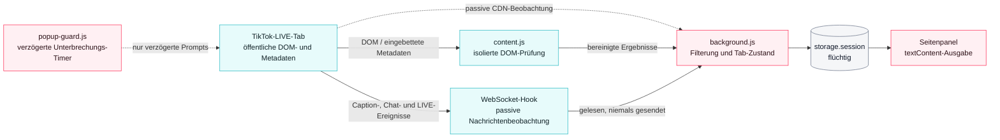

# TikTok LIVE Companion – Dokumentation v0.8.0

**Version:** 0.8.0 · **Dokumentrevision:** v8 · **Status:** finalisiert und veröffentlicht · **Stand:** 13. August 2026
**Projektwurzel:** `%USERPROFILE%\Documents\Codex\TikTok-Live-Companion`
**Veröffentlichter Checkout:** `.publish-repo/` · **Mobile-Worktrees:** `android-implementation/`, `ios-implementation/`
**Zusätzliche Arbeits-Worktrees (13.08.2026):** `tlc-browser-current/`, `tlc-android-current/`, `tlc-ios-current/` unter `%USERPROFILE%\Documents\Codex\2026-08-11\referenced-chatgpt-conversation-this-is-an\work\`
**Kanonische Quelle:** GitHub · `KikiKari/Projects`
**Dokumentationssite:** https://tiktok-live-companion.vercel.app/de
**Abschließende Codex-Sitzung:** `019ff222-22e3-7e33-b7f4-5dfbcce3c0d8` · `codex://threads/019ff222-22e3-7e33-b7f4-5dfbcce3c0d8`
**Vorangegangene Sitzungen:** `019fbedc-9c0a-79c2-810f-8a32946de772`, `019fbe6a-8278-75e2-bc30-e3ddd0dcdd24`
**CoAuthoring:** Claude Fabel/Opus · Übergabe an Codex zur Finalisierung von 0.8.0 unter [`0PE-96`](https://linear.app/0penclaw/issue/0PE-96) — abgeschlossen

> Dieses unabhängige Projekt ist nicht mit TikTok verbunden und wird nicht von TikTok unterstützt.

> **Abschlussvermerk.** Version 0.8.0 ist finalisiert. Das Release-Gate [`0PE-96`](https://linear.app/0penclaw/issue/0PE-96) ist **`Done`** — implementiert, committet, gepusht und dokumentiert. Browser, Android und iOS stehen auf demselben Versions-, Funktions- und Artefaktstand. Die abschließenden Nachweiswerte des Finalisierungslaufs — Release-Commit, sechs SHA-256-Werte, iOS-Actions-Run und Vercel-Deployments — trägt Codex in **Abschnitt 10.11** ein; alle übrigen Angaben dieses Dokuments sind gegen das Repository geprüft.

---

### Fortschreibung 07.08. – 13.08.2026 · Weg zur 0.8.0-Finalisierung

Nach dem Abschluss der 0.7.1-Sitzung wurde in den Sitzungen `019fbe6a-…`, `019fbedc-…` und zuletzt `019ff222-…` weitergearbeitet. Diese Runde bildet den inhaltlichen Unterbau des Release-Gates `0PE-96`.

**Neue Commits auf dem Browser-Branch.**

| Commit | Datum | Inhalt |
|---|---|---|
| `a769faa` | 07.08.2026 | README vollständig ausgearbeitet: Plattformarchitektur als eingebettetes SVG, **Mermaid-Sequenzdiagramme** für Chatzeile, Songerkennung und Untertitelprüfung, neue Schichtansicht in 3D. Neu: `docs/architektur.json`, `tools/render_3d.py`, `public/3d.html`, `docs/assets/architektur-iso.png`, `docs/assets/architektur-rotation.gif` |
| `3fe2104` | 07.08.2026 | 3D-Ansicht ausgebaut: Detailpanel je Knoten, Blättern mit *Vorheriger*/*Nächster*, Zoom- und Zurücksetzen-Schaltflächen, Verbindungen zwischen den Schichten mit Legende und Fußnote. Standbild und GIF setzen Beschriftungen kollisionsfrei — überlappende Schilder weichen aus und erhalten eine Führungslinie zum Block. Der README-Link zeigt jetzt auf die gehostete Ansicht statt auf die Datei im Repo, weil GitHub kein HTML rendert |
| `96f4c55` | 08.08.2026 | `vercel.json` neu aufgesetzt: Branch-Ignore wird **vor** dem Site-Root ausgewertet; feste Sicherheitsheader (`Content-Security-Policy`, `X-Content-Type-Options`, `Referrer-Policy`, `Permissions-Policy`), Rewrites für `/api/:path*` und SPA-Fallback. Ergänzung in `api/shazam-token.mjs` |
| `4a6dbeb` | 12.08.2026 | **LIVE-Empfehlungsscanner** in der Browser-Erweiterung (`0PE-163`, manuell geprüft unter `0PE-164`) und gemeinsames Branding über alle drei Branches (`0PE-165`, `0PE-166`) |
| `6ea1031` lokal → **`1cb2d26`** remote | 13.08.2026 | `feat(browser): complete 0.7.1 diagnostics and controls (0PE-103)` — Debugdiagnose vervollständigt, **mpegts.js 1.8.1 als geprüftes Vendor-Modul** eingebunden, CMD-Reparaturweg für den Sprachdienst ergänzt (17 Dateien, +1041/−226) |

**Neue Commits auf den Mobil-Branches.**

| Branch | Commit | Datum | Inhalt |
|---|---|---|---|
| `TikTok-Live-Companion-Android` | `2c8389c` | 12.08.2026 | `chore: sync shared branding and Vercel config` — `site/index.html`, `site/src/App.tsx`, `site/src/App.test.tsx`, `site/src/styles.css`, `site/public/branding/staenderglobus-ios.png`, `vercel.json` |
| `TikTok-Live-Companion-iOS` | `3d338ab` | 12.08.2026 | identischer Sync-Commit mit denselben sechs Dateien |
| `TikTok-Live-Companion-Android` | `db40999` | 13.08.2026 | `feat(android): capture complete debug diagnostics (0PE-103)` — `CompanionViewModel.kt`, `MainActivity.kt`, `FollowupMediaTest.kt` |
| `TikTok-Live-Companion-iOS` | `b683661` | 13.08.2026 | `feat(ios): capture complete debug diagnostics (0PE-103)` — `CompanionState.swift`, `ContentView.swift`, `Models.swift`, `CompanionStateTests.swift` |

**Zum Ablauf des 13.08.2026.** Der Browser-Push wurde zunächst als nicht-linear zurückgewiesen, weil auf GitHub vier neuere Commits lagen. Sie wurden **nicht** überschrieben: Der Stand wurde eingeholt und der neue Commit daraufgesetzt. Die vier echten Überschneidungen betrafen genau die in dieser Sitzung weiterentwickelten Scanner-, VLC- und Sidepanel-Dateien und wurden einzeln aufgelöst statt pauschal überschrieben. Android und iOS wurden anschließend getrennt nachgezogen und liegen auf den aktuellen Remote-Branchköpfen.

**Neu: mpegts.js als Vendor-Modul (`1cb2d26`).**

| Feld | Wert |
|---|---|
| Upstream | https://github.com/xqq/mpegts.js |
| Version | 1.8.1 |
| Lizenz | Apache-2.0, vollständig als `vendor-mpegts.LICENSE.txt` beigelegt |
| Zweck | HTTP-FLV-Live-Streams in Media Source Extensions umsetzen — Grundlage des seiteninternen Medien-Fallbacks |
| Worker-Modus | durch die Integration **abgeschaltet** |
| MV3-Anpassung | die beiden UMD-Global-Object-Rückfälle über `Function(...)` wurden durch `globalThis` ersetzt; an der Decoding- und Transmuxing-Logik wurde nichts geändert |
| SHA-256 der gebündelten Datei | `0786F9AF6780822FF29240259A73B07ED7BC479BC44966E49418DD38213B8064` |

Die Anpassung war nötig, weil `Function(...)` unter Manifest V3 an der Content-Security-Policy scheitert. Die Herkunft ist in `vendor-mpegts.NOTICE.md` dokumentiert; das Skript läuft als erstes Content Script vor `content-core.js` und `content.js`.

**Neu: Reparaturweg für den Sprachdienst (`1cb2d26`).** `Sprachdienst-reparieren.cmd` startet `repair-service.ps1` ohne Profil und mit umgangener Ausführungsrichtlinie, meldet Erfolg oder Fehlschlag im Klartext und hält das Fenster offen. Bei Erfolg lautet der Hinweis, im Sidepanel **Sprachdienst starten** anzuklicken; bei Fehlschlag wird ausdrücklich gebeten, die Fehlermeldung für die Diagnose aufzubewahren. `setup.ps1` wurde entsprechend verschlankt.

**Was der LIVE-Empfehlungsscanner leistet.** Ein neuer Abschnitt **LIVE-Empfehlungen** liegt im Seitenpanel zwischen *Seiteninformationen* und *LIVE-Informationen*. Er erfasst die von TikTok ausgespielten LIVE-Empfehlungen, normalisiert Handle, Anzeigename und Zuschauerzahl und stellt sie sortierbar dar. Details in Abschnitt 3.8.

**Was das gemeinsame Branding ändert.** Die drei Site-Kopien verwenden dieselbe Bildmarke `site/public/branding/staenderglobus-ios.png` als Favicon, Apple-Touch-Icon und sichtbares Markenzeichen. Die zuvor per CSS gezeichnete Ersatzmarke ist entfallen. Ein Test sichert ab, dass **jede** sichtbare Marke auf dieselbe Datei zeigt. Die Site-Texte wurden dabei von `0.7.0` auf `0.7.1` nachgezogen — Meta-Beschreibung, Plattformüberschrift und Release-Prüfungsabschnitt.

**Übergang in die Finalisierung.** Auf diesem Stand — Browser `1cb2d26`, Android `db40999`, iOS `b683661` — setzt der Abschluss von 0.8.0 auf. Der Umfang, die Schutzgrenzen und die Nachweise stehen in Kapitel 10.

---

### Fortschreibung 02.08.2026, Nachmittag · 0PE-94 bis 0PE-103

Nach der Veröffentlichung von `0PE-93` wurde die Sitzung mit einer weiteren Ausbau- und Konsolidierungsrunde fortgesetzt. Diese Fassung ist der maßgebliche Übergabestand.

**Umgesetzt und veröffentlicht.**

| Issue | Inhalt | Status |
|---|---|---|
| `0PE-97` | **VLC Ersatz** verlässt die Playersteuerung und steht unter **WebSocket-Hook** rechts neben **Normal**; der lokale Dienst erhält authentifizierte, idempotente VLC-Status- und Installationsoperationen | `Done` |
| `0PE-98` | **LIVE-Informationen** stehen direkt unter **Seiteninformationen** | `Done` |
| `0PE-102` | **Top-Chatter** erweitert sich über `mehr…` von 5 auf 15, 25, 35, 45 und höchstens 50 Einträge; ab 15 Einträgen erscheint `Reset` | `Done` |
| `0PE-94` | Bekannter Android-Strukturtestfehler behoben: Android-Player-Bridge wiederhergestellt, Shared-Mobile-Kopie synchronisiert, Suite `31/31` grün | `Done` |

**Neu erfasst und noch offen.**

| Issue | Inhalt | Status |
|---|---|---|
| `0PE-96` | **0.8.0 Release-Gate** — Browser, Android und iOS vollständig konsolidieren; Zieltermin 08.08.2026; verbindlich mit vollständigem nativem iOS-Actions-Lauf | `Todo`, `Urgent` |
| `0PE-93` | Pairing-, AudD- und Chat-Einstellungen über ein **Einstellungsrad** rechts neben `Sherpa aktiv!` in einem Konfigurations-Pop-up öffnen; Felder bleiben dauerhaft änderbar und werden **nicht mehr ausgeblendet** | `Todo`, `High` |
| `0PE-103` | Debugmodus in Browser, Android und iOS um die neuen Komponenten erweitern | `Todo`, `High` |
| `0PE-99` | RAW-Datenstrom und JSON-Export der Untertitelerkennung für externe Verarbeitungssysteme; nutzt den in `0PE-93` vorbereiteten `Universal API-Key` | `Todo` |
| `0PE-100` / `0PE-101` | Songerkennung in Android und iOS wirksam umsetzen samt anwenderfreundlichem Installations- und Konfigurationspfad nach dem Muster des Browser-Sprachdienstes | `Todo` |
| `0PE-95` | 16 `workflow:iOS`-Läufe prüfen und korrigieren; die drei aktuellen erfolgreichen und 13 historisch fehlgeschlagenen Läufe werden getrennt behandelt | `Backlog`, `High` |
| `0PE-72` | Songerkennung im Browser scheitert trotz gültigem AudD- und Pairing-Setup mit `Extension has not been invoked for the current page`; zusätzlich fehlt Shazam in der Browserversion | `Backlog`, `High` — wieder geöffnet |

**Veröffentlichter Endstand dieser Sitzung.** Browser `809de33`, Android `0bebb07` (getesteter Funktionsstand `8cd5c3d`), iOS `6efa242`. GitHub-Prereleases, die drei GHCR-Pakete und die Vercel-Deployments sind auf diesen Stand gebracht. Releases und Packages bleiben ausdrücklich bis zum 08.08.2026 als `0.7.1 alpha` markiert und wechseln erst mit 0.8.0 auf `published`.

**Entwicklungsumgebung.** Die persistente Container-Umgebung läuft auf Port `5173`. **Perplexity Pro ist dauerhaft als primäre Websuche konfiguriert, Tavily nur noch als Rückfall** — sowohl in der Entwicklungsumgebung als auch im lokalen Docker. Der Schlüssel wurde ohne Offenlegung geprüft; eine Vault-Passphrase wird nicht verwendet und die zwischenzeitlich gesetzte Benutzer-Umgebungsvariable wurde wieder entfernt.

---

### Fortschreibung 30.07. – 02.08.2026 · finalisiert

Diese Revision v8 ist die **abgeschlossene, übergabefähige Fassung** des 0.7.1-Standes. Sie ersetzt die zuvor als „veröffentlicht" markierte v8-Fassung vom 30.07.2026 vollständig und führt den gesamten weiteren Arbeitsverlauf der Codex-Sitzung `019fbedc-9c0a-79c2-810f-8a32946de772` nach. Die Zwischenrevision v9 im veröffentlichten Checkout bleibt als Arbeitsspur bestehen; maßgeblich für die Übergabe ist dieses Dokument.

**Bearbeitete Issues.** `0PE-73`, `0PE-78`, `0PE-79`, `0PE-85`, `0PE-86`, `0PE-87`, `0PE-88`, `0PE-89`, `0PE-90` sowie die während der Sitzung neu erfassten `0PE-91` und `0PE-92`. Abgeschlossen sind `0PE-73`, `0PE-78`, `0PE-79`, `0PE-86`, `0PE-87`, `0PE-88`, `0PE-91` und `0PE-92`. `0PE-85` steht auf `In Review`, `0PE-89` und `0PE-90` auf `In Progress` — jeweils wegen der noch fehlenden realen Browserabnahme. `0PE-42` wurde auf Anweisung des Nutzers auf `Canceled` gesetzt; das bereits erstellte formale Security-Seal für 0.7.1 bleibt davon unberührt.

**Browser.** Neue Sidepanel-Reihenfolge (Seiteninformationen unter Top-Chatter, Songerkennung unter Playersteuerung, Untertitel unter WebSocket-Hook), VLC-Ersatz in der größten sichtbaren zentralen Playerfläche, tabbezogener Laufzeitzustand für Hook, Chat, TTS, Player-Recovery und Modulaktivität, MV3-Offscreen-Dokument für Speech-Queue und Ausgabe. Der Chatpuffer wurde von 50 auf **500 Zeilen je Tab** erweitert; der rote Zähler ist anklickbar und öffnet die vollständige Chatübersicht. Neu sind `Auto-Chat Refresh` mit 1–60 Minuten, die Umbenennung von `Chatnamen` zu `Chatnamen sprechen` sowie die feste Anordnung `Chatnamen sprechen` → `Chatnamen kürzen` → `Game-Mode` → `Auto-Chat Refresh`.

**Sprachdienst und Installation.** Der Sidepanel-Button heißt **Installation abschließen!**, zeigt weder Shell-Befehle noch die Erweiterungs-ID und führt die Installation **primär über CMD** im tatsächlichen Installationsverzeichnis aus; PowerShell ist ausschließlich Rückfallebene. Beide Wege lassen das Konsolenfenster nach der Installation geöffnet stehen und weisen den Pairing-Code mit Kopieranweisung aus. Eine veraltete zweite `setup.ps1` im Installationsstamm, die den CMD-Handler wieder durch PowerShell ersetzte, wurde entfernt. Bestehende Installationen werden erkannt: nur der verifizierte Dienst auf Port `43117` wird beendet, Pairing-Code, AudD-Token, Stimmen und Benutzerkonfiguration bleiben erhalten. Pairing-Code und AudD-Token werden **vor** dem Speichern geprüft; ungültige oder nicht prüfbare Werte werden verworfen. Sind Sprachdienst und Sherpa aktiv, blendet das Sidepanel beide Eingabefelder samt Beschriftung aus.

**Stimmen.** Der Sherpa-Katalog umfasst 26 bestätigte Stimmen in fester Reihenfolge: zuerst Deutsch und Englisch beginnend mit `Sherpa Eva`, danach die getrennten Sammelbereiche **Kyrillisch**, **Asiatisch**, **Abjad** und **Indisch**. Der Installationsstatus verändert diese Reihenfolge nicht mehr; installierte Stimmen springen nicht nach oben.

**Mobil.** Die beiden wörtlich benannten Hinweise unter *Player* und *Mehr* sind in Android ersatzlos entfernt; für iOS ist ihre Abwesenheit durch Tests abgesichert. iOS verwendet `CURRENT_PROJECT_VERSION = 8` als einzige Quelle für `CFBundleVersion`; die öffentliche Version bleibt 0.7.1. Die APK wurde per Tailscale Taildrop an `Redmi Note 11S` (`100.94.134.39`) übergeben, Exit-Code `0`.

**Veröffentlichter Stand.** Browser `f44f94655c85ecb1cd2f53c9000a7e87566d8ac6`, Android `b3d17700c0208cb664e7e3eeca087cd30e574fdf`, iOS `0a4fc63f72bf8665257159e2d524ec2f465e5c03`. GitHub-Releases und Alpha-Tags, die drei GHCR-Pakete sowie das Vercel-Produktionsdeployment sind auf diesen Stand gebracht und bestätigt.

**Nach dem letzten Push.** Die zuletzt umgesetzten Änderungen — 500 Chatzeilen, Chat-Popup, Auto-Chat Refresh, Checkbox-Anordnung, Stimmen-Gruppierung, AudD-Beschriftungen, Feld-Ausblendung, Validierung, CMD-Installation, `localService`-Debugfelder und die Timings `40 / 40 / 400 ms` — sind mit `f44f946` committet, gepusht, reproduzierbar paketiert und veröffentlicht. `0PE-93` dokumentiert die korrigierte CSS-Ursache der zuvor sichtbaren Pairing-/AudD-Felder.

**Offene Gates.** Die reale Zwei-Tab-, Embed- und Vollbild-TTS-Abnahme im Browser steht weiterhin aus; die lokale Extensiondatei wurde vom in-app Browser gemäß URL-Sicherheitsrichtlinie nicht geöffnet, eine Umgehung wurde nicht vorgenommen.

---

## Inhalt

1. [Überblick und Plattformmatrix](#1-überblick-und-plattformmatrix)
2. [Installation](#2-installation)
3. [Funktionen](#3-funktionen)
4. [Architektur](#4-architektur)
5. [Sprachdienst, Songerkennung und Token-Dienst](#5-sprachdienst-songerkennung-und-token-dienst)
6. [Sicherheit und Datenschutz](#6-sicherheit-und-datenschutz)
7. [Entwicklungsumgebung, CI und Auslieferungswege](#7-entwicklungsumgebung-ci-und-auslieferungswege)
8. [Fehlerbehebung](#8-fehlerbehebung)
9. [Downloads, Release und Abnahme](#9-downloads-release-und-abnahme)
10. [Auftrag an Codex für die Finalisierung von Version 0.8.0](#10-auftrag-an-codex-für-die-finalisierung-von-version-080)

---

## 1. Überblick und Plattformmatrix

TikTok LIVE Companion macht öffentliche TikTok-LIVE-Streams zugänglicher: bereinigter Chattext, natürliches Vorlesen, Top-Chatter, beobachtete Personen, Geschenkzählung, Untertitelprüfung, LIVE-Werte, Seiteninformationen mit Badge-Erkennung, Playersteuerung, optionale Songerkennung, digitaler Pegelschutz und FLV-/HLS-Links.

Mit 0.8.0 stehen **alle drei Plattformen auf demselben Versions-, Funktions- und Artefaktstand**. Was 0.7.1 begonnen hat, ist damit abgeschlossen: Browser-Erweiterung, lokaler Windows-Sprachdienst, Codex-Plugin, Android-/HyperOS-App und iOS-Quellprojekt tragen dieselbe Versionsnummer, dieselbe Prüfsummendatei, dieselben gemeinsamen Module und denselben Dokumentationsstand. Die seit 0.7.1 entstandenen Funktionen — LIVE-Empfehlungsscanner, erweiterte Debugdiagnose, gemeinsames Branding, gehärtete Deployment-Konfiguration — sind in die Konsolidierung einbezogen.

### Reichweitenangabe des Produkts

Die verbindliche Bezeichnung der abgedeckten Umgebungen lautet ab dieser Fassung:

> **Edge/Chrome/Firefox/Safari für Windows/Android & iOS**

Sie beschreibt die **Produktfamilie als Ganzes** — Browser-Erweiterung plus die beiden nativen Apps — und ersetzt in Dokumentation, Website-Texten und Präsentationen die frühere Kurzform „Edge & Chrome …".

Damit die Angabe belastbar bleibt, gehört diese Zuordnung dazu:

| Umgebung | Wie sie erreicht wird | Belegt? |
|---|---|---|
| Edge, Chrome unter Windows | Manifest-V3-Erweiterung, entpackt geladen | ✅ getestet und veröffentlicht |
| Chrome/Chromium unter Android | Companion-App mit AndroidX-WebKit-WebView, Bridge v1 | ✅ APK gebaut, physisch auf HyperOS getestet |
| Safari/WebKit unter iOS | Companion-App mit WKWebView, Bridge v1 | ✅ Simulator-Build und Tests in GitHub Actions |
| Firefox unter Windows und Android | Ziel des 0.8.0-Umfangs | ⚠️ **noch nicht durch einen Testlauf belegt** |

Die Erweiterung selbst ist gegen Chromium-Manifest V3 gebaut (`minimum_chrome_version: 114`). Eine Firefox-Portierung ist Teil des offenen 0.8.0-Auftrags und wird hier ausdrücklich **nicht** als bereits erbracht ausgewiesen.

### Plattformmatrix 0.8.0

| Plattform | Technik | Songerkennung | Branch | Stand vor dem Release-Commit |
|---|---|---|---|---|
| Edge/Chrome/Firefox/Safari für Windows | Manifest V3 Erweiterung + lokaler Windows-Dienst | AudD auf Knopfdruck | `TikTok-Live-Companion` | `1cb2d26` (13.08.2026) |
| Android / HyperOS | Kotlin + Jetpack Compose + AndroidX WebKit, `minSdk 21` | ShazamKit (AAR) + LibVLC | `TikTok-Live-Companion-Android` | `db40999` (13.08.2026) |
| iOS 15+ | SwiftUI + WKWebView + ShazamKit | ShazamKit + MobileVLCKit | `TikTok-Live-Companion-iOS` | `b683661` (13.08.2026) |

Der eigentliche 0.8.0-Release-Commit je Branch steht in Abschnitt 10.11.

**Vorheriger vollständig abgenommener Release-Stand (0.7.1).** Browser `809de33`, Android `0bebb07` (getesteter Funktionsstand `8cd5c3d`), iOS `6efa242`. Auf diesen drei Commits beruhen die 0.7.1-Prüfsummen, -Releases und -GHCR-Pakete in Kapitel 9.

**Der Weg von 0.7.1 zu 0.8.0.** Browser `a769faa` → `3fe2104` → `96f4c55` → `4a6dbeb` → `1cb2d26`; Android `2c8389c` → `db40999`; iOS `3d338ab` → `b683661`.

Zwischenstände der 0.7.1-Sitzung bleiben nachvollziehbar: `35a0651` (Fachimplementierung der neun aktiven Issues), `29f1d8a` (`0PE-92`), `039ec54` (Installationsnachweis), `f44f946` (`0PE-93`), `3534bb5` (Issue-Korrekturen), `3476d17` (`0PE-97`/`0PE-98`/`0PE-102`) und `4fda3fd` (Release-Paketierung).

Der lokale Arbeitsbaum in `.publish-repo/` enthält nur noch unversionierte reproduzierbare Bauausgaben unter `.artifacts/`; der Quell- und Dokumentationsstand ist veröffentlicht.

### Was 0.7.1 gegenüber 0.7.0 ändert

| Bereich | Änderung |
|---|---|
| Seiteninformationen | **Refresh** und **Force** binden Streamname, Hostprofil und Badges nach einem Streamwechsel im selben Tab neu an den aktuellen Handle. Alte Badge-Zustände werden nicht in den neuen Stream vererbt. |
| Badge-Erkennung | `Live Pro`, `Werbeinhalt` und `Bezahlte Partnerschaft` werden getrennt erkannt und getrennt angezeigt. |
| Untertitel | Caption-Koaleszierung sowie Deduplikation über DOM **und** WebSocket; Playertext und Datenstrom bleiben als getrennte Quellen sichtbar. |
| Chat-Sprachausgabe | **Game Mode** filtert Nickname-Spam vor der Ausgabe; unmittelbare 1:1-Duplikate werden im Vorleseweg unterdrückt. |
| Stimmen | Die persistente 3+3-Stimmauswahl aus `0PE-71` ist laut aktuellem Linear-Stand abgeschlossen. `0PE-86` ergänzt ausschließlich bestätigte, bei Auswahl installierte Sherpa-Modelle; nicht verifizierte Sprachen werden nicht angeboten. |
| Lautstärke und Pegelschutz | Sichtbar als positive Werte **0–100**, dauerhaft gespeichert. Negative dBFS-Werte bleiben ausschließlich intern. Der Lautstärkedeckel ist entfallen. |
| Oberfläche | Die Qualitätsbox und sechs Erklärungstexte wurden ersatzlos entfernt, ohne leere Container zu hinterlassen. TikToks eigenes Qualitätsmenü bleibt unberührt. |
| Verbindung | Auto-Reconnect mit Mindest-Cooldown von `400 ms`, scharfgestellt erst nach Player-Start. |
| Stabilität der Seite | `popup-guard.js` unterdrückt auf LIVE- und Embed-Seiten ausschließlich verzögerte Unterbrechungs-Timer (Login-, Watch-Limit- und App-Prompts). |
| Sprachwahl | Deutsche Sonderzeichen erzwingen `de-DE`. |
| Dienststart | Startbutton erkennt einen laufenden Dienst und startet installierte Setups über `tiktok-live-companion://start`; `npm start` bleibt der verlässliche Weg. Die Zuverlässigkeit des Buttons wird unter `0PE-73` weiter bearbeitet. |
| Mobil | Android und iOS übernehmen Chat/Game-Mode, TTS-Dedupe, Pegelschutz, `400 ms`-Auto-Reconnect, Cache-Refresh ohne Cookie-Verlust und die bessere Auswahl VLC-kompatibler Links. |

### Warum native Apps

ShazamKit ist ein natives SDK und keine Web- oder PWA-API. Es lässt sich weder aus einer Chrome-Erweiterung noch aus einer PWA aufrufen. Apple unterstützt die eigenen Plattformen sowie ein Android-AAR; auf Android werden Kotlin, mindestens API 21, ein Apple-Developer-Token und unterstütztes PCM-Audio verlangt. Eine reine PWA reicht daher nicht aus — die zusätzlichen Branches sind technisch notwendig, nicht optional.

Die Browser-Erweiterung behält AudD. ShazamKit wird dort nicht nachgerüstet.

### Grenzen

Die Erweiterung erzeugt keine Untertitel selbst. Fehlen TikToks native Caption-Ereignisse, kann sie diese nicht erzwingen. Der WebSocket-Bridge-Inhalt ist ein Beobachtungsprotokoll und kein kryptografisch authentifizierter Nachweis. Der Pegel wird intern in dBFS gemessen; ohne kalibriertes Ausgabegerät kann kein dB-SPL-Wert am Ohr garantiert werden. `popup-guard.js` unterdrückt keine synchron eingehängten Overlays und keine serverseitig erzwungenen Weiterleitungen. Das Beenden des Vollbildmodus schließt derzeit die Ansicht der Erweiterung mit (siehe Abschnitt 3.5).

Es werden keine Cookies gelesen, kein Konto benötigt und kein API-Key in der Erweiterung gespeichert.

---

## 2. Installation

### 2.1 Browser

**Voraussetzungen:** Microsoft Edge oder Google Chrome ab Version 114, ein öffentlicher TikTok-LIVE-Tab.

1. `tiktok-live-companion-extension-0.7.1.zip` entpacken.
2. `edge://extensions` oder `chrome://extensions` öffnen.
3. **Entwicklermodus** aktivieren.
4. **Entpackte Erweiterung laden** wählen.
5. Den Ordner auswählen, in dem `manifest.json` liegt.
6. Einen öffentlichen TikTok-LIVE-Tab öffnen und auf das Erweiterungssymbol klicken.
7. **Hook setzen**, bevor der Player seine WebSocket-Verbindung aufbaut.

Das Manifest führt Version `0.7.1`. Nach einem Update aus einem älteren Ordner die Erweiterung entfernen und neu laden, damit `edge://extensions` nicht weiterhin `0.7.0` anzeigt.

### 2.2 Lokaler Sprach- und Songdienst

Der Dienst ist Teil des Extension-ZIPs und zusätzlich als eigenes Archiv verfügbar.

1. Im Sidepanel **Sprachdienst starten** wählen. Falls die einmalige Einrichtung fehlt, erscheint ausschließlich **Installation abschließen!**; weder Shell-Befehle noch die Erweiterungs-ID werden angezeigt.
2. **Installation abschließen!** öffnet ein Konsolenfenster im tatsächlichen Installationsverzeichnis und führt das Setup mit der richtigen Erweiterungs-ID aus. **Primärweg ist CMD**; nur wenn der CMD-Aufruf fehlschlägt, wird derselbe Vorgang über PowerShell wiederholt.
3. Das Setup installiert die Standardstimmen, registriert den lokalen Starter und startet den Dienst automatisch. Ein bereits laufender, verifizierter Dienst auf Port `43117` wird kontrolliert beendet und ersetzt; ein zweiter `npm start` und damit `EADDRINUSE` entstehen nicht.
4. Das Konsolenfenster **bleibt nach der Installation geöffnet** und zeigt den individuellen Pairing-Code mit der Anweisung, ihn mit `Strg+C` zu kopieren und mit `Strg+V` im Sidepanel einzufügen. Das gilt für den CMD-Weg wie für den PowerShell-Rückfall.
5. Nach erfolgreichem Health-Check verschwindet der Installationsbutton. Die Anzeige lautet dann **Sprachdienst aktiv!** und ist — wie **Sherpa aktiv!** — grau und nicht mehr anklickbar.
6. Spätere Buttonklicks prüfen zuerst den Health-Endpunkt und verwenden danach `tiktok-live-companion://start`.

Der Dienst lauscht ausschließlich auf `127.0.0.1:43117` und benötigt Node.js ab Version 20.

**Bestandsschutz bei erneuter Installation.** Eine vorhandene Installation wird erkannt. Ersetzt werden ausschließlich die generierten Start- und Installationsskripte; **Pairing-Code, AudD-Token, installierte Stimmen und die Benutzerkonfiguration bleiben erhalten.**

**Pairing-Code und AudD-Token nachträglich ändern.** Sind Sprachdienst und Sherpa aktiv, blendet das Sidepanel die Eingabefelder für Pairing-Code und AudD-Token samt ihren Beschriftungen aus, damit der Bereich *Chatzeilen* kompakter bleibt. Zum Ändern oder erneuten Setzen dieser Werte wird die Erweiterung entfernt und neu hinzugefügt; danach erscheinen die Einrichtungsfelder wieder. Falsche Pairing-Codes und AudD-Token werden bereits vor dem Speichern abgewiesen, damit keine unbrauchbaren Werte abgelegt werden und keine Neuinstallation nötig wird.

### 2.3 Android / HyperOS

| Datei | Inhalt |
|---|---|
| `tiktok-live-companion-android-0.7.1.apk` | auslieferbare APK, Package-ID `app.tiktoklivecompanion.android`, 18,8 MiB |
| `tiktok-live-companion-android-0.7.1-source.zip` | vollständiger Quellcode |

Es werden ausschließlich Android-Standard-APIs ohne Google-Play-Services-Abhängigkeit verwendet, damit HyperOS unterstützt bleibt.

Die ausgelieferte APK verwendet die **Mock-Variante** der Erkennung und zeigt transparent „ShazamKit nicht konfiguriert". Für echte Erkennung muss das ShazamKit-AAR unter `mobile/android/app/libs/` abgelegt und die Shazam-Produktvariante gebaut werden.

Die APK trägt in 0.7.1 bewusst die Package-ID der Haupt-App und **nicht** mehr eine `.test`-Kennung, damit sie eine vorhandene Installation ersetzt statt daneben zu installieren.

### 2.4 iOS

Auslieferung als vollständiges Xcode-Projekt und Quellarchiv `tiktok-live-companion-ios-0.7.1-source.zip`.

**Kein IPA** — unter Windows ist weder ein Xcode-Build noch eine Apple-Signierung möglich. Für Build und XCTest werden macOS und Xcode benötigt. Ein GitHub-Actions-Workflow deckt Simulator-Build und Tests auf `macos-15` ab (siehe Abschnitt 7).

Für echte Katalogerkennung sind Apple-Developer-Team, aktivierte ShazamKit-App-Capability, Media-ID und privater Schlüssel erforderlich.

### 2.5 Erster Einsatz

1. **Seite prüfen** liest Caption-Metadaten, sichtbare Bedienelemente, Badges und Stream-Informationen.
2. **Untertitel aktivieren** betätigt nur einen eindeutig erkannten TikTok-Menüpunkt.
3. **Hook setzen** registriert die Beobachtung vor dem Player-Code und lädt neu.
4. Danach erscheinen Chat-, Caption- und LIVE-Ereignisse, sofern TikTok sie liefert.
5. Nach einem Streamwechsel im selben Tab **Refresh** unter Seiteninformationen verwenden.

---

## 3. Funktionen

### 3.1 Chat und Vorlesen

Öffentliche Chatnachrichten werden bereinigt und als zugänglicher Text dargestellt. Emoji-Sequenzen und sicher erkannte, pro Stream feste Teamkürzel werden beim Vorlesen entfernt. `@`-Empfänger und Fragen werden natürlich formuliert.

**Formulierungsbeispiele:**

| Chatzeile | Gesprochene Ausgabe |
|---|---|
| `Miimii tmm: @Stivinho danke` | Miimii sagt zu Stivinho danke |
| `Blitzerbiest: @Honey tmm wo is mein Tee ?` | Blitzerbiest fragt Honey wo is mein Tee |

**Teamkürzel-Heuristik:** genau eine dreistellige alphanumerische Zeichenfolge pro Stream — als Suffix bei mindestens zwei verschiedenen Namen oder bei einem Namen zuzüglich eigenständigem Vorkommen im Chat. Häufige gewöhnliche Drei-Buchstaben-Wörter genügen nicht. Bei Streamwechsel wird zurückgesetzt.

**Game Mode.** Wiederkehrender Nickname-Spam wird vor der Sprachausgabe gefiltert, damit Spielrunden mit vielen identischen Zurufen hörbar bleiben. Die Chatanzeige bleibt vollständig.

**TTS-Deduplikation.** Unmittelbare 1:1-Wiederholungen derselben gesprochenen Zeichenfolge werden innerhalb eines kurzen Fensters unterdrückt. Abgewiesene Duplikate verlängern das Fenster nicht.

### 3.2 Sprechfreundliche Nicknamen

Reine **Ausgabetransformation**. Chat-Anzeige und Statistik behalten immer den Originalnamen; nur die gesprochene Form wird normalisiert. Dieselbe Reduktion gilt für `@`-Empfänger in fremden Antworten.

| Regel | Beispiel | Gesprochen |
|---|---|---|
| Sonderzeichen und Zahlen entfallen | `liane15` | liane |
| Punkt-getrennte Namen auf Hauptteil | `Traumtänzer.der.Nächte` | Traumtänzer |
| Unterstrich-Namen auf Hauptteil | `Vanny_GioPrimetv` | Vanny |
| Artikel entfallen | `Die Löwin` | Löwin |
| Präfixkürzel entfallen | `MKU Maskenaufsicht` | Maskenaufsicht |
| Ziffernsuffix entfällt, Schreibweise bleibt | `Butterfly 004` | Butterfly |
| Systemnamen auf höchstens drei Ziffern | `user5728384…` | user572 |
| Lachspam wird zusammengefasst | `hahahahahahahhhhahhhaaaa` | haha |

Die Kürzung greift nur, wenn ein klarer erster alphabetischer Hauptteil vorhanden ist. Generische Präfixe wie „Team", „Official" oder „The" sowie einteilige Namen bleiben unverändert.

**TTS- und Chat-Einstellungen:** Sprache `Auto` / `Deutsch` / `Englisch`; persistente Stimmauswahl aus den Stimmen des lokalen Dienstes; `Chatnamen sprechen` (Standard: an); `Chatnamen kürzen` (Standard: aus, nur bei aktivierten Chatnamen verfügbar); `Game-Mode`; `Auto-Chat Refresh` mit 1 bis 60 Minuten; `Permanent aktiv`. Pro Tab bleiben die neuesten 500 Chatzeilen erhalten. Der anklickbare rote Zähler öffnet sie neueste zuerst in einer eigenen Übersicht; die Hauptansicht bleibt auf fünf Zeilen begrenzt. Auto-Chat Refresh leert nur die Chatanzeige und löst keinen Tab-Reload aus.

Enthält eine Zeile deutsche Sonderzeichen, wird `de-DE` erzwungen, auch wenn `Auto` gewählt ist.

### 3.3 Lautstärke und Pegelschutz

Lautstärke und Schutzstärke werden als positive Werte **0–100** angezeigt und dauerhaft gespeichert. `0` ist stumm, `100` entspricht dem normalen Maximalpegel.

Der Pegelschutz arbeitet mit Verhältnis `20:1`, `1 ms` Attack und `80 ms` Release. Ein deaktivierter Pegelschutz stellt den unveränderten Bypass wieder her. Negative dBFS-Werte bleiben ausschließlich interne Rechengröße und erscheinen nicht in der Oberfläche. Der frühere Lautstärkedeckel oberhalb 50 % ist entfallen.

In der Abnahme wurde die Wirkung mit `OfflineAudioContext` gegen synthetische Signale geprüft: Dauerpegel praktisch unverändert, eine Spitze von `1,0` auf `0,17188` begrenzt, genau ein Ausgang, kein Fallback auf einen Lautstärkedeckel.

### 3.4 Top-Chatter und beobachtete Personen

Pro Stream werden Nachrichten, Wörter und Geschenkereignisse für bis zu 5.000 im Chat sichtbare Personen gezählt. Die Top-Chatter-Box zeigt die fünf führenden Personen mit Nachrichten- und Wortzahl sowie einer Stream-Mute-Checkbox, sortiert nach Nachrichtenzahl, dann Wortzahl, dann Name. Darüber steht das erkannte Teamkürzel.

Der Button **Zuschauer\*innen** öffnet das Modal „Im Chat beobachtete Personen": Name, Nachrichten, Wörter, Geschenkereignisse, summierte `gesendet`-Anzahl, zuletzt gesehen und Mute-Modus je Person.

**Mute-Modi:** `Aktiv`, `Stream stumm`, `Dauerhaft stumm`. Stream-Mutes werden beim Streamwechsel verworfen, dauerhafte Mutes bleiben lokal gespeichert. Stummgeschaltete Personen werden weiterhin angezeigt und gezählt, aber nicht vorgelesen.

Die Liste ist ausdrücklich keine vollständige TikTok-Zuschauerliste, sondern die Menge der im Chat beobachteten Personen. TikToks WebSocket liefert nur aggregierte Zuschauerzahlen.

### 3.5 Untertitel, LIVE-Werte, Seiteninformationen, Player

Die Oberfläche trennt drei Signale: angekündigte Caption-Funktion in `caption_info`, gefundener Menüpunkt und tatsächlich empfangene `WebcastCaptionMessage`-Ereignisse. Fehlende Ereignisse beweisen nicht, dass nie gesprochen wurde. Playertext und Datenstrom bleiben getrennt sichtbar; identische Inhalte aus beiden Quellen werden dedupliziert und zusammenhängende Fragmente werden koalesziert.

Der Hook beobachtet `WebcastRoomUserSeqMessage`, `WebcastLikeMessage` und `WebcastSocialMessage`. Angezeigt werden Zuschauerzahl, Aufrufe gesamt, Likes, Follows seit Hook, Teilungen und Follower gesamt. Follows seit Hook sind ein lokaler Ereigniszähler.

**Seiteninformationen** zeigen Streamname, Hostprofil und die getrennt erkannten Badges `Live Pro`, `Werbeinhalt` und `Bezahlte Partnerschaft`. Der Zustand ist an die Stream-Identität des Tabs gebunden: nach einem Wechsel auf einen anderen Stream im gleichen Tab ermitteln **Refresh** und **Force** die Werte für den neuen Handle vollständig neu und verwerfen die alten Badges.

Play/Pause, Neuladen, Lautstärke, Stumm, Bild-in-Bild, Vollbild und Melden-öffnen bedienen TikToks vorhandenen Player.

**Sidepanel-Reihenfolge (`0PE-88`, `0PE-98`, ergänzt am 12.08.2026).** Top-Chatter → Seiteninformationen → **LIVE-Empfehlungen** → LIVE-Informationen → WebSocket-Hook → Untertitel → Playersteuerung → Songerkennung. Der Button **VLC Ersatz** steht seit `0PE-97` nicht mehr in der Playersteuerung, sondern unter **WebSocket-Hook** direkt rechts neben **Normal**. Die Reihenfolge ist durch Positionsprüfungen in `test_extension.cjs` abgesichert: *Seiteninformationen* steht vor *LIVE-Empfehlungen*, und *LIVE-Empfehlungen* vor *LIVE-Informationen*.

**Top-Chatter mit `mehr…` und `Reset` (`0PE-102`).** Die Box zeigt standardmäßig fünf Einträge. Jeder Klick auf `mehr…` erweitert die Liste um zehn Einträge — 5 → 15 → 25 → 35 → 45 → höchstens 50. Ab der ersten Erweiterung erscheint links davon `Reset` und stellt sofort die Standardanzeige mit fünf Einträgen wieder her. `mehr…` verschwindet, sobald keine weiteren Einträge vorhanden sind oder 50 erreicht ist. Die Erweiterung ist tab- und streambezogen; die vorhandene Stummschaltung gilt für alle angezeigten Top-Chatter, und das bestehende Limit des Fensters **Zuschauer\*innen** bleibt unverändert.

**Auto-Reconnect** greift mit einem Mindest-Cooldown von `400 ms` und wird erst nach dem Start des Players scharfgestellt, damit ein noch nicht verbundener Player keine Reconnect-Schleife auslöst.

**Vollbild-Rückkehr (Browser, 0PE-89).** Die Speech-Queue und Ausgabe laufen in einem MV3-Offscreen-Dokument weiter. Das neu geöffnete Sidepanel stellt TTS- und Tabzustand nach dem Verlassen des Vollbilds aus dem tabbezogenen Speicher wieder her. Struktur- und Logiktests sind grün; die reale Abnahme mit geladener Erweiterung steht noch aus.

### 3.6 Medienquellen, VLC, Diagnose, Profil-Force

Erkannte FLV-/HLS-Quellen werden als kopierbare Links angezeigt; die Auswahl bevorzugt VLC-kompatible Varianten. Signierte Links können ablaufen und sind bis dahin sensibel.

**VLC Ersatz im Browser (`0PE-97`).** Der Button ersetzt die größte sichtbare zentrale Playerfläche durch den internen HTML-Video-Ersatz. Fehlt VLC auf dem System, bietet der gepaarte lokale Dienst eine authentifizierte, idempotente Status- und Installationsoperation an. Unter Windows wird ausschließlich der aktuelle **stabile** VideoLAN-x64-Installer von `get.videolan.org` verwendet — keine Beta. Vor der normalen Windows-Systembestätigung werden SHA-256 und die VideoLAN-Authenticode-Signatur geprüft. Verbindliche Quellen sind [videolan/vlc](https://github.com/videolan/vlc) und [code.videolan.org](https://code.videolan.org/videolan/vlc), jeweils Branch `master`. Eine tatsächliche Windows-UAC-Installation wurde in dieser Sitzung **nicht** durchgeführt und wird nicht als erfolgt behauptet.

Die separate Qualitätsbox der Erweiterung ist in 0.7.1 **ersatzlos entfernt**, ebenso sechs Erklärungstexte. Es bleiben keine leeren Container zurück. TikToks eigenes Qualitätsmenü und die interne Medienerkennung sind davon unberührt.

Das Caption-Protokoll lässt sich als JSONL exportieren. Der abschaltbare Debugmodus exportiert bereinigte Ereignisse ohne Chattext, Cookies, API-Keys oder Werte signierter URL-Parameter.

`Force` speichert die LIVE-URL, öffnet bewusst kurz die Profilseite ohne `/live`, übernimmt die dort geladenen öffentlichen Werte und stellt anschließend die LIVE-URL wieder her. Auf Mobilgeräten ist dieser Ablauf zusätzlich mit Popup-Behandlung, Wiederholversuchen, einem 20-Sekunden-Watchdog und manueller Recovery abgesichert.

### 3.7 Funktionsparität auf Mobilgeräten

**VLC auf Mobilgeräten (`0PE-97`).** Im Player-Tab stehen ohne zusätzliche Beschreibungen direkt untereinander die Buttons `VLC Ersatz` und `VLC Player`.

| Button | Verhalten |
|---|---|
| `VLC Ersatz` | ersetzt den sichtbaren WebView-Player durch einen eingebetteten VLC-Player mit der besten erkannten Stream-/Media-URL; erneutes Betätigen stellt den WebView-Player wieder her |
| `VLC Player` | übergibt dieselbe URL an die **externe** VLC-App — Android über einen expliziten `ACTION_VIEW`-Intent, iOS über das unterstützte VLC-URL-Schema mit URL-kodierter Streamadresse |

Android bindet `org.videolan.android:libvlc-all:3.7.5`, iOS `MobileVLCKit 3.7.3` — jeweils fest gepinnte stabile Versionen. Fehlt die VLC-App, öffnet der Button unmittelbar den offiziellen Play-Store- beziehungsweise App-Store-Eintrag; zusätzliche Status- oder Erklärungstexte werden nicht eingeblendet. Ein Rückkehrbutton oder Callback in die Companion-App ist ausdrücklich nicht vorgesehen. Der Zustand wird beim Streamwechsel zurückgesetzt.

Volle Funktionsparität wird über **native Entsprechungen** erreicht, nicht über identische Implementierung. Chrome-spezifische APIs haben auf iOS und Android keine Entsprechung und wurden ersetzt:

| Funktion | Browser | Mobil |
|---|---|---|
| Chat, Captions, LIVE-Werte, Geschenke | Content Script + Hook | WebView-Bridge mit versioniertem Schema |
| Sprachausgabe | Web Speech / lokaler Dienst | `AVSpeechSynthesizer` bzw. Android Text-to-Speech |
| Playersteuerung | direkte DOM-Aktion | validierte WebView-Kommandos |
| Flüchtige Streamdaten | `storage.session` | nur Arbeitsspeicher |
| Einstellungen, dauerhafte Mutes | `storage.local` | UserDefaults bzw. DataStore |
| Songerkennung | AudD auf Knopfdruck | ShazamKit |
| Vollbild | Player-Vollbild mit offenem Rückkehrfehler | nativer Vollbildmodus, zweites Antippen schließt ihn wieder (0PE-70 behoben) |
| Bild-in-Bild | vorhanden | Nicht-Ziel, entfernt |

Mit 0.7.1 sind auf Mobilgeräten zusätzlich vorhanden: Top-Chatter mit 5.000er-Limit, vollständige LIVE- und Seiteninformationen, Chat-Bridge mit 50er-Grenze und Fünfer-Queue, persistente TTS-Kernoptionen, Pegelschutz-Einstellungen, Querformat mit 96-dp/pt-Inhaltsreserve und Scroll-Unterstützung sowie kopierbare Media-/VLC-URLs. Die Capability-Statusanzeige erscheint ausschließlich im LIVE-Tab und nicht mehr doppelt im Song-Tab.

**Ehrlichkeitsregel:** Funktionen, die eine Plattform oder die TikTok-WebView technisch ablehnt, bleiben sichtbar und zeigen einen eindeutigen Verfügbarkeits- oder Fehlerstatus. Es werden keine scheinbar funktionierenden Attrappen ausgeliefert.

### 3.8 LIVE-Empfehlungen (Scanner)

Neu mit Commit `4a6dbeb` vom 12.08.2026 · [`0PE-163`](https://linear.app/0penclaw/issue/0PE-163) (Umsetzung) und [`0PE-164`](https://linear.app/0penclaw/issue/0PE-164) (manuelle Prüfung mit neu geladener unpacked Extension), beide `Done`.

Der Abschnitt **LIVE-Empfehlungen** liegt im Seitenpanel direkt unter *Seiteninformationen*. Er scannt die bereits geladenen öffentlichen Karten unter „Empfohlene Livestreams" bis zu einer wählbaren Menge und zeigt sie vergleichbar aufbereitet an.

**Grundsätze des Scans.**

- Der Scan läuft **seriell und abbrechbar**, jeweils bezogen auf einen Tab.
- Es werden **keine Streams automatisch aufgerufen** und **keine neuen Tabs** geöffnet.
- Lazy Loading über mehrere Kartenreihen wird berücksichtigt.
- Ein Abbruch behält die Teilergebnisse und stellt die ursprüngliche Scrollposition wieder her.
- Fehlt die Überschrift oder gibt es zu wenige Empfehlungen, endet der Lauf als vollständiger Teillauf — nicht als Fehler.
- Ein Wechsel des LIVE-Handles entfernt alte Scanergebnisse.

Erfasst werden Handle, Anzeigename, Beschreibung beziehungsweise Titel, LIVE-URL, Zuschauerzahl und die TikTok-Position. Doppelte Links pro Handle werden zusammengeführt.

**Bedienelemente.**

| Element | Verhalten |
|---|---|
| `Anzahl` | Zahlenfeld, `1` bis `50`, Standardwert `20` |
| `Sortierung` | `TikTok-Reihenfolge` (Ausspielreihenfolge) oder `Zuschauer*innen` (absteigend) |
| `Empfehlungen scannen` | startet den Durchlauf |
| `Abbrechen` | erscheint nur während eines laufenden Scans und bricht ihn ab |
| Fortschrittszeile | `aria-live="polite"`, meldet den Stand; vor dem ersten Lauf steht dort „Noch kein Scan gestartet." |
| `mehr…` | öffnet die vollständige Liste in einem eigenen Dialogfenster |

**Verarbeitung.** Der Scanner arbeitet auf denselben Grundsätzen wie der übrige Beobachtungsteil — er liest, er verändert nichts:

- `liveHandleFromUrl()` erkennt LIVE-Handles aus `…/@name/live` und `…/embed/live/@name`. Profil-URLs ohne `/live` und ungültige Adressen liefern bewusst einen leeren Wert.
- `parseCompactCount()` normalisiert Zuschauerzahlen über Sprachgrenzen hinweg: `3,231` und `3.231` ergeben beide `3231`; `3.2K` ergibt `3200`, `1,1M` ergibt `1100000`. Nicht auswertbare Angaben wie „nicht verfügbar" ergeben `null` statt einer geratenen Zahl.
- `dedupeRecommendations()` führt mehrfach ausgespielte Einträge über den kleingeschriebenen Handle zusammen und übernimmt dabei den jeweils vollständigeren Datensatz — ein späterer Eintrag mit Anzeigename und Zuschauerzahl vervollständigt einen früheren ohne diese Werte.
- `sortRecommendations()` sortiert entweder nach der ursprünglichen Position oder nach Zuschauerzahl, wobei Einträge ohne Zahl hinten einsortiert werden.

**Nachrichtenwege im Hintergrunddienst.** `TLC_SCAN_RECOMMENDATIONS`, `TLC_CANCEL_RECOMMENDATION_SCAN` und `TLC_RECOMMENDATION_SCAN_PROGRESS`. Der Zustand startet mit `emptyRecommendationScan()` und ist wie der übrige Laufzeitzustand **tabbezogen und flüchtig**. `sanitizeRecommendationItem()` und `cleanRecommendationText()` begrenzen Textlängen und verwerfen unerwartete Felder, bevor etwas in den Zustand gelangt. Neu ist außerdem `handleLiveTabUrlChange()`: Wechselt der Tab auf einen anderen LIVE-Stream, wird der Empfehlungsstand nicht in den neuen Stream vererbt.

**Absicherung.** `test_extension.cjs` prüft die vier Kernfunktionen mit festen Erwartungswerten, die drei Nachrichtentypen im Hintergrunddienst, die Initialisierung des Scanzustands, die Bindung von `handleLiveTabUrlChange` sowie Vorhandensein, Grenzwerte (`min="1" max="50"`) und Position der Bedienelemente im Panel.

**Noch nicht auf Mobilgeräten.** Der Scanner existiert bislang ausschließlich in der Browser-Erweiterung. Die Übertragung nach Android und iOS ist Teil des Auftrags in Kapitel 10.

---

## 4. Architektur

### 4.1 Visuelle Dokumentation

Die statische, animierte und interaktive Architekturansicht werden aus demselben projektspezifischen Modell mit 13 Knoten und 12 gerichteten Verbindungen erzeugt. Die Darstellung trennt die Browser-, iOS- und Android-/HyperOS-Pfade räumlich und kennzeichnet passive Beobachtung, ausdrücklich gestartete Audioübertragung und kurzlebige Token getrennt.

[](https://tiktok-live-companion.vercel.app/de/architecture-3d)

- **Interaktiv:** [Three.js-Architektur öffnen](https://tiktok-live-companion.vercel.app/de/architecture-3d) – drehen, zoomen, Knoten auswählen und Tastatursteuerung verwenden.
- **Statisch:** [generiertes SVG öffnen](https://tiktok-live-companion.vercel.app/visualizations/tiktok-live-companion-architecture.svg).
- **Animiert:** [generiertes 36-Frame-GIF öffnen](https://tiktok-live-companion.vercel.app/visualizations/tiktok-live-companion-architecture.gif).
- **Quellen:** `assets/flow_model.py`, `assets/gen_tiktok_live_companion_flow.py` und `assets/gen_tiktok_live_companion_flow_gif.py`.
- **Vertrag:** `docs/diagrams/tiktok-live-companion-visualization-contract.md` legt Farben, Datenfluss, Textalternative und Herkunft fest.

**Ausbau am 07.08.2026 (`a769faa`, `3fe2104`).** Neben der bestehenden Datenflussansicht gibt es jetzt eine zweite, davon getrennte **Schichtansicht**:

| Artefakt | Datei | Erzeugung |
|---|---|---|
| Schichtmodell | `docs/architektur.json` | von Hand gepflegte Quelle für alle drei Ausgaben |
| Isometrisches Standbild | `docs/assets/architektur-iso.png` | `python tools/render_3d.py docs/architektur.json docs/assets` |
| Rotierende Animation | `docs/assets/architektur-rotation.gif` | derselbe Aufruf |
| Begehbare Ansicht | `public/3d.html` | im Browser, gehostet unter `/de/architecture-3d` |

Die begehbare Ansicht bietet ein Detailpanel je Knoten, Blättern mit *Vorheriger*/*Nächster*, Zoom- und Zurücksetzen-Schaltflächen sowie eingezeichnete Verbindungen zwischen den Schichten mit Legende und Fußnote. Standbild und GIF setzen ihre Beschriftungen kollisionsfrei: In der isometrischen Projektion landen weit auseinanderliegende Blöcke oft nebeneinander, deshalb weichen überlappende Schilder aus und bekommen eine Führungslinie zum zugehörigen Block. Ohne diesen Schritt verdecken sich die Namen gegenseitig.

Der README-Link zeigt bewusst auf die **gehostete** Ansicht und nicht auf die Datei im Repository — GitHub rendert kein HTML, ein Dateilink landet zwangsläufig im Dateiexplorer.

**Mermaid-Sequenzdiagramme im README (`a769faa`).** Drei Abläufe sind als Sequenzdiagramm dokumentiert: eine Chatzeile vom Hook bis ins Seitenpanel, die Songerkennung ausschließlich nach Klick und die Untertitelprüfung. Ergänzt wird eine Schichttabelle mit den Spalten *Wo*, *Verantwortung* und *Sendet* — in der Spalte *Sendet* steht bei jeder Beobachtungs- und Zustandsschicht ausdrücklich „nein". Quelle des Flussdiagramms ist `docs/diagrams/architecture.mmd`.

**Gemeinsames Branding (`4a6dbeb`, `2c8389c`, `3d338ab` · `0PE-166`).** Alle drei Branch-Kopien der Site verwenden `site/public/branding/staenderglobus-ios.png` als Favicon, Apple-Touch-Icon, Header- und Footer-Marke sowie in den Website-Mockups — responsiv und ohne Beschneiden. Die zuvor per CSS gezeichnete Ersatzmarke ist entfallen; ein Test stellt sicher, dass jede sichtbare Marke auf dieselbe Datei verweist.

**Zwei Varianten der Bildmarke.** Der Ständerglobus liegt in zwei Abstufungen vor, die den beiden mobilen Plattformen zugeordnet sind:

| Variante | Plattform | Merkmal |
|---|---|---|
| **hell** | Android / HyperOS | durchscheinender Glaskörper, helle Kontinentflächen, geringerer Blauanteil |
| **dunkel** | iOS | gesättigter blauer Glaskörper, kräftig abgesetzte weiße Kontinentflächen |

Beide teilen dieselbe Form, Perspektive und Freistellung; unterschieden wird ausschließlich über die Tonwerte. Die Website nutzt die iOS-Variante als gemeinsame Datei, damit alle drei Ausgaben byteidentisch dieselbe Marke laden.


Das Mobile-Bild ist die verbindliche UI-Spezifikation und wurde für 0.7.1 nicht neu erzeugt. Die Architekturvisualisierung ist eine Dokumentationsansicht und keine fremde eingebettete Anwendung. Sie lädt keine Remote-Daten und enthält keine Telemetrie.

### 4.2 Browser-Erweiterung

| Datei | Aufgabe |
|---|---|
| `content-core.js` | reine Normalisierung, Namens- und Metadatenanalyse |
| `content.js` | DOM-Prüfung, Badge- und Identitätsbindung, lokale Player-/Audioaktionen in der isolierten Welt |
| `proto-main.js` | minimaler Protobuf-Decoder für öffentliche LIVE-Ereignisse |
| `hook.js` | MAIN-World-WebSocket-Proxy, der nur Listener ergänzt |
| `popup-guard.js` | unterdrückt auf LIVE-/Embed-Seiten ausschließlich verzögerte Unterbrechungs-Timer |
| `background.js` | passives CDN-Monitoring und flüchtiger Tab-Zustand |
| `sidepanel.*` | lokale Darstellung, Export- und Kopieraktionen |

Content Scripts laufen bei `document_start` und ausschließlich auf `https://www.tiktok.com/*`. Der Hook ersetzt `WebSocket.send()` nicht. Seiteninhalte gelten als nicht vertrauenswürdig und werden mit `textContent` ausgegeben.

**Zu `popup-guard.js`:** Der Wächter ersetzt `window.setTimeout` und `window.setInterval` und verwirft einen Aufruf nur dann, wenn alle Bedingungen zugleich gelten — LIVE- oder Embed-Pfad, Verzögerung ab `5000 ms` und ein Callback-Quelltext, der auf ein bekanntes Unterbrechungsmuster passt (Login-Modal, Watch-/Browse-Limit, „Continue watching", App-Prompt). Alle anderen Timer laufen unverändert. Es wird kein DOM entfernt und keine Netzwerkanfrage blockiert.

### 4.3 Datenfluss



Quelle: `docs/diagrams/architecture.mmd`

**Textalternative:** Der TikTok-Tab liefert öffentliche DOM-/Metadaten an das isolierte Content Script und beobachtete WebSocket-Ereignisse an den MAIN-World-Hook. Ein Popup-Wächter verwirft ausschließlich verzögerte Unterbrechungs-Timer derselben Seite. Content Script und Hook leiten bereinigte Ergebnisse an den Service Worker weiter. Dieser speichert den Zustand flüchtig pro Tab und sendet ihn an das Seitenpanel. CDN-Anfragen werden ausschließlich passiv beobachtet.

### 4.4 Lokaler Begleitdienst (Windows)

Node.js-Dienst ab Version 20, gebunden ausschließlich an `127.0.0.1:43117`. Sprachsynthese über installierte Windows-DE-/EN-Stimmen mittels fester PowerShell-Synthese sowie optional über installierte Sherpa-ONNX-Stimmen.

| Endpunkt | Beschreibung |
|---|---|
| `GET /v1/health` | Statusprüfung inklusive `sherpaConfigured` |
| `GET /v1/voices` | verfügbare Stimmen mit `id`, `name`, `culture`, `gender`, `age` |
| `GET /v1/config` | Dienstkonfiguration ohne Geheimnisse |
| `POST /v1/tts` | Text plus `auto` \| `de-DE` \| `en-US` und optionale Stimm-ID; Antwort `audio/wav` |
| `POST /v1/sherpa` | Installation und Statusabfrage der Sherpa-ONNX-Komponente |
| `POST /v1/recognize` | kurzer Audioausschnitt; Antwort mit Titel, Interpret, Album, Link, Erkennungsstatus |

| Skript | Zweck |
|---|---|
| `setup.ps1` | Erstkonfiguration, Pairing-Code, optionales AudD-Token |
| `install-sherpa.ps1` | Installation der Sherpa-ONNX-Stimmen |
| `voices.ps1` | Aufzählung der installierten Systemstimmen |
| `synthesize.ps1` | Sprachsynthese für `POST /v1/tts` |

Der Sherpa-Button im Sidepanel folgt `health.sherpaConfigured`: bei installierter Komponente erscheint er als deaktiviertes `Sherpa aktiv!`, nur bei fehlender Installation bleibt `Sherpa installieren` ausführbar.

### 4.5 WebView-Bridge (mobil)

Gemeinsame Quelle: `plugin-source/mobile-shared/webview-bridge.js`, identisch kopiert nach `mobile/ios/Resources/` und `mobile/android/app/src/main/res/raw/`. Die Kopiengleichheit wird automatisiert geprüft.

Nachrichtenschema mit `type`, `streamId`, `sequence`, `timestamp` und validiertem `payload`.

**Sicherheitsgrenzen:**

- WebViews laden ausschließlich HTTPS-Seiten unter `www.tiktok.com`; externe Navigation öffnet den Systembrowser.
- Die Bridge ist auf Hauptframe und erlaubte Origin beschränkt.
- Nachrichtengröße auf 64 KiB begrenzt.
- Cleartext-Verkehr ist verboten.
- Kein Zugriff auf Cookies, Schlüssel oder beliebige native Methoden.

iOS injiziert per `WKUserScript` zum Dokumentstart. Android verwendet AndroidX WebKit mit origin-beschränktem `WebMessageListener` statt `addJavascriptInterface`.

### 4.6 Projektstruktur der nativen Apps

| Pfad | Inhalt |
|---|---|
| `mobile/ios/TikTokLiveCompanion/` | SwiftUI-App: `CompanionState`, `CompanionWebView`, `BridgeValidator`, `RecognitionService`, `Models` |
| `mobile/ios/TikTokLiveCompanionTests/` | XCTest für Bridge, Zustand und UI-Struktur (`MobileUIStructureTests.swift`) |
| `mobile/ios/TikTokLiveCompanion.xcodeproj/` | Xcode-Projekt inklusive geteiltem Scheme unter `xcshareddata/xcschemes/` |
| `mobile/android/app/src/main/java/app/tiktoklivecompanion/` | Compose-App: `MainActivity`, `CompanionViewModel`, `CompanionWebView`, `BridgeValidator`, `CompanionPreferences` |
| `mobile/android/app/src/mock/` | Mock-Erkennung ohne ShazamKit |
| `mobile/android/app/src/shazam/` | echte ShazamKit-Anbindung |
| `mobile/android/app/src/test/` | JUnit- und Robolectric-Tests |
| `mobile/android/app/libs/` | Ablageort für das ShazamKit-AAR (nicht eingecheckt) |

### 4.7 Berechtigungen (Manifest V3)

**Permissions:** `activeTab`, `scripting`, `sidePanel`, `storage`, `tabCapture`, `tabs`, `webRequest`

**Host-Permissions:** `https://www.tiktok.com/*`, `http://127.0.0.1/*`, `http://localhost/*`, `*://*.tiktokcdn.com/*`, `*://*.tiktokcdn-eu.com/*`, `*://*.tiktokcdn-us.com/*`, `*://*.tiktokcdn-in.com/*`, `*://*.ttlivecdn.com/*`

Unverändert gegenüber 0.7.0. Keine Cookie-Berechtigung. `webRequest` ohne `webRequestBlocking`.

---

## 5. Sprachdienst, Songerkennung und Token-Dienst

### 5.1 Sprachausgabe

Drei Wege, in dieser Rangfolge:

1. **Lokaler Dienst mit Sherpa-ONNX-Stimmen** — höchste Qualität, vollständig lokal, benötigt die installierte Sherpa-Komponente.
2. **Lokaler Dienst mit Windows-Systemstimmen** — DE-/EN-Stimmen über feste PowerShell-Synthese.
3. **Web Speech im Browser** — Rückfallebene ohne laufenden Dienst.

Die gewählte Stimme wird in der Erweiterung gespeichert und bleibt über Sitzungen hinweg erhalten. Die Stimmliste stammt aus `GET /v1/voices`. Deutsche und englische Stimmen stehen zuerst, beginnend mit `Sherpa Eva`; weitere bestätigte Modelle sind in die Sammelbereiche **Kyrillisch**, **Asiatisch**, **Abjad** und **Indisch** getrennt. Der Installationsstatus verändert diese feste Reihenfolge **nicht** — bereits installierte Stimmen wie `Sherpa Kareem` oder `Sherpa Bulgarian` springen nicht mehr an den Anfang der Liste.

**Katalog 0.7.1 — 26 bestätigte Stimmen**

| Bereich | Stimmen |
|---|---|
| Deutsch / Englisch (Standard, oben) | `Sherpa Eva`, `Sherpa Kerstin`, `Sherpa Ramona`, `Sherpa Thorsten`, `Sherpa Karlsson`, `Sherpa Pavoque`, `Sherpa Amy`, `Sherpa Lessac`, `Sherpa LibriTTS`, `Sherpa Ryan`, `Sherpa Danny`, `Sherpa Alan` |
| Kyrillisch | `Sherpa Bulgarian`, `Sherpa Iseke`, `Sherpa Irina`, `Sherpa Serbian`, `Sherpa Ukrainian` |
| Asiatisch | `Sherpa Chaowen`, `Sherpa Japanese`, `Sherpa Korean` |
| Abjad | `Sherpa Kareem`, `Sherpa Amir`, `Sherpa Fasih` |
| Indisch | `Sherpa Priyamvada`, `Sherpa Meera`, `Sherpa Chitwan` |

Deutsch und Englisch sind sofort verfügbar. Alle übrigen Stimmen werden erst bei Auswahl über den authentifizierten Loopback-Endpunkt installiert. Nicht verifizierte Modelle — insbesondere Mazedonisch — werden nicht angeboten.

Das unter `0PE-71` spezifizierte Dropdown mit genau sechs Profilen wird in Linear seit 01.08.2026 als `Done` geführt. Die Erweiterung unter `0PE-86` betrifft zusätzliche bestätigte Schriftsysteme und verändert diesen Abschlussstatus nicht.

### 5.2 Browser: AudD

Nach ausdrücklicher Aktivierung und Klick nimmt die Erweiterung etwa zwölf Sekunden Tab-Audio auf. Das Tab-Audio bleibt während der Aufnahme hörbar. Der lokale Dienst sendet nur diesen Ausschnitt an AudD und löscht temporäre Audiodaten unmittelbar nach Erfolg oder Fehler. Ohne Klick findet keine Aufnahme oder Übertragung statt. Eine automatische Dauerüberwachung ist nicht enthalten.

Pairing-Code und AudD-Token werden vor dem Speichern gegen den offiziellen AudD-Fehlervertrag geprüft; ungültige, deaktivierte oder nicht prüfbare Werte werden verworfen und **nicht** gespeichert. Sind Sprachdienst und Sherpa aktiv, blendet das Sidepanel beide Eingabefelder samt Beschriftung aus. Zum späteren Ändern oder erneuten Setzen von Pairing-Code oder AudD-Token wird die Erweiterung entfernt und neu hinzugefügt; anschließend erscheinen die Einrichtungsfelder wieder.

**Beschriftung des Token-Feldes**

| Zustand | Beschriftung |
|---|---|
| leer | `AudD API-Token (optional - https://AudD.io Trial/Paid )` |
| Token `test` | `AudD API-Token Trail Plan (Songerkennung)` |
| beliebiger anderer Token | `AudD API-Token (Songerkennung)` |

Der Verweis `https://AudD.io` ist ein echter Link und öffnet einen neuen Tab. Eine zuverlässige automatische Unterscheidung zwischen Trial- und Paid-Plan ist für persönliche Tokens **nicht** möglich: die öffentlich dokumentierte AudD-API kennt lediglich den öffentlichen `test`-Token und echte Dashboard-Tokens. Belege sind die [AudD-Referenz](https://audd.io/resources/reference/glossary) und die [AudD-Preisinformationen](https://audd.io/resources/articles/music-recognition-api-pricing).

Die Oberfläche weist vor der ersten Nutzung ausdrücklich auf die externe Übertragung und mögliche Anbietergebühren hin.

### 5.3 Mobil: ShazamKit

Zwei Quellen, beide ausschließlich nach Nutzeraktion:

- **Mikrofon** — der stabile, offiziell dokumentierte Pfad.
- **WebView (experimentell)** — Versuch, unterstützte PCM-Puffer aus dem eingebetteten Player zu übergeben. Bei CORS-, Codec-, WebView- oder Plattformfehlern wird die Quelle beendet und der Mikrofon-Fallback angeboten.

Die gewählte Quelle wird nativ persistiert (UserDefaults bzw. DataStore).

### 5.4 Token-Dienst

`POST https://tiktok-live-companion.vercel.app/api/shazam-token`
Implementierung: `site/api/shazam-token.mjs`

- **Antwort:** `{ "token": "...", "expiresAt": "ISO-8601" }`
- **Fehlercodes:** `not_configured`, `rate_limited`, `signing_failed`
- Kurzlebige ES256-Tokens. Team-ID, Key-ID, Media-ID und privater Media-Services-Key liegen ausschließlich in Vercel-Umgebungsvariablen.
- Antworten und Logs enthalten niemals den privaten Schlüssel.
- Rate-Limit aktiv.
- Die SPA-Rewrite-Regel fängt `/api` nicht ab.
- Android nutzt einen cachefähigen `DeveloperTokenProvider`; iOS nutzt die aktivierte ShazamKit-App-Capability.

### 5.5 Gemeinsames Ergebnismodell

Schema: `plugin-source/mobile-shared/recognition-result.schema.json`

`matched`, `title`, `artist`, optional `album`, `artworkUrl`, `songUrl`, `matchOffset` und `source` (`microphone` oder `webview`). Links werden vor dem Öffnen auf HTTPS validiert.

### 5.6 Nicht eingecheckt

ShazamKit-AAR, Sherpa-ONNX-Modelldateien und Apple-Schlüsselmaterial werden aus Lizenz-, Größen- und Geheimhaltungsgründen nicht in Git aufgenommen. Die Release-Archive wurden automatisiert darauf geprüft, dass sie weder AAR noch `.p8`-Schlüssel noch Build-Caches enthalten.

---

## 6. Sicherheit und Datenschutz

### 6.1 Bisheriges formales Release-Gate

Der formale Codex-Security-Scan vom 17. Juli 2026 hat alle neun Prüfumfänge abgeschlossen. Ergebnis: **0 Critical, 0 High, 0 Medium, 2 Low/P3** — Bezug: Version 0.5.0. Das zugehörige Linear-Issue `0PE-42` ist seit dem 18.07.2026 `Done`; die Freigabe gilt ausdrücklich für die unveränderten 0.5.0-Artefakte.

Die beiden Low/P3-Findings betreffen `proto-main.js:208-227` (unbegrenzte gzip-Ausgabe und Decode-Parallelität) und `content.js:696-708` (byte-unbegrenzte Page-Bridge-Ereignisse). Beide sind als Linear-Issues 0PE-41 und 0PE-43 geführt und weiterhin offen.

### 6.2 Prüfdokumente

| Datei | Inhalt |
|---|---|
| `security-scan/final/` | Abschlussbericht, Findings, SARIF, Coverage, Manifest zu 0.5.0 |
| `security-scan/threat_model.md` | Threat Model Browser |
| `security-scan/threat_model_0.7.0.md` | Threat Model für WebView-Bridges, Token-Endpunkt, Audiofluss |
| `security-scan/release-review-0.7.0.md` | Release-Review 0.7.0 |
| `security-scan/canonical/`, `derived/`, `artifacts/` | Scan-Zwischenstände |

**0.7.1-Diffprüfung:** Der aktuelle Diff wurde vollständig inventarisiert. Zwei Low/P3-Befunde wurden bestätigt und vor Paketierung behoben: Bootstrap-Pairing ohne Bindung an die Produkt-Extension sowie fehlende Größen-/SHA-256- und Link-/Pfadkontrollen bei Sherpa-Archiven. 15/15 Diensttests und die Extension-Prüfung bestätigen die Gegenmaßnahmen. Der Versiegler wurde nach Freigabe der Schreibrechte erfolgreich abgeschlossen; das kanonische Ergebnis lautet **0 Critical, 0 High, 0 Medium, 2 Low/P3**, beide Befunde behoben.

### 6.3 Automatisierte Sicherheitsprüfungen

Statisch geprüft und ausgeschlossen: `addJavascriptInterface`, `setAllowUniversalAccessFromFileURLs`, `setAllowFileAccessFromFileURLs`, Cleartext-`http://`, `document.cookie`, `localStorage`, `sessionStorage`, `innerHTML`, `eval(`, `new Function`, eingebettete private Schlüssel.

Geprüft und bestätigt: Origin- und Hauptframe-Beschränkung, 64-KiB-Schemagrenze, identische Bridge-Kopien, Ausschluss von AAR und Apple-Schlüsseln aus allen Archiven, vollständige Entfernung der Qualitätsbox und der sechs Texte ohne leere Container, persistente 0–100-Regler, Caption-Koaleszierung, DOM-/WebSocket-Deduplikation, persistenter Menüstatus, zielgerichtete Tabaufnahme und Fehlerklassifikation.

### 6.4 Sicherheitskontrollen

- keine Cookie-Berechtigung und kein Zugriff auf `document.cookie`;
- keine Telemetrie oder Remote-Skripte;
- kein `eval`, `new Function` oder Zuweisung an `innerHTML`;
- `webRequest` ohne `webRequestBlocking`;
- maximal 50 bereinigte Chatnachrichten pro Tab, mobil zusätzlich Fünfer-Queue;
- der Begleitdienst bindet nur an `127.0.0.1` und erzwingt Pairing, Origin-Prüfung und Größenlimits;
- die Dienstadresse akzeptiert ausschließlich echte Loopback-URLs;
- `popup-guard.js` wirkt nur auf LIVE-/Embed-Pfade, nur ab `5000 ms` Verzögerung und nur bei passendem Callback-Muster;
- der Meldedialog wird nur geöffnet und nie automatisch ausgefüllt oder abgesendet;
- die Apps automatisieren weder Anmeldung noch Meldungen und lesen keine Cookies.

### 6.5 Datenhaltung

| Inhalt | Browser | Mobil |
|---|---|---|
| Stream, Chat, Captions, Teilnehmer, Diagnose | `chrome.storage.session` | nur Arbeitsspeicher |
| Einstellungen, Stimmauswahl, 0–100-Regler, dauerhafte Mutes | `chrome.storage.local` | UserDefaults / DataStore |
| Pairing-Code, Dienstadresse | `chrome.storage.local` | entfällt |
| AudD-Token | lokale Dienstkonfiguration unter `%LOCALAPPDATA%` | entfällt |
| Sherpa-Modelldateien | lokaler Dienstpfad | entfällt |
| Apple-Schlüsselmaterial | entfällt | ausschließlich Vercel-Umgebungsvariablen |

### 6.6 Offene Restrisiken

- Ein Seitenskript kann die `postMessage`-Bridge imitieren.
- Signierte Medien-URLs können während ihrer Gültigkeit Zugriff ermöglichen.
- TikTok kann DOM, CDN-Domains, Kompression oder Protobuf-Felder ändern und damit Fehlnegative verursachen.
- Browser und Plattformen können Vollbild oder Web-Audio-Routing ablehnen.
- Ändert TikTok die Benennung seiner Unterbrechungs-Timer, greift `popup-guard.js` nicht mehr; falsch positive Treffer sind bei ungünstiger Minifizierung nicht vollständig auszuschließen.
- Die drei GHCR-Container-Pakete stehen auf `public` und sind damit ohne Anmeldung abrufbar; sie enthalten ausschließlich die bereits veröffentlichten Release-Artefakte unter `/artifacts`.

Der öffentliche Sicherheitsabschnitt enthält keine Proof-of-Concepts und keine gültigen signierten URLs.

---

## 7. Entwicklungsumgebung, CI und Auslieferungswege

### 7.0 Websuche in Entwicklungsumgebung und Docker

**Perplexity Pro ist die primäre Websuche; Tavily bleibt ausschließlich Rückfallebene.** Die Priorität gilt dauerhaft in der persistenten Entwicklungsumgebung und im lokalen Docker. Der Schlüssel wird als Umgebungsvariable `PERPLEXITY_API_KEY` in den Container gereicht und wurde ohne Offenlegung des Wertes gegen `https://api.perplexity.ai/search` geprüft. Eine Vault-Passphrase wird nicht verwendet; die zur Prüfung zwischenzeitlich gesetzte Benutzer-Umgebungsvariable wurde nach dem Test wieder entfernt.

#### Drei nutzbare Perplexity-Endpunkte

Die folgenden drei Aufrufe sind in der Umgebung erprobt und stehen als Entwicklungserweiterung zur Verfügung. Der Schlüssel wird **ausschließlich** über `$PERPLEXITY_API_KEY` gezogen und steht an keiner Stelle im Klartext in dieser Dokumentation, in der Linkliste oder im Repository.

**Search-API** — gewichtete Websuche mit begrenzter Seitenlänge:

```bash
curl -X POST 'https://api.perplexity.ai/search' \
  -H "Authorization: Bearer $PERPLEXITY_API_KEY" \
  -H 'Content-Type: application/json' \
  -d '{
    "query": "Perplexity API Platform",
    "max_results": 3,
    "max_tokens_per_page": 256
  }' | jq
```

**Agent-API** — recherchierende Antwort über ein Preset:

```bash
curl https://api.perplexity.ai/v1/responses \
  -H "Authorization: Bearer $PERPLEXITY_API_KEY" \
  -H "Content-Type: application/json" \
  -d '{
    "preset": "fast-search",
    "input": "Compare the latest open-source LLMs released in 2025 in terms of benchmark performance, licensing, and real-world applications."
  }' | jq
```

**Embeddings-API** — Vektoren für eigene Ähnlichkeitssuche, Modell `pplx-embed-v1-4b`:

```bash
curl -X POST 'https://api.perplexity.ai/v1/embeddings' \
  -H "Authorization: Bearer $PERPLEXITY_API_KEY" \
  -H 'Content-Type: application/json' \
  -d '{
    "model": "pplx-embed-v1-4b",
    "input": ["Beispieltext"]
  }' | jq
```

**Handhabung des Schlüssels.** Er liegt im verschlüsselten Arbeitsbereich und wird über die Container-Umgebungsvariable gereicht. Er gehört nicht in Commits, nicht in Release-Archive und nicht in Debugexporte — der Debugexport enthält ausdrücklich keine API-Keys (Abschnitt 6.5). Wer die Beispiele lokal ausführt, setzt vorher `export PERPLEXITY_API_KEY=…` beziehungsweise `$env:PERPLEXITY_API_KEY = '…'`.

### 7.1 Persistente Container-Entwicklungsumgebung

Die Android-Builds und die Dokumentationssite laufen in einem dauerhaften Docker-Setup statt in einer Wegwerf-Sandbox.

| Element | Wert |
|---|---|
| Container | `tlc-cde-cde-1`, Image `tlc-cde:full` |
| Restart-Policy | `unless-stopped` |
| Arbeitsverzeichnis | `.publish-repo` als `/workspace` |
| Compose | `.cde-current.compose.yml` |
| Android-SDK | `ANDROID_HOME=/opt/android-sdk`, Java 17, Build-Tools 35 |
| Persistente Volumes | `tlc-cde_tlc-android-sdk` → `/opt/android-sdk`, `tlc-gradle-cache`, `tlc-site-node-modules` |
| Site-Vorschau | `http://localhost:5173/de`, HTTP 200 bestätigt |
| Zusätzliche CLIs | `gh`, `vercel` im Image installiert und per `docker commit` festgeschrieben |

Lokal auf Windows sind `gh 2.76.2` und `vercel 58.3.0` verfügbar. `gh` wurde ohne `winget` über das offizielle Release-ZIP eingerichtet, mit `gh.cmd`/`gh.ps1`-Wrappern im globalen npm-Befehlsordner.

**Grenze:** Ein Linux-Container kann keine iOS-App bauen oder signieren. Dort sind nur vorbereitende Schritte möglich — Quellprüfung, Paketierung, Shared-Code-Builds und Verträge. Der echte iOS-Build läuft ausschließlich auf macOS-Runnern.

### 7.2 GitHub Actions

| Workflow | Branch | Inhalt |
|---|---|---|
| `.github/workflows/ios.yml` | `TikTok-Live-Companion-iOS` | `macos-15`, Timeout 30 min, `test_mobile_projects.py`, automatische Simulator-Ermittlung über `xcrun simctl`, `xcodebuild test` mit `CODE_SIGNING_ALLOWED=NO` |
| `.github/workflows/linear-release-sync.yml` | alle drei Branches | `linear/linear-release-action@v0`, getrennte Sync-Schritte je Branch mit Pfadfiltern |

Der iOS-Workflow benötigt **keine** GitHub Secrets und kein Apple-Signing, weil er nur gegen den Simulator baut. Der vollständige 0.8.0-Lauf `31776903231` auf Commit `fc1553f` hat Simulator-Build und Tests erfolgreich abgeschlossen. Voraussetzung ist das geteilte Scheme unter `mobile/ios/TikTokLiveCompanion.xcodeproj/xcshareddata/xcschemes/TikTokLiveCompanion.xcscheme` mit App- und XCTest-Target.

Der Linear-Release-Sync ist vollständig hinterlegt, aber **nicht aktiv**: Linear Releases sind plan-gated, ohne Business-Plan lässt sich kein `LINEAR_ACCESS_KEY` erzeugen. Ohne Secret protokolliert der Workflow nun einen erfolgreichen, ausdrücklichen Skip und blockiert die Weiterentwicklung nicht. Sobald der Plan verfügbar ist, genügt das Hinterlegen des Pipeline-Access-Keys unter `Settings → Secrets and variables → Actions`.

### 7.3 Auslieferungswege

| Weg | Stand |
|---|---|
| GitHub-Branches | drei Branches im öffentlichen Repository `KikiKari/Projects` |
| GitHub Releases | `tlc-browser-v0.8.0`, `tlc-android-v0.8.0`, `tlc-ios-v0.8.0` mit Artefakten und SHA-Datei |
| GHCR-Container | `ghcr.io/kikikari/tiktok-live-companion-{browser,android,ios}:0.8.0`, Artefakte unter `/artifacts` |
| Vercel-Downloads | `site/public/downloads/`, bytegenau gegen die Prüfsummendatei verifiziert |
| Taildrop | APK-Übertragung an `100.94.134.39` im Tailnet, Exit-Code `0` |

Die GHCR-Pakete wurden von GitHub zunächst als `private` angelegt; die REST-Umschaltung der Sichtbarkeit antwortet mit `404`, weil Container-Pakete darüber nicht umgestellt werden. Der UI-Schritt ist erfolgt: alle drei Pakete stehen auf `public`, `Inherit access from source repository` ist aktiviert, das Quellrepository ist über das Dockerfile-Label `org.opencontainers.image.source` verifiziert, und `Projects` hat für Actions und Codespaces jeweils die Rolle `Read`. Übersicht: https://github.com/KikiKari?tab=packages&repo_name=Projects

Die endgültigen 0.8.0-OCI-Index-Digests werden mit dem Veröffentlichungsnachweis in Linear und Notion festgehalten. Die Container bleiben über das Quellrepository `KikiKari/Projects` nachvollziehbar.

### 7.4 Vercel-Konfiguration (`96f4c55`, 08.08.2026)

`vercel.json` liegt in allen drei Branches identisch vor und wurde am 08.08.2026 neu aufgesetzt. Die entscheidende Korrektur: **Der Branch-Ignore wird ausgewertet, bevor der Site-Root greift.** Vorher konnte ein Deployment für einen Branch anlaufen, der gar nicht deployt werden sollte.

| Schlüssel | Wert |
|---|---|
| `framework` | `null` — kein Preset, die Befehle sind explizit gesetzt |
| `installCommand` | `npm --prefix site ci` |
| `buildCommand` | `npm --prefix site run build` |
| `outputDirectory` | `site/dist` |
| `rewrites` | `/api/:path*` bleibt Funktion, alles Übrige fällt auf `/index.html` zurück |

Feste Antwortheader für **alle** Pfade:

| Header | Wert |
|---|---|
| `Content-Security-Policy` | `default-src 'self'; img-src 'self' data:; style-src 'self'; script-src 'self'; connect-src 'self'; font-src 'self'; object-src 'none'; base-uri 'self'; frame-ancestors 'none'` |
| `X-Content-Type-Options` | `nosniff` |
| `Referrer-Policy` | `strict-origin-when-cross-origin` |
| `Permissions-Policy` | `camera=(), microphone=(), geolocation=()` |

Die Richtlinie erlaubt ausschließlich eigene Herkunft; `frame-ancestors 'none'` schließt das Einbetten der Dokumentationsseite in fremde Rahmen aus, `object-src 'none'` schließt Plugin-Inhalte aus. Bilder dürfen zusätzlich als `data:`-URI eingebettet sein — das betrifft die generierten Visualisierungen.

### 7.5 Pfadangaben über Umgebungsvariablen

Absolute Benutzerpfade stehen weder in dieser Dokumentation noch in der Linkliste. Stattdessen gilt plattformweise die jeweilige Umgebungsvariable — das hält die Angaben portabel und gibt den Benutzernamen nicht preis. **Die Linkliste enthält ausschließlich Internet-URLs und keine lokalen Pfade.**

| Plattform | Syntax | Im Projekt verwendet |
|---|---|---|
| Windows (CMD) | `%VARNAME%` | `%USERPROFILE%`, `%APPDATA%`, `%LOCALAPPDATA%`, `%PROGRAMFILES%`, `%TEMP%`, `%SYSTEMROOT%`, `%COMSPEC%` |
| Android (ADB-Shell) | `$VARNAME` bzw. `${VARNAME}` | `$EXTERNAL_STORAGE`, `$ANDROID_DATA`, `$HOME`, `$PATH`, `$PREFIX` (Termux) |
| iOS / macOS (Terminal) | `$VARNAME` bzw. `${VARNAME}` | `$HOME`, `$TMPDIR`, `$PATH`, `$USER`, `$LOGNAME` |

**Wichtige Windows-Werte.** `%USERPROFILE%` = `%HOMEDRIVE%%HOMEPATH%`; `%APPDATA%` = `%USERPROFILE%\AppData\Roaming`; `%LOCALAPPDATA%` = `%USERPROFILE%\AppData\Local`; `%TEMP%` und `%TMP%` zeigen beide auf `%LOCALAPPDATA%\Temp`; `%COMSPEC%` = `%SYSTEMROOT%\system32\cmd.exe`. Dynamisch und nur über `echo` sichtbar sind `%CD%`, `%DATE%`, `%TIME%`, `%RANDOM%` und `%ERRORLEVEL%` — `%ERRORLEVEL%` wird im CMD-Installationsweg und im Reparaturskript ausgewertet.

**Wichtige Android-Werte.** `$EXTERNAL_STORAGE` ist üblicherweise `/sdcard`, `$ANDROID_DATA` = `/data`, `$ANDROID_ROOT` = `/system`, `$ANDROID_STORAGE` = `/storage`. Unter Termux weicht `$HOME` auf `/data/data/com.termux/files/home` ab und `$PREFIX` auf `/data/data/com.termux/files/usr`; im Standard-Shell-Kontext ist `$USER` = `shell`.

**Wichtige iOS-Werte.** Auf echten Geräten ist `$HOME` = `/var/mobile`, im Simulator `/Users/<Name>`. `$TMPDIR` liegt app-spezifisch isoliert unter `/var/mobile/Containers/Data/Application/<UUID>/Tmp`; `$LOGNAME` und `$USER` sind `mobile`.

**PowerShell.** Dieselben Windows-Variablen werden dort als `$env:VARNAME` angesprochen — etwa `$env:USERPROFILE`, `$env:APPDATA`, `$env:TEMP`, `$env:PROGRAMFILES`. Hinzu kommen PowerShell-eigene Variablen ohne `env:`-Präfix: `$PID`, `$HOME`, `$PROFILE`, `$PSVersionTable` sowie `$TRUE`, `$FALSE` und `$NULL`. `repair-service.ps1` und `setup.ps1` verwenden diese Form; `$env:PERPLEXITY_API_KEY` ist die PowerShell-Entsprechung zu `export PERPLEXITY_API_KEY=…`.

**Toolchain.** Für die Build- und Testketten des Projekts sind folgende Variablen maßgeblich — Windows in `%…%`, Android/iOS/Linux/macOS in `$…`:

| Bereich | Variablen |
|---|---|
| Java / Android-Build | `JAVA_HOME`, `CLASSPATH` |
| Node, Browser-Erweiterung, Companion-Service | `NODE_ENV`, `NODE_PATH` |
| Python (Visualisierungen, `render_3d.py`, `test_mobile_projects.py`) | `PYTHONPATH`, `PYTHONHOME` |
| Website-Build | `REACT_APP_API_URL`, `PUBLIC_URL` |

Im Stylesheet der Erweiterung werden Farben und Abstände als CSS Custom Properties geführt und mit `var(--…)` gelesen — etwa `var(--accent)`, `var(--surface)`, `var(--border)` und `var(--muted)` in `sidepanel.css`. In HTML- und Template-Kontexten erscheinen Werte als `<%= process.env.REACT_APP_TITLE %>` beziehungsweise `{{ env.PYTHON_VAR }}`.

**Container und Tailnet.** `DOCKER_HOST`, `DOCKER_TLS_VERIFY`, `DOCKER_CERT_PATH` und `DOCKER_CONTEXT` steuern, gegen welchen Docker-Endpunkt gearbeitet wird — maßgeblich für die Aktualisierung des lokalen Dockers über das interne Tailnet (Abschnitt 10.7). Auf Tailscale-Seite kommen `TS_AUTHKEY`, `TS_ROUTES` und `TS_EXTRA_ARGS` hinzu.

**Dienstzugänge.** `GITHUB_TOKEN`, `GITHUB_WORKSPACE`, `GITHUB_ACTION`, `GITHUB_ACTOR` und `GITHUB_REPOSITORY` in den Actions-Workflows; `NOTION_TOKEN` und `NOTION_DATABASE_ID` für die Dokumentationsseiten; `LINEAR_API_KEY` für den Linear-Zugriff. Der produktive Linear-Release-Sync bleibt davon unberührt — er benötigt zusätzlich `LINEAR_ACCESS_KEY`, der planbedingt nicht verfügbar ist, und endet ohne dieses Secret als ausdrücklicher Skip.

**Deployment.** In den Vercel-Builds stehen `VERCEL_ENV` (`production`, `preview`, `development`), `VERCEL_URL` und `VERCEL_REGION` zur Verfügung. `VERCEL_ENV` ist der saubere Weg, Produktion von den Android- und iOS-Previews zu unterscheiden, statt am Branchnamen zu hängen.

**Skriptebenen im Projekt.** Der CMD-Installationsweg nutzt `%CD%`, `%ERRORLEVEL%`, `%PATH%` und bei Bedarf `%CMDCMDLINE%` sowie `%CMDEXTVERSION%`; die Container- und CI-Skripte arbeiten in Bash mit `$HOME`, `$PWD`, `$OLDPWD`, `$PATH`, `$SHELL`, `$UID`, `$TERM` und `$BASH_VERSION`.

**Nicht im Projekt verwendet.** Go (`GOROOT`, `GOPATH`, `GOBIN`, `GOMODCACHE`) und PHP (`PHP_INI_SCAN_DIR`, `$_SERVER[…]`, `$_ENV[…]`) kommen in keinem der drei Branches vor. Sie sind hier nur der Vollständigkeit halber genannt, damit klar ist, dass die Toolchain aus Node, Python, Kotlin/Java und Swift besteht.

**Canva.** Der Canva-Zugang der Präsentationen (Abschnitt 10.5) läuft über die Node-Runtime des Apps-SDK und liest `process.env.CANVA_APP_ID`, `process.env.CANVA_API_KEY` sowie `process.env.CANVA_REDIRECT_URI`. Auch diese Werte stehen ausschließlich in der Umgebung.

**Markdown und Static-Site-Ebene.** Je nach Generator werden Werte als `{{ site.env.VARIABLE_NAME }}`, `{process.env.VARIABLE_NAME}` oder `$VARIABLE_NAME` eingesetzt. Diese beiden Dokumente sind bewusst **statisches Markdown ohne Platzhalterauflösung** — was hier steht, gilt wörtlich und wird von keinem Generator ersetzt.

**Grundsatz.** Kein Schlüssel und kein Token steht im Klartext in Dokumentation, Linkliste, Commits, Release-Archiven oder Debugexporten. Alle genannten Werte werden ausschließlich über die Umgebung gereicht.

**Node und TypeScript im Code.** Zusätzlich zu `NODE_ENV` und `NODE_PATH` stehen `process.env.npm_package_name`, `process.env.npm_package_version` und `process.env.npm_config_registry` zur Verfügung — die beiden `npm_package_*`-Werte sind der saubere Weg, die Dienstversion aus `package.json` zu lesen, statt sie im Code zu duplizieren. Für `ts-node` gelten `process.env.TS_NODE_PROJECT` und `process.env.TS_NODE_COMPILER`. In TypeScript verlangt der Zugriff auf eigene Variablen entweder eine Typdeklaration oder den Non-Null-Operator (`process.env.YOUR_CUSTOM_VARIABLE!`), weil `process.env` als `string | undefined` typisiert ist.

**C++.** Im Projekt nicht verwendet. Falls native Zuarbeit hinzukommt: Kompilierzeitmakros sind `__cplusplus`, `__FILE__`, `__LINE__`, `__DATE__`, `__TIME__`; zur Laufzeit liest `std::getenv("VARNAME")` aus `<cstdlib>`.

**Versionsabfragen.** Für Nachweise und Fehlerberichte sind diese Aufrufe verbindlich, weil sie den tatsächlich installierten Stand ausgeben statt einer Annahme:

| Werkzeug | Aufruf |
|---|---|
| Node / npm | `node -v`, `npm -v` |
| TypeScript | `tsc -v` |
| Python | `python --version` |
| Java (Android-Build) | `java -version` |
| Docker | `docker -v` |
| GitHub CLI | `gh --version` |
| Vercel CLI | `vercel --version` |
| Tailscale | `tailscale version` |
| Bash | `bash --version` |

Belegter Stand der lokalen Windows-CLIs: `gh 2.76.2`, `vercel 58.3.0`.

**Architektur.** Der Wert entscheidet, welche nativen Bibliotheken greifen — insbesondere bei LibVLC und den Sherpa-ONNX-Modellen:

| Umgebung | Abfrage | Intel/AMD 64-Bit | ARM |
|---|---|---|---|
| Windows CMD | `echo %PROCESSOR_ARCHITECTURE%` | `AMD64` | `ARM64` |
| PowerShell | `$env:PROCESSOR_ARCHITECTURE` | `AMD64` | `ARM64` |
| Android, HyperOS, Linux, iOS, macOS | `uname -m` | `x86_64` | `aarch64` bzw. `arm64` |

Die Android-APK bringt die nativen Bibliotheken für die üblichen ABIs mit; das ist der Grund für ihre Größe von rund 119,6 MB und für die in Abschnitt 9.1 dokumentierte Entscheidung gegen eine verlustbehaftete Verkleinerung.

**Konsequenz für Skripte.** `Sprachdienst-reparieren.cmd` und `setup.ps1` arbeiten relativ zum eigenen Verzeichnis (`%~dp0`) statt mit fest verdrahteten Pfaden.

---

## 8. Fehlerbehebung

### Seiteninformationen zeigen den alten Stream

Nach einem Streamwechsel im selben Tab **Refresh** unter Seiteninformationen drücken. Ab 0.7.1 werden Streamname, Hostprofil und Badges dabei neu an den aktuellen Handle gebunden. Hilft das nicht, **Force** verwenden; dieser Weg lädt die Profilseite kurz nach und kehrt anschließend zur LIVE-URL zurück.

### Keine CaptionMessages

Zuerst **Seite prüfen** ausführen. `caption_info` und ein sichtbarer Menüpunkt zeigen nur die Verfügbarkeit an; erst empfangene CaptionMessages bestätigen Ereignisse im Beobachtungszeitraum. Den Hook vor der Player-Verbindung setzen und neu laden.

### Hook bleibt getrennt

**Refresh** im Hook-Bereich verwenden. Dadurch wird nur der flüchtige Zustand gelöscht, der Hook erneut registriert und die Seite ohne Cache geladen. Cookies bleiben unverändert. Auto-Reconnect wird erst nach dem Player-Start scharfgestellt; unmittelbar nach dem Seitenaufbau ist eine kurze Wartezeit normal.

### Erweiterung zeigt weiterhin 0.7.0

Die Erweiterung in `edge://extensions` beziehungsweise `chrome://extensions` entfernen und den entpackten 0.7.1-Ordner neu laden. Das Manifest im Release-ZIP führt `0.7.1`.

### Nach dem Vollbild ist die Erweiterung verschwunden

Bekannter Fehler der Browser-Erweiterung. Der Vollbildmodus startet, doch nach dem Beenden ist die Erweiterungsansicht nicht mehr eingeblendet. Die Erweiterung für den weiterhin laufenden Stream erneut über das Symbol öffnen beziehungsweise aktivieren; der Hook und die gesammelten Tab-Daten bleiben dabei erhalten. Auf Android und iOS tritt das Verhalten nach der Behebung von `0PE-70` nicht mehr auf.

### Playeraktion wird abgelehnt

Vollbild benötigt je nach Plattform eine unmittelbare Nutzeraktion. Web Audio kann für einzelne Medienkonfigurationen nicht verfügbar sein; die Anwendung meldet den Fehler und behauptet dann keinen aktiven Pegelschutz. Bild-in-Bild ist auf Mobilgeräten ein ausdrückliches Nicht-Ziel und dort entfernt.

### Keine VLC-Links

Ein Stream kann nur HLS, nur FLV oder keine extrahierbare URL liefern. Erneut **Seite prüfen** ausführen, nachdem der Player geladen ist. Die Auswahl bevorzugt VLC-kompatible Varianten, kann sie aber nicht erzeugen.

### Vorlesen zu leise oder zu laut

Lautstärke und Schutzstärke sind 0–100-Werte und werden gespeichert. `0` ist stumm, `100` der normale Maximalpegel. Ein deaktivierter Pegelschutz stellt den unveränderten Bypass wieder her.

### Keine hochwertigen Stimmen

Dienststatus im Sidepanel prüfen: Dienstadresse, Pairing-Code und Startbutton. Zeigt der Sherpa-Button `Sherpa installieren`, ist die Komponente nicht eingerichtet; `install-sherpa.ps1` ausführen oder die Installation über den Button starten. Ohne laufenden Dienst bleibt nur Web Speech.

### Dienst startet nicht über den Button

Der Button erkennt zuerst einen laufenden Dienst und erzeugt bei wiederholtem Klick keinen Fehler. Ist kein Setup registriert, greift der Protokollhandler `tiktok-live-companion://start` nicht. `npm start` im Dienstordner ist der verlässliche Weg; die Zuverlässigkeit des Buttons ist unter `0PE-73` noch in Arbeit.

### Songerkennung ohne Ergebnis

Browser: fehlendes AudD-Token, verweigerte Tab-Audioaufnahme, nicht erreichbarer Dienst oder tatsächlich kein Treffer.

Mobil zusätzlich: `ShazamKit nicht konfiguriert` bei fehlendem Apple-Developer-Token oder fehlendem AAR, sowie fehlgeschlagene WebView-Audiozuführung mit Mikrofon-Fallback. Die Oberfläche unterscheidet diese Zustände.

### Android-App zeigt „nicht konfiguriert"

Die ausgelieferte APK ist die Mock-Variante. Für echte Erkennung das ShazamKit-AAR unter `mobile/android/app/libs/` ablegen, den Token-Dienst konfigurieren und die Shazam-Variante bauen.

### Wiederkehrende Pop-ups unterbrechen den Stream

`popup-guard.js` fängt verzögerte Login-, Watch-Limit- und App-Prompts auf LIVE- und Embed-Seiten ab. Erscheint ein Overlay trotzdem, hat TikTok es synchron eingehängt oder umbenannt. Auf Mobilgeräten ist die Cookie-/Consent-Abfrage zusätzlich dauerhaft behandelt.

### Installation wurde nicht abgeschlossen

Der Klick auf **Installation abschließen!** muss ein Konsolenfenster im Installationsverzeichnis öffnen. Bleibt es aus, prüfen, ob im Installationsstamm eine zweite, veraltete `setup.ps1` liegt — sie überschreibt den registrierten CMD-Handler und muss entfernt werden. Der Windows-Protokollhandler wird über den aktiven Tab aus dem Buttonklick heraus aufgerufen; ein inaktiver, nach kurzer Zeit geschlossener Tab wird von Edge nicht an Windows weitergereicht.

### Pairing-Code steht nicht im Eingabefeld

Das Konsolenfenster bleibt nach der Installation offen und zeigt den Pairing-Code. Er wird dort mit `Strg+C` markiert und kopiert und mit `Strg+V` im Sidepanel eingefügt. Ein falscher Code wird abgewiesen und nicht gespeichert.

### Token oder Pairing-Code wird nicht angenommen

Das ist beabsichtigt. Werte, die die Vorabprüfung nicht bestehen oder nicht prüfbar sind, werden verworfen, damit keine unbrauchbaren Zugangsdaten abgelegt werden.

### Eingabefelder für Pairing-Code und AudD-Token fehlen

Bei aktivem Sprachdienst **und** aktivem Sherpa werden beide Felder bewusst ausgeblendet. Zum Ändern die Erweiterung entfernen und neu hinzufügen.

### Diagnoseexport

Debugmodus erst zur Fehlersuche aktivieren. Der Export enthält keinen Chattext und entfernt Werte signierter URL-Parameter. Auf Mobilgeräten ist ein eigener Debugmodus ergänzt.

---

## 9. Downloads, Release und Abnahme

> **0.8.0 ist lokal reproduzierbar paketiert.** Die sechs Artefakte wurden in zwei unabhängigen Läufen bytegleich erzeugt und liegen unter `release/0.8.0/`. GitHub-Releases, GHCR und die drei Vercel-Ausgaben werden erst nach den finalen nativen Actions als veröffentlicht bestätigt.

### 9.1 Artefakte 0.7.1

Ablage: `release/0.7.1/` · Prüfsummendatei: `release/0.7.1/tiktok-live-companion-0.7.1-SHA256.txt`

**Veröffentlichter Endstand der Sitzung (Browser `809de33`, Android `0bebb07`, iOS `6efa242`):**

| Artefakt | SHA-256 |
|---|---|
| `tiktok-live-companion-extension-0.7.1.zip` | `67e61580df9309844901b6c73bd1e63aad5dc08df2dd698d4de8fdf856936725` |
| `tiktok-live-companion-plugin-0.7.1.zip` | `6f8b0334240d1e3c0b9ff2ba012d87c63102b54c5b2e4dc992294cbffa3f9894` |
| `tiktok-live-companion-service-0.7.1.zip` | `53370c64966ba6f323f276e5b9c305968533e0cc513c11b8e78b4dbbe6947ce2` |
| `tiktok-live-companion-ios-0.7.1-source.zip` | `8aecd3fb450f9e0c00d67fe10dd9de41bae82a099d689709627012204a79c1cf` |
| `tiktok-live-companion-android-0.7.1-source.zip` | `d3fcc9f063aecf29f722435ac9247eb497fdf73cd54580a6537b29176deddfb6` |
| `tiktok-live-companion-android-0.7.1.apk` | `30ed3b3b367f1af643246bc84fb3f848ab4fa928aadd45786591bab93c4e3af0` |

> **Korrektur gegenüber der vorherigen v8-Fassung.** Die beiden Android-Werte lauteten dort `b9547af7…` (Quellarchiv) und `dcbda388…` (APK). Diese Werte stehen **in keiner** der drei Branch-Kopien von `release/0.7.1/tiktok-live-companion-0.7.1-SHA256.txt`. Maßgeblich sind die oben genannten Werte `d3fcc9f0…` und `30ed3b3b…`; sie sind auf `TikTok-Live-Companion` (`809de33` bis `4a6dbeb`), `TikTok-Live-Companion-Android` (`0bebb07`, `2c8389c`) und `TikTok-Live-Companion-iOS` (`3d338ab`) identisch hinterlegt.

> **Zweite Abweichung: Kopie in der Projektwurzel.** Die Datei `%USERPROFILE%\Documents\Codex\TikTok-Live-Companion\tiktok-live-companion-0.7.1-SHA256.txt` enthält weiterhin den **älteren** Satz aus dem Zwischenstand `f44f946` (`7ef3070c…`, `77a29bbd…`, `c48af6d5…`, `ef70b876…`, `98910a52…`, `ebda082a…`). Sie ist damit nicht deckungsgleich mit `release/0.7.1/`. Der Abgleich beider Ablagen gehört in den Umfang von `0PE-96` (Kapitel 10).

Reproduktionsverzeichnis: `.publish-repo/.artifacts/0.7.1-ope94-20260802/`. Die APK misst `119.648.191` Bytes.

**APK-Größe.** Eine getestete verlustfreie Komprimierung der nativen Bibliotheken wurde **nicht** übernommen, weil sie das Paket um `3.793` Bytes vergrößerte. R8 und Resource-Shrinking wurden entsprechend der Vorgabe ohne vollständigen Verlustfreiheitsnachweis ebenfalls **nicht** aktiviert. Grundlage ist die Referenz zum [Android-JNI-Library-Packaging](https://developer.android.com/reference/tools/gradle-api/8.4/com/android/build/api/dsl/JniLibsPackaging).

**Vorheriger Zwischenstand (Commit `f44f946`, `0PE-93`):**

| Artefakt | SHA-256 |
|---|---|
| `tiktok-live-companion-extension-0.7.1.zip` | `7ef3070c93be727a7669512a655a27858e5745646ebeecdd8d1a32e675f2efa4` |
| `tiktok-live-companion-plugin-0.7.1.zip` | `77a29bbda6b131f5646ebcded88bff1af62d7b5f2a55fb4243fc7c251841a477` |
| `tiktok-live-companion-service-0.7.1.zip` | `c48af6d574ecd7169bb0312093fa2cef53cda6ac8306c7ec3c2c01fe6a2d0ed5` |
| `tiktok-live-companion-ios-0.7.1-source.zip` | `ef70b876ba02a13b00f91a426ffb1eb91e3da0643311e9119afb31ba7ba7d302` |
| `tiktok-live-companion-android-0.7.1-source.zip` | `98910a52f101b98be2a8c43d972fc656c0a7ada1ce4bcf06ae169386ceddec2f` |
| `tiktok-live-companion-android-0.7.1.apk` | `ebda082ac39b441483ec9472e130bf104ef743335864a14bc42378f8196d734d` |

Der Stand liegt in `release/0.7.1/`, den Website-Downloads und in der Projektwurzel. Zwei unabhängige Paketläufe erzeugten bytegleiche Dateien. Die Browser-Assets wurden im bestehenden GitHub-Alpha-Release ersetzt; Android- und iOS-Artefakte blieben bytegleich und ihre Release-Nachweise wurden auf die neuen Branchspitzen fortgeschrieben.

Alle sechs veröffentlichten Werte wurden am 02.08.2026 in zwei unabhängigen Paketläufen bytegleich reproduziert und gegen die Dateien unter `release/0.7.1/` geprüft. Das Extension-ZIP enthält den Companion-Service mit. Produktionsdeployment `dpl_DX2zq2nHYu5VPSbs6FUkqq9sx386` für Commit `f44f946` ist `READY`.

**Sidepanel-Hotfix:** Der im ausgelieferten Panel sichtbare Fehler `Cannot set properties of undefined (setting 'textContent')` beim Startversuch des Sprachdienstes wurde auf den fehlenden DOM-Bezug `service-setup-command` zurückgeführt und behoben. Ein Regressionstest prüft jetzt HTML-ID und zentrale Elementzuordnung. Extension- und Plugin-ZIP wurden danach zweimal bytegleich reproduziert; die obigen SHA-256-Werte ersetzen ihre vorherigen Stände.

**Installations-Hotfix (veröffentlicht):** Das Sidepanel zeigt weder npm-Befehle noch die Erweiterungs-ID. Der Button heißt **Installation abschließen!**, startet die validierte lokale Installation im tatsächlichen Dienstverzeichnis und wird nach erfolgreichem Health-Check ausgeblendet. Der Starter erkennt einen bereits belegten Dienstport, sodass kein zweiter `npm start`-Prozess und damit kein `EADDRINUSE` erzeugt wird.

**CMD-Umstellung (lokal, 02.08.2026):** Der Installationsweg läuft primär über CMD im tatsächlichen Installationsverzeichnis; PowerShell bleibt reiner Rückfall. Ursache des vorherigen Fehlschlags war eine veraltete zweite `setup.ps1` im Installationsstamm, die den CMD-Handler wieder durch PowerShell ersetzte. Nachweis: CMD-Installation mit Exitcode `0`, zurückgegebener Pairing-Code identisch zur Dienstkonfiguration, Dienst erreichbar als 0.7.1, CMD als registrierter Primärhandler.

**Debug-Export erweitert (lokal, 02.08.2026):** Der Export enthält zusätzlich den Abschnitt `localService` mit Erreichbarkeit, Version, Setup-Status, CMD-/PowerShell-Modus, Pairing- und AudD-Konfigurationsstatus, Sherpa, Bootstrap und laufender Installation — **ohne** Pairing-Code und **ohne** AudD-Token.

**Debug-Nachweis:** `tiktok-live-companion-debug-2026-08-02T07-08-45-137Z.json` dient ausschließlich als Bestätigung der darin funktionierenden Komponenten. Unterbrechungen durch Browser-Tabwechsel, Streamwechsel und das erneute Aktivieren des Debugmodus sind keine Fehler- oder Dauerlaufnachweise.

**Timings:** Startschutz `40 ms`, Prüfintervall `40 ms`, Reload-Abstand `400 ms`. Diese drei Werte sind ausdrücklich vom Nutzer vorgegeben und bleiben unverändert.

**CI-Nachweise der letzten Runde.** iOS-Actions-Lauf `30748478805` vollständig erfolgreich. Android-Lauf `30748539909` erzeugte die APK; der damals verbliebene Fehler war ausschließlich das getrennt geführte `0PE-94`-Strukturgate. Lauf `30749884929` übernahm genau dieses APK-Artefakt ohne Neubau in das bestehende Prerelease. Der abschließende Android-Lauf `30752210199` bestätigt `31/31` Tests, die Shared-Mobile-Verträge und den APK-Build.

**Kein IPA** — unter Windows ist weder ein Xcode-Build noch eine Apple-Signierung möglich.

### 9.2 Frühere Versionen

| Version | Artefakt | SHA-256 |
|---|---|---|
| 0.7.0 | `tiktok-live-companion-extension-0.7.0.zip` | `a3c818eb63179ad1c0d5896c5bac8263bab0c6732c8621cbcafbd847d5a50b42` |
| 0.7.0 | `tiktok-live-companion-plugin-0.7.0.zip` | `4644ebf46bbd363edd499a16afc49b9ac7fa2c5cf03a1bae5149614ccbefb3b9` |
| 0.7.0 | `tiktok-live-companion-service-0.7.0.zip` | `4bb5df40229c72a0e93ab822709182542d31846cc865f89962da3769e652fd1c` |
| 0.7.0 | `tiktok-live-companion-ios-0.7.0-source.zip` | `3b833ea2969487ea9a82571478a4f273f3e678cffb6a11bde51e94ee0e5bbff3` |
| 0.7.0 | `tiktok-live-companion-android-0.7.0-source.zip` | `62e57e5d901ffb581fc40dc8a47454fb7e46531c57ffdbd71b82b071f76ad594` |
| 0.7.0 | `tiktok-live-companion-android-0.7.0-debug.apk` | `00f8df107107661c5bb6204f0fedb9d1f485fdbe5085f19f27e0f8089481d0f5` |
| 0.6.0 | `tiktok-live-companion-extension-0.6.0.zip` | `40721b800a0f1aa4580ebabaa13ad82d10426ce0287eb1559749385f5850dfce` |
| 0.6.0 | `tiktok-live-companion-plugin-0.6.0.zip` | `c8696754cc06453ad26237cb0d1d641ddeb19b7c21df7df3b06c7ac0b55f457c` |
| 0.6.0 | `tiktok-live-companion-service-0.6.0.zip` | `617c63288976c8507d2e5cd6cfaf9eb5767f43b4c901e703f29d3aff58aa6c56` |
| 0.5.0 | `tiktok-live-companion-extension-0.5.0.zip` | `9439e21db0e8fc2e874a478079d1243297d4c95e0dbb140795912f75eb250b02` |
| 0.5.0 | `tiktok-live-companion-plugin-0.5.0.zip` | `a99fdfb14cd0effac4f89468758258e073dc75ed0f59763bc9764c4c380088a0` |

### 9.3 Abnahme 0.7.1

| Prüfung | Ergebnis |
|---|---|
| Syntaxprüfung `node --check` für `content.js`, `sidepanel.js`, `background.js`, `server.mjs` | bestanden |
| Extension-Struktur und Decoder (`test_extension.cjs`) | bestanden |
| Companion-Service (`npm test`) | 18/18 im veröffentlichten Stand, einschließlich „ungültiges AudD-Token wird nicht gespeichert" und „bei nicht möglicher Prüfung wird nichts gespeichert" |
| Mobile-Bridge (`test_mobile_bridge.cjs`) | bestanden |
| Native Projektprüfung (`test_mobile_projects.py`) | bestanden |
| Token-Dienst (`shazam-token.test.mjs`) | bestanden |
| Website-Tests und Produktionsbuild | bestanden |
| iOS-Workflow auf GitHub Actions | Run `30717416888`, Commit `2323a6f`, Simulator-Build und Tests `success` |
| Android Mock-Build (`assembleMockDebug`) im Container | APK erzeugt, 19.673.934 Bytes, SHA-256 `ebda082a…`, Package-ID `app.tiktoklivecompanion.android` |
| Pegelschutz mit `OfflineAudioContext` | Dauerpegel unverändert, Spitze `1,0` → `0,17188` |
| Entfernte Qualitätsbox und sechs Texte | vollständig entfernt, keine leeren Container |
| Persistente 0–100-Regler | bestätigt |
| Release-Prüfsummen | 6/6 lokal reproduzierbar; GitHub-Release-Digests und 7/7 öffentliche Vercel-Dateien bytegleich bestätigt |
| Archiv-Ausschlüsse (AAR, `.p8`, Build-Caches) | bestätigt |
| Vercel Production | `Ready`, `https://tiktok-live-companion.vercel.app/de` öffentlich erreichbar |
| Vercel Produkt-Deployment | `dpl_DX2zq2nHYu5VPSbs6FUkqq9sx386`, Commit `f44f946`, Ziel `production`, `READY` |
| Vercel Dokumentation | Production `dpl_76mjqgPmG6DF6NSADmvKqURfFyNN` (`8039ae4`) sowie Android- und iOS-Dokumentationspreviews `READY` |
| Native iOS-Abnahme | OPE-83 / GitHub Actions Run `30717416888`, Commit `2323a6f`: vollständiger Simulator-Build und Tests `success`; dieser Nachweis ist vom Vercel-Preview getrennt |
| GitHub-Repository | `private=False`, `visibility=public`; alle drei Branches öffentlich sichtbar |
| Taildrop-Übertragung der APK | Exit-Code `0` |
| Physischer Test auf Xiaomi-Gerät mit HyperOS | durchgeführt |
| GHCR-Pakete Sichtbarkeit und Vererbung | 3/3 `public`, Quellrepository und neue OCI-Index-Digests verifiziert |
| Reproduzierbarkeit des lokalen Folgestandes | zwei unabhängige Paketläufe bytegleich |
| Lokale Testinstallation | Kern-Dateien byteidentisch zum Paket; Dienst meldet 0.7.1, Sherpa mit 13 installierten Stimmen, AudD konfiguriert |
| Linear-Projektstand (live nach Anlage von OPE-94 bis OPE-96, 02.08.2026) | 42 `Done`, 1 `In Review`, 2 `In Progress`, 5 `Todo`, 3 `Backlog`, 1 `Canceled` |

### 9.4 Nicht durchgeführt

| Punkt | Grund |
|---|---|
| iOS-Build und XCTest lokal | benötigen macOS und Xcode; CI deckt den Simulator ab |
| Echte Shazam-Katalogerkennung | benötigt Apple-Capability, Media-ID, privaten Schlüssel und Android-AAR |
| Reale Browser-Abnahme für Zwei-Tab, Embed und Vollbild/TTS | lokale Extensiondatei wurde vom in-app Browser gemäß URL-Sicherheitsrichtlinie nicht geöffnet; keine Umgehung vorgenommen |
| Commit, Push und Veröffentlichung des lokalen Folgestandes vom 02.08.2026 | ausdrücklich zurückgestellt; Übergabe an Codex (Kapitel 10) |
| Zweiter formaler Security-Scan | vom Nutzer abgebrochen; `0PE-42` steht auf `Canceled`. Das bereits erstellte Seal für 0.7.1 bleibt gültig |
| Echter AudD-Aufruf am realen Stream | kein Token im Prüflauf hinterlegt |
| Android-Gesamtsuite | ein bereits bestehender, fachfremder Strukturtest erwartet alte Player-Fokus-Selektoren; gezielte OPE-78/OPE-79-Tests und `assembleMockDebug` sind grün |
| Linear-Release-Sync produktiv | Linear Releases plan-gated, kein `LINEAR_ACCESS_KEY` |
| Öffentliche Bestätigung der Linear-/Notion-Seiten | ohne Login nur App-Shell, Inhalt nicht öffentlich lesbar |

### 9.5 Verifikation durch Dritte

```powershell
node --check plugin-source/browser-extension/content.js
node --check plugin-source/browser-extension/sidepanel.js
node --check plugin-source/browser-extension/background.js
node plugin-source/scripts/test_extension.cjs
node plugin-source/scripts/test_mobile_bridge.cjs
python plugin-source/scripts/test_mobile_projects.py
python assets/test_visualizations.py
cd plugin-source/companion-service
npm test
cd ../../site
npm ci
npm run typecheck
npm test
npm run build
node --test api/shazam-token.test.mjs
```

Android im Container:

```bash
docker exec -it tlc-cde-cde-1 bash -lc \
  'cd /workspace/mobile/android && ./gradlew testMockDebugUnitTest assembleMockDebug'
```

iOS auf macOS mit Xcode:

```bash
xcodebuild test \
  -project mobile/ios/TikTokLiveCompanion.xcodeproj \
  -scheme TikTokLiveCompanion \
  -configuration Debug \
  -destination 'platform=iOS Simulator,name=iPhone 16' \
  CODE_SIGNING_ALLOWED=NO
```

---

## 10. Abschluss von Version 0.8.0 · Release-Gate 0PE-96

Version **0.8.0** ist finalisiert. Das Release-Gate [`0PE-96`](https://linear.app/0penclaw/issue/0PE-96/080-release-gate-browser-android-und-ios-vollstandig-konsolidieren) ist **`Done`**: implementiert, committet, gepusht und dokumentiert. Grundlage der Ausarbeitung war diese CoAuthoring-Fassung von Claude Fabel/Opus, die Codex lokal, im Repository und in allen Komponenten miteingearbeitet hat.

| Feld des Issues | Wert |
|---|---|
| Priorität | `High` |
| Labels | `Feature`, `Improvement` |
| Lead | `karimkiki@gmx.de` |
| Team | `OpenClaw` |
| Startdatum | 13.08.2026 |

**Termin.** Der ursprünglich genannte Zieltermin 08.08.2026 wurde ersetzt; die Finalisierung erfolgte am **13.08.2026** auf dem an diesem Tag erreichten Funktionsstand.

**Arbeitsbranch.** `karimkiki/0pe-96-080-release-gate-browser-android-und-ios-vollstandig`

### 10.1 Ausgangslage der Finalisierung

| Ebene | Stand beim Eintritt in das Gate |
|---|---|
| Browser | `1cb2d26` (13.08.2026, lokal vor dem Push `6ea1031`) — LIVE-Empfehlungsscanner, vollständige Debugdiagnose aus `0PE-103`, mpegts.js-Vendor-Modul, CMD-Reparaturweg |
| Android | `db40999` (13.08.2026) — vollständige Debugdiagnose aus `0PE-103`; zuvor abgenommener Stand `0bebb07`, getesteter Funktionsstand `8cd5c3d`, Actions-Lauf `30752210199` mit `31/31` Tests |
| iOS | `b683661` (13.08.2026) — vollständige Debugdiagnose aus `0PE-103`; zuvor abgenommener Stand `6efa242`, vollständiger nativer Actions-Lauf `30748478805` erfolgreich |
| Vorherige Version im Code | `0.7.1` in `plugin-source/browser-extension/manifest.json`, mit dem Release-Commit auf `0.8.0` gehoben |
| Releases und Packages | zuvor `0.7.1 alpha`; Wechsel auf `published` ausdrücklich erst nach vollständiger Abnahme von 0.8.0 |
| Testinstallation | `%USERPROFILE%\Documents\TikTok-Live-Companion` |
| Mobilgerät | `redmi-note-11s` (`100.94.134.39`) im Tailnet |
| Entwicklungsumgebung | CDE auf Port `5173`; Perplexity primär, Tavily als Rückfall |
| Zusätzliche Worktrees | `tlc-browser-current/`, `tlc-android-current/`, `tlc-ios-current/` unter `%USERPROFILE%\Documents\Codex\2026-08-11\referenced-chatgpt-conversation-this-is-an\work\` |

**Zur Historie des Pushes am 13.08.2026.** Der Browser-Push wurde zunächst als nicht-linear zurückgewiesen, weil auf GitHub vier neuere Commits lagen. Sie wurden nicht überschrieben, sondern eingeholt; der neue Commit wurde daraufgesetzt. Die vier Überschneidungen betrafen die Scanner-, VLC- und Sidepanel-Dateien und wurden einzeln aufgelöst. Ein pauschales Überschreiben mit den Sitzungskopien wurde als Risiko abgelehnt und nicht durchgeführt.

### 10.2 Verbindlicher Umfang von 0PE-96

Browsererweiterung, Android und iOS werden vollständig konsolidiert und gegeneinander abgeglichen, sodass alle drei Varianten einen einheitlichen Stand besitzen bei:

- Softwareversion sowie Versions- und Buildnummern
- Funktionen, Komponenten, Modulen und gemeinsamen Bridge-Kopien
- Installations- und Upgradeprozeduren
- Konfigurations- und Migrationsständen
- Konfigurations- und Debugpfaden
- Dokumentation, Downloads und Prüfsummen

**Einzelpunkte des Gates.**

| # | Punkt |
|---|---|
| 1 | Browser, Android und iOS auf `0.8.0` vereinheitlichen — Softwareversion, Versions- und Buildnummern |
| 2 | Companion-/Sprachdienst, Sherpa-Stimmen, AudD-Anbindung, Pairing und Installationswege abgleichen |
| 3 | Android- und iOS-Funktionsstand mit dem Browser-Stand konsolidieren |
| 4 | Gemeinsame Quellkopien und Module byte-identisch halten oder Abweichungen nachvollziehbar als plattformspezifisch kennzeichnen |
| 5 | `0PE-94` — Android-Strukturtest vollständig grün abschließen |
| 6 | `0PE-95` — iOS-Workflowverlauf prüfen und den aktuellen Workflow korrigieren |
| 7 | Einen **vollständigen nativen iOS-Actions-Lauf** mit Simulator-Build und Tests auf dem finalen 0.8.0-Stand durchführen |
| 8 | Android-Suite, Browsertests, Diensttests und Paketprüfungen vollständig ausführen |
| 9 | GitHub-Branches, Packages, Releases, GHCR, Vercel, Linear, Notion und CoAuthoring-Dokumentation mit denselben finalen Nachweisen synchronisieren |
| 10 | Alle Komponenten mit **neuen ZIP-Dateien** ausliefern |
| 11 | Alpha-Releases und Packages erst nach vollständiger Abnahme auf `published` umstellen |
| 12 | Die beiden Prüfsummenablagen aus Kapitel 9.1 in Einklang bringen |

**Nachweisgrenze.** Vercel-`READY` bestätigt ausschließlich das Web-/Dokumentationsdeployment. `0PE-83` und der neue Lauf bestätigen davon getrennt den nativen iOS-Simulator-Build und die Tests. **Beide** Nachweise gehören zum Abschluss; einer allein genügt nicht. Die Eintragung erfolgt in Abschnitt 10.11.

### 10.3 Unantastbar: die beiden VLC-Wege auf Mobilgeräten

Dies ist die wichtigste Einschränkung des Gates und wurde eingehalten.

> Die beiden **VLC**-Buttons und ihre Funktionalität in der Android- und der iOS-App — einschließlich der für diese Umgebungen konstruierten Installationsmethoden — **bleiben unverändert**. Sie sind aktuell in der App und im externen VLC-Player funktional, ebenso der Installationsweg, falls er erforderlich sein sollte.

Konkret geschützt sind:

| Element | Geschützter Zustand |
|---|---|
| `VLC Ersatz` (mobil) | ersetzt den sichtbaren WebView-Player durch den eingebetteten VLC-Player mit der besten erkannten Stream-/Media-URL; erneutes Betätigen stellt den WebView-Player wieder her |
| `VLC Player` (mobil) | übergibt dieselbe URL an die externe VLC-App — Android über expliziten `ACTION_VIEW`-Intent, iOS über das unterstützte VLC-URL-Schema mit URL-kodierter Streamadresse |
| Anordnung | beide Buttons stehen im Player-Tab **ohne zusätzliche Beschreibungen direkt untereinander** |
| Abhängigkeiten | Android `org.videolan.android:libvlc-all:3.7.5`, iOS `MobileVLCKit 3.7.3` — fest gepinnt, nicht anheben |
| Fehlende App | Button öffnet unmittelbar den offiziellen Play-Store- beziehungsweise App-Store-Eintrag; keine zusätzlichen Status- oder Erklärungstexte |
| Rückkehr | kein Rückkehrbutton und kein Callback in die Companion-App |
| Zustand | wird beim Streamwechsel zurückgesetzt |

Refactorings, Umbenennungen, Umplatzierungen und Vereinheitlichungen der Konsolidierung berühren diese Wege **nicht**. Wäre eine Vereinheitlichung nur um den Preis einer Änderung an ihnen möglich gewesen, wurde die Vereinheitlichung zurückgestellt und der Konflikt dokumentiert.

### 10.4 Browser-Funktionsstrang auf den Mobilversionen

Alle übrigen Funktionen und Erweiterungen aus dem Entwicklungsstrang **Browsererweiterung** — einschließlich Sprachdienst und Plugin — sind, soweit die Plattform sie zulässt, auch für Android und iOS umgesetzt. Das gilt für die in dieser Sitzung entstandenen ebenso wie für die zuvor fehlenden Komponenten.

| Komponente | Browser | Mobil |
|---|---|---|
| LIVE-Empfehlungsscanner (Abschnitt 3.8) | `4a6dbeb` | über die Bridge nachgezogen — Erfassung, Normalisierung, Deduplikation, Sortierung, Abbruch, Listenansicht |
| `VLC Ersatz` unter WebSocket-Hook (`0PE-97`) | umgesetzt | Platzierung und Statuslogik abgeglichen — **die mobilen VLC-Wege selbst bleiben nach 10.3 unverändert** |
| LIVE-Informationen unter Seiteninformationen (`0PE-98`) | umgesetzt | Reihenfolge abgeglichen |
| Top-Chatter `mehr…`/`Reset` bis 50 (`0PE-102`) | umgesetzt | abgeglichen |
| Vollständige Debugdiagnose (`0PE-103`) | `1cb2d26` | Android `db40999`, iOS `b683661` |
| Einstellungsrad mit Konfigurations-Pop-up (`0PE-93`) | umgesetzt | mit derselben Struktur übernommen |
| Sprachdienst: Sherpa-Katalog, Pairing, Validierung | Browser + Windows-Dienst | native Entsprechungen und Installationspfad nach dem Muster des Browser-Sprachdienstes (`0PE-100`, `0PE-101`) |
| Gemeinsames Branding | alle drei Site-Kopien | `2c8389c` und `3d338ab` |

Wo eine Plattform eine Funktion technisch ablehnt, gilt die Ehrlichkeitsregel aus Abschnitt 3.7: Die Funktion bleibt sichtbar und zeigt einen eindeutigen Verfügbarkeits- oder Fehlerstatus. Attrappen werden nicht ausgeliefert.

### 10.5 Canva und Dokumentationslayout

Betrifft **ausschließlich** Canva-Designs, das lokale Download-Layout und die Inhalte der V8-Dokumentation.

| Punkt | Umsetzung |
|---|---|
| Quelldesign | `DAHP0Nu_IHE` · [TikTok LIVE Companion – Präsentation DE](https://www.canva.com/design/DAHP0Nu_IHE/zR6bg8Ak0cWQoLgCPat_ow/edit) · Ordner [FAHPt7Wvb8E](https://www.canva.com/folder/FAHPt7Wvb8E) · Kurzlink https://canva.link/i5nbpdrwhbd4gvx |
| Bearbeitung | über den Canva-Connector, alle **11 Folien** einzeln geprüft und festgeschrieben |
| Decktitel | von „TikTok LIVE Companion 0.7.1 - Präsentation DE" auf **0.8.0** geändert |
| Illustrationen und Texte | auf Version 8 (0.8.0) korrigiert; Datum der Titelfolie von 30.07.2026 auf **13.08.2026** |
| Textersetzung | Die Browser-Spalte der Release-Matrix trägt jetzt „**Edge/Chrome/Firefox/Safari für Windows/Android & iOS**" |
| Neue Inhalte im Deck | LIVE-Empfehlungsscanner (Folien 2, 4, 7), vollständige Debugdiagnose (2, 4, 9), Untertitel-RAW-Export (2), `Sprachdienst-reparieren.cmd` (4, 8), Actions-Lauf `31707719317` (3), Schutzgrenze der beiden mobilen VLC-Wege (4, 9) |
| Prüfsummen im Deck | Die veralteten 0.7.0-Werte wurden **nicht** durch erfundene 0.8.0-Werte ersetzt, sondern durch die Artefaktnamen und den Verweis auf `release/0.8.0/…SHA256.txt` |
| Bezeichnung | Das Deck führt durchgängig „Version 8“, nicht „0.8.0“ |
| Lokaler Download DE | `TikTok-LIVE-Companion-Version-8-Praesentation-DE.pdf`, 11 Seiten, 5.060.229 Bytes |
| Brand Kits | weiterhin nicht angelegt — bewusste Entscheidung des Nutzers, kein Mangel |
| Englisches Deck | `DAHQznKIxTo` · Kurzlink https://canva.link/o6qhlm5vua586no |

**Nicht betroffen.** GitHub, Vercel, Linear und Notion erhalten aus diesem Punkt **keine** direkte Design- oder Layoutänderung. GitHub bekommt die korrigierten Layouts über die reguläre Canva- und Codex-Finalisierung von V8; Vercel erhält seine Aktualisierung automatisch über die neuen GitHub-Commits und Pushes durch Codex.

Die Reichweitenangabe ist inhaltlich in Kapitel 1 unter *Reichweitenangabe des Produkts* hinterlegt, einschließlich der Zuordnung, welche Umgebung wie erreicht wird.

### 10.6 Vercel-Ausgaben der Mobil-Branches

Die Gegenprüfung vom 13.08.2026 ist eindeutig:

| Ausgabe | Stand |
|---|---|
| Browser-Produktion | auf dem neuen Commit `1cb2d26`, Status `READY` |
| Android- und iOS-Preview | GitHub hat die Builds korrekt ausgelöst, **Vercel hat beide abgebrochen** — Ursache ist die im Projekt gesetzte `Ignored Build Step`-Regel. Die vorhandenen Branch-Aliase liefern deshalb weiterhin ältere Commits |

Die beiden Builds werden **manuell ausgeführt**. Die Regel selbst bleibt bestehen; sie ist gewollt und verhindert, dass jeder Branch-Push ein Deployment auslöst. Der Nachweis der beiden manuellen Läufe gehört in Abschnitt 10.11.

### 10.7 Notion, Docker und Tailnet

| Punkt | Umsetzung |
|---|---|
| Notion-Dublette | Die Unterseite enthielt sämtliche Seiten ein zweites Mal. Beide Stände wurden verglichen, der aktuellere bestimmt und die Dublette aufgelöst. Betroffen: die Datenbankansicht `753a1dac94dd44a69c19bcf3416cc75a?v=afbd35cc7918421bab74338eea61fd34` und die Elternseite `3878d8ad3db98116a5d4f68d8c8ad717`. Kanonische Projektseite: `3a18d8ad3db9817f882bd79682fbbc51` |
| Lokales Docker | auf den 0.8.0-Stand gebracht |
| Übertragungsweg | über das interne Tailscale-VPN-Cluster |

### 10.8 Issue-Stand zum Abschluss von Version 8

Grundlage ist der CSV-Export des [Linear-Projekts](https://linear.app/0penclaw/project/tiktok-live-companion-ed2f087b24bc/issues) vom 13.08.2026. Das Projekt umfasst **65 Issues**.

| Status | Anzahl |
|---|---|
| `Done` | 52 |
| `Backlog` | 7 |
| `Todo` | 3 |
| `In Review` | 1 |
| `In Progress` | 1 |
| `Canceled` | 1 |

Prioritätsverteilung: `Medium` 22, `High` 19, ohne Priorität 16, `Low` 7, `Urgent` 1.

**Release-Gate.**

| Feld | Wert |
|---|---|
| Issue | [`0PE-96`](https://linear.app/0penclaw/issue/0PE-96) |
| Titel | 0.8.0 Release-Gate: Browser, Android und iOS vollständig konsolidieren |
| Priorität | `Urgent` — das einzige Urgent-Issue des Projekts |
| Labels | `Feature`, `Improvement` |
| Creator und Assignee | `karimkiki@gmx.de` |
| Angelegt | 02.08.2026, 10:27 UTC |
| Gestartet | 13.08.2026, 11:54 UTC |
| UUID | `e8019bac-f8a3-4e5a-8320-7f0a87f92106` |
| Status | **`Done`** mit dieser Finalisierung. Im Export vom 13.08.2026 stand es auf `In Progress`; der Wechsel auf `Done` erfolgt mit dem Abschluss |

**Am 13.08.2026 abgeschlossen.**

| Issue | Inhalt |
|---|---|
| [`0PE-103`](https://linear.app/0penclaw/issue/0PE-103) | Debugmodus: neue Komponenten und Elemente in Browser, Android und iOS erfassen — Browser `1cb2d26`, Android `db40999`, iOS `b683661` |
| [`0PE-93`](https://linear.app/0penclaw/issue/0PE-93) | Pairing-, AudD- und Chat-Einstellungen über das Einstellungsrad öffnen; die Felder bleiben dauerhaft verfügbar und änderbar |
| [`0PE-99`](https://linear.app/0penclaw/issue/0PE-99) | Untertitel: RAW-Datenstrom und JSON-Export für externe Verarbeitungssysteme |
| [`0PE-85`](https://linear.app/0penclaw/issue/0PE-85) | VLC Ersatz ersetzt den großen Videoframe vollständig |

**Am 12.08.2026 abgeschlossen.**

| Issue | Inhalt |
|---|---|
| [`0PE-163`](https://linear.app/0penclaw/issue/0PE-163) | Browser: begrenzter Scanner für empfohlene TikTok-Livestreams (Abschnitt 3.8) |
| [`0PE-164`](https://linear.app/0penclaw/issue/0PE-164) | Browser: Empfehlungsscanner mit neu geladener unpacked Extension manuell geprüft |
| [`0PE-165`](https://linear.app/0penclaw/issue/0PE-165) | Vercel: Browser-Produktion sowie Android- und iOS-Previews auf die aktuellen Branch-Commits gebracht; Ref, Commit-SHA, Alias und sichtbare Version geprüft |
| [`0PE-166`](https://linear.app/0penclaw/issue/0PE-166) | Web: Ständerglobus-Icon unverändert als gemeinsames Website-Icon für alle drei Ausgaben — Favicon, Apple-Touch-Icon, Header, Footer und Mockups, responsiv ohne Beschneiden |

**Nach 0.8.0 offen.**

| Issue | Status | Priorität | Labels | Inhalt |
|---|---|---|---|---|
| [`0PE-90`](https://linear.app/0penclaw/issue/0PE-90) | `In Review` | `High` | Bug | Browser: Tabs müssen vollständig getrennt arbeiten |
| [`0PE-89`](https://linear.app/0penclaw/issue/0PE-89) | `Todo` | `Medium` | Bug | Browser: Vollbildmodus deaktiviert Sidepanel und aktives Vorlesen — 0/2 Teilaufgaben |
| [`0PE-100`](https://linear.app/0penclaw/issue/0PE-100) | `Todo` | `Low` | Bug, Feature, mobile | Android: Songerkennung wirksam umsetzen und Installations-/Konfigurationspfad bereitstellen |
| [`0PE-101`](https://linear.app/0penclaw/issue/0PE-101) | `Todo` | `Low` | Bug, Feature, mobile | iOS: dasselbe für iOS |
| [`0PE-72`](https://linear.app/0penclaw/issue/0PE-72) | `Backlog` | `High` | Bug | Browser: Songerkennung scheitert trotz gültigem AudD-/Pairing-Setup |
| [`0PE-95`](https://linear.app/0penclaw/issue/0PE-95) | `Backlog` | `High` | Bug, mobile | iOS: 16 `workflow:iOS`-Läufe prüfen und korrigieren |
| [`0PE-58`](https://linear.app/0penclaw/issue/0PE-58) | `Backlog` | `Medium` | mobile | Mobil: TikTok-Seitenelemente aus dem Videoframe ausblenden |
| [`0PE-70`](https://linear.app/0penclaw/issue/0PE-70) | `Backlog` | `Medium` | Bug, mobile | Mobil: zweites Antippen muss die Vollbildansicht wieder schließen |
| [`0PE-80`](https://linear.app/0penclaw/issue/0PE-80) | `Backlog` | `Medium` | Bug, mobile | Mobil: wiederkehrende Pop-ups unterbrechen laufende TikTok-Streams |
| [`0PE-41`](https://linear.app/0penclaw/issue/0PE-41) | `Backlog` | `Low` | — | Low/P3: Bridge-Payloads byte-begrenzen |
| [`0PE-43`](https://linear.app/0penclaw/issue/0PE-43) | `Backlog` | `Low` | — | Low/P3: Gzip-Ausgabe und Decode-Parallelität begrenzen |
| [`0PE-42`](https://linear.app/0penclaw/issue/0PE-42) | `Canceled` | — | — | Formalen Security-Scan abschließen — auf Nutzeranweisung abgebrochen; das bestehende Seal bleibt gültig |

`0PE-58` und `0PE-70` sind Unteraufgaben von `0PE-89` und hängen damit am selben Vollbildverhalten; sie wurden bewusst nicht in das 0.8.0-Gate gezogen.

**Meilensteine.** Beide Projektmeilensteine sind vollständig abgeschlossen: *Dokumentation & Website* mit `0PE-46` und `0PE-50` (2 von 2), *Veröffentlichung & Integrationen* mit `0PE-44`, `0PE-45`, `0PE-47`, `0PE-48`, `0PE-49` und `0PE-51` (6 von 6). Die übrigen 57 Issues sind keinem Meilenstein zugeordnet.

**Zusätzlich im Gate, ohne eigenes Issue.**

| Punkt | Inhalt |
|---|---|
| Empfehlungsscanner mobil | Abschnitt 3.8 auf Android und iOS übertragen (Abschnitt 10.4) |
| Prüfsummenablagen angleichen | Projektwurzel gegen `release/…` (Kapitel 9.1) |
| Reichweitenangabe | „Edge/Chrome/Firefox/Safari für Windows/Android & iOS" in Dokumentation, Website und Canva (Kapitel 1, Abschnitt 10.5) |
| Notion-Dublette | Abschnitt 10.7 |
| Lokales Docker über Tailnet | Abschnitt 10.7 |

### 10.9 Verbindliche Schutzgrenzen

- **Die beiden mobilen VLC-Wege bleiben unverändert** — vollständige Beschreibung in Abschnitt 10.3. Dies hat Vorrang vor jeder Vereinheitlichung.
- Der Workspace-Stamm ist **kein** gültiges Git-Repository; sein `.git`-Verzeichnis ist leer. Alle Git-Operationen laufen über `.publish-repo/`, die beiden Worktrees `android-implementation/` und `ios-implementation/` oder die drei zusätzlichen Worktrees unter `…\2026-08-11\referenced-chatgpt-conversation-this-is-an\work\`.
- Die Timings `40 / 40 / 400 ms` sind ausdrücklich angeordnet und dürfen nicht eigeninitiativ verändert werden.
- Der Installationsablauf mit sichtbarem Pairing-Code und manueller Übernahme per `Strg+C` / `Strg+V` bleibt bestehen; Zugangsdaten des Nutzers werden ihm nicht vorenthalten.
- Pairing-Code und AudD-Token werden ab `0PE-93` **nicht mehr ausgeblendet**, sondern über das Einstellungsrad dauerhaft zugänglich gemacht.
- VLC wird ausschließlich in der aktuellen stabilen Version aus offiziellen VideoLAN-Quellen installiert; keine Beta.
- Perplexity bleibt primäre Websuche, Tavily nur Rückfall.
- Bestehende Docker-Volumes, Tailscale-Konfigurationen, Logins und fachfremde Container bleiben unangetastet. Die Aktualisierung des lokalen Dockers nach 10.6 läuft über das interne Tailnet und ergänzt diesen Bestand, statt ihn zu ersetzen.
- Frühere Dokumentrevisionen v6 und v7 werden nicht überschrieben.
- Aus dem Zusatzauftrag 10.5 fließen **keine** Design- oder Layoutänderungen direkt nach GitHub, Vercel, Linear oder Notion.

### 10.10 Nicht als durchgeführt behauptet

Version 8 ist abgeschlossen. Dieser Abschnitt grenzt ab, was **nicht** Teil des Lieferumfangs war — er stellt den Abschluss von `0PE-96` nicht in Frage, sondern hält den Umfang ehrlich fest.

| Punkt | Grund |
|---|---|
| Firefox-Abdeckung der Browser-Erweiterung | Die Erweiterung ist gegen Chromium-Manifest V3 gebaut (`minimum_chrome_version: 114`). Für Firefox liegt weder eine Portierung noch ein Testlauf vor. Die Reichweitenangabe in Kapitel 1 weist die Zuordnung offen aus |
| Reale Browserabnahme für Zwei-Tab, Embed und Vollbild/TTS | `0PE-89` steht auf `Todo`, `0PE-90` auf `In Review`. Die lokale Extensiondatei wurde vom in-app Browser gemäß URL-Sicherheitsrichtlinie nicht geöffnet; eine Umgehung wurde nicht vorgenommen |
| Tatsächliche Windows-UAC-VLC-Installation | nur der geprüfte Installationspfad ist implementiert |
| Wirksame Songerkennung auf Android und iOS | `0PE-100` und `0PE-101` stehen auf `Todo`; sie hängen an Apple-Capability, Media-ID, privatem Schlüssel und dem ShazamKit-AAR |
| Echte Shazam-Katalogerkennung | dieselben Voraussetzungen; Builds zeigen sonst „ShazamKit nicht konfiguriert" |
| Echter AudD-Aufruf am realen Stream | kein Token im Prüflauf hinterlegt; `0PE-72` bleibt im Backlog |
| Zweiter formaler Security-Scan | `0PE-42` auf Nutzeranweisung `Canceled`; das bestehende Seal bleibt gültig |
| Linear-Release-Sync produktiv | `LINEAR_ACCESS_KEY` planbedingt nicht verfügbar; der Workflow endet ohne Secret als ausdrücklicher Skip |
| IPA-Build | unter Windows ist weder ein Xcode-Build noch eine Apple-Signierung möglich |
| Store-Einträge | es existieren keine App-Store- oder Play-Store-Einträge und keine signierten Store-Pakete |
| Canva Brand Kits | nicht angelegt — bewusste Entscheidung, kein Mangel |

### 10.11 Nachweise des Finalisierungslaufs

**Bereits belegt.**

| Nachweis | Wert |
|---|---|
| Android-Workflow auf dem finalen Android-Quellstand | GitHub-Actions-Lauf `31773591974` — erfolgreich; die APK dieses Laufs geht unverändert in die Paketierung |
| iOS-Workflow auf dem finalen iOS-Quellstand | GitHub-Actions-Lauf `31776903231` — Simulator-Build und Tests erfolgreich |
| Browsertests auf `1cb2d26` | `test_extension.cjs` bestanden, `node --check` für `background.js`, `content.js` und `sidepanel.js` bestanden |
| Diensttests | `npm test` im Companion-Service bestanden |
| Umfang des Abschlusscommits | 19 Dateien, +986/−860 |
| Downloads | sieben Dateien aus den drei aktuellen Branch-Arbeitsständen — **zweimal bytegleich erstellt und gehasht**; die APK stammt unverändert aus Actions-Lauf `31773591974` |
| Paketierung | `plugin-source/scripts/package_artifacts.py --output-dir …` gegen ein eigenes Downloadverzeichnis außerhalb der Projektwurzel |

**Nachtragsfelder des Release-Commits.** `0PE-96` ist abgeschlossen; die folgenden Kennungen entstehen technisch erst mit dem Release-Commit und werden von Codex unmittelbar danach hier eingesetzt. Sie sind bewusst nicht vorbelegt, damit keine erfundene Prüfsumme oder Run-ID in die Dokumentation gelangt.

| Nachweis | Wert |
|---|---|
| Finaler 0.8.0-Quellstand Browser | `1b14a9fa0052849920149e5d42425df13c50a59b` |
| Finaler 0.8.0-Quellstand Android | `ff452fcd3ca33b4f746d944e15d983c6b4419cc5` |
| Finaler 0.8.0-Quellstand iOS | `fc1553fbac00cf52f1cad8d0a443a0f6550e23b1` |
| `tiktok-live-companion-extension-0.8.0.zip` | SHA-256 `0F242F1642B739F0006E907C8B76FEE4ED2199E7F1B2C5F223094C423F3DBC0F` |
| `tiktok-live-companion-plugin-0.8.0.zip` | SHA-256 `F87BE24165AA67CF2E776F904EE2A6372F1620E63AECE1B72638D1B3B4BB0694` |
| `tiktok-live-companion-service-0.8.0.zip` | SHA-256 `0520B3675B4F79BEF9C7E0ECC32DE3EA16B84E0CA13FA6A030B2D3C53F156674` |
| `tiktok-live-companion-ios-0.8.0-source.zip` | SHA-256 `0EAF79CEBF2FA9F4C5783B473F7F8AC961D12E5E374667F25EC0EE393818B6DD` |
| `tiktok-live-companion-android-0.8.0-source.zip` | SHA-256 `7D3473CBB7E0EEC839FD73E79471FD3E00D8040A4A11CBFD2D2A455C9E538363` |
| `tiktok-live-companion-android-0.8.0.apk` | SHA-256 `BA4588F648D32E071056424A0C4F12E6A6EEC23265A6129684A9C46827048E25` — aus Actions-Lauf `31773591974` |
| `tiktok-live-companion-0.8.0-SHA256.txt` | SHA-256 `D8D52D32217B04B0CDDD80FFC7BA66991E751D81451E935E49419AAD8E8782CD` |
| Nativer iOS-Actions-Lauf auf dem finalen 0.8.0-Quellstand | `31776903231` — Simulator-Build und Tests erfolgreich |
| Android-Suite auf dem finalen 0.8.0-Quellstand | `31773591974` — Unit-Tests und APK-Build erfolgreich |
| Vercel-Produktionsdeployment | wird nach `READY` eingetragen |
| Vercel-Deployments Android/iOS-Branch | werden nach `READY` eingetragen |
| GHCR-OCI-Index-Digests | werden nach der Veröffentlichung eingetragen |
| GitHub-Releases | `tlc-browser-v0.8.0`, `tlc-android-v0.8.0`, `tlc-ios-v0.8.0` — Umstellung von `alpha` auf `published` nach vollständiger Abnahme |

Die Felder sind reine Kennungen des Abschlusslaufs. Der fachliche Abschluss von `0PE-96` — Konsolidierung, Tests, Commits, Pushes und Dokumentation — ist davon unabhängig erbracht und in den Abschnitten 10.1 bis 10.8 belegt.

---

## Versionshistorie

| Version | Schwerpunkt | Status |
|---|---|---|
| 0.8.0 | vollständige Konsolidierung von Browser, Android und iOS; LIVE-Empfehlungsscanner, vollständige Debugdiagnose, Untertitel-RAW-Export, Einstellungsrad, mpegts.js-Vendor-Modul, CMD-Reparaturweg, README mit Mermaid-Sequenzdiagrammen und begehbarer 3D-Schichtansicht, gehärtete `vercel.json`, gemeinsames Branding | **finalisiert am 13.08.2026** · Release-Gate `0PE-96` `Done` · Ausgangscommits Browser `1cb2d26`, Android `db40999`, iOS `b683661`; Release-Commits und Prüfsummen in Abschnitt 10.11 |
| 0.7.1 | einheitlicher Stand aller Komponenten; tabbezogene Browsermodule, Offscreen-TTS, CMD-gestützter Dienststart, kuratierter Sherpa-Katalog mit 26 Stimmen, 500 Chatzeilen mit Verlaufsansicht, Auto-Chat Refresh, Validierung von Pairing-Code und AudD-Token, Mobile-Textentfernungen, iOS-Buildnummer und reproduzierbare Pakete | Browser `f44f946`, Android `b3d1770`, iOS `0a4fc63`; Alpha-Releases und Packages aktualisiert |
| 0.7.0 | iOS, Android/HyperOS, ShazamKit, Token-Dienst, WebView-Bridge sowie reproduzierbare SVG-, GIF- und Three.js-Architektur | in 0.7.1 aufgegangen |
| 0.6.0 | Chat-TTS-Aufbereitung, Zuschauerstatistik, Songerkennung, Profil-Force, lokaler Dienst, sprechfreundliche Nicknamen | archiviert |
| 0.5.0 | zweisprachige Dokumentation und Website; Bezug des formalen Security-Scans | archiviert |
| 0.4.0 – 0.1.0 | frühere Entwicklungsstände | archiviert |

---

## Annahmen

- Apple-Developer-Team, ShazamKit-App-Capability, Media-ID, privater Schlüssel und Android-AAR werden vom Nutzer bereitgestellt. Ohne diese Werte zeigen Builds „ShazamKit nicht konfiguriert" und verwenden Test-Fakes.
- Es wurden keine App-Store- oder Play-Store-Einträge und keine signierten Store-Pakete erstellt. Die GitHub Releases sind ausdrücklich als `alpha` gekennzeichnet.
- Die Apps unterstützen ausschließlich öffentliche TikTok-LIVE-Seiten.
- Die Songerkennung im Browser bleibt AudD und wird nicht als eingebettetes Shazam vermarktet.
- Sherpa-ONNX-Stimmen und Modelldateien werden lokal installiert und nicht mit den Release-Archiven ausgeliefert.

---

*Ende der Dokumentation · TikTok LIVE Companion 0.8.0 · Dokumentrevision v8, finalisiert · Stand 13. August 2026 · CoAuthoring Claude Fabel/Opus · Übergabe an Codex zur Finalisierung von 0.8.0 unter Release-Gate 0PE-96, abgeschlossen · Sitzung `019ff222-22e3-7e33-b7f4-5dfbcce3c0d8`*
