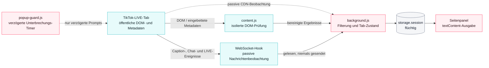

# TikTok LIVE Companion – Dokumentation v0.7.1

**Version:** 0.7.1 · **Dokumentrevision:** v9 · **Status:** in Bearbeitung · **Stand:** 2. August 2026
**Projektwurzel:** `C:\Users\silve\Documents\Codex\TikTok-Live-Companion`
**Veröffentlichter Checkout:** `.publish-repo/` · **Mobile-Worktrees:** `android-implementation/`, `ios-implementation/`
**Kanonische Quelle:** GitHub · `KikiKari/Projects`
**Dokumentationssite:** https://tiktok-live-companion.vercel.app/de

> Dieses unabhängige Projekt ist nicht mit TikTok verbunden und wird nicht von TikTok unterstützt.

### Fortschreibung 02.08.2026 · OPE-97, OPE-98 und OPE-102

Der Browserstand `3476d17c099227f94459d4ace67b5fa338a8e98d` platziert **VLC Ersatz** unter **WebSocket-Hook** rechts neben **Normal**, ordnet **LIVE-Informationen** direkt unter **Seiteninformationen** an und erweitert **Top-Chatter** tab- und streambezogen von fünf auf 15, 25, 35, 45 und höchstens 50 Einträge. Ab 15 Einträgen steht **Reset** links von **mehr…**; die vorhandene Stummschaltung und das bestehende Zuschauer\*innen-Limit bleiben erhalten.

Der gepaarte lokale Dienst ergänzt authentifizierte, idempotente VLC-Status- und Installationsoperationen. Unter Windows wird ausschließlich der aktuelle stabile VideoLAN-x64-Installer von `get.videolan.org` verwendet; SHA-256 und VideoLAN-Authenticode-Signatur werden vor der normalen Windows-Systembestätigung geprüft. Der Installationspfad folgt den offiziellen PowerShell-7.6- und PSScriptAnalyzer-Referenzen.

Android verwendet `org.videolan.android:libvlc-all:3.7.5`, iOS `MobileVLCKit 3.7.3`. Im mobilen Player-Tab stehen ohne zusätzliche Beschreibung **VLC Ersatz** und darunter **VLC Player**. Der erste Button schaltet zwischen WebView und eingebettetem VLC um; der zweite übergibt die beste erkannte Media-URL an die externe VLC-App und öffnet bei fehlender App ausschließlich den offiziellen Store-Eintrag. Der Zustand wird beim Streamwechsel zurückgesetzt. iOS ist durch den vollständigen Actions-Lauf `30748478805` bestätigt. Android-Lauf `30748539909` erzeugte die APK; der abschließende Fehler ist ausschließlich das getrennt geführte OPE-94-Strukturgate. Lauf `30749884929` übernahm genau dieses APK-Artefakt ohne Neubau in das bestehende Prerelease.

### Fortschreibung 01.08.2026 · in Bearbeitung

Aktiv bearbeitet werden `0PE-73`, `0PE-78`, `0PE-79`, `0PE-85`, `0PE-86`, `0PE-87`, `0PE-88`, `0PE-89` und `0PE-90`. Browserseitig sind die neue Sidepanel-Reihenfolge, die Auswahl der größten sichtbaren zentralen Playerfläche, tabbezogener Laufzeitzustand und MV3-Offscreen-TTS lokal umgesetzt. Der vorhandene Sprachdienst nutzt weiterhin Setup, Startskript und Protokollhandler; Pairing wird nach dem einmaligen Setup über einen kurzlebigen lokalen Nonce übernommen. Deutsch und Englisch bleiben Standard, weitere bestätigte Stimmen werden erst bei Auswahl installiert. Android entfernt die zwei exakt bezeichneten Hinweise; iOS sichert deren Abwesenheit und verwendet `CURRENT_PROJECT_VERSION = 8` als Quelle von `CFBundleVersion`.

Browser-Implementierung und reproduzierbare Release-Artefakte sind ab Commit `35a06518658a6e5062de989758b89613e439fe5d` belegt; der bestätigte Browser-Dokumentationsstand ist `130200525305e62cd57bf0c4a8073ec9defaa421`. Android steht auf `80d3cb1368c09875be6697021b21c1bc04c79870`, iOS auf `2323a6faa6526ad9057bccf81253306b224c62c4`. GitHub Releases und die drei GHCR-Tags sind mit diesen Ständen aktualisiert. Das formale Security-Seal ist abgeschlossen. Als getrennte Gates bleiben das neue Vercel-Deployment und die reale Browserabnahme bestehen.

---

## Inhalt

1. [Überblick und Plattformmatrix](#1-überblick-und-plattformmatrix)
2. [Installation](#2-installation)
3. [Funktionen](#3-funktionen)
4. [Architektur](#4-architektur)
5. [Sprachdienst, Songerkennung und Token-Dienst](#5-sprachdienst-songerkennung-und-token-dienst)
6. [Sicherheit und Datenschutz](#6-sicherheit-und-datenschutz)
7. [Entwicklungsumgebung, CI und Auslieferungswege](#7-entwicklungsumgebung-ci-und-auslieferungswege)
8. [Fehlerbehebung](#8-fehlerbehebung)
9. [Downloads, Release und Abnahme](#9-downloads-release-und-abnahme)

---

## 1. Überblick und Plattformmatrix

TikTok LIVE Companion macht öffentliche TikTok-LIVE-Streams zugänglicher: bereinigter Chattext, natürliches Vorlesen, Top-Chatter, beobachtete Personen, Geschenkzählung, Untertitelprüfung, LIVE-Werte, Seiteninformationen mit Badge-Erkennung, Playersteuerung, optionale Songerkennung, digitaler Pegelschutz und FLV-/HLS-Links.

Mit 0.7.1 stehen **alle drei Plattformen auf demselben Versions- und Artefaktstand**. Die Konsolidierung war das eigentliche Ziel dieses Release: Browser-Erweiterung, lokaler Windows-Sprachdienst, Codex-Plugin, Android-/HyperOS-App und iOS-Quellprojekt tragen dieselbe Versionsnummer, dieselbe Prüfsummendatei und denselben Dokumentationsstand.

### Plattformmatrix 0.7.1

| Plattform | Technik | Songerkennung | Branch | Branchspitze |
|---|---|---|---|---|
| Edge / Chrome | Manifest V3 Erweiterung + lokaler Windows-Dienst | AudD auf Knopfdruck | `TikTok-Live-Companion` | Implementierung `35a0651` |
| Android / HyperOS | Kotlin + Jetpack Compose + AndroidX WebKit, `minSdk 21` | ShazamKit (AAR) | `TikTok-Live-Companion-Android` | `80d3cb1` |
| iOS 15+ | SwiftUI + WKWebView + ShazamKit | ShazamKit | `TikTok-Live-Companion-iOS` | `2323a6f` |

Android `80d3cb1`, iOS `2323a6f` und der Browser-Dokumentationsstand `ad1fef6` sind gepusht und gegen das Remote bestätigt. Die fachliche Browser-Implementierung ist separat als `35a0651` nachvollziehbar.

### Was 0.7.1 gegenüber 0.7.0 ändert

| Bereich | Änderung |
|---|---|
| Seiteninformationen | **Refresh** und **Force** binden Streamname, Hostprofil und Badges nach einem Streamwechsel im selben Tab neu an den aktuellen Handle. Alte Badge-Zustände werden nicht in den neuen Stream vererbt. |
| Badge-Erkennung | `Live Pro`, `Werbeinhalt` und `Bezahlte Partnerschaft` werden getrennt erkannt und getrennt angezeigt. |
| Untertitel | Caption-Koaleszierung sowie Deduplikation über DOM **und** WebSocket; Playertext und Datenstrom bleiben als getrennte Quellen sichtbar. |
| Chat-Sprachausgabe | **Game Mode** filtert Nickname-Spam vor der Ausgabe; unmittelbare 1:1-Duplikate werden im Vorleseweg unterdrückt. |
| Stimmen | Die persistente 3+3-Stimmauswahl aus `0PE-71` ist laut aktuellem Linear-Stand abgeschlossen. `0PE-86` ergänzt ausschließlich bestätigte, bei Auswahl installierte Sherpa-Modelle; nicht verifizierte Sprachen werden nicht angeboten. |
| Lautstärke und Pegelschutz | Sichtbar als positive Werte **0–100**, dauerhaft gespeichert. Negative dBFS-Werte bleiben ausschließlich intern. Der Lautstärkedeckel ist entfallen. |
| Oberfläche | Die Qualitätsbox und sechs Erklärungstexte wurden ersatzlos entfernt, ohne leere Container zu hinterlassen. TikToks eigenes Qualitätsmenü bleibt unberührt. |
| Verbindung | Auto-Reconnect mit Mindest-Cooldown von `400 ms`, scharfgestellt erst nach Player-Start. |
| Stabilität der Seite | `popup-guard.js` unterdrückt auf LIVE- und Embed-Seiten ausschließlich verzögerte Unterbrechungs-Timer (Login-, Watch-Limit- und App-Prompts). |
| Sprachwahl | Deutsche Sonderzeichen erzwingen `de-DE`. |
| Dienststart | Startbutton erkennt einen laufenden Dienst und startet installierte Setups über `tiktok-live-companion://start`; `npm start` bleibt der verlässliche Weg. Die Zuverlässigkeit des Buttons wird unter `0PE-73` weiter bearbeitet. |
| Mobil | Android und iOS übernehmen Chat/Game-Mode, TTS-Dedupe, Pegelschutz, `400 ms`-Auto-Reconnect, Cache-Refresh ohne Cookie-Verlust und die bessere Auswahl VLC-kompatibler Links. |

### Warum native Apps

ShazamKit ist ein natives SDK und keine Web- oder PWA-API. Es lässt sich weder aus einer Chrome-Erweiterung noch aus einer PWA aufrufen. Apple unterstützt die eigenen Plattformen sowie ein Android-AAR; auf Android werden Kotlin, mindestens API 21, ein Apple-Developer-Token und unterstütztes PCM-Audio verlangt. Eine reine PWA reicht daher nicht aus — die zusätzlichen Branches sind technisch notwendig, nicht optional.

Die Browser-Erweiterung behält AudD. ShazamKit wird dort nicht nachgerüstet.

### Grenzen

Die Erweiterung erzeugt keine Untertitel selbst. Fehlen TikToks native Caption-Ereignisse, kann sie diese nicht erzwingen. Der WebSocket-Bridge-Inhalt ist ein Beobachtungsprotokoll und kein kryptografisch authentifizierter Nachweis. Der Pegel wird intern in dBFS gemessen; ohne kalibriertes Ausgabegerät kann kein dB-SPL-Wert am Ohr garantiert werden. `popup-guard.js` unterdrückt keine synchron eingehängten Overlays und keine serverseitig erzwungenen Weiterleitungen. Das Beenden des Vollbildmodus schließt derzeit die Ansicht der Erweiterung mit (siehe Abschnitt 3.5).

Es werden keine Cookies gelesen, kein Konto benötigt und kein API-Key in der Erweiterung gespeichert.

---

## 2. Installation

### 2.1 Browser

**Voraussetzungen:** Microsoft Edge oder Google Chrome ab Version 114, ein öffentlicher TikTok-LIVE-Tab.

1. `tiktok-live-companion-extension-0.7.1.zip` entpacken.
2. `edge://extensions` oder `chrome://extensions` öffnen.
3. **Entwicklermodus** aktivieren.
4. **Entpackte Erweiterung laden** wählen.
5. Den Ordner auswählen, in dem `manifest.json` liegt.
6. Einen öffentlichen TikTok-LIVE-Tab öffnen und auf das Erweiterungssymbol klicken.
7. **Hook setzen**, bevor der Player seine WebSocket-Verbindung aufbaut.

Das Manifest führt Version `0.7.1`. Nach einem Update aus einem älteren Ordner die Erweiterung entfernen und neu laden, damit `edge://extensions` nicht weiterhin `0.7.0` anzeigt.

### 2.2 Lokaler Sprach- und Songdienst

Der Dienst ist Teil des Extension-ZIPs und zusätzlich als eigenes Archiv verfügbar.

1. Im Sidepanel **Sprachdienst starten** wählen. Falls die einmalige Einrichtung fehlt, erscheint ausschließlich **Installation abschließen!**; weder Shell-Befehle noch die Erweiterungs-ID werden angezeigt.
2. **Installation abschließen!** öffnet PowerShell im tatsächlichen Dienstverzeichnis und führt das Setup mit der richtigen Erweiterungs-ID aus.
3. Das Setup installiert die Standardstimmen, registriert den lokalen Starter und startet den Dienst automatisch. Ein bereits laufender Dienst wird erkannt und nicht doppelt gestartet.
4. Der Pairing-Code wird über einen kurzlebigen, einmaligen Nonce automatisch in das Sidepanel übernommen; nach erfolgreichem Health-Check verschwindet der Installationsbutton.
5. Spätere Buttonklicks prüfen den Health-Endpunkt und verwenden danach `tiktok-live-companion://start`.

Der Dienst lauscht ausschließlich auf `127.0.0.1:43117` und benötigt Node.js ab Version 20.

### 2.3 Android / HyperOS

| Datei | Inhalt |
|---|---|
| `tiktok-live-companion-android-0.7.1.apk` | auslieferbare APK, Package-ID `app.tiktoklivecompanion.android`, 18,8 MiB |
| `tiktok-live-companion-android-0.7.1-source.zip` | vollständiger Quellcode |

Es werden ausschließlich Android-Standard-APIs ohne Google-Play-Services-Abhängigkeit verwendet, damit HyperOS unterstützt bleibt.

Die ausgelieferte APK verwendet die **Mock-Variante** der Erkennung und zeigt transparent „ShazamKit nicht konfiguriert". Für echte Erkennung muss das ShazamKit-AAR unter `mobile/android/app/libs/` abgelegt und die Shazam-Produktvariante gebaut werden.

Die APK trägt in 0.7.1 bewusst die Package-ID der Haupt-App und **nicht** mehr eine `.test`-Kennung, damit sie eine vorhandene Installation ersetzt statt daneben zu installieren.

### 2.4 iOS

Auslieferung als vollständiges Xcode-Projekt und Quellarchiv `tiktok-live-companion-ios-0.7.1-source.zip`.

**Kein IPA** — unter Windows ist weder ein Xcode-Build noch eine Apple-Signierung möglich. Für Build und XCTest werden macOS und Xcode benötigt. Ein GitHub-Actions-Workflow deckt Simulator-Build und Tests auf `macos-15` ab (siehe Abschnitt 7).

Für echte Katalogerkennung sind Apple-Developer-Team, aktivierte ShazamKit-App-Capability, Media-ID und privater Schlüssel erforderlich.

### 2.5 Erster Einsatz

1. **Seite prüfen** liest Caption-Metadaten, sichtbare Bedienelemente, Badges und Stream-Informationen.
2. **Untertitel aktivieren** betätigt nur einen eindeutig erkannten TikTok-Menüpunkt.
3. **Hook setzen** registriert die Beobachtung vor dem Player-Code und lädt neu.
4. Danach erscheinen Chat-, Caption- und LIVE-Ereignisse, sofern TikTok sie liefert.
5. Nach einem Streamwechsel im selben Tab **Refresh** unter Seiteninformationen verwenden.

---

## 3. Funktionen

### 3.1 Chat und Vorlesen

Öffentliche Chatnachrichten werden bereinigt und als zugänglicher Text dargestellt. Emoji-Sequenzen und sicher erkannte, pro Stream feste Teamkürzel werden beim Vorlesen entfernt. `@`-Empfänger und Fragen werden natürlich formuliert.

**Formulierungsbeispiele:**

| Chatzeile | Gesprochene Ausgabe |
|---|---|
| `Miimii tmm: @Stivinho danke` | Miimii sagt zu Stivinho danke |
| `Blitzerbiest: @Honey tmm wo is mein Tee ?` | Blitzerbiest fragt Honey wo is mein Tee |

**Teamkürzel-Heuristik:** genau eine dreistellige alphanumerische Zeichenfolge pro Stream — als Suffix bei mindestens zwei verschiedenen Namen oder bei einem Namen zuzüglich eigenständigem Vorkommen im Chat. Häufige gewöhnliche Drei-Buchstaben-Wörter genügen nicht. Bei Streamwechsel wird zurückgesetzt.

**Game Mode.** Wiederkehrender Nickname-Spam wird vor der Sprachausgabe gefiltert, damit Spielrunden mit vielen identischen Zurufen hörbar bleiben. Die Chatanzeige bleibt vollständig.

**TTS-Deduplikation.** Unmittelbare 1:1-Wiederholungen derselben gesprochenen Zeichenfolge werden innerhalb eines kurzen Fensters unterdrückt. Abgewiesene Duplikate verlängern das Fenster nicht.

### 3.2 Sprechfreundliche Nicknamen

Reine **Ausgabetransformation**. Chat-Anzeige und Statistik behalten immer den Originalnamen; nur die gesprochene Form wird normalisiert. Dieselbe Reduktion gilt für `@`-Empfänger in fremden Antworten.

| Regel | Beispiel | Gesprochen |
|---|---|---|
| Sonderzeichen und Zahlen entfallen | `liane15` | liane |
| Punkt-getrennte Namen auf Hauptteil | `Traumtänzer.der.Nächte` | Traumtänzer |
| Unterstrich-Namen auf Hauptteil | `Vanny_GioPrimetv` | Vanny |
| Artikel entfallen | `Die Löwin` | Löwin |
| Präfixkürzel entfallen | `MKU Maskenaufsicht` | Maskenaufsicht |
| Ziffernsuffix entfällt, Schreibweise bleibt | `Butterfly 004` | Butterfly |
| Systemnamen auf höchstens drei Ziffern | `user5728384…` | user572 |
| Lachspam wird zusammengefasst | `hahahahahahahhhhahhhaaaa` | haha |

Die Kürzung greift nur, wenn ein klarer erster alphabetischer Hauptteil vorhanden ist. Generische Präfixe wie „Team", „Official" oder „The" sowie einteilige Namen bleiben unverändert.

**TTS- und Chat-Einstellungen:** Sprache `Auto` / `Deutsch` / `Englisch`; persistente Stimmauswahl aus den Stimmen des lokalen Dienstes; `Chatnamen sprechen` (Standard: an); `Chatnamen kürzen` (Standard: aus, nur bei aktivierten Chatnamen verfügbar); `Game-Mode`; `Auto-Chat Refresh` mit 1 bis 60 Minuten; `Permanent aktiv`. Pro Tab bleiben die neuesten 500 Chatzeilen erhalten. Der anklickbare rote Zähler öffnet sie neueste zuerst in einer eigenen Übersicht; die Hauptansicht bleibt auf fünf Zeilen begrenzt. Auto-Chat Refresh leert nur die Chatanzeige und löst keinen Tab-Reload aus.

Enthält eine Zeile deutsche Sonderzeichen, wird `de-DE` erzwungen, auch wenn `Auto` gewählt ist.

### 3.3 Lautstärke und Pegelschutz

Lautstärke und Schutzstärke werden als positive Werte **0–100** angezeigt und dauerhaft gespeichert. `0` ist stumm, `100` entspricht dem normalen Maximalpegel.

Der Pegelschutz arbeitet mit Verhältnis `20:1`, `1 ms` Attack und `80 ms` Release. Ein deaktivierter Pegelschutz stellt den unveränderten Bypass wieder her. Negative dBFS-Werte bleiben ausschließlich interne Rechengröße und erscheinen nicht in der Oberfläche. Der frühere Lautstärkedeckel oberhalb 50 % ist entfallen.

In der Abnahme wurde die Wirkung mit `OfflineAudioContext` gegen synthetische Signale geprüft: Dauerpegel praktisch unverändert, eine Spitze von `1,0` auf `0,17188` begrenzt, genau ein Ausgang, kein Fallback auf einen Lautstärkedeckel.

### 3.4 Top-Chatter und beobachtete Personen

Pro Stream werden Nachrichten, Wörter und Geschenkereignisse für bis zu 5.000 im Chat sichtbare Personen gezählt. Die Top-Chatter-Box zeigt zunächst die fünf führenden Personen mit Nachrichten- und Wortzahl sowie einer Stream-Mute-Checkbox, sortiert nach Nachrichtenzahl, dann Wortzahl, dann Name. **mehr…** erweitert tab- und streambezogen auf 15, 25, 35, 45 und höchstens 50 Einträge; **Reset** stellt sofort fünf Einträge wieder her. Darüber steht das erkannte Teamkürzel.

Der Button **Zuschauer\*innen** öffnet das Modal „Im Chat beobachtete Personen": Name, Nachrichten, Wörter, Geschenkereignisse, summierte `gesendet`-Anzahl, zuletzt gesehen und Mute-Modus je Person.

**Mute-Modi:** `Aktiv`, `Stream stumm`, `Dauerhaft stumm`. Stream-Mutes werden beim Streamwechsel verworfen, dauerhafte Mutes bleiben lokal gespeichert. Stummgeschaltete Personen werden weiterhin angezeigt und gezählt, aber nicht vorgelesen.

Die Liste ist ausdrücklich keine vollständige TikTok-Zuschauerliste, sondern die Menge der im Chat beobachteten Personen. TikToks WebSocket liefert nur aggregierte Zuschauerzahlen.

### 3.5 Untertitel, LIVE-Werte, Seiteninformationen, Player

Die Oberfläche trennt drei Signale: angekündigte Caption-Funktion in `caption_info`, gefundener Menüpunkt und tatsächlich empfangene `WebcastCaptionMessage`-Ereignisse. Fehlende Ereignisse beweisen nicht, dass nie gesprochen wurde. Playertext und Datenstrom bleiben getrennt sichtbar; identische Inhalte aus beiden Quellen werden dedupliziert und zusammenhängende Fragmente werden koalesziert.

Der Hook beobachtet `WebcastRoomUserSeqMessage`, `WebcastLikeMessage` und `WebcastSocialMessage`. Angezeigt werden Zuschauerzahl, Aufrufe gesamt, Likes, Follows seit Hook, Teilungen und Follower gesamt. Follows seit Hook sind ein lokaler Ereigniszähler.

**Seiteninformationen** zeigen Streamname, Hostprofil und die getrennt erkannten Badges `Live Pro`, `Werbeinhalt` und `Bezahlte Partnerschaft`. Der Zustand ist an die Stream-Identität des Tabs gebunden: nach einem Wechsel auf einen anderen Stream im gleichen Tab ermitteln **Refresh** und **Force** die Werte für den neuen Handle vollständig neu und verwerfen die alten Badges.

Play/Pause, Neuladen, Lautstärke, Stumm, Bild-in-Bild, Vollbild und Melden-öffnen bedienen TikToks vorhandenen Player.

**Auto-Reconnect** greift mit einem Mindest-Cooldown von `400 ms` und wird erst nach dem Start des Players scharfgestellt, damit ein noch nicht verbundener Player keine Reconnect-Schleife auslöst.

**Vollbild-Rückkehr (Browser, 0PE-89).** Die Speech-Queue und Ausgabe laufen in einem MV3-Offscreen-Dokument weiter. Das neu geöffnete Sidepanel stellt TTS- und Tabzustand nach dem Verlassen des Vollbilds aus dem tabbezogenen Speicher wieder her. Struktur- und Logiktests sind grün; die reale Abnahme mit geladener Erweiterung steht noch aus.

### 3.6 Medienquellen, VLC, Diagnose, Profil-Force

Erkannte FLV-/HLS-Quellen werden als kopierbare Links angezeigt; die Auswahl bevorzugt VLC-kompatible Varianten. Signierte Links können ablaufen und sind bis dahin sensibel.

Die separate Qualitätsbox der Erweiterung ist in 0.7.1 **ersatzlos entfernt**, ebenso sechs Erklärungstexte. Es bleiben keine leeren Container zurück. TikToks eigenes Qualitätsmenü und die interne Medienerkennung sind davon unberührt.

Das Caption-Protokoll lässt sich als JSONL exportieren. Der abschaltbare Debugmodus exportiert bereinigte Ereignisse ohne Chattext, Cookies, API-Keys oder Werte signierter URL-Parameter.

`Force` speichert die LIVE-URL, öffnet bewusst kurz die Profilseite ohne `/live`, übernimmt die dort geladenen öffentlichen Werte und stellt anschließend die LIVE-URL wieder her. Auf Mobilgeräten ist dieser Ablauf zusätzlich mit Popup-Behandlung, Wiederholversuchen, einem 20-Sekunden-Watchdog und manueller Recovery abgesichert.

### 3.7 Funktionsparität auf Mobilgeräten

Volle Funktionsparität wird über **native Entsprechungen** erreicht, nicht über identische Implementierung. Chrome-spezifische APIs haben auf iOS und Android keine Entsprechung und wurden ersetzt:

| Funktion | Browser | Mobil |
|---|---|---|
| Chat, Captions, LIVE-Werte, Geschenke | Content Script + Hook | WebView-Bridge mit versioniertem Schema |
| Sprachausgabe | Web Speech / lokaler Dienst | `AVSpeechSynthesizer` bzw. Android Text-to-Speech |
| Playersteuerung | direkte DOM-Aktion | validierte WebView-Kommandos |
| Flüchtige Streamdaten | `storage.session` | nur Arbeitsspeicher |
| Einstellungen, dauerhafte Mutes | `storage.local` | UserDefaults bzw. DataStore |
| Songerkennung | AudD auf Knopfdruck | ShazamKit |
| Vollbild | Player-Vollbild mit offenem Rückkehrfehler | nativer Vollbildmodus, zweites Antippen schließt ihn wieder (0PE-70 behoben) |
| Bild-in-Bild | vorhanden | Nicht-Ziel, entfernt |

Mit 0.7.1 sind auf Mobilgeräten zusätzlich vorhanden: Top-Chatter mit 5.000er-Limit, vollständige LIVE- und Seiteninformationen, Chat-Bridge mit 50er-Grenze und Fünfer-Queue, persistente TTS-Kernoptionen, Pegelschutz-Einstellungen, Querformat mit 96-dp/pt-Inhaltsreserve und Scroll-Unterstützung sowie kopierbare Media-/VLC-URLs. Im Player-Tab schaltet **VLC Ersatz** auf den eingebetteten LibVLC-/MobileVLCKit-Player; **VLC Player** übergibt dieselbe ausgewählte URL an die externe VLC-App oder deren offiziellen Store-Eintrag. Die Capability-Statusanzeige erscheint ausschließlich im LIVE-Tab und nicht mehr doppelt im Song-Tab.

**Ehrlichkeitsregel:** Funktionen, die eine Plattform oder die TikTok-WebView technisch ablehnt, bleiben sichtbar und zeigen einen eindeutigen Verfügbarkeits- oder Fehlerstatus. Es werden keine scheinbar funktionierenden Attrappen ausgeliefert.

---

## 4. Architektur

### 4.1 Visuelle Dokumentation

Die statische, animierte und interaktive Architekturansicht werden aus demselben projektspezifischen Modell mit 13 Knoten und 12 gerichteten Verbindungen erzeugt. Die Darstellung trennt die Browser-, iOS- und Android-/HyperOS-Pfade räumlich und kennzeichnet passive Beobachtung, ausdrücklich gestartete Audioübertragung und kurzlebige Token getrennt.

[](https://tiktok-live-companion.vercel.app/de/architecture-3d)

- **Interaktiv:** [Three.js-Architektur öffnen](https://tiktok-live-companion.vercel.app/de/architecture-3d) – drehen, zoomen, Knoten auswählen und Tastatursteuerung verwenden.
- **Statisch:** [generiertes SVG öffnen](https://tiktok-live-companion.vercel.app/visualizations/tiktok-live-companion-architecture.svg).
- **Animiert:** [generiertes 36-Frame-GIF öffnen](https://tiktok-live-companion.vercel.app/visualizations/tiktok-live-companion-architecture.gif).
- **Quellen:** `assets/flow_model.py`, `assets/gen_tiktok_live_companion_flow.py` und `assets/gen_tiktok_live_companion_flow_gif.py`.
- **Vertrag:** `docs/diagrams/tiktok-live-companion-visualization-contract.md` legt Farben, Datenfluss, Textalternative und Herkunft fest.


Das Mobile-Bild ist die verbindliche UI-Spezifikation und wurde für 0.7.1 nicht neu erzeugt. Die Architekturvisualisierung ist eine Dokumentationsansicht und keine fremde eingebettete Anwendung. Sie lädt keine Remote-Daten und enthält keine Telemetrie.

### 4.2 Browser-Erweiterung

| Datei | Aufgabe |
|---|---|
| `content-core.js` | reine Normalisierung, Namens- und Metadatenanalyse |
| `content.js` | DOM-Prüfung, Badge- und Identitätsbindung, lokale Player-/Audioaktionen in der isolierten Welt |
| `proto-main.js` | minimaler Protobuf-Decoder für öffentliche LIVE-Ereignisse |
| `hook.js` | MAIN-World-WebSocket-Proxy, der nur Listener ergänzt |
| `popup-guard.js` | unterdrückt auf LIVE-/Embed-Seiten ausschließlich verzögerte Unterbrechungs-Timer |
| `background.js` | passives CDN-Monitoring und flüchtiger Tab-Zustand |
| `sidepanel.*` | lokale Darstellung, Export- und Kopieraktionen |

Content Scripts laufen bei `document_start` und ausschließlich auf `https://www.tiktok.com/*`. Der Hook ersetzt `WebSocket.send()` nicht. Seiteninhalte gelten als nicht vertrauenswürdig und werden mit `textContent` ausgegeben.

**Zu `popup-guard.js`:** Der Wächter ersetzt `window.setTimeout` und `window.setInterval` und verwirft einen Aufruf nur dann, wenn alle Bedingungen zugleich gelten — LIVE- oder Embed-Pfad, Verzögerung ab `5000 ms` und ein Callback-Quelltext, der auf ein bekanntes Unterbrechungsmuster passt (Login-Modal, Watch-/Browse-Limit, „Continue watching", App-Prompt). Alle anderen Timer laufen unverändert. Es wird kein DOM entfernt und keine Netzwerkanfrage blockiert.

### 4.3 Datenfluss



Quelle: `docs/diagrams/architecture.mmd`

**Textalternative:** Der TikTok-Tab liefert öffentliche DOM-/Metadaten an das isolierte Content Script und beobachtete WebSocket-Ereignisse an den MAIN-World-Hook. Ein Popup-Wächter verwirft ausschließlich verzögerte Unterbrechungs-Timer derselben Seite. Content Script und Hook leiten bereinigte Ergebnisse an den Service Worker weiter. Dieser speichert den Zustand flüchtig pro Tab und sendet ihn an das Seitenpanel. CDN-Anfragen werden ausschließlich passiv beobachtet.

### 4.4 Lokaler Begleitdienst (Windows)

Node.js-Dienst ab Version 20, gebunden ausschließlich an `127.0.0.1:43117`. Sprachsynthese über installierte Windows-DE-/EN-Stimmen mittels fester PowerShell-Synthese sowie optional über installierte Sherpa-ONNX-Stimmen.

| Endpunkt | Beschreibung |
|---|---|
| `GET /v1/health` | Statusprüfung inklusive `sherpaConfigured` |
| `GET /v1/voices` | verfügbare Stimmen mit `id`, `name`, `culture`, `gender`, `age` |
| `GET /v1/config` | Dienstkonfiguration ohne Geheimnisse |
| `POST /v1/tts` | Text plus `auto` \| `de-DE` \| `en-US` und optionale Stimm-ID; Antwort `audio/wav` |
| `POST /v1/sherpa` | Installation und Statusabfrage der Sherpa-ONNX-Komponente |
| `POST /v1/recognize` | kurzer Audioausschnitt; Antwort mit Titel, Interpret, Album, Link, Erkennungsstatus |

| Skript | Zweck |
|---|---|
| `setup.ps1` | Erstkonfiguration, Pairing-Code, optionales AudD-Token |
| `install-sherpa.ps1` | Installation der Sherpa-ONNX-Stimmen |
| `voices.ps1` | Aufzählung der installierten Systemstimmen |
| `synthesize.ps1` | Sprachsynthese für `POST /v1/tts` |

Der Sherpa-Button im Sidepanel folgt `health.sherpaConfigured`: bei installierter Komponente erscheint er als deaktiviertes `Sherpa aktiv!`, nur bei fehlender Installation bleibt `Sherpa installieren` ausführbar.

### 4.5 WebView-Bridge (mobil)

Gemeinsame Quelle: `plugin-source/mobile-shared/webview-bridge.js`, identisch kopiert nach `mobile/ios/Resources/` und `mobile/android/app/src/main/res/raw/`. Die Kopiengleichheit wird automatisiert geprüft.

Nachrichtenschema mit `type`, `streamId`, `sequence`, `timestamp` und validiertem `payload`.

**Sicherheitsgrenzen:**

- WebViews laden ausschließlich HTTPS-Seiten unter `www.tiktok.com`; externe Navigation öffnet den Systembrowser.
- Die Bridge ist auf Hauptframe und erlaubte Origin beschränkt.
- Nachrichtengröße auf 64 KiB begrenzt.
- Cleartext-Verkehr ist verboten.
- Kein Zugriff auf Cookies, Schlüssel oder beliebige native Methoden.

iOS injiziert per `WKUserScript` zum Dokumentstart. Android verwendet AndroidX WebKit mit origin-beschränktem `WebMessageListener` statt `addJavascriptInterface`.

### 4.6 Projektstruktur der nativen Apps

| Pfad | Inhalt |
|---|---|
| `mobile/ios/TikTokLiveCompanion/` | SwiftUI-App: `CompanionState`, `CompanionWebView`, `BridgeValidator`, `RecognitionService`, `Models` |
| `mobile/ios/TikTokLiveCompanionTests/` | XCTest für Bridge, Zustand und UI-Struktur (`MobileUIStructureTests.swift`) |
| `mobile/ios/TikTokLiveCompanion.xcodeproj/` | Xcode-Projekt inklusive geteiltem Scheme unter `xcshareddata/xcschemes/` |
| `mobile/android/app/src/main/java/app/tiktoklivecompanion/` | Compose-App: `MainActivity`, `CompanionViewModel`, `CompanionWebView`, `BridgeValidator`, `CompanionPreferences` |
| `mobile/android/app/src/mock/` | Mock-Erkennung ohne ShazamKit |
| `mobile/android/app/src/shazam/` | echte ShazamKit-Anbindung |
| `mobile/android/app/src/test/` | JUnit- und Robolectric-Tests |
| `mobile/android/app/libs/` | Ablageort für das ShazamKit-AAR (nicht eingecheckt) |

### 4.7 Berechtigungen (Manifest V3)

**Permissions:** `activeTab`, `scripting`, `sidePanel`, `storage`, `tabCapture`, `tabs`, `webRequest`

**Host-Permissions:** `https://www.tiktok.com/*`, `http://127.0.0.1/*`, `http://localhost/*`, `*://*.tiktokcdn.com/*`, `*://*.tiktokcdn-eu.com/*`, `*://*.tiktokcdn-us.com/*`, `*://*.tiktokcdn-in.com/*`, `*://*.ttlivecdn.com/*`

Unverändert gegenüber 0.7.0. Keine Cookie-Berechtigung. `webRequest` ohne `webRequestBlocking`.

---

## 5. Sprachdienst, Songerkennung und Token-Dienst

### 5.1 Sprachausgabe

Drei Wege, in dieser Rangfolge:

1. **Lokaler Dienst mit Sherpa-ONNX-Stimmen** — höchste Qualität, vollständig lokal, benötigt die installierte Sherpa-Komponente.
2. **Lokaler Dienst mit Windows-Systemstimmen** — DE-/EN-Stimmen über feste PowerShell-Synthese.
3. **Web Speech im Browser** — Rückfallebene ohne laufenden Dienst.

Die gewählte Stimme wird in der Erweiterung gespeichert und bleibt über Sitzungen hinweg erhalten. Die Stimmliste stammt aus `GET /v1/voices`. Deutsche und englische Stimmen stehen zuerst, beginnend mit Sherpa Eva; weitere bestätigte Modelle sind in die Bereiche **Kyrillisch**, **Asiatisch**, **Abjad** und **Indisch** getrennt. Der Installationsstatus verändert diese feste Reihenfolge nicht.

Das unter `0PE-71` spezifizierte Dropdown mit genau sechs Profilen wird in Linear seit 01.08.2026 als `Done` geführt. Die Erweiterung unter `0PE-86` betrifft zusätzliche bestätigte Schriftsysteme und verändert diesen Abschlussstatus nicht.

### 5.2 Browser: AudD

Nach ausdrücklicher Aktivierung und Klick nimmt die Erweiterung etwa zwölf Sekunden Tab-Audio auf. Das Tab-Audio bleibt während der Aufnahme hörbar. Der lokale Dienst sendet nur diesen Ausschnitt an AudD und löscht temporäre Audiodaten unmittelbar nach Erfolg oder Fehler. Ohne Klick findet keine Aufnahme oder Übertragung statt. Eine automatische Dauerüberwachung ist nicht enthalten.

Pairing-Code und AudD-Token werden vor dem Speichern geprüft; ungültige, deaktivierte oder nicht prüfbare Werte werden verworfen. Sind Sprachdienst und Sherpa aktiv, blendet das Sidepanel beide Eingabefelder aus. Zum späteren Ändern oder erneuten Setzen von Pairing-Code oder AudD-Token wird das Plugin entfernt und neu hinzugefügt; anschließend erscheinen die Einrichtungsfelder wieder.

Die Oberfläche weist vor der ersten Nutzung ausdrücklich auf die externe Übertragung und mögliche Anbietergebühren hin.

### 5.3 Mobil: ShazamKit

Zwei Quellen, beide ausschließlich nach Nutzeraktion:

- **Mikrofon** — der stabile, offiziell dokumentierte Pfad.
- **WebView (experimentell)** — Versuch, unterstützte PCM-Puffer aus dem eingebetteten Player zu übergeben. Bei CORS-, Codec-, WebView- oder Plattformfehlern wird die Quelle beendet und der Mikrofon-Fallback angeboten.

Die gewählte Quelle wird nativ persistiert (UserDefaults bzw. DataStore).

### 5.4 Token-Dienst

`POST https://tiktok-live-companion.vercel.app/api/shazam-token`
Implementierung: `site/api/shazam-token.mjs`

- **Antwort:** `{ "token": "...", "expiresAt": "ISO-8601" }`
- **Fehlercodes:** `not_configured`, `rate_limited`, `signing_failed`
- Kurzlebige ES256-Tokens. Team-ID, Key-ID, Media-ID und privater Media-Services-Key liegen ausschließlich in Vercel-Umgebungsvariablen.
- Antworten und Logs enthalten niemals den privaten Schlüssel.
- Rate-Limit aktiv.
- Die SPA-Rewrite-Regel fängt `/api` nicht ab.
- Android nutzt einen cachefähigen `DeveloperTokenProvider`; iOS nutzt die aktivierte ShazamKit-App-Capability.

### 5.5 Gemeinsames Ergebnismodell

Schema: `plugin-source/mobile-shared/recognition-result.schema.json`

`matched`, `title`, `artist`, optional `album`, `artworkUrl`, `songUrl`, `matchOffset` und `source` (`microphone` oder `webview`). Links werden vor dem Öffnen auf HTTPS validiert.

### 5.6 Nicht eingecheckt

ShazamKit-AAR, Sherpa-ONNX-Modelldateien und Apple-Schlüsselmaterial werden aus Lizenz-, Größen- und Geheimhaltungsgründen nicht in Git aufgenommen. Die Release-Archive wurden automatisiert darauf geprüft, dass sie weder AAR noch `.p8`-Schlüssel noch Build-Caches enthalten.

---

## 6. Sicherheit und Datenschutz

### 6.1 Bisheriges formales Release-Gate

Der formale Codex-Security-Scan vom 17. Juli 2026 hat alle neun Prüfumfänge abgeschlossen. Ergebnis: **0 Critical, 0 High, 0 Medium, 2 Low/P3** — Bezug: Version 0.5.0. Das zugehörige Linear-Issue `0PE-42` ist seit dem 18.07.2026 `Done`; die Freigabe gilt ausdrücklich für die unveränderten 0.5.0-Artefakte.

Die beiden Low/P3-Findings betreffen `proto-main.js:208-227` (unbegrenzte gzip-Ausgabe und Decode-Parallelität) und `content.js:696-708` (byte-unbegrenzte Page-Bridge-Ereignisse). Beide sind als Linear-Issues 0PE-41 und 0PE-43 geführt und weiterhin offen.

### 6.2 Prüfdokumente

| Datei | Inhalt |
|---|---|
| `security-scan/final/` | Abschlussbericht, Findings, SARIF, Coverage, Manifest zu 0.5.0 |
| `security-scan/threat_model.md` | Threat Model Browser |
| `security-scan/threat_model_0.7.0.md` | Threat Model für WebView-Bridges, Token-Endpunkt, Audiofluss |
| `security-scan/release-review-0.7.0.md` | Release-Review 0.7.0 |
| `security-scan/canonical/`, `derived/`, `artifacts/` | Scan-Zwischenstände |

**0.7.1-Diffprüfung:** Der aktuelle Diff wurde vollständig inventarisiert. Zwei Low/P3-Befunde wurden bestätigt und vor Paketierung behoben: Bootstrap-Pairing ohne Bindung an die Produkt-Extension sowie fehlende Größen-/SHA-256- und Link-/Pfadkontrollen bei Sherpa-Archiven. 15/15 Diensttests und die Extension-Prüfung bestätigen die Gegenmaßnahmen. Der Versiegler wurde nach Freigabe der Schreibrechte erfolgreich abgeschlossen; das kanonische Ergebnis lautet **0 Critical, 0 High, 0 Medium, 2 Low/P3**, beide Befunde behoben.

### 6.3 Automatisierte Sicherheitsprüfungen

Statisch geprüft und ausgeschlossen: `addJavascriptInterface`, `setAllowUniversalAccessFromFileURLs`, `setAllowFileAccessFromFileURLs`, Cleartext-`http://`, `document.cookie`, `localStorage`, `sessionStorage`, `innerHTML`, `eval(`, `new Function`, eingebettete private Schlüssel.

Geprüft und bestätigt: Origin- und Hauptframe-Beschränkung, 64-KiB-Schemagrenze, identische Bridge-Kopien, Ausschluss von AAR und Apple-Schlüsseln aus allen Archiven, vollständige Entfernung der Qualitätsbox und der sechs Texte ohne leere Container, persistente 0–100-Regler, Caption-Koaleszierung, DOM-/WebSocket-Deduplikation, persistenter Menüstatus, zielgerichtete Tabaufnahme und Fehlerklassifikation.

### 6.4 Sicherheitskontrollen

- keine Cookie-Berechtigung und kein Zugriff auf `document.cookie`;
- keine Telemetrie oder Remote-Skripte;
- kein `eval`, `new Function` oder Zuweisung an `innerHTML`;
- `webRequest` ohne `webRequestBlocking`;
- maximal 50 bereinigte Chatnachrichten pro Tab, mobil zusätzlich Fünfer-Queue;
- der Begleitdienst bindet nur an `127.0.0.1` und erzwingt Pairing, Origin-Prüfung und Größenlimits;
- die Dienstadresse akzeptiert ausschließlich echte Loopback-URLs;
- `popup-guard.js` wirkt nur auf LIVE-/Embed-Pfade, nur ab `5000 ms` Verzögerung und nur bei passendem Callback-Muster;
- der Meldedialog wird nur geöffnet und nie automatisch ausgefüllt oder abgesendet;
- die Apps automatisieren weder Anmeldung noch Meldungen und lesen keine Cookies.

### 6.5 Datenhaltung

| Inhalt | Browser | Mobil |
|---|---|---|
| Stream, Chat, Captions, Teilnehmer, Diagnose | `chrome.storage.session` | nur Arbeitsspeicher |
| Einstellungen, Stimmauswahl, 0–100-Regler, dauerhafte Mutes | `chrome.storage.local` | UserDefaults / DataStore |
| Pairing-Code, Dienstadresse | `chrome.storage.local` | entfällt |
| AudD-Token | lokale Dienstkonfiguration unter `%LOCALAPPDATA%` | entfällt |
| Sherpa-Modelldateien | lokaler Dienstpfad | entfällt |
| Apple-Schlüsselmaterial | entfällt | ausschließlich Vercel-Umgebungsvariablen |

### 6.6 Offene Restrisiken

- Ein Seitenskript kann die `postMessage`-Bridge imitieren.
- Signierte Medien-URLs können während ihrer Gültigkeit Zugriff ermöglichen.
- TikTok kann DOM, CDN-Domains, Kompression oder Protobuf-Felder ändern und damit Fehlnegative verursachen.
- Browser und Plattformen können Vollbild oder Web-Audio-Routing ablehnen.
- Ändert TikTok die Benennung seiner Unterbrechungs-Timer, greift `popup-guard.js` nicht mehr; falsch positive Treffer sind bei ungünstiger Minifizierung nicht vollständig auszuschließen.
- Die drei GHCR-Container-Pakete stehen auf `public` und sind damit ohne Anmeldung abrufbar; sie enthalten ausschließlich die bereits veröffentlichten Release-Artefakte unter `/artifacts`.

Der öffentliche Sicherheitsabschnitt enthält keine Proof-of-Concepts und keine gültigen signierten URLs.

---

## 7. Entwicklungsumgebung, CI und Auslieferungswege

### 7.1 Persistente Container-Entwicklungsumgebung

Die Android-Builds und die Dokumentationssite laufen in einem dauerhaften Docker-Setup statt in einer Wegwerf-Sandbox.

| Element | Wert |
|---|---|
| Container | `tlc-cde-cde-1`, Image `tlc-cde:full` |
| Restart-Policy | `unless-stopped` |
| Arbeitsverzeichnis | `.publish-repo` als `/workspace` |
| Compose | `.cde-current.compose.yml` |
| Android-SDK | `ANDROID_HOME=/opt/android-sdk`, Java 17, Build-Tools 35 |
| Persistente Volumes | `tlc-cde_tlc-android-sdk` → `/opt/android-sdk`, `tlc-gradle-cache`, `tlc-site-node-modules` |
| Site-Vorschau | `http://localhost:5173/de`, HTTP 200 bestätigt |
| Zusätzliche CLIs | `gh`, `vercel` im Image installiert und per `docker commit` festgeschrieben |

Lokal auf Windows sind `gh 2.76.2` und `vercel 58.3.0` verfügbar. `gh` wurde ohne `winget` über das offizielle Release-ZIP eingerichtet, mit `gh.cmd`/`gh.ps1`-Wrappern im globalen npm-Befehlsordner.

**Grenze:** Ein Linux-Container kann keine iOS-App bauen oder signieren. Dort sind nur vorbereitende Schritte möglich — Quellprüfung, Paketierung, Shared-Code-Builds und Verträge. Der echte iOS-Build läuft ausschließlich auf macOS-Runnern.

### 7.2 GitHub Actions

| Workflow | Branch | Inhalt |
|---|---|---|
| `.github/workflows/ios.yml` | `TikTok-Live-Companion-iOS` | `macos-15`, Timeout 30 min, `test_mobile_projects.py`, automatische Simulator-Ermittlung über `xcrun simctl`, `xcodebuild test` mit `CODE_SIGNING_ALLOWED=NO` |
| `.github/workflows/linear-release-sync.yml` | alle drei Branches | `linear/linear-release-action@v0`, getrennte Sync-Schritte je Branch mit Pfadfiltern |

Der iOS-Workflow benötigt **keine** GitHub Secrets und kein Apple-Signing, weil er nur gegen den Simulator baut. Letzter bestätigter Lauf: `#14`, Commit `34e0dbb`, Status `success`. Voraussetzung ist das geteilte Scheme unter `mobile/ios/TikTokLiveCompanion.xcodeproj/xcshareddata/xcschemes/TikTokLiveCompanion.xcscheme` mit App- und XCTest-Target.

Der Linear-Release-Sync ist vollständig hinterlegt, aber **nicht aktiv**: Linear Releases sind plan-gated, ohne Business-Plan lässt sich kein `LINEAR_ACCESS_KEY` erzeugen. Ohne Secret protokolliert der Workflow nun einen erfolgreichen, ausdrücklichen Skip und blockiert die Weiterentwicklung nicht. Sobald der Plan verfügbar ist, genügt das Hinterlegen des Pipeline-Access-Keys unter `Settings → Secrets and variables → Actions`.

### 7.3 Auslieferungswege

| Weg | Stand |
|---|---|
| GitHub-Branches | drei Branches im öffentlichen Repository `KikiKari/Projects` |
| GitHub Releases | `tlc-browser-v0.7.1-alpha`, `tlc-android-v0.7.1-alpha`, `tlc-ios-v0.7.1-alpha` mit Artefakten und SHA-Datei |
| GHCR-Container | `ghcr.io/kikikari/tiktok-live-companion-{browser,android,ios}:0.7.1-alpha`, `public`, Artefakte unter `/artifacts` |
| Vercel-Downloads | `site/public/downloads/`, bytegenau gegen die Prüfsummendatei verifiziert |
| Taildrop | APK-Übertragung an `100.94.134.39` im Tailnet, Exit-Code `0` |

Die GHCR-Pakete wurden von GitHub zunächst als `private` angelegt; die REST-Umschaltung der Sichtbarkeit antwortet mit `404`, weil Container-Pakete darüber nicht umgestellt werden. Der UI-Schritt ist erfolgt: alle drei Pakete stehen auf `public`, `Inherit access from source repository` ist aktiviert, das Quellrepository ist über das Dockerfile-Label `org.opencontainers.image.source` verifiziert, und `Projects` hat für Actions und Codespaces jeweils die Rolle `Read`. Übersicht: https://github.com/KikiKari?tab=packages&repo_name=Projects

Bestätigte OCI-Index-Digests am 02.08.2026: Browser nach dem Installations-Hotfix `sha256:6b33a791e8de9bbdc3bfa4ca838cc5a04aaa82f0a6a07225a92e40f337cac58f`, Android `sha256:59ed92b8102904d0ba517bb1b35cfd66ab243168d7738565cc8540807577ba52`, iOS `sha256:6b5dde969391ce7593d88d7e4b8859cf62e5e5e853b9697f56af8985c6f09dba`.

---

## 8. Fehlerbehebung

### Seiteninformationen zeigen den alten Stream

Nach einem Streamwechsel im selben Tab **Refresh** unter Seiteninformationen drücken. Ab 0.7.1 werden Streamname, Hostprofil und Badges dabei neu an den aktuellen Handle gebunden. Hilft das nicht, **Force** verwenden; dieser Weg lädt die Profilseite kurz nach und kehrt anschließend zur LIVE-URL zurück.

### Keine CaptionMessages

Zuerst **Seite prüfen** ausführen. `caption_info` und ein sichtbarer Menüpunkt zeigen nur die Verfügbarkeit an; erst empfangene CaptionMessages bestätigen Ereignisse im Beobachtungszeitraum. Den Hook vor der Player-Verbindung setzen und neu laden.

### Hook bleibt getrennt

**Refresh** im Hook-Bereich verwenden. Dadurch wird nur der flüchtige Zustand gelöscht, der Hook erneut registriert und die Seite ohne Cache geladen. Cookies bleiben unverändert. Auto-Reconnect wird erst nach dem Player-Start scharfgestellt; unmittelbar nach dem Seitenaufbau ist eine kurze Wartezeit normal.

### Erweiterung zeigt weiterhin 0.7.0

Die Erweiterung in `edge://extensions` beziehungsweise `chrome://extensions` entfernen und den entpackten 0.7.1-Ordner neu laden. Das Manifest im Release-ZIP führt `0.7.1`.

### Nach dem Vollbild ist die Erweiterung verschwunden

Bekannter Fehler der Browser-Erweiterung. Der Vollbildmodus startet, doch nach dem Beenden ist die Erweiterungsansicht nicht mehr eingeblendet. Die Erweiterung für den weiterhin laufenden Stream erneut über das Symbol öffnen beziehungsweise aktivieren; der Hook und die gesammelten Tab-Daten bleiben dabei erhalten. Auf Android und iOS tritt das Verhalten nach der Behebung von `0PE-70` nicht mehr auf.

### Playeraktion wird abgelehnt

Vollbild benötigt je nach Plattform eine unmittelbare Nutzeraktion. Web Audio kann für einzelne Medienkonfigurationen nicht verfügbar sein; die Anwendung meldet den Fehler und behauptet dann keinen aktiven Pegelschutz. Bild-in-Bild ist auf Mobilgeräten ein ausdrückliches Nicht-Ziel und dort entfernt.

### Keine VLC-Links

Ein Stream kann nur HLS, nur FLV oder keine extrahierbare URL liefern. Erneut **Seite prüfen** ausführen, nachdem der Player geladen ist. Die Auswahl bevorzugt VLC-kompatible Varianten, kann sie aber nicht erzeugen.

### Vorlesen zu leise oder zu laut

Lautstärke und Schutzstärke sind 0–100-Werte und werden gespeichert. `0` ist stumm, `100` der normale Maximalpegel. Ein deaktivierter Pegelschutz stellt den unveränderten Bypass wieder her.

### Keine hochwertigen Stimmen

Dienststatus im Sidepanel prüfen: Dienstadresse, Pairing-Code und Startbutton. Zeigt der Sherpa-Button `Sherpa installieren`, ist die Komponente nicht eingerichtet; `install-sherpa.ps1` ausführen oder die Installation über den Button starten. Ohne laufenden Dienst bleibt nur Web Speech.

### Dienst startet nicht über den Button

Der Button erkennt zuerst einen laufenden Dienst und erzeugt bei wiederholtem Klick keinen Fehler. Ist kein Setup registriert, greift der Protokollhandler `tiktok-live-companion://start` nicht. `npm start` im Dienstordner ist der verlässliche Weg; die Zuverlässigkeit des Buttons ist unter `0PE-73` noch in Arbeit.

### Songerkennung ohne Ergebnis

Browser: fehlendes AudD-Token, verweigerte Tab-Audioaufnahme, nicht erreichbarer Dienst oder tatsächlich kein Treffer.

Mobil zusätzlich: `ShazamKit nicht konfiguriert` bei fehlendem Apple-Developer-Token oder fehlendem AAR, sowie fehlgeschlagene WebView-Audiozuführung mit Mikrofon-Fallback. Die Oberfläche unterscheidet diese Zustände.

### Android-App zeigt „nicht konfiguriert"

Die ausgelieferte APK ist die Mock-Variante. Für echte Erkennung das ShazamKit-AAR unter `mobile/android/app/libs/` ablegen, den Token-Dienst konfigurieren und die Shazam-Variante bauen.

### Wiederkehrende Pop-ups unterbrechen den Stream

`popup-guard.js` fängt verzögerte Login-, Watch-Limit- und App-Prompts auf LIVE- und Embed-Seiten ab. Erscheint ein Overlay trotzdem, hat TikTok es synchron eingehängt oder umbenannt. Auf Mobilgeräten ist die Cookie-/Consent-Abfrage zusätzlich dauerhaft behandelt.

### Diagnoseexport

Debugmodus erst zur Fehlersuche aktivieren. Der Export enthält keinen Chattext und entfernt Werte signierter URL-Parameter. Auf Mobilgeräten ist ein eigener Debugmodus ergänzt.

---

## 9. Downloads, Release und Abnahme

### 9.1 Artefakte 0.7.1

Ablage: `release/0.7.1/` · Prüfsummendatei: `release/0.7.1/tiktok-live-companion-0.7.1-SHA256.txt`

| Artefakt | SHA-256 |
|---|---|
| `tiktok-live-companion-extension-0.7.1.zip` | `67e61580df9309844901b6c73bd1e63aad5dc08df2dd698d4de8fdf856936725` |
| `tiktok-live-companion-plugin-0.7.1.zip` | `6f8b0334240d1e3c0b9ff2ba012d87c63102b54c5b2e4dc992294cbffa3f9894` |
| `tiktok-live-companion-service-0.7.1.zip` | `53370c64966ba6f323f276e5b9c305968533e0cc513c11b8e78b4dbbe6947ce2` |
| `tiktok-live-companion-ios-0.7.1-source.zip` | `8aecd3fb450f9e0c00d67fe10dd9de41bae82a099d689709627012204a79c1cf` |
| `tiktok-live-companion-android-0.7.1-source.zip` | `d3fcc9f063aecf29f722435ac9247eb497fdf73cd54580a6537b29176deddfb6` |
| `tiktok-live-companion-android-0.7.1.apk` | `30ed3b3b367f1af643246bc84fb3f848ab4fa928aadd45786591bab93c4e3af0` |

Alle sechs Werte wurden am 02.08.2026 in zwei unabhängigen Paketläufen bytegleich reproduziert und gegen die Dateien unter `release/0.7.1/` sowie `site/public/downloads/` geprüft. Das Extension-ZIP enthält den Companion-Service mit. Browser-Produktionsdeployment `dpl_BHLa1tsF9THR2Lsf38QFksLCsmhK` für Commit `3476d17` ist `READY`; die Mobile-Previews `dpl_Ayf3VgZBqNWuc7x2GyLonLHDyd7G` und `dpl_C3h1xqMMcDaLrGhLwsSmdNQEqHPB` sind ebenfalls `READY`.

**Sidepanel-Hotfix:** Der im ausgelieferten Panel sichtbare Fehler `Cannot set properties of undefined (setting 'textContent')` beim Startversuch des Sprachdienstes wurde auf den fehlenden DOM-Bezug `service-setup-command` zurückgeführt und behoben. Ein Regressionstest prüft jetzt HTML-ID und zentrale Elementzuordnung. Extension- und Plugin-ZIP wurden danach zweimal bytegleich reproduziert; die obigen SHA-256-Werte ersetzen ihre vorherigen Stände.

**Installations-Hotfix:** Das Sidepanel zeigt weder npm-Befehle noch die Erweiterungs-ID. Der Button heißt **Installation abschließen!**, startet die validierte lokale PowerShell-Installation im tatsächlichen Dienstverzeichnis, übernimmt den Pairing-Code automatisch und wird nach erfolgreichem Health-Check ausgeblendet. Der Starter erkennt einen bereits belegten Dienstport, sodass kein zweiter `npm start`-Prozess und damit kein `EADDRINUSE` erzeugt wird. Extension, Plugin und Dienst wurden anschließend zweimal bytegleich reproduziert; die obigen SHA-256-Werte ersetzen die vorherigen Stände.

**Kein IPA** — unter Windows ist weder ein Xcode-Build noch eine Apple-Signierung möglich.

### 9.2 Frühere Versionen

| Version | Artefakt | SHA-256 |
|---|---|---|
| 0.7.0 | `tiktok-live-companion-extension-0.7.0.zip` | `a3c818eb63179ad1c0d5896c5bac8263bab0c6732c8621cbcafbd847d5a50b42` |
| 0.7.0 | `tiktok-live-companion-plugin-0.7.0.zip` | `4644ebf46bbd363edd499a16afc49b9ac7fa2c5cf03a1bae5149614ccbefb3b9` |
| 0.7.0 | `tiktok-live-companion-service-0.7.0.zip` | `4bb5df40229c72a0e93ab822709182542d31846cc865f89962da3769e652fd1c` |
| 0.7.0 | `tiktok-live-companion-ios-0.7.0-source.zip` | `3b833ea2969487ea9a82571478a4f273f3e678cffb6a11bde51e94ee0e5bbff3` |
| 0.7.0 | `tiktok-live-companion-android-0.7.0-source.zip` | `62e57e5d901ffb581fc40dc8a47454fb7e46531c57ffdbd71b82b071f76ad594` |
| 0.7.0 | `tiktok-live-companion-android-0.7.0-debug.apk` | `00f8df107107661c5bb6204f0fedb9d1f485fdbe5085f19f27e0f8089481d0f5` |
| 0.6.0 | `tiktok-live-companion-extension-0.6.0.zip` | `40721b800a0f1aa4580ebabaa13ad82d10426ce0287eb1559749385f5850dfce` |
| 0.6.0 | `tiktok-live-companion-plugin-0.6.0.zip` | `c8696754cc06453ad26237cb0d1d641ddeb19b7c21df7df3b06c7ac0b55f457c` |
| 0.6.0 | `tiktok-live-companion-service-0.6.0.zip` | `617c63288976c8507d2e5cd6cfaf9eb5767f43b4c901e703f29d3aff58aa6c56` |
| 0.5.0 | `tiktok-live-companion-extension-0.5.0.zip` | `9439e21db0e8fc2e874a478079d1243297d4c95e0dbb140795912f75eb250b02` |
| 0.5.0 | `tiktok-live-companion-plugin-0.5.0.zip` | `a99fdfb14cd0effac4f89468758258e073dc75ed0f59763bc9764c4c380088a0` |

### 9.3 Abnahme 0.7.1

| Prüfung | Ergebnis |
|---|---|
| Syntaxprüfung `node --check` für `content.js`, `sidepanel.js`, `background.js`, `server.mjs` | bestanden |
| Extension-Struktur und Decoder (`test_extension.cjs`) | bestanden |
| Companion-Service (`npm test`) | 20/20 bestanden, einschließlich VLC-Status, Authentifizierung und idempotenter Installation |
| Mobile-Bridge (`test_mobile_bridge.cjs`) | bestanden |
| Native Projektprüfung (`test_mobile_projects.py`) | bestanden |
| Token-Dienst (`shazam-token.test.mjs`) | bestanden |
| Website-Tests und Produktionsbuild | bestanden |
| iOS-Workflow auf GitHub Actions | Run `30748478805`, Commit `f812d1c`, vollständiger Simulator-Build und Tests `success` |
| Android Mock-Build (`assembleMockDebug`) | Run `30748539909`, APK erzeugt, 119.644.545 Bytes, SHA-256 `30ed3b3b…`; separates OPE-94-Strukturgate bleibt offen |
| Pegelschutz mit `OfflineAudioContext` | Dauerpegel unverändert, Spitze `1,0` → `0,17188` |
| Entfernte Qualitätsbox und sechs Texte | vollständig entfernt, keine leeren Container |
| Persistente 0–100-Regler | bestätigt |
| Release-Prüfsummen | 6/6 in zwei Paketläufen bytegleich; GitHub-Prerelease-Digests bestätigt |
| Archiv-Ausschlüsse (AAR, `.p8`, Build-Caches) | bestätigt |
| Vercel Production | `Ready`, `https://tiktok-live-companion.vercel.app/de` öffentlich erreichbar |
| Vercel Release-Deployments | Browser Production `dpl_BHLa1tsF9THR2Lsf38QFksLCsmhK`, Android Preview `dpl_Ayf3VgZBqNWuc7x2GyLonLHDyd7G`, iOS Preview `dpl_C3h1xqMMcDaLrGhLwsSmdNQEqHPB`; alle `READY` |
| GitHub-Repository | `private=False`, `visibility=public`; alle drei Branches öffentlich sichtbar |
| Taildrop-Übertragung der APK | Exit-Code `0` |
| Physischer Test auf Xiaomi-Gerät mit HyperOS | durchgeführt |
| GHCR-Pakete Sichtbarkeit und Vererbung | 3/3 `public`, Quellrepository und neue OCI-Index-Digests verifiziert |
| Linear-Projektstand (CSV-Export 30.07.2026) | 36 `Done`, 4 `In Progress`, 2 `Backlog` |

### 9.4 Nicht durchgeführt

| Punkt | Grund |
|---|---|
| iOS-Build und XCTest lokal | benötigen macOS und Xcode; CI deckt den Simulator ab |
| Echte Shazam-Katalogerkennung | benötigt Apple-Capability, Media-ID, privaten Schlüssel und Android-AAR |
| Reale Browser-Abnahme für Zwei-Tab, Embed und Vollbild/TTS | lokale Extensiondatei wurde vom in-app Browser gemäß URL-Sicherheitsrichtlinie nicht geöffnet; keine Umgehung vorgenommen |
| Echter AudD-Aufruf am realen Stream | kein Token im Prüflauf hinterlegt |
| Android-Gesamtsuite | ein bereits bestehender, fachfremder Strukturtest erwartet alte Player-Fokus-Selektoren; gezielte OPE-78/OPE-79-Tests und `assembleMockDebug` sind grün |
| Linear-Release-Sync produktiv | Linear Releases plan-gated, kein `LINEAR_ACCESS_KEY` |
| Öffentliche Bestätigung der Linear-/Notion-Seiten | ohne Login nur App-Shell, Inhalt nicht öffentlich lesbar |

### 9.5 Verifikation durch Dritte

```powershell
node --check plugin-source/browser-extension/content.js
node --check plugin-source/browser-extension/sidepanel.js
node --check plugin-source/browser-extension/background.js
node plugin-source/scripts/test_extension.cjs
node plugin-source/scripts/test_mobile_bridge.cjs
python plugin-source/scripts/test_mobile_projects.py
python assets/test_visualizations.py
cd plugin-source/companion-service
npm test
cd ../../site
npm ci
npm run typecheck
npm test
npm run build
node --test api/shazam-token.test.mjs
```

Android im Container:

```bash
docker exec -it tlc-cde-cde-1 bash -lc \
  'cd /workspace/mobile/android && ./gradlew testMockDebugUnitTest assembleMockDebug'
```

iOS auf macOS mit Xcode:

```bash
xcodebuild test \
  -project mobile/ios/TikTokLiveCompanion.xcodeproj \
  -scheme TikTokLiveCompanion \
  -configuration Debug \
  -destination 'platform=iOS Simulator,name=iPhone 16' \
  CODE_SIGNING_ALLOWED=NO
```

---

## Versionshistorie

| Version | Schwerpunkt | Status |
|---|---|---|
| 0.7.1 | einheitlicher Stand aller Komponenten; tabbezogene Browsermodule, Offscreen-TTS, sicherer Dienststart, kuratierter Sherpa-Katalog, Mobile-Textentfernungen, iOS-Buildnummer und reproduzierbare Pakete | in Bearbeitung; externe Release-Gates offen |
| 0.7.0 | iOS, Android/HyperOS, ShazamKit, Token-Dienst, WebView-Bridge sowie reproduzierbare SVG-, GIF- und Three.js-Architektur | in 0.7.1 aufgegangen |
| 0.6.0 | Chat-TTS-Aufbereitung, Zuschauerstatistik, Songerkennung, Profil-Force, lokaler Dienst, sprechfreundliche Nicknamen | archiviert |
| 0.5.0 | zweisprachige Dokumentation und Website; Bezug des formalen Security-Scans | archiviert |
| 0.4.0 – 0.1.0 | frühere Entwicklungsstände | archiviert |

---

## Annahmen

- Apple-Developer-Team, ShazamKit-App-Capability, Media-ID, privater Schlüssel und Android-AAR werden vom Nutzer bereitgestellt. Ohne diese Werte zeigen Builds „ShazamKit nicht konfiguriert" und verwenden Test-Fakes.
- Es wurden keine App-Store- oder Play-Store-Einträge und keine signierten Store-Pakete erstellt. Die GitHub Releases sind ausdrücklich als `alpha` gekennzeichnet.
- Die Apps unterstützen ausschließlich öffentliche TikTok-LIVE-Seiten.
- Die Songerkennung im Browser bleibt AudD und wird nicht als eingebettetes Shazam vermarktet.
- Sherpa-ONNX-Stimmen und Modelldateien werden lokal installiert und nicht mit den Release-Archiven ausgeliefert.

---

*Ende der Dokumentation · TikTok LIVE Companion 0.7.1 · Dokumentrevision v9 · Stand 1. August 2026*
