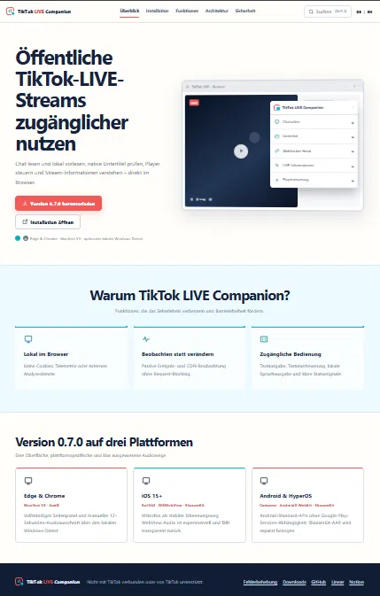
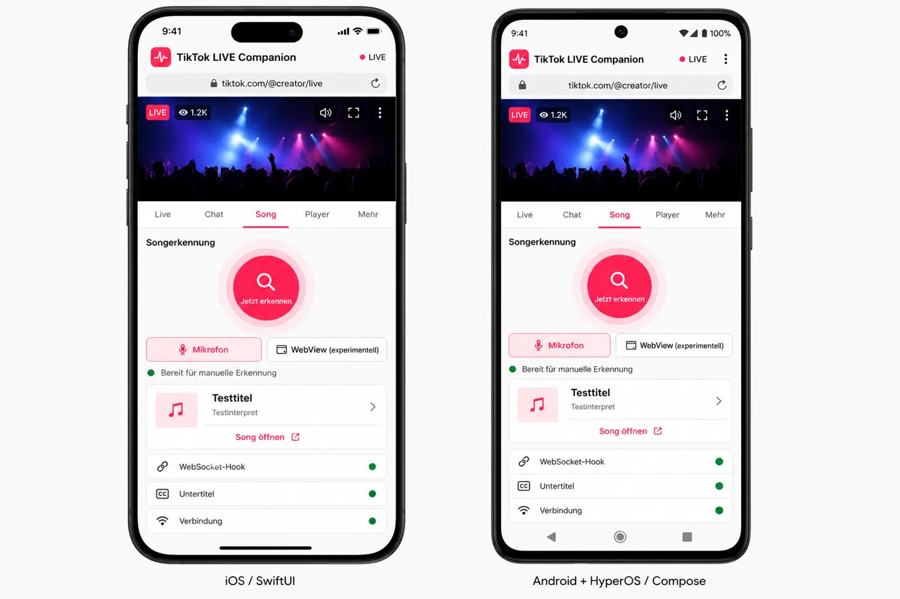
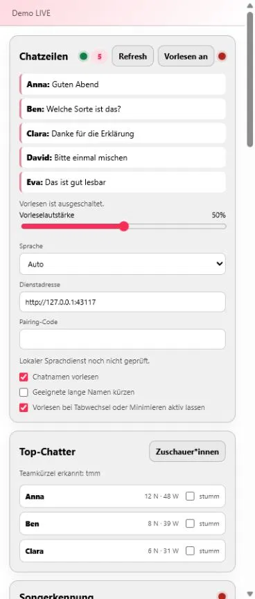
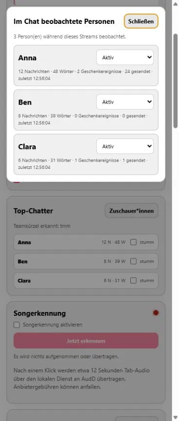
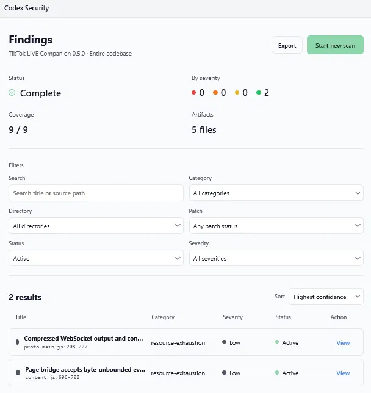
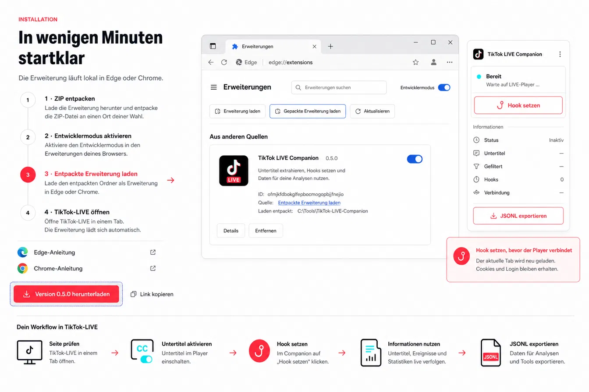
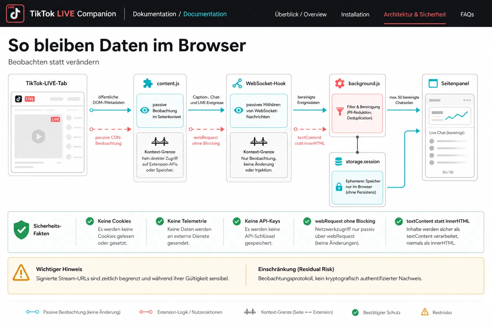
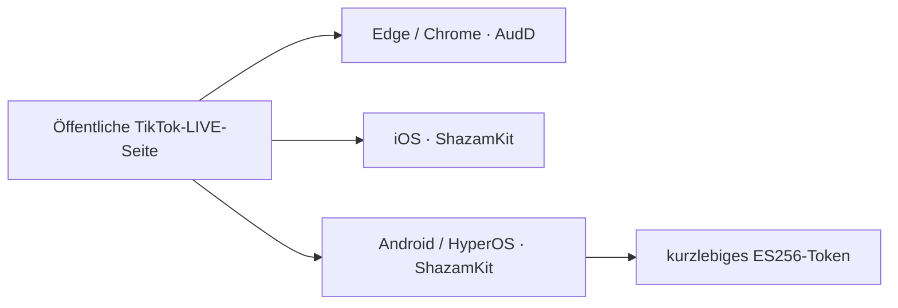

# CoAuthoring V7 – freigegebene visuelle Quellen

**Stand:** 18. Juli 2026 · **Version:** 0.7.0 · **Quelle:** vom Nutzer freigegebene CoAuthoring-Anhänge

Alle 13 PNG-Dateien wurden unverändert unter `site/public/assets/coauthoring-v7/` übernommen. Bilder mit sichtbarer Versionsangabe 0.5.0 dokumentieren frühere Entwurfsstufen. Für den finalen 0.7.0-Stand sind insbesondere die V7-Übersicht und die Mobile-ShazamKit-Ansicht maßgeblich.

## Maßgebliche V7-Ansichten

## Browserfunktionen und Sicherheit

## Designhistorie

Die folgenden Motive bleiben als nachvollziehbare Designvarianten erhalten:

- [Funktionsseite – Coral](../site/public/assets/coauthoring-v7/features-player-coral.png)
- [Architektur – Coral](../site/public/assets/coauthoring-v7/architecture-browser-coral.png)
- [Installation – Coral](../site/public/assets/coauthoring-v7/installation-browser-coral.png)
- [Übersicht – Coral](../site/public/assets/coauthoring-v7/overview-browser-coral.png)
- [Funktionsseite – Cyan](../site/public/assets/coauthoring-v7/features-player-cyan.png)
- [Übersicht – Cyan](../site/public/assets/coauthoring-v7/overview-browser-cyan.png)

## Reproduzierbare Diagramme

- [Gesamtarchitektur als Mermaid](diagrams/architecture.mmd)
- [Songerkennungssequenz als Mermaid](diagrams/recognition-flow.mmd)
- [Plattform-Deployment als Mermaid](diagrams/platform-deployment.mmd)

🧊 [**Interaktive 3D-Ansicht öffnen**](https://kikikari.github.io/OpenClaw/mcp-flow.html) — drehbar und zoombar (Three.js, Branch [gh-pages](https://github.com/KikiKari/OpenClaw/tree/gh-pages)).

Die externe 3D-Ansicht dient als Interaktionsreferenz. Die TikTok-LIVE-Companion-Systemwahrheit bleibt in den versionskontrollierten Mermaid-Dateien und deren Textalternativen.

Reproduktionswerkzeuge der 3D-Referenz:

- [assets/gen_mcp_flow.py](https://github.com/KikiKari/OpenClaw/blob/main/assets/gen_mcp_flow.py) – SVG
- [assets/gen_mcp_flow_gif.py](https://github.com/KikiKari/OpenClaw/blob/main/assets/gen_mcp_flow_gif.py) – GIF
