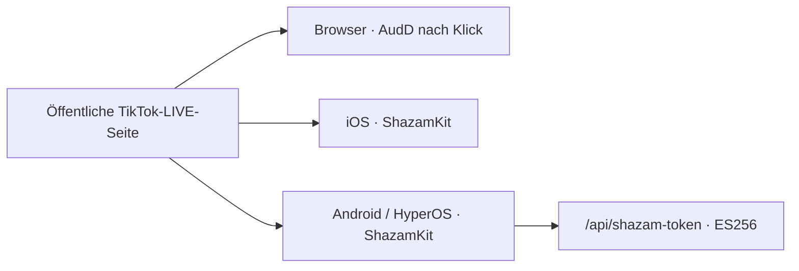

# Architektur

Die Erweiterung besteht aus sechs Laufzeitbereichen:

- `content-core.js`: reine Normalisierung und Metadatenanalyse;
- `content.js`: DOM-Prüfung und lokale Player-/Audioaktionen in der isolierten Welt;
- `proto-main.js`: minimaler Protobuf-Decoder für öffentliche LIVE-Ereignisse;
- `hook.js`: MAIN-World-WebSocket-Proxy, der nur Listener ergänzt;
- `background.js`: passives CDN-Monitoring und flüchtiger Tab-Zustand;
- `sidepanel.*`: lokale Darstellung, Export- und Kopieraktionen.

Der Hook ersetzt `WebSocket.send()` nicht. Seiteninhalte gelten als nicht vertrauenswürdig und werden mit `textContent` ausgegeben. Stream-Daten, Captions, Chat und Diagnosen liegen in `storage.session`; `storage.local` enthält nur Autostart-, Vorlese- und Lautstärkepräferenzen.

## Mobile Laufzeitbereiche

- `mobile/ios`: SwiftUI-App mit WKWebView, `WKUserScript` am Dokumentstart, AVSpeechSynthesizer und ShazamKit;
- `mobile/android`: Kotlin-/Compose-App mit AndroidX WebKit, Android Text-to-Speech und ShazamKit-AAR;
- `plugin-source/mobile-shared`: gemeinsame, versionierte Bridge für öffentliche TikTok-DOM-, Metadaten- und WebSocket-Ereignisse;
- `site/api/shazam-token.mjs`: Android-Token-Endpunkt mit kurzlebigen ES256-Tokens. Der Media-Services-Private-Key bleibt ausschließlich in der Serverumgebung.

Mobile Bridge-Nachrichten werden nur vom Hauptframe der Origin `https://www.tiktok.com` angenommen, sind auf 64 KiB begrenzt und verwenden eine feste Ereignis- und Befehlsliste. Die Apps lesen weder Cookies noch Web-Storage aus. Streamdaten bleiben flüchtig; Einstellungen und dauerhafte Mutes liegen in UserDefaults beziehungsweise DataStore.

Die Mikrofonerkennung läuft nur nach einem Klick und höchstens zwölf Sekunden. WebView-PCM ist experimentell; bei CORS-, Codec- oder WebView-Fehlern wird die Funktion beendet und das Mikrofon angeboten.

## Reproduzierbare Ansichten

- [Gesamtarchitektur als Mermaid](../diagrams/architecture.mmd)
- [Songerkennung als Mermaid-Sequenz](../diagrams/recognition-flow.mmd)
- [Browser-/iOS-/Android-Deployment als Mermaid](../diagrams/platform-deployment.mmd)
- [CoAuthoring V7 mit allen freigegebenen Bildquellen](../coauthoring-v7.md)

🧊 [**Interaktive 3D-Ansicht öffnen**](https://kikikari.github.io/OpenClaw/mcp-flow.html) — drehbar und zoombar (Three.js, Branch [gh-pages](https://github.com/KikiKari/OpenClaw/tree/gh-pages)). Die externe Ansicht ist eine Interaktionsreferenz; die Mermaid-Dateien oben bleiben die statische, barrierearme Systemquelle.

Referenzgeneratoren: [SVG](https://github.com/KikiKari/OpenClaw/blob/main/assets/gen_mcp_flow.py) und [GIF](https://github.com/KikiKari/OpenClaw/blob/main/assets/gen_mcp_flow_gif.py).

## Textalternative

Im Browser liefert der TikTok-Tab öffentliche DOM-/Metadaten an das isolierte Content Script und beobachtete WebSocket-Ereignisse an den MAIN-World-Hook. Beide leiten bereinigte Ergebnisse an den Service Worker weiter. Dieser speichert den Zustand flüchtig pro Tab und sendet ihn an das Seitenpanel. CDN-Anfragen werden ausschließlich passiv beobachtet. Mobil wird derselbe Decoder am Dokumentstart in die erlaubte TikTok-WebView injiziert und gibt nur validierte Ereignisumschläge an den nativen Zustand weiter.
