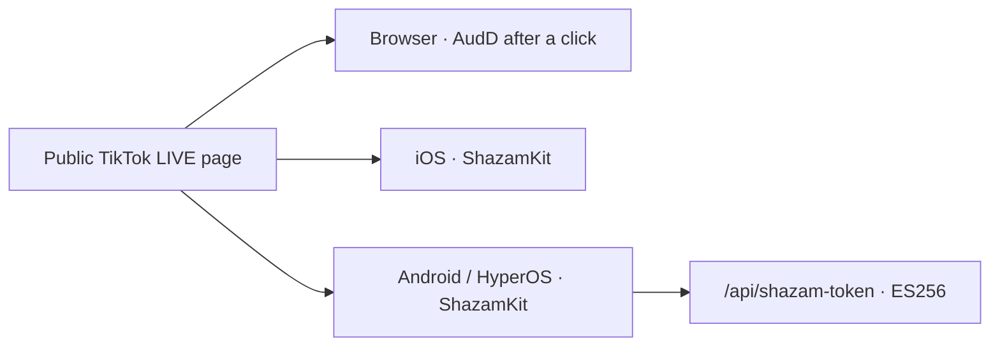

# Architecture

The extension has six runtime areas:

- `content-core.js`: pure normalization and metadata analysis;
- `content.js`: isolated-world DOM inspection and local player/audio actions;
- `proto-main.js`: minimal protobuf decoder for public LIVE events;
- `hook.js`: MAIN-world WebSocket proxy that only adds listeners;
- `background.js`: passive CDN observation and volatile per-tab state;
- `sidepanel.*`: local rendering, export, and copy actions.

The hook never replaces `WebSocket.send()`. Page content is untrusted and displayed with `textContent`. Stream data, captions, chat, and diagnostics use `storage.session`; `storage.local` contains only auto-hook, speech-continuity, and speech-volume preferences.

## Mobile runtime areas

- `mobile/ios`: SwiftUI app with WKWebView, document-start `WKUserScript`, AVSpeechSynthesizer, and ShazamKit;
- `mobile/android`: Kotlin/Compose app with AndroidX WebKit, Android Text-to-Speech, and the ShazamKit AAR;
- `plugin-source/mobile-shared`: shared, versioned bridge for public TikTok DOM, metadata, and WebSocket events;
- `site/api/shazam-token.mjs`: Android token endpoint producing short-lived ES256 tokens while the Media Services private key remains server-side.

Mobile bridge messages are accepted only from the `https://www.tiktok.com` main frame, are bounded to 64 KiB, and use fixed event and command allowlists. The apps never read cookies or Web Storage. Stream state is volatile; preferences and permanent mutes use UserDefaults or DataStore.

Microphone recognition starts only after a click and runs for at most twelve seconds. WebView PCM is experimental; CORS, codec, or WebView failure stops capture and offers the microphone path.

## Reproducible views

- [Overall architecture in Mermaid](../diagrams/architecture.mmd)
- [Song-recognition Mermaid sequence](../diagrams/recognition-flow.mmd)
- [Browser/iOS/Android deployment in Mermaid](../diagrams/platform-deployment.mmd)
- [CoAuthoring V7 with all approved visual sources](../coauthoring-v7.md)

🧊 [**Open the interactive 3D view**](https://kikikari.github.io/OpenClaw/mcp-flow.html) — orbitable and zoomable (Three.js, branch [gh-pages](https://github.com/KikiKari/OpenClaw/tree/gh-pages)). The external view is an interaction reference; the Mermaid files above remain the static, accessible system source.

Reference generators: [SVG](https://github.com/KikiKari/OpenClaw/blob/main/assets/gen_mcp_flow.py) and [GIF](https://github.com/KikiKari/OpenClaw/blob/main/assets/gen_mcp_flow_gif.py).

## Text alternative

In the browser, the TikTok tab supplies public DOM/metadata to the isolated content script and observed WebSocket events to the MAIN-world hook. Both forward sanitized results to the service worker. It keeps volatile per-tab state and sends it to the side panel. CDN requests are observed passively only. On mobile, the same decoder is injected at document start into the allowed TikTok WebView and forwards only validated event envelopes to native state.
